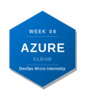
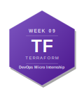
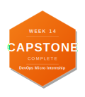

# DevOps Micro Internship with Agentic AI — My Journey

> 👋 **New here?** Read the [submission instructions](./onboarding) first — how to fork, fill in, and submit your assignments.
> Find all the required links & assignment guidelines from here [Required links](./dmi_cohort3_resources.md)

---

## About Me

| | |
|---|---|
| **Name** | EZEOBI CHINECHEREM JUDE |
| **LinkedIn** | (www.linkedin.com/in/ezeobi-palloti-5b231a1b9) |
| **Location** | Lagos, Nigeria |
| **Background** | Cloud Security, DevOps Engineer|
| **Goal** | Gaining clarity about Ai driven Cloud security and Devops Engineering operations |

---

## About the Program

**DevOps Micro Internship with Agentic AI** is a 14-week mentor-led cohort program by [Pravin Mishra](https://www.linkedin.com/in/pravin-mishra-aws-trainer/) — Cloud, DevOps & AI consultant with 15+ years of experience, 5,000+ learners trained, and 20K+ LinkedIn followers.

This is not a course. It is an internship-style program — real deployments, real pipelines, real evidence reviewed by mentors every week.

- 🌐 Program Website: https://dmi.pravinmishra.com
- 💬 Discord Community: https://discord.pravinmishra.com
- 📺 YouTube: [Pravin Mishra](https://www.youtube.com/@awswithpravinmishra)
- 🔗 Instructor: [LinkedIn](https://www.linkedin.com/in/pravin-mishra-aws-trainer/)

---

## 🏆 Achievements

### Champion of the Week

<!-- If you were named Champion of the Week, add the badge below and link to your LinkedIn post -->

| Week | Award | Post |
|------|-------|------|
| <!-- e.g. Week 03 --> | <!-- 🏆 Champion of the Week --> | <!-- [LinkedIn Post](#) --> |

### Leaderboard

 Add your cohort leaderboard rank here as you progress 

> 🥇 Cohort 3 Rank: **#__** <!-- Update this each week -->

---

## My DevOps Stack

Your stack earned via participation

 Week 00 → Internet & Networking Basics 

<!--  -->

  

 Week 01 → Success Mindset 

  

 Week 02 → Agentic AI with Claude Code 

  

 

 Week 03 → Linux & Bash for DevOps 

 

<!-- Week 04 → Git & GitHub -->
<!--  -->

<!-- Week 05 → DevOps Lifecycle & Agile -->
<!--  -->

<!-- Week 06 → AWS Cloud -->
<!--  -->

<!-- Week 07 → Azure Cloud -->
<!--  -->

<!-- Week 08 → Terraform -->
<!--  -->

<!-- Week 09 → Ansible -->
<!--  -->

<!-- Week 10 → Azure DevOps CI/CD -->
<!--  -->

<!-- Week 11 → Docker -->
<!--  -->

<!-- Week 12 → Kubernetes -->
<!--  -->

<!-- Week 13 → Final Project / Capstone -->
<!--  -->

*Complete a week → uncomment the badge → watch your stack grow.*

---

## Program Overview

| Phase | Weeks | Focus |
|-------|-------|-------|
| Foundation | 00 – 02 | Networking, Mindset, Agentic AI |
| Core DevOps | 03 – 05 | Linux & Bash, Git, DevOps Lifecycle |
| Cloud | 06 – 07 | AWS & Azure Real Deployments |
| Automation | 08 – 10 | Terraform, Ansible, CI/CD |
| Containers | 11 – 12 | Docker & Kubernetes |
| Capstone | 13 | Final Project |

---

## Weekly Progress

| Week | Topic | Status | Assignment | LinkedIn Post | Blog Post |
|------|-------|--------|------------|---------------|-----------|

| 00 | Internet & Networking Basics | ✅ Complete | ✅ Solved |https://www.linkedin.com/posts/ezeobi-palloti-5b231a1b9_startuplife-networking-techforfounders-share-7473842580309520385-Ts5c/?utm_source=share&utm_medium=member_desktop&rcm=ACoAADLFS9YBFQ6i_O56Veo32xN5JbLJZhDGNnE|https://substack.com/profile/487332231-ezeobi-chinecherem-jude/note/c-298647371?r=8257yf&utm_source=notes-share-action&utm_medium=web|

| 01 | Success Mindset | ✅ Completed | ✅ Solved|https://www.linkedin.com/posts/ezeobi-palloti-5b231a1b9_devops-cloudengineering-continuouslearning-activity-7476649737945874432-CErC?utm_source=share&utm_medium=member_desktop&rcm=ACoAADLFS9YBFQ6i_O56Veo32xN5JbLJZhDGNnE |https://medium.com/@palloti10x/mental-dependencies-before-server-dependencies-why-your-mindset-is-your-true-foundation-in-devops-d0b8e665ce2c|

| 02 | Agentic AI with Claude Code |✅ Complete  | ✅ Solved |https://www.linkedin.com/posts/ezeobi-palloti-5b231a1b9_devops-agenticai-cloudengineering-ugcPost-7482423989043249152-HAcf/?utm_source=share&utm_medium=member_desktop&rcm=ACoAADLFS9YBFQ6i_O56Veo32xN5JbLJZhDGNnE|https://medium.com/@palloti10x/the-rise-of-agentic-devops-990ff2cc9551?source=user_profile_page---------0-------------e994ee2a86f5----------------------|

| 03 | Linux for DevOps | ✅ Completed | ✅ Solved
 |https://www.linkedin.com/posts/ezeobi-palloti-5b231a1b9_devops-linux-cloudsecurity-ugcPost-7485168451012087808-cgMx/?utm_source=share&utm_medium=member_desktop&rcm=ACoAADLFS9YBFQ6i_O56Veo32xN5JbLJZhDGNnE|https://substack.com/profile/487332231-ezeobi-chinecherem-jude/note/c-298642766?utm_source=substack&utm_content=first-note-modal|
 
| 04 | Bash Scripting | ⬜ Not Started | ⏳ Pending | — | — |
| 05 | Git & GitHub | ⬜ Not Started | ⏳ Pending | — | — |
| 06 | DevOps Lifecycle & Agile | ⬜ Not Started | ⏳ Pending | — | — |
| 07 | AWS Cloud | ⬜ Not Started | ⏳ Pending | — | — |
| 08 | Azure Cloud | ⬜ Not Started | ⏳ Pending | — | — |
| 09 | Terraform | ⬜ Not Started | ⏳ Pending | — | — |
| 10 | Ansible | ⬜ Not Started | ⏳ Pending | — | — |
| 11 | Azure DevOps (CI/CD) | ⬜ Not Started | ⏳ Pending | — | — |
| 12 | Docker | ⬜ Not Started | ⏳ Pending | — | — |
| 13 | Kubernetes | ⬜ Not Started | ⏳ Pending | — | — |
| 14 | Final Project | ⬜ Not Started | ⏳ Pending | — | — |

**Status:** ⬜ Not Started &nbsp;|&nbsp; 🔄 In Progress &nbsp;|&nbsp; ✅ Completed 
**Assignment:** ⏳ Pending &nbsp;|&nbsp; ✅ Solved

---

## Certificate of Completion

*Awarded upon completing Week 13 — Final Project.*

<!-- Drop your certificate image here -->

---

## Connect

If you found this repo useful or want to follow my DevOps journey:

- ⭐ Star this repo
- 🔗 Connect with me on [LinkedIn](#)
- 🌐 Learn more about the program: https://dmi.pravinmishra.com
- 💬 Join the community: https://discord.pravinmishra.com
