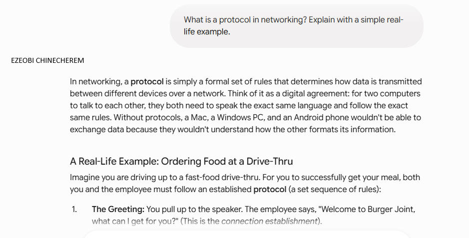

# Week 00 - Internet and Networking

Part of the DevOps Micro Internship (DMI) Cohort 3 with Agentic AI

---

# 🧑‍💻 Task 1: Using ChatGPT as Your Learning Assistant

## Scenario

You're new to DevOps and will frequently encounter technical questions. ChatGPT can be your learning companion.

## Your Task

Write a clear ChatGPT prompt to help you understand:

> "What is a protocol in networking? Explain with a simple real-life example."

Take a screenshot of your interaction showing:

* Your detailed prompt (with clear expectations)
* ChatGPT's simplified response with an example

## Screenshot

Save your screenshot in the `screenshots` folder and update the file name below.




Replace `task-1-chatgpt.png` with your actual screenshot file name.

---

## What I Learned (2–3 lines)

Add your answer here...

In networking, a protocol is simply a formal set of rules that determines how data is transmitted between different devices over a network. Networking is the bedrock of internet communication and transimission of informations.
---

# 🌐 Task 2: Internet and Networking

## Scenario

Your friend is launching an online bookstore named **EpicReads**.

He asked you to explain how users globally can access his website hosted in Finland.

## Your Task

Write a short explanation (**100–150 words**) that includes:

* Packet Switching
* IP Address
* TCP/IP
* HTTP/HTTPS

💡 **Tip:** You may use ChatGPT (as demonstrated in Task 1) to refine your explanation.

## Answer

Add your answer here...

PACKET SWITCHING
This is the communication technique in data is split into smaller units called 'PACKETS' and sent across a network independently. 
i   Message is not sent as one continous stream
ii  Instead , its divided into smaller packets

IP ADDRESS
This is a unique logical address assigned to a device connected to a network.
IP ADDRESS TELLS THE NETWORK
i   Who is sending the data
ii  Who should receive the data

TCP (Transmission Control Prptocol)
 This is a transport layer protocol that provides reliable order and error checked delivery of data between Applications.

 HTTP/HTTPS
 This is application layer protocol used for communication between web browsers and web servers
i   HTTP : Sends data in plain text
ii  HTTPS: Uses encryption through TLS for secure communication.

# 🏗️ Task 3: Application Architecture & Stack

## Scenario

EpicReads bookstore has two application versions:

### Two-Tier Application

 Frontend


 Database

### Three-Tier Application

 Frontend

 Backend

 Database

## Your Task

 Draw simple diagrams (hand-drawn or tool-based such as draw.io)
 Label each layer clearly
 List at least two common technologies or tools used for each layer
 Submit a screenshot or photo clearly showing your own drawing

## Diagram Screenshot / Photo

Save your diagram image in the `screenshots` folder and update the file name below.


Replace `task-3-diagram.png` with your actual diagram file name.

---

## Technologies Used

### Frontend

 React


 Angular

### Backend

 Node.JS


 Express.JS

### Database

 Mysql


 Redis

---

# 🌍 Task 4: Domain Name & DNS (Basic Concepts)

## Scenario

Your friend's bookstore **EpicReads** is currently accessible through:

```text
52.172.142.222:3000
```

He purchased the domain:

```text
epicreads.com
```

## Your Task

In **50–100 words**, explain in your own words:

1. What is DNS (Domain Name System)?
2. Which DNS record type should be used to connect the domain to the given IP, and why?

## Answer

Add your answer here...
DNS [Domain Name Service]
 This resolves a name to an IP address. It's often called the 'phonebook' of the internet because it translates human friendly domain name (like google.com) into machine readable IP address (Like 142.250.80.46) that the computer use to identify each other on the network. Without DNS you do have to memorize strings of numbers to visit everywebsite.

2 To connect Epicreads.com to an IP address, you should use an A recirds (IPV4) or AAAA record (For IPV6)

MY REASONS

1) DIRECT IP MAPPING >>> An A record translates domain name directly into an IPV4 address with no intermediate steps.
2) APEX DOMAIN SUPPORT >>> Unlike C Name, an A record works at the root/apex of the domain (Epicreads.com itself). CNAME cannot be used at the apex per DNS standards
3) SINGLE LOOKUP >>> The resolver gets the IP in one query. No chains of redirects.
4) UNIVERSAL COMPATITBILITY >>> Every broswer , resolver and DNS client understands A record. 
---

# 💻 Task 5: Visual Studio Code Setup (Hands-on)

## Your Task

Install Visual Studio Code (if not already installed).

Take a screenshot of your VS Code environment showing:

* Terminal open inside VS Code
* Running a basic command:

### Windows

```powershell
dir
```

### Linux / macOS

```bash
pwd
ls
```

* Your selected VS Code theme clearly visible

⚠️ **Important:** The screenshot must show your username or another identifiable detail to confirm it is your environment.

## Screenshot

Save your screenshot in the `screenshots` folder and update the file name below.


Replace `task-5-vscode.png` with your actual screenshot file name.

---

# 🔗 Task 6: Publish Your Assignment as a LinkedIn Post

## Objective

Publishing on LinkedIn helps you:

* Build your professional online presence
* Reinforce your learning
* Document your DevOps journey publicly

## Your Task

Summarize your answers from Tasks 1–5 into a LinkedIn post.

Clearly structure your post into the following sections:

* ChatGPT
* Internet & Networking
* App Architecture
* DNS
* VS Code Setup

Add the following credit note at the end of your post:

> **P.S. This post is a part of DevOps Micro Internship with Agentic AI Cohort-3 by Pravin Mishra. You can start your DevOps journey by joining this Discord community: https://discord.pravinmishra.com/**

---

## LinkedIn Post URL

Paste your LinkedIn post URL here:


https://www.linkedin.com/posts/ezeobi-palloti-5b231a1b9_startuplife-networking-techforfounders-activity-7473842583388119041-ihPm?utm_source=share&utm_medium=member_desktop&rcm=ACoAADLFS9YBFQ6i_O56Veo32xN5JbLJZhDGNnE
---

## LinkedIn Post Backup Copy

Paste the full text of your LinkedIn post here:

Add your post content here...

My friend is building a global startup—an online multilingual bookstore called EpicReads.com.
As a non-technical founder, he recently hit me with a massive question:
"How does my website actually deliver books to someone on the other side of the world in milliseconds?"
Breaking down networking concepts for a founder is always a fun challenge. You have to move past the jargon and focus on the trade-offs that impact the business.
Here is how we broke down the "communication chain" that keeps his platform alive:

🌐 The Layered Chain of Communication
Think of data transmission like global shipping. It’s not just one step; it’s an interconnected chain:

1️⃣ The Application (Layer 7 - HTTP vs. HTTPS):
He asked why he couldn't just use standard HTTP.
The reality: HTTP sends data in plain text. For an e-commerce store handling user credentials and payments, HTTPS (secured via TLS) isn't optional—it's a trust requirement for global customers.

2️⃣ The Transport (Layer 4 - TCP vs. UDP):
Why do we use TCP for EpicReads?
The trade-off: UDP is fast but allows data loss (great for video streaming). TCP, however, guarantees reliable, ordered, and error-checked delivery. If a customer is downloading an e-book, they need every single page to arrive intact.

3️⃣ The Routing (IP Addresses & Packet Switching):
Data doesn't travel as one giant block. It gets chopped into "packets" and routed across the fastest global paths, reassembling perfectly on the user's screen.

🏗️ Scaling the Architecture: 3-Tier vs. 2-Tier
We also discussed why a Three-Tier Architecture (Presentation ➡️ Application ➡️ Database) beats a Two-Tier system for a global startup. By separating the user interface from the business logic and the database, EpicReads can handle massive spikes in global traffic without the entire system crashing.

🗺️ The Global Gateway: DNS & CDNs
Finally, we talked about routing users efficiently:
Choosing A/AAAA records (pointing directly to an IP) versus CNAME records (canonical names) to optimize lookup speeds.
Leveraging a Content Delivery Network (CDN) to cache book covers and static pages on local servers worldwide, slashing latency.
The takeaway for founders: You don't need to write the networking code yourself, but understanding how your data moves shapes your security, your user experience, and ultimately, your ability to scale globally.
Kudos to founders who aren't afraid to dive into the technical weeds to build better products! 🚀

P.S. This post is part of the DevOps Micro Internship with Agentic AI Cohort run by Pravin Mishra https://www.linkedin.com/in/pravin-mishra-aws-trainer/. Join the community here: https://discord.pravinmishra.com/ 

#StartupLife #Networking #TechForFounders #SoftwareArchitecture #GlobalScale #EpicReads

---

# Reflection – Week 0

### What did you find easy?

Add your answer here...
Navigating through the questions and getting precised responses with my AI assistant

---

### What was difficult?

Add your answer here...

Reading to construct a reasonable answer from my Ai assistance
---

### What will you improve next week?

Add your answer here...

Fast reading and reasoning 
---

## 📌 About DMI & CloudAdvisory

DevOps Micro Internship (DMI) is a project-based DevOps program run by Pravin Mishra (The CloudAdvisory) focused on real-world execution, systems thinking, and career readiness.

It helps learners build strong DevOps foundations with hands-on experience.


## 📌 Resources

- 🌐 **DMI Official Website:** https://pravinmishra.com/dmi  
- 🎓 **DevOps for Beginners (Udemy):** https://www.udemy.com/course/devops-for-beginners-docker-k8s-cloud-cicd-4-projects/  
- 🎓 **Ultimate Agentic AI DevOps with Clude Code** https://www.udemy.com/course/ultimate-agentic-ai-devops-with-claude-code/?referralCode=448389767BC96284087B
- 🎓 **DevOps with Claude Code: Terraform, EKS, ArgoCD & Helm** https://www.udemy.com/course/devops-with-claude-code-terraform-eks-argocd-helm/?referralCode=1C5B734505D65A010FA3
- ▶️ **YouTube Playlist (DMI Cohort 3):** https://www.youtube.com/playlist?list=PLFeSNDtI4Cho  
- 🔗 **Pravin Mishra (LinkedIn):** https://www.linkedin.com/in/pravin-mishra-aws-trainer/  
- 🏢 **CloudAdvisory (LinkedIn):** https://www.linkedin.com/company/thecloudadvisory/

---

*This submission is part of DevOps Micro Internship (DMI) Cohort 3 — Agentic AI Track*