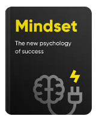
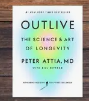

# Week 01 — Success Mindset (Mindset OS)

Part of the DevOps Micro Internship (DMI) Cohort 3 with Agentic AI

---

## Purpose (Read This First)

This week is not motivation homework.

This is you building your **Mindset OS** — the system you will use for the next 5 months (and honestly, for years).

### Expectations

* Be honest.
* Be specific.
* Be practical.
* Write like an adult professional: clear sentences, no one-liners.

You will reuse this in later weeks. So do it properly once.

---

# Assignment 1. What is something you believe to be true that most people around you would disagree with?

### Rules

* No "safe" answers.
* Must be your real belief (not copied from internet).
* Minimum 50 words.

**Hint:** What do you believe about career, money, learning, discipline, relationships, health, success, life, tech industry, etc. that most people don't agree with?

## Answer

"While many argue that the end justifies the means, I firmly believe that true value lies within the process—the journey of transformation and growth. fixing your mind strictly on a predetermined outcome often leads to frustration because reality rarely unfolds in a linear pattern. By detaching ourselves from a rigid end result and instead focusing on systemic execution, we build resilience. The end is simply a milestone within a continuous process, not the final chapter.".

---

# Assignment 2. What are the top 3 objective truths you discovered through experimentation and results?

### Definition

Objective truths do not depend on opinions. They hold true regardless of how people feel.

Write each truth in this format:

**Truth:** (1 sentence)

**Evidence from my life:** (2–4 lines: what you tried + what happened)

---

 Truth #1

### Truth

The power of living in the presence

 Evidence from my life

Life is'nt about perfection, life is an adventure, the little moments of life holds weight eg. attending ur kids graudation ,spending time with the kids at the park etc, life is about living in the presence stop believing that you'll be enjoy life more tomorrow or when you clock 60 .

---

 Truth #2

### Truth

Taking zero risk costs more

 Evidence from my life

The future belongs to those taking a calculated risk. The truth is that some years from now you'll become someone . The big question is "who" ?

Lol
Hope I'm not sounding like a motivational speaker
---

 Truth #3

### Truth

Clarity meets you half way in the grind 

 Evidence from my life

A year ago, I made the mistake of delaying my DevOps journey, waiting for the 'perfect time' and hoping to find absolute clarity before taking action. That year taught me a valuable lesson about inertia. Today, three months into the deep grind, I am finally gaining that clarity—one technical milestone at a time. It made me realize a fundamental truth about career growth: Clarity doesn't precede action. It meets you halfway through the execution, never before you begin.

---

 Assignment 3. What does your 2.0 version look like?

### Instructions

Write as if a journalist is writing about you **3 to 7 years from now** (not 20 years).

**Minimum 300 words.**

### Rules

* Write in past tense, like it already happened.
* Don't use "likes to / wants to / hopes to."
* Use specifics:

  * built
  * shipped
  * led
  * published
  * earned
  * relocated
  * contributed
* Include skills proof:

  * projects
  * portfolios
  * GitHub
  * blogs
  * certifications
  * job role
  * leadership
  * community contribution
* Add 1–3 images if you can (optional but powerful).

### Publish It Publicly On Any ONE

* LinkedIn
* Medium
* WordPress
* Blogspot
* Personal blog
* Portfolio page

Include this line:

> **P.S. This post is a part of DevOps Micro Internship with Agentic AI Cohort-3 by [Pravin Mishra](https://www.linkedin.com/in/pravin-mishra-aws-trainer/). You can start your DevOps journey by joining this [Discord community](https://discord.pravinmishra.com/) ( https://discord.pravinmishra.com/ ).**

## Your Article

REINTRODUCING MYSELF                     
“let’s imagine 7 years from now”

As a Senior DevOps and Platform Engineer who has spent the last six years architecting resilient infrastructure, automating complex deployment pipelines, and scaling cloud environments for industry giants. Driven by a philosophy that infrastructure should be invisible, repeatable, and inherently secure, having shipped multiple production-grade systems at institutions like Nvidia and Tesla, ensuring that cutting-edge software deploys flawlessly at global scale.

Throughout my career, I have built and optimized cloud infrastructure tailored for high-stakes environments. My technical job role has continuously evolved at the intersection of automation, site reliability, and cloud architecture, with a heavy emphasis on transforming legacy frameworks into modern, containerized platforms. Currently based in London after having relocated to the UK with my family, scaling technical frontiers by majorly focusing on Fintech projects, where zero-downtime, strict regulatory compliance, and microsecond-level latency are the baseline standards.

 I have published technical guides and architectural blueprints that demystify complex cloud-native systems. I have contributed extensively to open-source projects and developer communities, ensuring the broader ecosystem benefits from battle-tested methodologies. 

### Public Link

Paste your link here:
https://www.linkedin.com/posts/ezeobi-palloti-5b231a1b9_devops-cloudcomputing-softwareengineering-share-7477398559223431168-46gd/?utm_source=share&utm_medium=member_desktop&rcm=ACoAADLFS9YBFQ6i_O56Veo32xN5JbLJZhDGNnE
`__________________________`

---

# Assignment 4. Have you ever cut corners (unethical / dishonest / shortcut behavior — not necessarily illegal)? If yes, how did it make you feel?

### Important

You don't need to write the full story.

Focus on the feeling:

* guilt
* fear
* shame
* stress
* regret
* numbness
* etc.

This is about self-awareness, not judgment.

### Answer Format

**Yes / No**

If Yes:

**What emotion did you feel?** (minimum 50–100 words)

## Answer

Add your answer here...
No

Been innocent is not what I am try to portray here.
But I have not been in a situation, where cutting corners would be necessary , so I never did

# Assignment 5. What are 10 non-fiction books you plan to read in the next 1 year?

### Rules

* Mention **Title + Author**
* Any language allowed
* No fiction novels

### Tip

Choose books that improve:

* mindset
* communication
* productivity
* health
* money
* career
* leadership

## Book List

1. Mindset by Carol S. Dweck

2. Atomic habits by James Clear

3. Crucial conversation by Joseph Greeny, Kerry Patterson, et al.

4. Deep work by Cal Newporl

5. Outlive by Peter Attia

6. The psychology of Money by Morgan Housel

7. Rich Dad Poor Dad by Robert T. Kiyosaki

8. What got you here won't get you there by Marshall Goldsmith

9. 5Am Club by Robin Sharma

10. Design your life by Bill Burnett and Dave Evans

---

# Assignment 6. What are the things you will measure regularly in your life and career?

### Rules

List topics only. No need to share numbers.

### Must Include

* Learning / skill
* Output / proof
* Health / energy
* Time / focus
* Money / finance (personal or business)

### Example

* Learning hours per week
* Deep work sessions per week
* Projects shipped / documented
* Steps / workouts
* Sleep hours
* Spending tracker

## My Metrics

* Two hours early workout before breakfast
* Taking more of fruits and less junks
* Three pages a day from one of the aforementioned books
* Earlier dinner, night sleep by 8pm
* To wake up by 3am for morning 2hours studing my cloud and Devops materials before earlier morning workout
* On weekends after saturday 8hours class , full focus on my Assignments and rewatching the youtube videos

---

# Assignment 7. Brain Dump + 5-Month System Plan

## Step 1: Brain Dump (Private)

Do a brain dump of everything in your mind into a notebook.

Examples:

* Bills
* Tasks
* Worries
* Goals
* Pending messages
* Ideas
* Responsibilities

### Did You Do It?

# **Yes / No**

Answer: Yes

Add your answer here...

Sometimes, it is not easy to stay locked into learning a new skill when your family depends on you for so many things. My goal in this cohort is to gain clarity and confidence by building a strong foundation in cloud-native technologies. It is important for me to understand my current learning baseline, especially during those moments when confusion and anxiety creep in. Through this program, I aim to secure a clear learning roadmap and significantly increase my technical understanding of DevOps.
---

## Step 2: Your 5-Month Routine + Focus Blocks

Create a simple plan you can realistically follow for the next 5 months.

### Weekly Routine

Example:

* Mon–Thu: 60 min deep work
* Sat: DMI session
* Sun: Weekly review

#### My Weekly Routine

Add your answer here...

* Mon-Fri: I work from 9am-5pm ,3hours study everyday before from 4am-7am
* Sat: DMI 8 hours session. After the sesssion, full focus on my Assignments 
* Sun: Weekly reflection and review . Also Asssignment completion
### Focus Blocks

#### When Will You Do DMI Work? (Days + Time)

Add your answer here...

#### How Many Sessions Per Week?

Add your answer here...

Sat: After the 8hours session, 2 hours of sleep and 5 hours on the Assignment
Sun: Full day working on the Assignment like 15 hours with little break in-between 
Mon: 3-4hours early morning reading and watching DMI youtube videos
---

### Distraction Rules

Examples:

* Phone rules
* Social media rules
* Environment setup

#### My Distraction Rules

Add your answer here...

* My phone always on airplane mode during my reading hours
* My room and state Libary conducive for learning

# Reflection – Week 1

### Biggest insight I got about myself this week

Add your answer here...
Understanding the effect of compounding, consistent little disciple leads to greatness
Prioritizing my health and mental state

### My biggest weakness/loop I noticed

Add your answer here...
Mastering consistency is the ultimate challenge for me right now. However, I am confident that in the near future, I will achieve it.

### One system I will implement from this week (exact habit + time)

Add your answer here...
Wake up early by 3am
3hrs early morning reading 
2hrs early morning workout

### LinkedIn Post

Paste your LinkedIn post link here:

`https://www.linkedin.com/posts/ezeobi-palloti-5b231a1b9_devops-cloudcomputing-softwareengineering-share-7477398559223431168-46gd/?utm_source=share&utm_medium=member_desktop&rcm=ACoAADLFS9YBFQ6i_O56Veo32xN5JbLJZhDGNnE__________________________`

---

## 10. Proof of Work

- LinkedIn Post URL: **https://www.linkedin.com/posts/ezeobi-palloti-5b231a1b9_devops-cloudcomputing-softwareengineering-share-7477398559223431168-46gd/?utm_source=share&utm_medium=member_desktop&rcm=ACoAADLFS9YBFQ6i_O56Veo32xN5JbLJZhDGNnE**  

- Blog / Medium : **https://medium.com/@palloti10x/mental-dependencies-before-server-dependencies-why-your-mindset-is-your-true-foundation-in-devops-d0b8e665ce2c**  

---

## 📌 About DMI & CloudAdvisory

DevOps Micro Internship (DMI) is a project-based DevOps program run by Pravin Mishra (The CloudAdvisory) focused on real-world execution, systems thinking, and career readiness.

It helps learners build strong DevOps foundations with hands-on experience.

## 📌 Resources

- 🌐 **DMI Official Website:** https://pravinmishra.com/dmi  
- 🎓 **DevOps for Beginners (Udemy):** https://www.udemy.com/course/devops-for-beginners-docker-k8s-cloud-cicd-4-projects/  
- 🎓 **Ultimate Agentic AI DevOps with Clude Code** https://www.udemy.com/course/ultimate-agentic-ai-devops-with-claude-code/?referralCode=448389767BC96284087B
- 🎓 **DevOps with Claude Code: Terraform, EKS, ArgoCD & Helm** https://www.udemy.com/course/devops-with-claude-code-terraform-eks-argocd-helm/?referralCode=1C5B734505D65A010FA3
- ▶️ **YouTube Playlist (DMI Cohort 3):** https://www.youtube.com/playlist?list=PLFeSNDtI4Cho  
- 🔗 **Pravin Mishra (LinkedIn):** https://www.linkedin.com/in/pravin-mishra-aws-trainer/  
- 🏢 **CloudAdvisory (LinkedIn):** https://www.linkedin.com/company/thecloudadvisory/

---

*This submission is part of DevOps Micro Internship (DMI) Cohort 3 — Agentic AI Track*