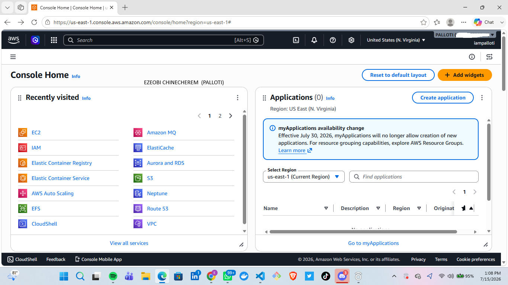

# Assignment 1 — AWS Free Tier Account Setup (EpicReads Cloud Onboarding)

Part of the DevOps Micro Internship (DMI) Cohort 3 with Agentic AI

---

## Purpose

In this assignment, you will create and verify an AWS Free Tier account as part of onboarding EpicReads — an online bookstore moving to the cloud. You will demonstrate an understanding of AWS fundamentals, Free Tier services, and account setup by answering conceptual questions and capturing proof of a working AWS Console login.

---

# Task 1 — Understanding AWS & Free Tier

## Goal

Demonstrate understanding of AWS basics and Free Tier usage by answering the following questions in your own words (3–4 lines each).

### Answers

#### Question 1 — What is an AWS account, and why do you need it at this stage?

Write your answer here.

--- An AWS account represents a formal business relationship between you and AWS, serving as the central hub where you provision, manage, and pay for your cloud resources.

IMPORTANCE OF AWS ACCOUNT

1 Access to Cloud Infrastructure: Creating an account is the mandatory first step to accessing AWS's massive ecosystem of over 200 services.

2 For easy procurement of Virtual servers e.g EC2 , S3

3 For Safety of our provisioned infrastructure through the use of Security groups

#### Question 2 — What is AWS Free Tier, and how long does it last?

Write your answer here.

The AWS Free Tier allows developers, students, and businesses to explore and test AWS some services at no cost (once the services are within the free credit).

Always Free                     Indefinitely (as long as your account is active)

12 Months Free                  12 months starting from your initial sign-up date

Short-Term Trials               Typically 30 to 90 days starting when you activate the specific service
---

#### Question 3 — Name three AWS Free Tier services and their free usage limits.

Write your answer here.

---
EC2            750 hours per month of t2.micro or t3.micro instances (depending on your AWS Region).
S3             5 GB of Standard Storage.20,000 HTTP GET requests (retrieving data).2,000 HTTP PUT, COPY, POST, or LIST 
                requests (uploading/managing data).
AWS Lambda     1 million free requests per month and 400,000 GB-seconds of compute time per month.

# Task 2 — Create AWS Free Tier Account

## Goal

Create a valid AWS Free Tier account and sign in to the AWS Management Console.

> No screenshots required for this task. Completion is verified through Task 3.

---

# Task 3 — Verify AWS Account

## Goal

Confirm that your AWS account setup is complete by navigating to the Account section and capturing proof.

### Evidence

#### Screenshot 1 — AWS Account page showing account name (email may be blurred)

Add your screenshot here.

---

# Submission Instructions

- Add all required screenshots in your GitHub repository submission
- Full name must be visible in required screenshots
- Do not expose sensitive information (keys, passwords, account IDs)

---

# Completion Checklist

- [ ] Task 1 answers written in own words
- [ ] AWS Free Tier account created successfully
- [ ] Signed in to AWS Management Console
- [ ] Screenshot of AWS Account page captured (full name visible, no sensitive data)
- [ ] All required screenshots added to repository

---

## 📌 About DMI & CloudAdvisory

DevOps Micro Internship (DMI) is a project-based DevOps program run by Pravin Mishra (The CloudAdvisory) focused on real-world execution, systems thinking, and career readiness.

It helps learners build strong DevOps foundations with hands-on experience.

---

## 📌 Resources

- 🌐 DMI Official Website: https://pravinmishra.com/dmi  
- 🎓 DevOps for Beginners (Udemy): https://www.udemy.com/course/devops-for-beginners-docker-k8s-cloud-cicd-4-projects/  
- 🎓 Agentic AI DevOps with Claude Code: https://www.udemy.com/course/ultimate-agentic-ai-devops-with-claude-code/  
- 🎓 DevOps with Claude Code: Terraform, EKS, ArgoCD & Helm: https://www.udemy.com/course/devops-with-claude-code-terraform-eks-argocd-helm/  
- ▶️ YouTube Playlist: https://www.youtube.com/playlist?list=PLFeSNDtI4Cho  
- 🔗 Pravin Mishra (LinkedIn): https://www.linkedin.com/in/pravin-mishra-aws-trainer/  
- 🏢 CloudAdvisory (LinkedIn): https://www.linkedin.com/company/thecloudadvisory/

---

*This submission is part of DevOps Micro Internship (DMI) Cohort 3 — Agentic AI Track.*