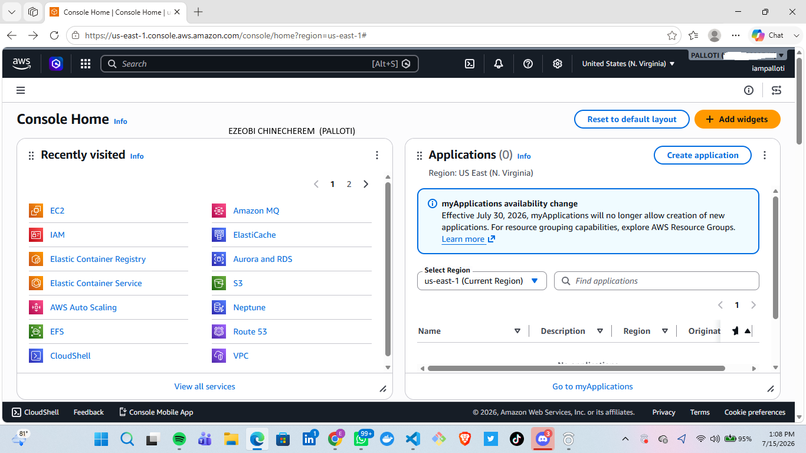

# Assignment 1 — AWS Free Tier Account Setup (EpicReads Cloud Onboarding)

Part of the DevOps Micro Internship (DMI) Cohort 3 with Agentic AI

---

## Purpose

In this assignment, you will create and verify an AWS Free Tier account as part of onboarding EpicReads — an online bookstore moving to the cloud. You will demonstrate an understanding of AWS fundamentals, Free Tier services, and account setup by answering conceptual questions and capturing proof of a working AWS Console login.

---

# Task 1 — Understanding AWS & Free Tier

## Goal

Demonstrate understanding of AWS basics and Free Tier usage by answering the following questions in your own words (3–4 lines each).

### Answers

#### Question 1 — What is an AWS account, and why do you need it at this stage?

An AWS Account is essentially your secure container for accessing Amazon Web Services. It gives you an isolated environment where you can launch virtual servers, set up databases, store files, and configure cloud networks. It comes with root administrative access and acts as both your security boundary and billing account.

At this stage in your DevOps journey—especially coming off hands-on projects like deploying applications on EC2 instances and configuring web servers like Nginx—an AWS Account is essential for a few major reasons:
---

#### Question 2 — What is AWS Free Tier, and how long does it last?

The AWS Free Tier is Amazon’s onboarding program that lets developers, students, and businesses experiment with real cloud services for free up to specific limits.

HOW LONG IT LAST
The Credit-Based Free Plan
 (Default for New Accounts)What you get: AWS gives you $100 in initial credits upon account creation, plus the ability to earn up to $100 more in additional credits by completing basic console setup tasks (like setting up budget alerts or enabling MFA).  Safety Net: This plan prevents surprise credit card charges. Once your credits run out or the trial period ends, AWS simply pauses/closes the account rather than billing your card.  Duration: Lasts up to 6 months (or until your credits hit $0, whichever comes first). 
---

#### Question 3 — Name three AWS Free Tier services and their free usage limits.

1. Amazon EC2 (Elastic Compute Cloud) — Virtual ServersCategory:
 12-Month Free Offer  Free Limit: 750 hours per month of Linux, RHEL, SLES, or Windows compute time running on t2.micro or t3.micro instances.  What that means: 750 hours is enough to run one single instance continuously for an entire 31-day month (or multiple instances running for fewer combined hours).

2. Amazon S3 (Simple Storage Service) — Cloud Object StorageCategory: 
  12-Month Free Offer  Free Limit:5 GB of S3 Standard Storage  20,000 GET Requests  2,000 PUT, POST, or LIST Requests  What that means: Great for hosting static web assets, application backups, or log files without incurring storage fees.

3. AWS Lambda — Serverless ComputeCategory:
 Always Free (never expires, even after 12 months)  Free Limit:1 million free requests per month  400,000 GB-seconds of compute time per month  What that means: You can execute event-driven code or microservices automatically without paying for idle server time.
---

# Task 2 — Create AWS Free Tier Account

## Goal

Create a valid AWS Free Tier account and sign in to the AWS Management Console.

> No screenshots required for this task. Completion is verified through Task 3.

---

# Task 3 — Verify AWS Account

## Goal

Confirm that your AWS account setup is complete by navigating to the Account section and capturing proof.

### Evidence

#### Screenshot 1 — AWS Account page showing account name (email may be blurred)

---

# Submission Instructions

- Add all required screenshots in your GitHub repository submission
- Full name must be visible in required screenshots
- Do not expose sensitive information (keys, passwords, account IDs)

---

# Completion Checklist

- [ ] Task 1 answers written in own words
- [ ] AWS Free Tier account created successfully
- [ ] Signed in to AWS Management Console
- [ ] Screenshot of AWS Account page captured (full name visible, no sensitive data)
- [ ] All required screenshots added to repository

---

## 📌 About DMI & CloudAdvisory

DevOps Micro Internship (DMI) is a project-based DevOps program run by Pravin Mishra (The CloudAdvisory) focused on real-world execution, systems thinking, and career readiness.

It helps learners build strong DevOps foundations with hands-on experience.

---

## 📌 Resources

- 🌐 DMI Official Website: https://pravinmishra.com/dmi  
- 🎓 DevOps for Beginners (Udemy): https://www.udemy.com/course/devops-for-beginners-docker-k8s-cloud-cicd-4-projects/  
- 🎓 Agentic AI DevOps with Claude Code: https://www.udemy.com/course/ultimate-agentic-ai-devops-with-claude-code/  
- 🎓 DevOps with Claude Code: Terraform, EKS, ArgoCD & Helm: https://www.udemy.com/course/devops-with-claude-code-terraform-eks-argocd-helm/  
- ▶️ YouTube Playlist: https://www.youtube.com/playlist?list=PLFeSNDtI4Cho  
- 🔗 Pravin Mishra (LinkedIn): https://www.linkedin.com/in/pravin-mishra-aws-trainer/  
- 🏢 CloudAdvisory (LinkedIn): https://www.linkedin.com/company/thecloudadvisory/

---

*This submission is part of DevOps Micro Internship (DMI) Cohort 3 — Agentic AI Track.*