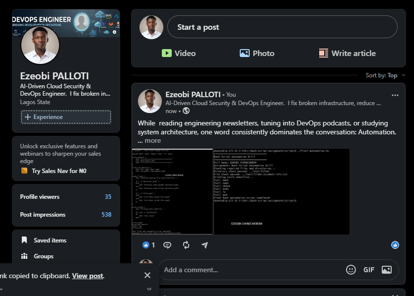

# Assignment 5 — Bash Script Automation Drill (OPS Checklist)

Part of the DevOps Micro Internship (DMI) Cohort 3 with Agentic AI

---

## Purpose

In this assignment, you will practice Bash scripting by building a series of small automation scripts covering environment setup, variables, arrays, loops, file conditionals, if-else logic, and functions. These scripts form the foundation of real-world Linux automation used in DevOps, cloud, and production support environments.

---

# Task 1 — Bash Environment & Workspace Setup

## Goal

Verify that Bash is available on your system and create a clean workspace for this assignment.

### Evidence

#### Screenshot 1 — Output of `echo $SHELL` and `bash --version`

Add your screenshot here.

---

#### Screenshot 2 — Output of `pwd` and `ls -lah` showing the scripts directory

Add your screenshot here.

---

### Notes

Answer the following in your own words:

**1. What is Bash?**

Bash (short for Bourne Again SHell) is a command-line interpreter and scripting language used primarily on Unix-like operating systems, such as Linux and macOS.
---

**2. What is the difference between shell and Bash?**

The difference is simple: Shell is the broad category, while Bash is a specific software program inside that category.
---

**3. Why is it important to confirm the Bash version before writing scripts?**

Add your answer here.
Confirming your Bash version is important because features and syntax change over time. A script that runs perfectly on a modern machine might completely crash or behave unpredictably on an older server
---

# Task 2 — Your First Bash Script

## Goal

Create your first Bash script, make it executable, and run it from the terminal.

### Evidence

#### Screenshot 1 — Content of `first-script.sh`

Add your screenshot here.

---

#### Screenshot 2 — Output of `./first-script.sh`

Add your screenshot here.

---

#### Screenshot 3 — Output of `ls -l first-script.sh` showing executable permission

Add your screenshot here.

---

### Notes

Answer the following in your own words:

**1. What is the purpose of `#!/bin/bash`?**

Add your answer here.
It's called a shebang (or hash-bang). Its purpose is to tell the operating system exactly which interpreter to use to run the commands in your script.
---

**2. Why do we use `chmod +x` before running a script?**

Add your answer here.

Changes the file's permissions to make it executable.
---

**3. What is the difference between running a script using `./script.sh` and `bash script.sh`?**

Add your answer here.

The difference comes down to who is in charge of launching the script and which permissions are required.

bash script.sh
When you type this, you are manually starting a fresh instance of the Bash program and handing it your script as a text file to read.

./script.sh
When you type this, you are telling the operating system's kernel to run the file directly as an independent program (the ./ just points to the current folder).
---

# Task 3 — Variables: User Information Script

## Goal

Use variables to store and display user-related information.

### Evidence

#### Screenshot 1 — Content of `user-info.sh`

Add your screenshot here.

---

#### Screenshot 2 — Output of `./user-info.sh`

Add your screenshot here.

---

### Notes

Answer the following in your own words:

**1. What is a variable in Bash?**

Add your answer here.
A variable in Bash is a temporary storage location that holds a piece of text or a number. Think of it like a labeled box: you give the box a name, drop some data inside it, and then call that name whenever you need to use that data later in your script.
---

**2. Why should we avoid spaces around the `=` sign when creating variables?**

Add your answer here.

Bash treats the very first word on a line as a command to run, and spaces act as separators between that command and its arguments.
---

**3. How do you access the value stored inside a Bash variable?**

Add your answer here.

To access the value stored inside a Bash variable, you put a dollar sign ($) directly in front of the variable's name.
---

# Task 4 — Arrays & Loops: Tools Checklist Script

## Goal

Use arrays and loops to print a checklist of tools used in Bash scripting.

### Evidence

#### Screenshot 1 — Content of `tools-checklist.sh`

Add your screenshot here.

---

#### Screenshot 2 — Output of `./tools-checklist.sh`

Add your screenshot here.

---

### Notes

Answer the following in your own words:

**1. What is an array in Bash?**

Add your answer here.
An array is a structured row of numbered slots. It allows you to store a list of multiple values under a single variable name.
---

**2. Why are arrays useful in scripts?**

Add your answer here.
Arrays are useful because they allow you to handle dynamic, unpredictable lists of data without rewriting your code.
---

**3. What does `"${tools[@]}"` mean?**

Add your answer here.

In Bash, this expression means: "Give me every single item inside the array named tools, and keep each item completely distinct."
---

**4. What is the purpose of the `for` loop in this script?**

Add your answer here.

The purpose of a for loop is automation through repetition. It tells the computer to take a list of items and run the exact same block of code over every single item, one by one, until the list is finished.
---

# Task 5 — Loops: Number Counter Script

## Goal

Use loops to repeat a task multiple times.

### Evidence

#### Screenshot 1 — Content of `counter.sh`

Add your screenshot here.

---

#### Screenshot 2 — Output of `./counter.sh`

Add your screenshot here.

---

### Notes

Answer the following in your own words:

**1. What is a loop?**

Add your answer here.

A loop is a programming tool that repeats a block of code over and over again until a specific condition is met.
---

**2. Why do we use loops in Bash scripting?**

Add your answer here.

We use loops in Bash scripting primarily to eliminate repetitive manual work and automate mass operations.
---

**3. How many times did the loop run in your script?**

Add your answer here.
Five times
---

**4. What would you change if you wanted the loop to run 10 times?**

Add your answer here.
Change the for number block from 5 digits to 10 digits
---

# Task 6 — Files & Conditionals: File Validation Script

## Goal

Use file checks and conditionals to verify whether files and directories exist.

### Evidence

#### Screenshot 1 — Output of `ls -lah ../test-folder`

Add your screenshot here.

---

#### Screenshot 2 — Content of `file-check.sh`

Add your screenshot here.

---

#### Screenshot 3 — Output of `./file-check.sh`

Add your screenshot here.

---

### Notes

Answer the following in your own words:

**1. What does `-d` check in Bash?**

Add your answer here.
'-d' means run the code the background/detached mode i.e The code output shouldn't show up on the screen

**2. What does `-f` check in Bash?**

Add your answer here.

In Bash, the -f flag is a conditional test used to check if a specific file exists and is a regular file.
---

**3. Why should file and directory paths be stored in variables?**

Add your answer here.

Storing file and directory paths in variables is an absolute best practice in scripting. It saves time, prevents catastrophic mistakes, and makes your code much cleaner.
---

**4. What happens if the file does not exist?**

Add your answer here.
It creates the file, if it doesn't exist
---

# Task 7 — Conditionals: Pass or Retry Script

## Goal

Use if-else conditionals to make decisions based on a variable value.

### Evidence

#### Screenshot 1 — Content of `score-check.sh` with `score=85`

Add your screenshot here.

---

#### Screenshot 2 — Output showing `Result: Pass`

Add your screenshot here.

---

#### Screenshot 3 — Content of `score-check.sh` with `score=55`

Add your screenshot here.

---

#### Screenshot 4 — Output showing `Result: Retry`

Add your screenshot here.

---

### Notes

Answer the following in your own words:

**1. What is the purpose of if-else in Bash?**

Add your answer here.

The purpose of an if-else statement is to give your script decision-making power.
---

**2. What does `-ge` mean?**

Add your answer here.

In Bash, -ge stands for "greater than or equal to".
---

**3. Why should conditions be tested with different values?**

Add your answer here.

This often called boundary and equivalence testing : This is the only way to prove a program actually works the way you expect. If you only test a single "happy path" value, you leave the door open for hidden bugs, crashes, and security holes.
---

**4. How can conditionals help in automation scripts?**

Add your answer here.

In automation scripts, conditionals (if/else statements) serve as the brain of your script. Without them, a script is just a rigid list of commands that runs blindly from top to bottom. Conditionals allow your script to dynamically pause, pivot, and make decisions based on the real-time state of your environment.
---

# Task 8 — Functions: Final Bash Automation Script

## Goal

Create a final Bash script using functions to organize reusable code.

### Evidence

#### Screenshot 1 — Content of `final-automation.sh`

Add your screenshot here.

---

#### Screenshot 2 — Output of `./final-automation.sh`

Add your screenshot here.

---

#### Screenshot 3 — Output of `ls -lah` showing all created scripts

Add your screenshot here.

---

### Notes

Answer the following in your own words:

**1. What is a function in Bash?**

Add your answer here.

In Bash, a function is essentially a reusable mini-script tucked inside your main script. It allows you to group a block of commands together, give that block a name, and run it whenever you want just by calling that name.
---

**2. Why are functions useful in scripts?**

Add your answer here.

Functions are useful in scripts because they transform a messy, repetitive sequence of commands into a clean, organized, and maintainable tool.
---

**3. Which functions did you create in this script?**

Add your answer here.

The functions I created in this script:

1. print_header() – Prints a visual separator header using the assignment name.
2. `print_user_details()`– Displays the full name and assignment name.
3. `check_files()` – Verifies whether the specified directory and file exist on the system.
4. `print_tools()` – Loops through the `tools` array and lists each tool.
---

**4. How does this final script combine variables, arrays, loops, conditionals, files, and functions?**

Add your answer here.

At the very top,I define the raw information the script needs to run.

Variables (full_name, directory_path, etc.) store single pieces of text.

An Array (tools) acts as a dedicated list holding multiple related values together ("bash", "nano", etc.).
---

# LinkedIn Post (Required)

## Evidence

#### LinkedIn Post URL

Paste your LinkedIn post URL here:

`https://www.linkedin.com/posts/ezeobi-palloti-5b231a1b9_while-reading-engineering-newsletters-tuning-ugcPost-7484574314764107776-PWfQ/?utm_source=share&utm_medium=member_desktop&rcm=ACoAADLFS9YBFQ6i_O56Veo32xN5JbLJZhDGNnE`

---

#### Screenshot — Published LinkedIn post

Add your screenshot here.

---

# Submission Instructions

- Add all required screenshots in your submission
- Full name must be visible in required screenshots
- All script files must be created and run successfully
- Required notes must be answered clearly for every task
- Do not expose sensitive information (keys, passwords, credentials)

---

# Completion Checklist

- [ ] Task 1: Environment setup verified, workspace created (Screenshots 1–2, Notes answered)
- [ ] Task 2: First script created, executed, permissions verified (Screenshots 1–3, Notes answered)
- [ ] Task 3: Variables script created and run (Screenshots 1–2, Notes answered)
- [ ] Task 4: Arrays and loops script created and run (Screenshots 1–2, Notes answered)
- [ ] Task 5: Counter loop script created and run (Screenshots 1–2, Notes answered)
- [ ] Task 6: File validation script created and run (Screenshots 1–3, Notes answered)
- [ ] Task 7: Pass/Retry conditional script tested with both values (Screenshots 1–4, Notes answered)
- [ ] Task 8: Final automation script created and run (Screenshots 1–3, Notes answered)
- [ ] All scripts run without errors
- [ ] Full Name visible in all required screenshots
- [ ] LinkedIn post published and URL submitted
- [ ] No sensitive data exposed

---

## 📌 About DMI & CloudAdvisory

DevOps Micro Internship (DMI) is a project-based DevOps program run by Pravin Mishra (The CloudAdvisory) focused on real-world execution, systems thinking, and career readiness.

It helps learners build strong DevOps foundations with hands-on experience.

---

## 📌 Resources

- 🌐 DMI Official Website: https://pravinmishra.com/dmi  
- 🎓 DevOps for Beginners (Udemy): https://www.udemy.com/course/devops-for-beginners-docker-k8s-cloud-cicd-4-projects/  
- 🎓 Agentic AI DevOps with Claude Code: https://www.udemy.com/course/ultimate-agentic-ai-devops-with-claude-code/  
- 🎓 DevOps with Claude Code: Terraform, EKS, ArgoCD & Helm: https://www.udemy.com/course/devops-with-claude-code-terraform-eks-argocd-helm/  
- ▶️ YouTube Playlist: https://www.youtube.com/playlist?list=PLFeSNDtI4Cho  
- 🔗 Pravin Mishra (LinkedIn): https://www.linkedin.com/in/pravin-mishra-aws-trainer/  
- 🏢 CloudAdvisory (LinkedIn): https://www.linkedin.com/company/thecloudadvisory/

---

*This submission is part of DevOps Micro Internship (DMI) Cohort 3 — Agentic AI Track.*