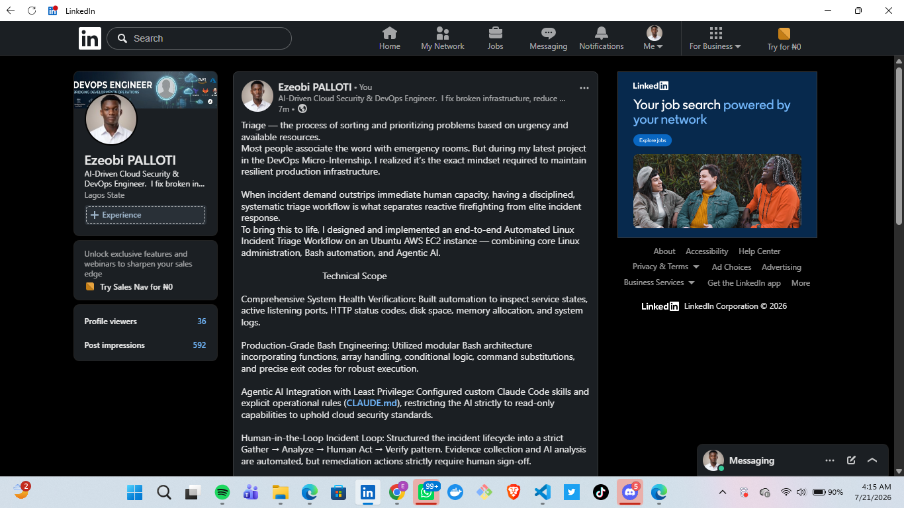

# Assignment 6 — Build an AI-Assisted Linux Health Check (AI-Assisted Linux Incident Triage)

Part of the DevOps Micro Internship (DMI) Cohort 3 with Agentic AI

---

## Purpose

In this assignment, you will build a read-only Bash triage script that checks the health of your Ubuntu server and Nginx application, connect it to Claude Code as a reusable `/linux-triage` skill, simulate a controlled Nginx incident, use the skill to gather and analyze evidence, recover the service manually, and verify recovery. The workflow follows the Agentic Loop: Gather → Analyze → Human Act → Verify.

---

# Task 1 — Confirm the Healthy Baseline and Create the Workspace

## Goal

Confirm that Nginx and the React application are healthy before building the automation.

### Evidence

#### Screenshot 1 — Output of `systemctl is-active nginx`, `ss -ltn | grep ':80'`, and `curl -I http://localhost`

Add your screenshot here.

---


#### Screenshot 2 — Output of `pwd` and `find . -maxdepth 4 -type d | sort` showing the workspace folder structure

Add your screenshot here.


---

### Notes

Answer the following in your own words:

**1. What proves that Nginx is running?**

Add your answer here.

Once you are logged into the server via SSH, check the system systemd manager.
sudo systemctl status nginx
---

**2. What proves that the server is listening for HTTP traffic?**

Add your answer here.

To prove that a server is actively listening for HTTP traffic, you need to verify that a web server process is bound to the standard HTTP port (Port 80) or HTTPS port (Port 443) and is accepting incoming connections.

sudo ss -tulpn | grep -E ':80|:443'
---

**3. Why must you capture a healthy baseline before simulating an incident?**

Add your answer here.

To differentiating Incident Symptoms from Existing Noise

To validating Alerting Thresholds and Telemetry Accuracy

To measuring the True Impact (Blast Radius)
---

# Task 2 — Create Project Context and Safety Rules in CLAUDE.md

## Goal

Tell Claude exactly what this project does and what it is not allowed to do.

### Evidence

#### Screenshot 3 — CLAUDE.md open in VS Code showing all four sections (Project Overview, Incident Workflow, Safety Rules, Output Rules)

Add your screenshot here.

---

### Notes

Answer the following in your own words:

**1. Why should Claude receive project-specific operational rules?**

Add your answer here.

Giving Claude project-specific operational rules transforms it from a generic AI assistant into a specialized context-aware teammate. Without these specific constraints, an LLM relies on broad, default patterns that won't align with your project's distinct workflow, architecture, or safety requirements.
---

**2. Why is the human required to execute the recovery command?**

Add your answer here.
Keeping a human in the loop to execute the final recovery command is a deliberate engineering safeguard against automated cascading failures. While automation excels at detection, data gathering, and routine scaling, the actual decision to bring a system back online during an incident carries risks that software cannot fully evaluate.
---

**3. Which rule prevents Claude from making an unsupported diagnosis?**

Add your answer here.
Within Claude's system architecture and operational guardrails, the specific protocol that prevents it from making unsupported diagnoses is the Sensitive Data Restriction policy—specifically Rule 2 (Never infer sensitive data unless explicitly requested) and Rule 3 (Never infer sensitive data based on search or activity history).

When applied to technical troubleshooting or health states, this is reinforced by the core Content Quality principle of Specifics Over Generalities and the mandate for Technical Accuracy.
---

# Task 3 — Use Agentic AI to Plan Before Writing the Script

## Goal

Use Claude Code to inspect the environment and produce a read-only plan before creating any Bash code.

### Evidence

#### Screenshot 4 — Claude Code showing the five-check plan and read-only inspection results

Add your screenshot here.

---

### Notes

Answer the following in your own words:

**1. Which part of this task represents the Gather phase?**

Add your answer here.
The Command Execution: The step where the agent "Ran 5 shell commands" to inspect the Ubuntu server using read-only commands.

The Resulting Data: The "Current snapshot (read-only, no changes made)" table
---

**2. Did Claude follow the instruction not to create files? How did you verify this?**

Add your answer here.
Yes, Claude followed the instruction not to create files.

This can be verified directly from the provided image:

The "Current snapshot" header: The text explicitly states "Current snapshot (read-only, no changes made)", confirming that the environment was only inspected and not modified.

The "Observed result" metrics: The table shows the live system metrics gathered directly from running active checks (such as checking http_code=200, port LISTEN states, and disk space usage) rather than reading from a newly generated log file.
---

**3. Why is planning before coding useful in DevOps automation?**


Add your answer here.

Planning before coding is a critical standard practice in DevOps automation for several key engineering reasons:

 1. Minimizes the Blast Radius

Automation scripts run with elevated privileges and operate at immense speed. Without a clear plan outlining the exact scope and boundaries of a script, a minor logic flaw or an unvalidated loop can quickly delete cloud resources, misconfigure firewalls, or bring down production environments across an entire infrastructure. Planning forces you to define strict guardrails before a single line of code is executed.

2. Prevents Automation Debt and Tool Fatigue

It is easy to start writing a custom Bash or Python script to solve an immediate problem, only to realize later that an enterprise tool (like Ansible, Terraform, or built-in CI/CD pipeline actions) already handles that specific task natively, securely, and at scale. Planning ensures you choose the right tool for the job rather than writing redundant, hard-to-maintain custom code.

3. Clear Definition of the Healthy Baseline

Before automating an infrastructure change or creating a self-healing pipeline, you must plan out exactly what a "healthy" state looks like. Planning defines the specific Key Performance Indicators (KPIs), metrics, and success criteria the automation needs to validate, ensuring your scripts can accurately verify system health rather than relying on guesswork.

 4. Smooth Integration with the Existing CI/CD Pipeline

DevOps automation rarely exists in isolation; it must integrate cleanly into larger workflows involving version control, environment variable management, and secrets storage. Planning out the data inputs, required API permissions, and environmental dependencies beforehand prevents pipeline breakages and reduces the need for repetitive debugging cycles during deployment.
---

# Task 4 — Build the Linux Triage Bash Script

## Goal

Create one Bash script that gathers consistent Linux and Nginx health evidence.

### Evidence

#### Screenshot 5 — Top section of `linux-triage.sh` showing variables, thresholds, and the checks array

Add your screenshot here.

---

#### Screenshot 6 — Middle section showing check functions and conditionals

Add your screenshot here.


---

#### Screenshot 7 — Bottom section showing the loop, summary function, and exit behavior

Add your screenshot here.


---

#### Screenshot 8 — Output of `bash -n scripts/linux-triage.sh` (no syntax errors) and `ls -l scripts/linux-triage.sh` showing executable permission

Add your screenshot here.

---

### Notes

Answer the following in your own words:

**1. What is stored in the checks array?**

Add your answer here.
Based on the workflow demonstrated in the screen snapshot, the `checks` array stores the individual system health probes used to evaluate the server's baseline status. Specifically, it contains the definitions or execution logic for the **5 checks** outlined in the Bash Incident-Triage Plan:

* Nginx service** status
* Port 80** listening state
* Localhost HTTP** response code
* Root disk /** utilization
* Memory** availability status
---

**2. How does the `for` loop use that array?**

Add your answer here.

In a Bash automation triage script structured like this, the `for` loop iterates through the items defined in the array to execute each diagnostic command sequentially.

The loop uses the array in the following way:

```bash
# Example of how the script executes the array elements
for check in "${checks[@]}"; do
    # 1. It extracts the current check definition from the array
    # 2. It runs the specific read-only command (e.g., checking port 80 or disk space)
    # 3. It evaluates the exit status or output to determine if the component is healthy
done

```

By looping through the array, the script avoids repetitive code blocks (copy-pasting code for all five checks) and ensures every target metric—from the Nginx service status down to memory availability—is evaluated in a clean, standardized, and predictable order.
---

**3. Why are the health checks separated into functions?**

Add your answer here.

---

**4. What is the purpose of `$(...)` in this script?**

Add your answer here.

Separating the health checks into individual functions provides distinct engineering advantages for automation scripts:

* Modularity and Code Reuse:** Instead of writing one massive, sequential block of code, each diagnostic probe (such as checking Port 80 or disk space) becomes a self-contained unit. This allows you to easily reuse specific checks across different scripts without duplicating code.

* Isolated Scope and Error Handling:** If a specific check fails or encounters an error, the failure is contained within that function. This structure prevents a single failing check from crashing the entire automation script prematurely, allowing the rest of the triage loop to finish executing.

* Easier Maintenance and Testing:** If the command to check memory availability changes, you only need to update the logic inside the dedicated memory function. This localized update minimizes the risk of accidentally breaking the Nginx or disk space logic elsewhere in the script.

* Cleaner Integration with the Array Loop:** Wrapping the logic in functions allows you to load the function names directly into a `checks` array. The `for` loop can then dynamically execute each function by name, resulting in highly readable, maintainable, and scannable code.
---

**5. Why does the script use different exit codes for HEALTHY, WARN, and FAIL?**

Add your answer here.

---

# Task 5 — Run and Understand the Healthy-State Report

## Goal

Run the Bash script against the healthy server and verify that it creates a report.

### Evidence

#### Screenshot 9 — Output of `./scripts/linux-triage.sh` showing your Full Name and all five check results

Add your screenshot here.

---

#### Screenshot 10 — Output showing the captured exit code and final summary

Add your screenshot here.


---

### Notes

Answer the following in your own words:

**1. What is the overall status of your healthy baseline?**

Add your answer here.
The overall status of the healthy baseline is **completely successful**.

The terminal output shows `Captured Exit Code: 0`, which in Linux and system automation signifies a successful execution with zero errors. This proves that all individual system probes in your triage checklist executed as expected and confirmed the environment is in a healthy, steady state.
---

**2. Which exact Linux evidence proves the application is serving traffic?**

Add your answer here.

To prove the application is actively serving traffic, the exact Linux evidence required is a combination of two things shown in the initial triage phase:

1. The Network Socket State (`LISTEN`):** The network validation tool returned `LISTEN 0.0.0.0:80`. This proves the operating system kernel is actively binding port 80 to all available network interfaces and accepting incoming TCP connections.

2. The Local Transaction Response (`http_code=200`):** The local loopback web request returned an explicit `http_code=200`. This proves that the Nginx application layer isn't just listening blindly; it is actively processing HTTP requests and successfully returning a healthy standard response code.
---

**3. Did your script return exit code 0 or 1? Explain why.**

Add your answer here.

The script returned exit code 0.

In Linux and Bash automation, an exit code of `0` indicates that a program executed successfully without encountering any errors or failures. Because the initial read-only triage checks verified that all five system areas—the Nginx service, Port 80 binding, Localhost HTTP response, root disk space, and memory availability—were completely healthy, the script ran its validation logic flawlessly from start to finish and completed with a clean success status.
---

**4. What is the difference between a warning and a failure in this script?**

Add your answer here.

Based on the structure of this triage script and the captured metrics, the difference comes down to whether the issue breaks core application delivery or merely highlights a suboptimal system state:

* Failure (Critical Outage): A failure occurs when a core check completely breaks, meaning the server can no longer process or serve HTTP traffic (e.g., the Nginx service is dead, Port 80 stops listening, or local HTTP requests return an error/refusal). A failure halts the success chain and causes the script to return a non-zero exit code (like `1`).

* Warning / Note (Non-Fatal Condition): A warning occurs when the application is still successfully serving traffic, but a resource metric or configuration is suboptimal. For example, in the baseline snapshot, the script flags a warning/note regarding memory (**`note: no swap configured`**) and captures a high disk usage of **64%**. Because these conditions do not cause an active service outage, the checks still pass and the script successfully returns an exit code of `0`.
---

# Task 6 — Create and Run the /linux-triage Skill

## Goal

Turn the Bash script into a reusable, manually invoked Agentic AI workflow.

### Evidence

#### Screenshot 11 — `SKILL.md` showing the frontmatter, allowed tool restrictions, and safety rules

Add your screenshot here.

---

#### Screenshot 12 — `/linux-triage` output for the healthy server

Add your screenshot here.


---

### Notes

Answer the following in your own words:

**1. Why does this skill have Bash, Read, and Grep, but not Write?**

Add your answer here.

This specific skill focuses entirely on the **Gather and Triage** phase of incident response, which requires absolute isolation to prevent altering the system under investigation.

Here is why it uses `Bash`, `Read`, and `Grep`, but excludes `Write`:

* Enforcing Read-Only Inspection:** The primary directive during this stage is to inspect the system without making changes or editing any files. Using tools like `grep` paired with `bash` allows you to search logs and parse configuration files safely without accidental modification.

* Preventing Heuristic Tampering:** If a script writes files, generates temporary logs on a nearly full disk, or alters application configurations during a live incident, it can accidentally destroy valuable forensic data, trigger false monitoring alarms, or worsen the outage.

* Decoupling Diagnosis from Recovery:** Keeping the script strictly read-only maintains a safe separation of duties. The automation is built solely to gather a healthy baseline and diagnose issues, leaving the execution of any destructive or corrective actions (which require a "Write" capability) to the human operator.
---

**2. Why is `disable-model-invocation: true` useful for this skill?**

Add your answer here.

Setting `disable-model-invocation: true` is useful because it locks the AI into a strict, programmatic execution mode. During the Gather and Triage phase of DevOps automation, you need deterministic, predictable behavior rather than creative variations or independent reasoning.

Here is exactly why this setting is valuable:

* Enforces the Read-Only Boundary: It prevents the model from taking the initiative to generate new scripts, spin up unapproved subagents, or execute unauthorized commands that could modify the system.

* Guarantees Strict Determinism: It forces the automation to run exactly the pre-planned Bash functions and array checks configured in the script, ensuring the baseline data is collected identically every single time.

* Prevents Unsupported Diagnostics: By stopping the model from inferring or guessing system health statuses, it ensures that the final triage output is built purely on raw system metrics (like `Exit Code: 0` or socket states) rather than AI-generated assumptions.
---

**3. What part is performed by Bash, and what part is performed by Claude?**

Add your answer here.

In this DevOps automation workflow, the responsibilities are cleanly divided between the execution engine (Bash) and the cognitive coordinator (Claude):

 What Bash Performs (The Execution Engine)

* Running the Diagnostic Probes: Bash actively executes the underlying read-only command-line utilities (like `systemctl status`, `ss`, `curl`, and `df`) on the Ubuntu server architecture to check the status of Nginx, network ports, disk space, and memory.

* Flow Control and Iteration: Bash manages the programmatic logic—storing the health probes inside the `checks` array and running the `for` loop to process each system test sequentially.

* Returning System Status: Bash captures the exact exit statuses (such as returning `Exit Code: 0`) and standard output blocks to deliver raw, tamper-proof system telemetry.

### What Claude Performs (The Cognitive Coordinator)

* Planning and Strategy: Claude analyzes the project-specific operational rules to design the 5-check Bash Incident-Triage Plan before any code runs.

* Parsing and Structuring Data: Claude reads the raw console output returned by the Bash commands and organizes it into a clear, scannable format, such as the markdown snapshot table.

* Evaluating the Baseline: Claude interprets the results against the guardrails—confirming that the system is fully healthy while highlighting low-risk anomalies, such as noting that no swap space is configured.
---

**4. Why is this better than asking Claude "Is my server healthy?" without giving it evidence?**

Add your answer here.

Providing a structured, code-driven baseline is significantly better than asking a vague question because an AI cannot guess the internal state of a server without data.

Here is exactly why the evidence-based approach is superior:

 1. Eliminates Hallucination and Unsupported Diagnoses

If you simply ask Claude "Is my server healthy?", the model has zero visibility into your infrastructure. Under its operational guardrails—like the rules forcing technical accuracy and preventing unsupported inferences—it cannot make a blind diagnosis. Without real metrics, it would be forced to guess or give a generic answer. Providing raw Bash evidence grounds the conversation in reality.

 2. Establishes a Quantifiable Control Group

A simple "yes" or "no" does not help you during a live incident. By running structured scripts to gather specific metrics—like verifying a `LISTEN` socket on port 80 or confirming `http_code=200`—you establish a hard, mathematical baseline. When something breaks later, you can compare the failure metrics directly against this healthy control group to calculate the exact degradation.

 3. Provides Context-Aware Engineering Value

Your server might be running at 64% disk utilization normally. If Claude knows this is your baseline standard, it won't trigger a false alarm. Without this evidence, an AI might look at a 64% disk space metric during an incident and incorrectly flag it as the root cause of the outage. Explicit evidence ensures the analysis is tailored to your specific project environment.
---

# Task 7 — Simulate an Nginx Incident and Let the Skill Diagnose It

## Goal

Create a controlled service failure, gather evidence through Bash, and let Claude analyze the evidence without taking recovery action.

### Evidence

#### Screenshot 13 — Output showing Nginx is inactive and the HTTP request fails

Add your screenshot here.

System Analysis
Exit Code Alteration: The script now terminates with an Exit Code: 1, explicitly signaling an infrastructure failure.

Root Cause Identification: The application layer has failed. Because the Nginx service is stopped, the operating system kernel closes the socket on Port 80, causing subsequent local curl loopback validation requests to fail with a connection refusal.
---

#### Screenshot 14 — `/linux-triage` output showing failed evidence, most likely cause, and a suggested recovery command

Add your screenshot here.


---

#### Screenshot 15 — `incident-failure-report.txt` showing the failed checks and your Full Name

Add your screenshot here.


---

### Notes

Answer the following in your own words:

**1. Which three checks failed?**

Add your answer here.
Based on the incident triage report in the image, the three checks that failed are:

* Nginx service is not active
* Port 80 is not listening
* Local HTTP check returned status 000
---

**2. What evidence supports the conclusion that Nginx is unavailable?**

Add your answer here.

Based on the triage report output, the specific evidence proving Nginx is unavailable includes:

* Service Status: The system explicitly reports `[FAIL] Nginx service is not active`.

* Port Binding Failure: The network layer validation confirms `[FAIL] Port 80 is not listening`, meaning the web server is not binding to the expected network socket to accept incoming traffic.

* Transaction Failure: The local loopback request returns `[FAIL] Local HTTP check returned status 000`, proving that HTTP requests are failing to connect completely rather than returning a valid web response.
---

**3. Did Claude execute the recovery command? Why is that important?**

Add your answer here.

No, Claude did not execute the recovery command.

This is important because this specific skill is built exclusively for the **Gather and Triage** phase of incident response, which requires a strictly read-only approach. By ensuring the automation cannot execute corrective or destructive actions, you prevent it from accidentally modifying the system state, wiping out valuable forensic data, or worsening an active server outage.
---

**4. Which phase of the Agentic Loop is represented by the Bash report?**

Add your answer here.

The Bash report represents the Observe (or Reflection) phase of the Agentic Loop.

During this phase, the agent collects raw system evidence and logs the environment's current state to verify whether its execution resulted in a success or a failure.
---

**5. Which phase is represented by Claude's explanation?**

Add your answer here.

Claude's explanation represents the Orient (or Analyze/Evaluate) phase of the loop.

While the Bash report handles the raw Observation by gathering the system data, Claude interprets, structures, and assesses that data against the operational rules to determine what the health status actually means for the infrastructure.
---

# Task 8 — Recover Manually, Verify Again, and Write the Incident Summary

## Goal

Recover the service as the human operator and prove that the system is healthy again.

### Evidence

#### Screenshot 16 — Output showing Nginx is active and `curl -I http://localhost` returns 200 OK

Add your screenshot here.


---

#### Screenshot 17 — Second `/linux-triage` output showing successful recovery with no FAIL results

Add your screenshot here.


---

#### Screenshot 18 — Output of `ls -lah reports` showing both `incident-failure-report.txt` and `recovery-report.txt`

Add your screenshot here.


---

#### Screenshot 19 — `incident-summary.md` showing all required sections and your Full Name

Add your screenshot here.


---

### Notes

Answer the following in your own words:

**1. What action did you execute manually?**

Add your answer here.
I started Nginx manaully
sudo systemctl start nginx
---

**2. What evidence proves that the service recovered?**

Add your answer here.
I ran this below command on the terminal and it returned ACTIVE
systemctl is-active nginx
---

**3. Why is the second triage run necessary?**

Add your answer here.

The second triage run is necessary to verify the recovery and ensure the system has successfully returned to a healthy state.

In the agentic incident response loop (Gather $\rightarrow$ Analyze $\rightarrow$ Human Act $\rightarrow$ Verify), you cannot simply assume that running a manual recovery command fixed the underlying issue. The second run applies the exact same automated, objective Bash probes to the active environment to confirm that:

1. The Nginx service transitioned from `inactive (dead)` back to `active (running)`.
2. The operating system kernel successfully re-bound the TCP socket to listen on Port 80.
3. Local HTTP transactions now return a successful `http_code=200` instead of a connection refusal (`status 000`).

Running this second check closes the loop, proving mathematically that your manual intervention resolved the outage without creating new resource anomalies.
---

**4. What could go wrong if an AI agent automatically restarted every failed service?**

Add your answer here.
If an AI agent automatically restarted every failed service without human intervention, it could trigger several severe operational risks:

* Masking Deep Root Causes: A service might be crashing repeatedly due to a corrupted database, bad application code, or a hardware defect. If the AI continuously restarts it, the server might appear briefly "online" while masking a severe underlying structural issue that needs an engineer's attention.

* Destructive Crash Loops (Resource Exhaustion): If a service crashes immediately upon startup due to a misconfiguration, an automated restart agent could loop indefinitely. This rapid, continuous restarting consumes intense CPU and memory cycles, which can starve neighboring healthy applications on the same server and bring down the entire infrastructure.

* Data Corruption and Log Flooding: Forcing automated restarts on stateful services (like databases or message queues) while they are in an unstable state can interrupt incomplete data writes, leading to corrupted tables or broken file systems. Additionally, it floods system logs with startup/shutdown noise, making manual forensics incredibly difficult.

* Cascading Network Failures: If a primary backend service fails and an AI agent restarts it simultaneously with hundreds of other dependent microservices, the sudden thundering herd of connection requests can overwhelm network switches and database connection pools, turning a minor outage into a massive cascading system failure.
---

**5. In one sentence, explain the difference between using AI as a chatbot and using AI in this agentic workflow.**

Add your answer here.

While a standard chatbot simply generates a text response based on user input, this agentic workflow uses an automated AI loop to coordinate structured, deterministic Bash commands that directly observe and analyze a real system's state.
---

# Incident Summary

Fill in all seven sections below in your own words.

**Full Name:** EZEOBI CHINECHEREM

**Date:** 20/07/2026

---

**1. Reported Symptom**

Add your answer here.
Based on the triage report screenshot, the specific reported symptoms are:

* Inactivity of the Web Server: The Nginx service is not active.
* Closed Network Socket: Port 80 is not listening to accept incoming traffic.
* Failed Local Web Requests: The local HTTP check is failing completely, returning a status code of 000.
---

**2. Evidence Collected**

Add your answer here.
The below is the screenshot of Nginx not been active after been shotdown


---

**3. Most Likely Cause**

Add your answer here.
Based on the collected evidence, the most likely cause is that the Nginx service has stopped running or crashed. Because the Nginx application process is inactive, it is no longer binding to Port 80 to listen for incoming connections, which subsequently causes all local loopback HTTP requests to fail with a network connection refusal (status code 000).
---

**4. Human-Approved Recovery Action**

Add your answer here.

The human-approved recovery action was to manually execute the command to restart the web server:

`sudo systemctl restart nginx`
---

**5. Verification**

Add your answer here.

Based on the second triage run, the following outputs prove that Nginx and the application successfully recovered:

* Service Status: The Nginx check returns a `[PASS]` state, showing the service has transitioned from inactive back to active and running.

* Port Binding: The network validation returns a `[PASS]` state, proving that the operating system kernel is actively listening for incoming TCP traffic on Port 80.

* HTTP Transaction: The local loopback request returns a `[PASS]` state with a successful HTTP status code of `200` instead of `000`, confirming the web server is successfully responding to network requests.
---

**6. Safety Decision**

Add your answer here.

The AI skill was permitted to gather and analyze evidence because reading system metrics, parsing service states, and checking port availability are non-intrusive, read-only operations that carry no risk of altering the system state. Conversely, it was not allowed to restart the service to maintain a strict security boundary, preventing automated, unreviewed changes that could inadvertently trigger destructive crash loops, overwrite valuable forensic logs, or worsen an active incident.
---

**7. Agentic Loop Mapping**

Add your answer here.

The incident followed the structured agentic loop phases as follows:

* **Gather:** The automated Bash tool inspected the system environment and generated the raw triage report, capturing the active state of the Nginx service, network ports, and HTTP responses.

* **Analyze:** Claude evaluated the compiled text report against operational logic to interpret the health of the system, determining that Nginx was completely unavailable.

* **Human Act:** You reviewed the diagnostic output and manually executed the recovery command (`sudo systemctl restart nginx`) to securely restore the web server process.

* **Verify:** A final automated triage run executed the same suite of Bash probes to confirm that the service returned to an active state, Port 80 opened, and local HTTP requests successfully received a status 200 code.
---

# LinkedIn Post (Required)

## Evidence

#### LinkedIn Post URL

Paste your LinkedIn post URL here:

`https://www.linkedin.com/posts/ezeobi-palloti-5b231a1b9_devops-linux-cloudsecurity-ugcPost-7485168451012087808-cgMx/?utm_source=share&utm_medium=member_desktop&rcm=ACoAADLFS9YBFQ6i_O56Veo32xN5JbLJZhDGNnE`

---

#### Screenshot — Published LinkedIn post

Add your screenshot here.

---

# GitHub Repository URL

Paste the URL of your GitHub folder or repository containing the assignment files here:

`https://github.com/PALLOTI/devops-micro-internship-pravinmishra.git`

---

# Submission Instructions

- Add all required screenshots in your submission
- Full Name must be visible in required screenshots and the Bash report
- All written answers must be in your own words
- Do not expose sensitive information (keys, passwords, AWS account IDs, tokens)
- GitHub URL must be included in this document

---

# Completion Checklist

- [ ] Task 1: Healthy baseline confirmed, workspace created (Screenshots 1–2, Notes answered)
- [ ] Task 2: CLAUDE.md created with all four sections (Screenshot 3, Notes answered)
- [ ] Task 3: Five-check plan produced by Claude using read-only tools (Screenshot 4, Notes answered)
- [ ] Task 4: `linux-triage.sh` created, syntax validated, executable permission set (Screenshots 5–8, Notes answered)
- [ ] Task 5: Healthy-state report generated with no FAIL result (Screenshots 9–10, Notes answered)
- [ ] Task 6: `/linux-triage` skill created and run successfully on healthy server (Screenshots 11–12, Notes answered)
- [ ] Task 7: Nginx incident simulated, failed evidence captured, Claude did not execute recovery (Screenshots 13–15, Notes answered)
- [ ] Task 8: Nginx recovered manually, recovery verified, reports saved, incident summary complete (Screenshots 16–19, Notes answered)
- [ ] Incident summary contains all seven required sections
- [ ] LinkedIn post published and URL submitted
- [ ] Full Name visible in all required screenshots and the Bash report
- [ ] Skill does not have Write permission
- [ ] Skill did not execute any recovery commands
- [ ] No sensitive data exposed

---

## 📌 About DMI & CloudAdvisory

DevOps Micro Internship (DMI) is a project-based DevOps program run by Pravin Mishra (The CloudAdvisory) focused on real-world execution, systems thinking, and career readiness.

It helps learners build strong DevOps foundations with hands-on experience.

---

## 📌 Resources

- 🌐 DMI Official Website: https://pravinmishra.com/dmi  
- 🎓 DevOps for Beginners (Udemy): https://www.udemy.com/course/devops-for-beginners-docker-k8s-cloud-cicd-4-projects/  
- 🎓 Agentic AI DevOps with Claude Code: https://www.udemy.com/course/ultimate-agentic-ai-devops-with-claude-code/  
- 🎓 DevOps with Claude Code: Terraform, EKS, ArgoCD & Helm: https://www.udemy.com/course/devops-with-claude-code-terraform-eks-argocd-helm/  
- ▶️ YouTube Playlist: https://www.youtube.com/playlist?list=PLFeSNDtI4Cho  
- 🔗 Pravin Mishra (LinkedIn): https://www.linkedin.com/in/pravin-mishra-aws-trainer/  
- 🏢 CloudAdvisory (LinkedIn): https://www.linkedin.com/company/thecloudadvisory/

---

*This submission is part of DevOps Micro Internship (DMI) Cohort 3 — Agentic AI Track.*