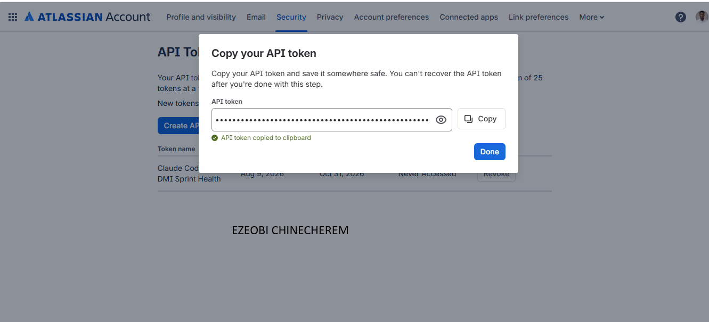
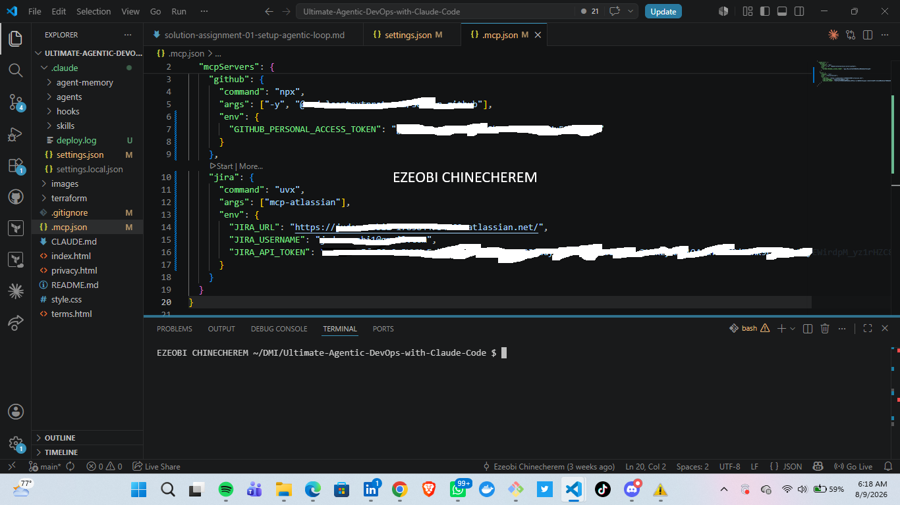
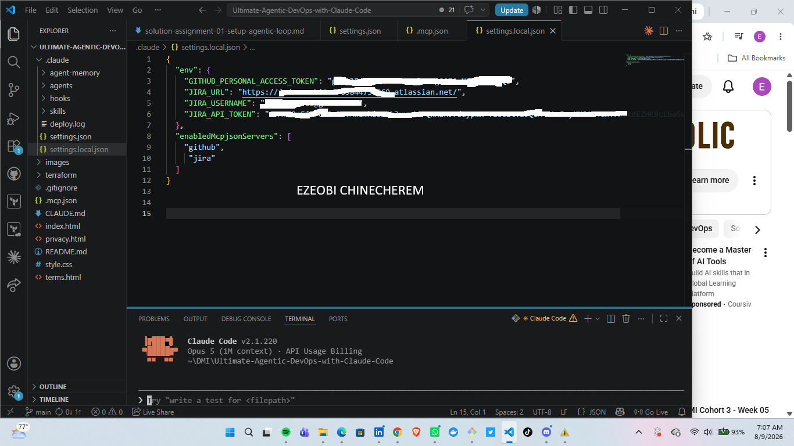
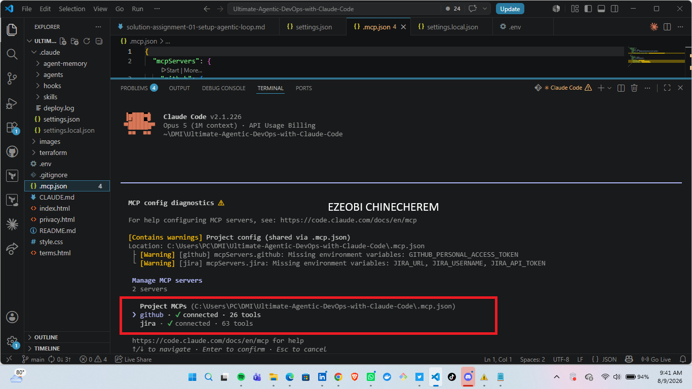

# Assignment 5 — AI-Assisted Sprint Health Report via Jira MCP

Part of the DevOps Micro Internship (DMI) Cohort 3 with Agentic AI

---

## Purpose

In this assignment, you will connect Claude Code to your Jira board through an MCP server, the same way you connected it to GitHub in Week 2, and build a read-only `/sprint-health` skill. The skill reads your current sprint through Jira's API and reports sprint velocity, stories at risk of missing the sprint, and items missing an estimate — but it must never create, edit, comment on, or transition a single ticket itself. You will prove that boundary holds by making a real change on the board yourself and confirming the skill only ever reports, never acts.

---

# Task 1 — Create a Jira API Token

## Goal

Generate an API token from your Atlassian account that the MCP server will use to authenticate with your Jira site. Do not screenshot the token value itself.

### Evidence

#### Screenshot 1 — Jira API token creation confirmation page showing the token name, with the token value not visible

### Notes You Must Write (Very Important):

Why does the MCP server need your site URL and account email in addition to the token?

An MCP server (such as the Atlassian/Jira MCP server) requires your Site URL, Account Email, and API Token because each piece plays a distinct role in basic HTTP Basic Authentication and Authorization to upstream Cloud APIs.

---

# Task 2 — Create .mcp.json at the Project Root

## Goal

Create or update `.mcp.json` at your project root with a Jira MCP server block, following the same shape as the GitHub MCP server you configured in Week 2.

### Evidence

#### Screenshot 2 — `.mcp.json` open in VS Code showing the Jira server configuration

### Notes You Must Write (Very Important):

Compare this jira block to the github block from Week 2 Assignment 5. The GitHub server ran via npx (a Node.js package); this one runs via uvx (a Python package) — what stays exactly the same shape despite that difference, and why doesn't Claude Code care which language a given MCP server is written in?

Regardless of whether an MCP server is invoked via Node.js (npx) or Python (uvx), the core architecture remains identical from Claude Code's perspective.

Here is why the configuration shape stays the same and why Claude Code doesn't care about the underlying programming language.

What Stays Exactly the Same
1 The JSON Configuration Block Structure

The wrapper configuration inside your claude.json / MCP config file maintains the exact same structural schema:

2 Server Identifier: The top-level key defining the tool name (e.g., "github" vs "jira" or "atlassian").

3 command String: The binary command used to execute the runner process ("npx" vs "uvx").

4 args Array: The list of arguments passed to boot the server (package name, setup flags, etc.).

5 env Object: The key-value environment variables containing credentials (tokens, site URLs, emails).

The Execution Model (Subprocess Management)

Claude Code treats both servers identically: it spawns a local child process using the binary specified in command, passes the args, injects the env variables, and maintains a persistent process while running.

Standard Input/Output (stdio) Communication

Both servers communicate over stdio (standard input and standard output). Claude Code sends JSON-RPC messages into the process's stdin and reads responses directly from its stdout.

---

# Task 3 — Add Your Credentials to settings.local.json

## Goal

Add your Jira site URL, account email, and API token to `.claude/settings.local.json`, and confirm that file is listed in `.gitignore` so it is never committed.

### Evidence

#### Screenshot 3 — `settings.local.json` open in VS Code showing the `env` section, with the actual token value blurred or covered

### Notes You Must Write (Very Important):

Why must JIRA_API_TOKEN live in settings.local.json and never in .mcp.json?

1. File Visibility and Version Control (.gitignore)
.mcp.json is committed to Git: This file is meant to define shared project-level MCP server configurations for the entire team or repository. Because it is tracked by Git, placing an API token inside .mcp.json means committing sensitive credentials directly into your source control history (which can leak to GitHub, GitLab, or unauthorized teammates).

settings.local.json is local-only: By convention and design, local settings files (or environment files) are ignored by Git via .gitignore. They stay exclusively on your local machine.

2. Multi-User and Authorization Boundary
Even within the same team, every developer has distinct permissions in Jira:

If JIRA_API_TOKEN were stored in a shared .mcp.json, every engineer pulling the repo would execute actions under the identity of whoever created that token.

By placing tokens in settings.local.json (or referencing local environment variables), each team member authenticates using their own email and API token. Actions taken via the MCP server are accurately attributed to the specific user in Jira's audit logs.

3. Key Rotation and Revocation
If a token in settings.local.json gets compromised or rotated, you only update your local file without affecting repo history or creating Git diffs.

If a token is committed to .mcp.json, revoking the token breaks the repository configuration for everyone, and deleting it from Git requires rewriting Git commit history to purge the secret permanently.

---

# Task 4 — Verify the Connection with /mcp

## Goal

Restart Claude Code and confirm the Jira MCP server shows as connected.

### Evidence

#### Screenshot 4 — `/mcp` output showing `jira: connected`

---

# Task 5 — Run a Live Query to Prove Real Board Data

## Goal

Ask Claude to list the issues in your current active sprint through the Jira MCP connection, and confirm the result matches what you see on your live board in the browser.

### Evidence

#### Screenshot 5 — Claude's response showing the live sprint issue list retrieved via Jira MCP

### Notes You Must Write (Very Important):

How did you confirm this was real board data and not something Claude guessed?

1. Cryptographic Identifiers & Unique Server Keys
Guessed or mock data typically uses generic numbers (e.g., KAN-1, TASK-123). Real responses contain globally unique, server-generated metadata:

Database IDs: Long numerical string IDs (e.g., 10024, 10892) generated by Atlassian/GitHub databases upon issue creation.

2. Live API Metadata and System Timestamps
Real backend responses automatically attach exact system timestamps and account metadata:

Timestamps to the Millisecond: 2026-08-10T20:14:02.341+0000 (exact system time recorded when created or updated).

Atlassian Account IDs (accountId): Strings like "5f9b2c8a0011223344556677" mapping directly to your authenticated user profile in Atlassian Cloud.

---

# Task 6 — Build the /sprint-health Skill

## Goal

Create a `/sprint-health` skill restricted to read-only Jira tools plus `Read`, with no issue-mutating tools and no `Write`. Run it and confirm it produces a report covering sprint velocity, at-risk stories, and items missing an estimate.

### Evidence

#### Screenshot 6 — `SKILL.md` frontmatter showing `allowed-tools` limited to read-only Jira tools plus `Read`, with `disable-model-invocation: true`

#### Screenshot 7 — `/sprint-health` output showing the full triage report against your real sprint

### Notes You Must Write (Very Important):

1. Which Jira MCP tools does this skill's allowed-tools list include, and which mutating tools (create issue, update issue, transition issue, add comment) does it deliberately exclude?

his skill is scoped strictly to read-only / inspection operations to safely query and monitor board data without risking accidental modifications:

jira_search_issues (or search_issues / jira_get_issue): Used to execute JQL queries, fetch issue lists, and retrieve specific issue details.

jira_get_all_projects / jira_get_board_issues: Used to list active boards, projects, and backlog items.

jira_get_project_components / jira_get_sprints: Used to view sprint statuses, active sprint goals, and structural metadata.

2. Why does a Scrum Master need this restriction more than almost any other role in this course?

1. The SM Protects Process Integrity, Not Ticket Execution
The Scrum Master’s core role is to serve as an agile coach and process guardian. Their job is to ensure the team owns the sprint board, maintains workflow discipline, and updates their own progress.

If an automated AI tool or an SM independently transitions tickets (e.g., automatically moving an issue from In Progress to Done or updating story points), it bypasses the team's agreed Definition of Done (DoD) checks.

1 The SM’s objective in Jira is observability (analyzing flow, spotting stale tickets, tracking burndown/velocity), not performing the administrative updates for developers.

2. Preventing False Process Indicators & Flawed Metrics
Agile metrics in Jira (such as Cycle Time, CFD/Cumulative Flow Diagrams, and Velocity) rely entirely on authentic human team behavior:

If an SM skill automatically moves or creates tickets, it artificially distorts sprint velocity and masks underlying bottlenecks (e.g., tickets actually stuck in QA or waiting for code review).

Read-only access allows the SM to identify where work is piling up so they can facilitate a discussion in the Daily Standup, rather than silently "fixing" the board state.

3. Preserving Team Ownership and Accountability
In Scrum, developers hold collective ownership over the Sprint Backlog.

When individual team members log sub-tasks, update statuses, and flag blockers themselves, they maintain direct accountability for their work.

If a Scrum Master (or an automated SM agent) mutates Jira tickets on behalf of the team, developers lose visibility into board state transitions, weakening team self-organization.

---

# Task 7 — Prove the Skill Never Mutates the Board

## Goal

Manually update one ticket on your board in the browser (for example, move a story to "Done" or add a missing estimate), then run `/sprint-health` again and confirm the new report reflects your change — proving the skill only ever reads live state and never wrote to the board itself.

### Evidence

#### Screenshot 8 — Second `/sprint-health` run showing the report now reflects your manual board change

### Notes You Must Write (Very Important):

Map this assignment to Gather → Analyze → Human Act → Verify from Week 3 Assignment 6. Which step did you perform manually in the browser, and why must that step stay human?

Which Step You Performed Manually in the Browser
1 You performed the Human Act step manually in the browser by opening the live deployment IP address ([http://18.188.7.58](http://18.188.7.58)) to inspect the running web application (verifying the hero tagline, dynamic footer, and Nginx response) and updating/verifying ticket states directly on the Jira board.

2 Why That Step Must Stay Human
True End-to-End Visual Verification (UX Guardrail): While AI can verify HTTP status codes or terminal output, a human must visually inspect the rendered UI in a real browser to ensure layout alignment, accessibility, and user experience match the design intent before marking a feature as delivered.

3 Accountability and Authorization Boundary: Mutating live board data or declaring a feature "Done" represents a business commitment. Keeping the "Act" step human ensures an autonomous agent cannot independently alter production board states, misrepresent sprint progress, or bypass human acceptance criteria.

4 Closing the Control Loop safely: By keeping human intervention in the execution loop (Human-in-the-Loop), you maintain strict governance over cloud resources and project state, ensuring the AI remains a supportive thought partner rather than an unmonitored actor.

---

# Submission Instructions

Complete all tasks in sequence.

Your submission must include:
- All 8 required screenshots
- All the required notes

---

# Completion Checklist

- [ ] Task 1: Jira API token created, value never screenshotted (Screenshot 1)
- [ ] Task 2: `.mcp.json` has the Jira server block (Screenshot 2)
- [ ] Task 3: Credentials stored in `settings.local.json`, token blurred, file gitignored (Screenshot 3)
- [ ] Task 4: `/mcp` shows the Jira server connected (Screenshot 4)
- [ ] Task 5: Live query returned real sprint data, verified against the browser (Screenshot 5)
- [ ] Task 6: `/sprint-health` skill created with correct read-only `allowed-tools`, and produced a full report (Screenshots 6–7)
- [ ] Task 7: A manual board change was reflected in a second `/sprint-health` run (Screenshot 8)
- [ ] Skill never created, edited, transitioned, or commented on any issue
- [ ] Reflection answered (Notes)
- [ ] No API token value exposed

---

## 📌 About DMI & CloudAdvisory

DevOps Micro Internship (DMI) is a project-based DevOps program run by Pravin Mishra (The CloudAdvisory) focused on real-world execution, systems thinking, and career readiness.

It helps learners build strong DevOps foundations with hands-on experience.

---

## 📌 Resources

- 🌐 DMI Official Website: https://dmi.pravinmishra.com?utm_source=github&utm_medium=readme  
- 🎓 University: https://university.pravinmishra.com?utm_source=github&utm_medium=readme  
- 💬 Discord Community: https://discord.pravinmishra.com?utm_source=github&utm_medium=readme  
- 📝 Blog: https://dmi.pravinmishra.com/blog?utm_source=github&utm_medium=readme  
- ▶️ YouTube Playlist: https://www.youtube.com/playlist?list=PLFeSNDtI4Cho  
- 🔗 Pravin Mishra (LinkedIn): https://www.linkedin.com/in/pravin-mishra-aws-trainer/  
- 🏢 CloudAdvisory (LinkedIn): https://www.linkedin.com/company/thecloudadvisory/

---

*This submission is part of DevOps Micro Internship (DMI) Cohort 3 — Agentic AI Track.*
