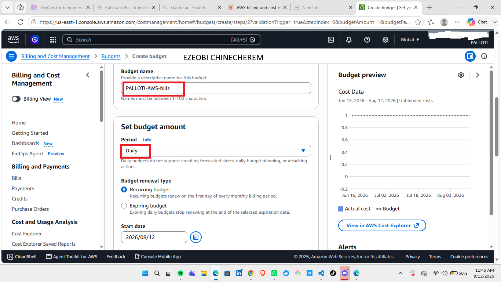

# Assignment 1 — Creating an AWS Free Tier Account & Setting Up Budget Management and Alerts

Part of the DevOps Micro Internship (DMI) Cohort 3 with Agentic AI

---

## Purpose

In this assignment, you will create your own AWS Free Tier account and configure budget management with cost alerts. This is an important first step: it lets you follow along with the rest of the course, and the alerts help ensure you do not exceed your budget.

---

# Task 1 — Sign Up for AWS and Access the Console

## Goal

Create your AWS Free Tier account, select the Basic Support Plan (Free), and log in to the AWS Management Console.

> No screenshot required for this task. Completion is verified through Task 2.

---

# Task 2 — Create a Monthly Cost Budget with Alerts

## Goal

In the Billing Dashboard, create a monthly Cost Budget with a name, amount, and start month, then configure alert thresholds (e.g. 50%, 80%, 100%) and a notification email address.

### Evidence

#### Screenshot 1 — AWS Budget setup page showing the budget name, budget amount, and alert thresholds

---

### Notes

Answer the following in your own words:

**1. Why is it important to set up budget alerts when using an AWS account?**

Setting up budget alerts in AWS is an essential best practice for managing cloud infrastructure. Because AWS operates on an elastic, pay-as-you-go model, costs scale infinitely with usage unless explicit boundaries are established.

 1. Eliminating "Bill Shock" and Unplanned Costs

In cloud environments, leaving test instances running, failing to detach unassociated Elastic IPs or EBS volumes, or making configuration errors can quickly run up large bills. Budget alerts notify you as soon as spending crosses defined thresholds (e.g., 50%, 80%, or 100% of your allocated budget), letting you take action before receiving an unexpected bill at the end of the month.

 2. Early Detection of Security Breaches and Runaway Code

Unusual spikes in AWS charges are often the first indicator of a problem:

* **Compromised Credentials:** If an API key or IAM credential leaks, malicious actors may spawn high-end GPU instances for cryptocurrency mining or distributed attacks.
* **Infinite Loops & Misconfigurations:** A serverless function (AWS Lambda) caught in an infinite loop or an overly aggressive Auto Scaling policy can trigger thousands of dollars in usage in hours.

Budget alerts act as an early warning system for these operational and security anomalies.

 3. Proactive Forecasting vs. Reactive Cleanup

AWS Budgets allows alerts based on both **actual spend** and **forecasted spend**. Forecasted alerts analyze your current spending trajectory and notify you early in the billing cycle if AWS predicts you will exceed your budget by the end of the month. This shifts management from reactive cleanup to proactive control.

 4. Granular Accountability Across Teams and Services

AWS Budgets can be customized by service, tag, linked account, or project. You can set separate alerts for:

* **Development vs. Production:** Ensuring dev environments stay cheap without impacting prod.
* **Specific Services:** Monitoring heavy data transfer, S3 storage growth, or EC2 compute charges individually.
* **Team Allocation:** Tracking expenditures across specific engineering units or client projects.

 5. Enforcing Automated Financial Guardrails

Beyond basic email or SNS/Slack notifications, AWS Budget Alerts can trigger **AWS Budget Actions**. These automated responses can enforce immediate guardrails when thresholds are breached, such as:

* Applying a restrictive IAM policy to block new resource provisioning.
* Triggering an AWS Lambda function to stop non-critical EC2 instances.
* Applying Service Control Policies (SCPs) at the AWS Organization level.

---

# Submission Instructions

- Add the required screenshot in your submission
- Do not expose sensitive billing, card, identity, or account information

---

# Completion Checklist

- [ ] AWS Free Tier account created and Basic Support Plan (Free) selected
- [ ] Logged in to the AWS Management Console
- [ ] Monthly Cost Budget created with name, amount, and start month
- [ ] Budget alert thresholds and notification email configured
- [ ] Screenshot captured showing budget name, amount, and thresholds (Screenshot 1)
- [ ] Notes question answered
- [ ] No sensitive billing or account information exposed

---

## 📌 About DMI & CloudAdvisory

DevOps Micro Internship (DMI) is a project-based DevOps program run by Pravin Mishra (The CloudAdvisory) focused on real-world execution, systems thinking, and career readiness.

It helps learners build strong DevOps foundations with hands-on experience.

---

## 📌 Resources

- 🌐 DMI Official Website: https://dmi.pravinmishra.com?utm_source=github&utm_medium=readme  
- 🎓 University: https://university.pravinmishra.com?utm_source=github&utm_medium=readme  
- 💬 Discord Community: https://discord.pravinmishra.com?utm_source=github&utm_medium=readme  
- 📝 Blog: https://dmi.pravinmishra.com/blog?utm_source=github&utm_medium=readme  
- ▶️ YouTube Playlist: https://www.youtube.com/playlist?list=PLFeSNDtI4Cho  
- 🔗 Pravin Mishra (LinkedIn): https://www.linkedin.com/in/pravin-mishra-aws-trainer/  
- 🏢 CloudAdvisory (LinkedIn): https://www.linkedin.com/company/thecloudadvisory/

---

*This submission is part of DevOps Micro Internship (DMI) Cohort 3 — Agentic AI Track.*
