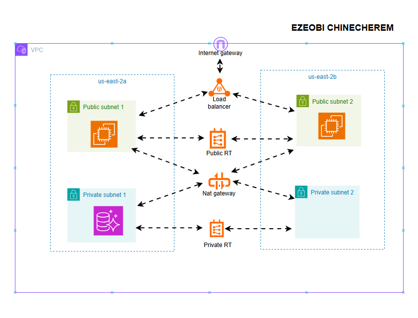
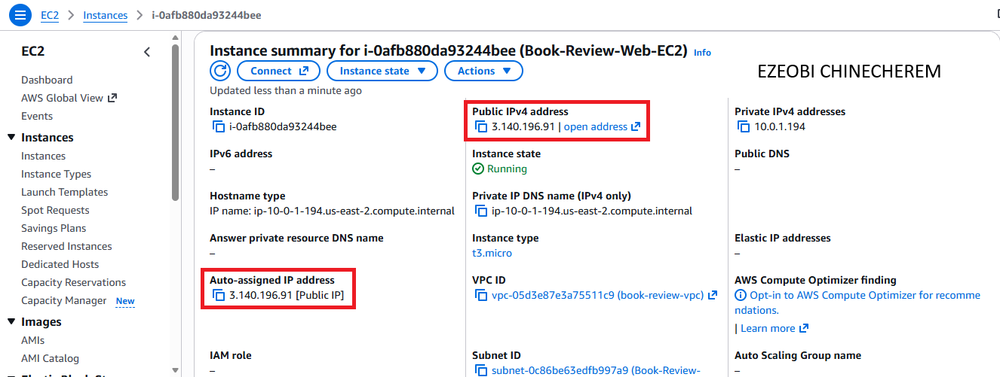
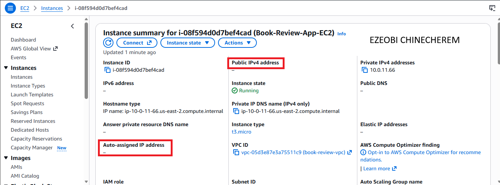
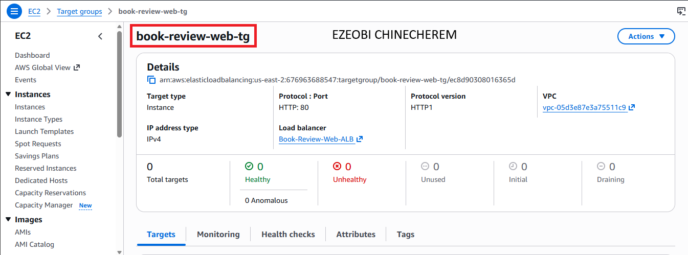
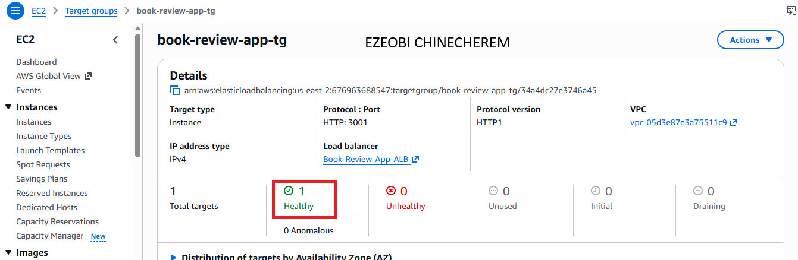
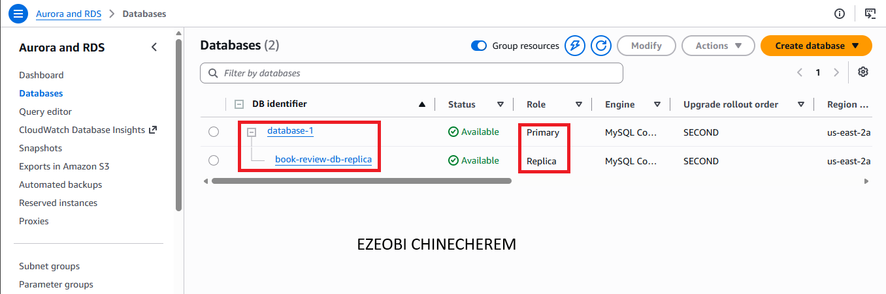
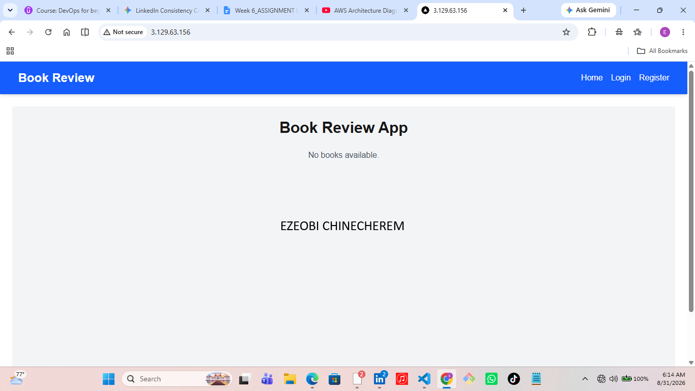
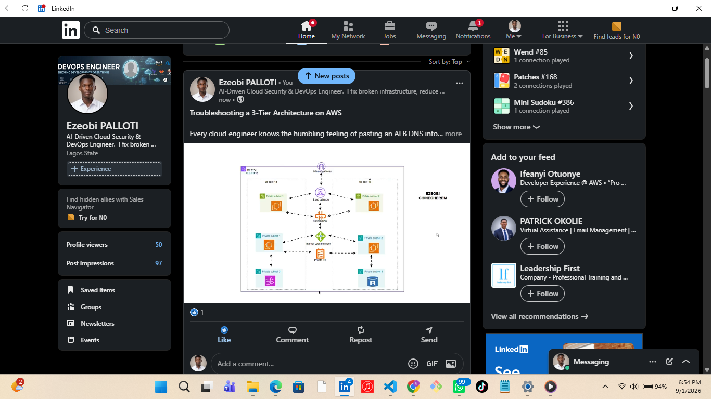

# Assignment 6 — Capstone: Deploy Book Review App (Three-Tier Architecture) on AWS

Part of the DevOps Micro Internship (DMI) Cohort 3 with Agentic AI

---

## Purpose

This is the most important assignment of the course. You will deploy the Book Review App in a fully production-style three-tier architecture on AWS: a Next.js Web Tier behind Nginx and a public ALB, a private Node.js/Express App Tier behind an internal ALB, and a private Multi-AZ MySQL RDS database with a read replica. You are expected to design, deploy, isolate, debug, and document the result independently.

---

# Task 1 — Architecture Diagram

## Goal

Create an architecture diagram showing the custom VPC (10.0.0.0/16), the six subnets across two Availability Zones (two public Web Tier, two private App Tier, two private Database Tier), the public ALB, Web Tier EC2/Nginx, internal ALB, private App Tier EC2, private Multi-AZ RDS with its read replica, and the permitted traffic flow.

### Evidence

#### Diagram image or link

---

# Task 2 — AWS Region & Services Used

## Goal

Record the AWS Region used and list every AWS service used across networking, compute, load balancing, security, and the database.

### Notes

**Region:**

Ohio Us-east-2

---

**Services used:**

VPC
Subnets
Internet gateway
Nat gateway
Load balancer
Ec2
Autoscaling group
Route table
Target group
Subnet group
Mysql database
DB subnet group

---

# Task 3 — Public Entry Point

## Goal

Confirm the Book Review App loads through the public ALB DNS name.

### Evidence

#### Public ALB DNS

Paste your public ALB DNS name here:

internal-Book-Review-App-ALB-1175332058.us-east-2.elb.amazonaws.com

---

# Task 4 — Evidence Screenshots

## Goal

Capture visual proof of every tier and load balancer.

### Evidence

#### Screenshot 1 — Web Tier EC2 instance in a public subnet

---

#### Screenshot 2 — App Tier EC2 instance in a private subnet

---

#### Screenshot 3 — Public Application Load Balancer configuration or healthy targets

---

#### Screenshot 4 — Internal Application Load Balancer configuration or healthy targets

---

#### Screenshot 5 — Amazon RDS for MySQL showing Multi-AZ and the read replica

---

#### Screenshot 6 — Book Review App UI working through the public ALB

---

# Task 5 — Summary

## Goal

Summarize what worked in the final deployment, the issues encountered and how each was fixed, and the tools or sources used to research and debug.

### Notes

**What worked:**

Setted up all necessary AWS resources 
SSHd into my frontend, through frontend sshd into backend server, configured my database
Cloned my application
Built my backend app
Kept the backend app running actively in the background
Moved to the frontend 
Built the frontend application
Installed and configured my nginx as a reverse proxy
Ran the frontend 
My ALB DNS endpoint url pasted on my browser

---

**Issues encountered and fixes:**
ALB DNS into the browser, hitting enter, and then Error 502: Bad Gateway.

Nginx mis-configuration

---

**Tools/sources used:**
Check the logs: I checked the latest Nginx error logs using sudo tail -n 10 /var/log/nginx/error.log and saw that Nginx was still struggling to connect upstream.

Audit the configurations: A quick grep search (sudo grep -rn "3001" /etc/nginx/) revealed the culprit. An old book-review configuration file was taking precedence over the default block, creating port conflicts.

Refine and test: I updated the Nginx configuration to correctly route traffic to my app on port 3000, while routing /api/ traffic to the backend ALB DNS endpoint.

Verify: After running sudo nginx -t to check syntax and sudo systemctl reload nginx, the book review app finally loaded smoothly in the browser.

---

# LinkedIn Post (Required)

## Goal

Publish a LinkedIn post sharing the capstone deployment, including the public ALB DNS (or a redacted screenshot), three to five lines on what you built and why it is production-style, and one proof screenshot.

## Evidence

#### LinkedIn Post URL

https://lnkd.in/p/eNsd3Ftv

---

#### Screenshot — Published LinkedIn post

---

# Submission Instructions

- Add all required screenshots and links in your submission
- Do not expose passwords, RDS credentials, connection strings, private keys, or account IDs

---

# Completion Checklist

- [ ] Task 1: Architecture diagram completed
- [ ] Task 2: AWS Region and services documented
- [ ] Task 3: Public ALB DNS confirmed working
- [ ] Task 4: All six evidence screenshots captured (Web Tier, App Tier, both ALBs, RDS + replica, app UI)
- [ ] Task 5: Deployment summary completed (what worked, issues/fixes, tools/sources)
- [ ] LinkedIn post published and URL submitted
- [ ] App Tier and Database Tier confirmed not publicly accessible
- [ ] No sensitive data exposed

---

## 📌 About DMI & CloudAdvisory

DevOps Micro Internship (DMI) is a project-based DevOps program run by Pravin Mishra (The CloudAdvisory) focused on real-world execution, systems thinking, and career readiness.

It helps learners build strong DevOps foundations with hands-on experience.

---

## 📌 Resources

- 🌐 DMI Official Website: https://dmi.pravinmishra.com?utm_source=github&utm_medium=readme  
- 🎓 University: https://university.pravinmishra.com?utm_source=github&utm_medium=readme  
- 💬 Discord Community: https://discord.pravinmishra.com?utm_source=github&utm_medium=readme  
- 📝 Blog: https://dmi.pravinmishra.com/blog?utm_source=github&utm_medium=readme  
- ▶️ YouTube Playlist: https://www.youtube.com/playlist?list=PLFeSNDtI4Cho  
- 🔗 Pravin Mishra (LinkedIn): https://www.linkedin.com/in/pravin-mishra-aws-trainer/  
- 🏢 CloudAdvisory (LinkedIn): https://www.linkedin.com/company/thecloudadvisory/

---

*This submission is part of DevOps Micro Internship (DMI) Cohort 3 — Agentic AI Track.*
