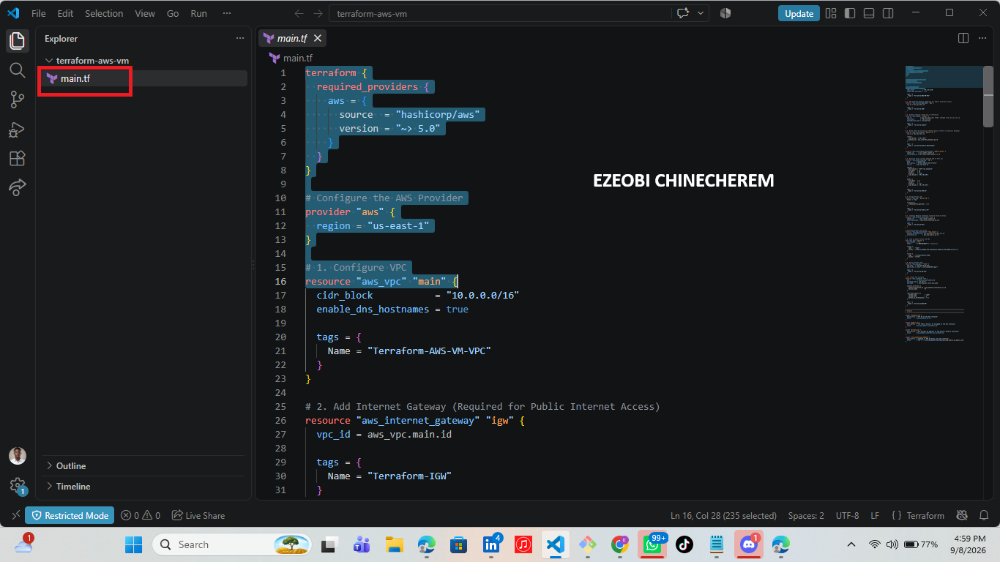
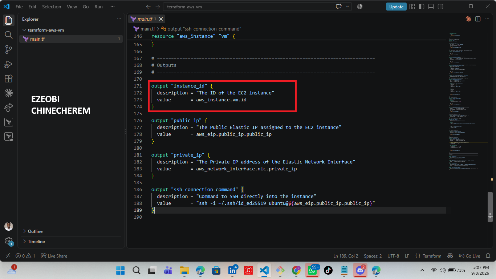
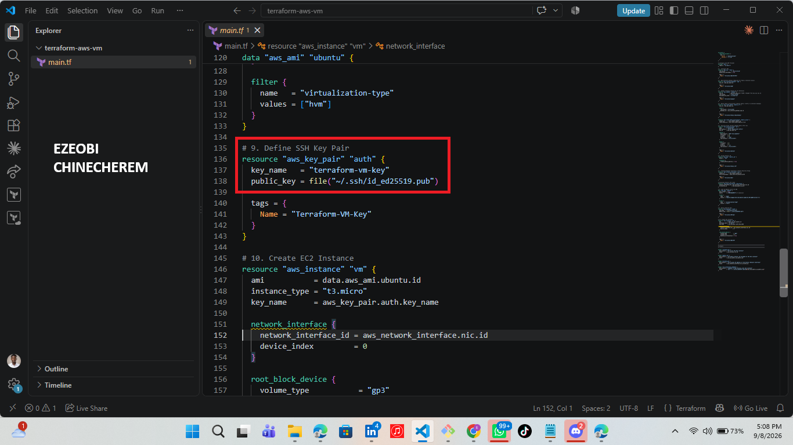
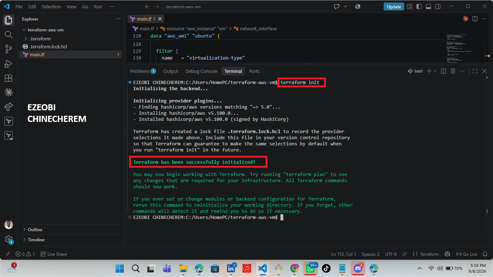
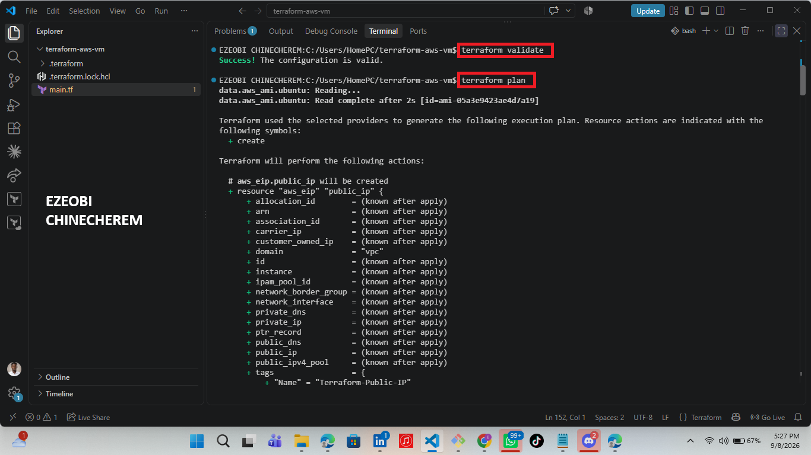
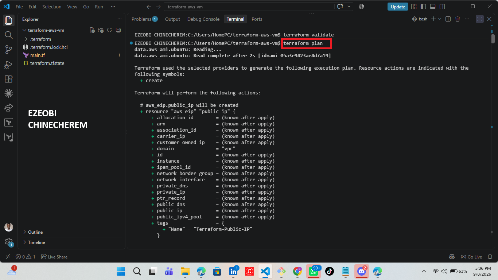
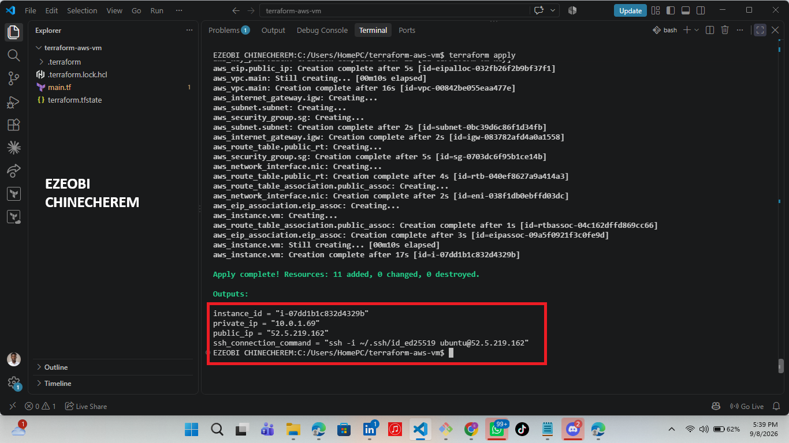
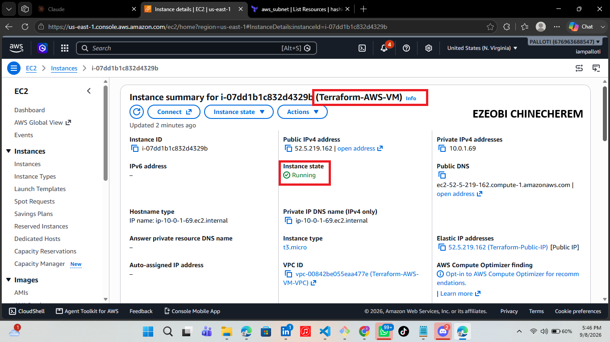
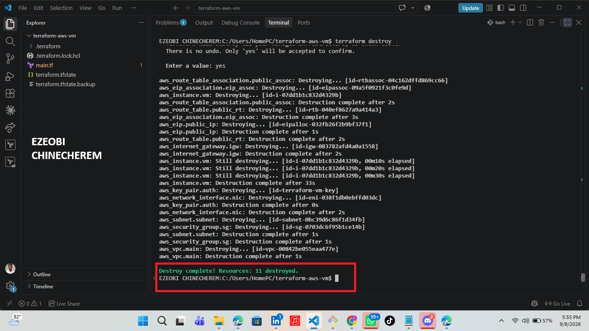

# Assignment 1 — Create an Azure Virtual Machine using Terraform

Part of the DevOps Micro Internship (DMI) with Agentic AI

---

## Purpose

In this assignment, you will use Terraform to provision a complete Azure Virtual Machine environment: a resource group, virtual network, subnet, public IP, network interface, and an Ubuntu 18.04 Linux VM. You will initialize, plan, and apply the configuration, verify the running VM via Azure CLI, and destroy the resources after testing.

---

# Task 0 — Set Up and Verify the Terraform and Azure CLI Environment

## Goal

Create a `terraform-azure-vm` project and define the resource group, virtual network, subnet, public IP, network interface, and Ubuntu 18.04 VM (with username/password authentication and a public IP output) in `main.tf`.

### Evidence

#### Screenshot 1 — VS Code showing `main.tf` and the required Azure resources

---

#### Screenshot 2 — `main.tf` showing the public IP output and VM authentication configuration, with the password hidden or redacted

---

# Task 2 — Initialize Terraform

## Goal

Initialize the Terraform working directory and download the required provider components.

### Evidence

#### Screenshot 6 — Terminal showing the successful `terraform init` output

---

# Task 3 — Plan and Apply the Configuration

## Goal

Review the Terraform execution plan and provision the Azure resources.

### Evidence

#### Screenshot 7 — Terraform plan summary showing the proposed resources

---

#### Screenshot 8 — Terraform apply output showing successful completion

---

#### Screenshot 9 — Terraform output showing the public IP address of the VM

---

# Task 4 — Verify the Deployment

## Goal

Confirm through Azure CLI that the virtual machine was created successfully and is currently running.

### Evidence

#### Screenshot 10 — Azure CLI output showing the deployed VM name and `VM running` status

---

# Task 5 — Destroy the Resources

## Goal

Remove all Azure resources created by Terraform after completing the deployment and verification.

### Evidence

#### Screenshot 11 — Terminal showing successful `terraform destroy` completion

---

### Notes

Write a short paragraph explaining what you learned or any issues you encountered.

Navigating through terraform registry documentation 
Aligning my necessary resources 
And my ssh-keygen input i.e getting my ssh key , for easy authentication into my AWS console
---

# Submission Instructions

- Complete all tasks in sequence and include all required screenshots specified in Tasks 0–5.
- Do not expose passwords, keys, account IDs, or other sensitive information in screenshots.

---

# Completion Checklist

- Installed Terraform and verified it using `terraform version`
- Installed Azure CLI and verified it using `az version`
- Signed in to Azure using `az login`
- Confirmed the correct Azure subscription
- Installed and enabled the HashiCorp Terraform extension in VS Code
- Created the `terraform-azure-vm` project directory and `main.tf`
- Added the Terraform and AzureRM provider configuration
- Defined the resource group, virtual network, subnet, public IP, and network interface
- Defined the Linux virtual machine with username and password-based authentication
- Added the Terraform output for the VM public IP address
- Completed `terraform init` successfully
- Reviewed the Terraform execution plan using `terraform plan`
- Completed `terraform apply` successfully
- Captured and recorded the VM public IP using `terraform output`
- Verified that the VM is running using Azure CLI
- Completed `terraform destroy` successfully
- Captured all required screenshots
- Checked that no passwords, keys, account IDs, or other sensitive information are visible in the screenshots

---

## 📌 About DMI & CloudAdvisory

DevOps Micro Internship (DMI) is a project-based DevOps program run by Pravin Mishra (The CloudAdvisory) focused on real-world execution, systems thinking, and career readiness.

It helps learners build strong DevOps foundations with hands-on experience.

---

## 📌 Resources

- 🌐 DMI Official Website: https://dmi.pravinmishra.com?utm_source=github&utm_medium=readme
- 🎓 University: https://university.pravinmishra.com?utm_source=github&utm_medium=readme
- 💬 Discord Community: https://discord.pravinmishra.com?utm_source=github&utm_medium=readme
- 📝 Blog: https://dmi.pravinmishra.com/blog?utm_source=github&utm_medium=readme
- ▶️ YouTube Playlist: https://www.youtube.com/playlist?list=PLFeSNDtI4Cho
- 🔗 Pravin Mishra (LinkedIn): https://www.linkedin.com/in/pravin-mishra-aws-trainer/
- 🏢 CloudAdvisory (LinkedIn): https://www.linkedin.com/company/thecloudadvisory/

---

*This submission is part of DevOps Micro Internship (DMI) — Agentic AI Track.*