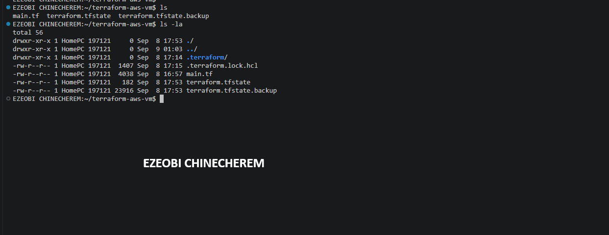
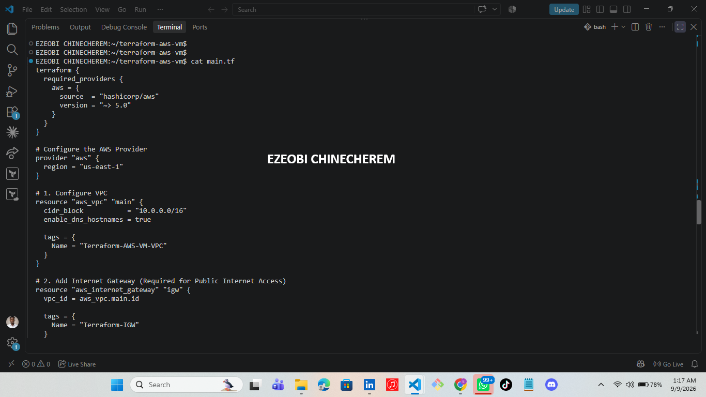
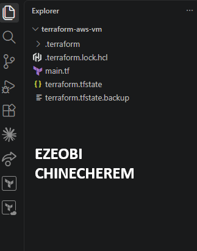
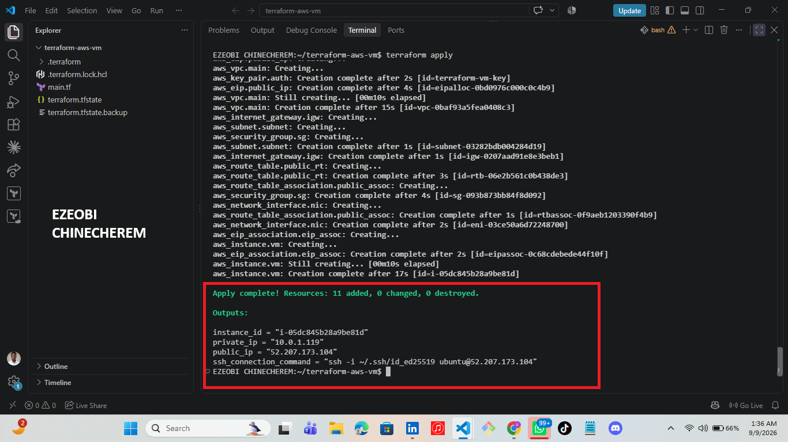
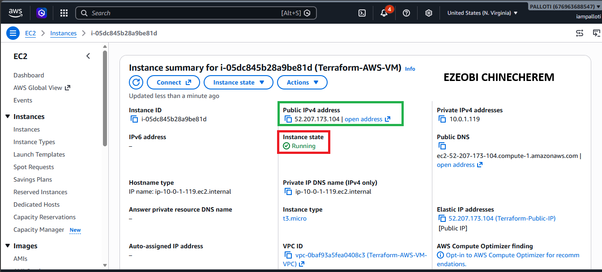
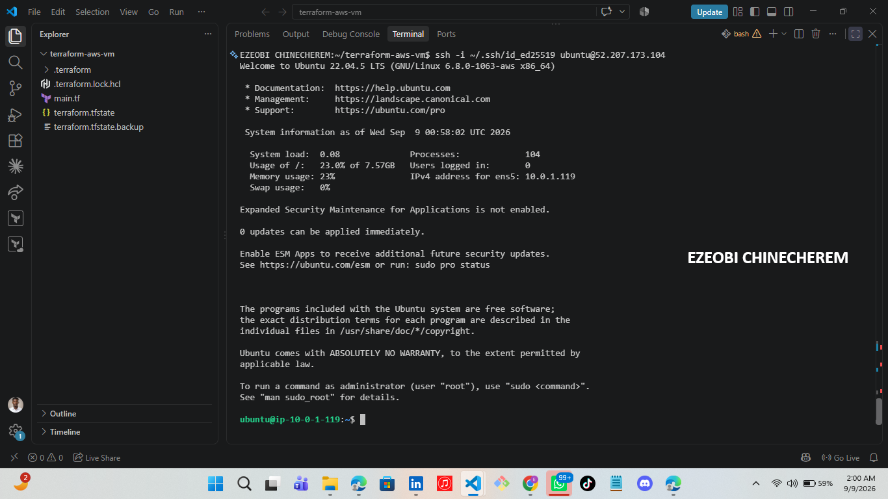
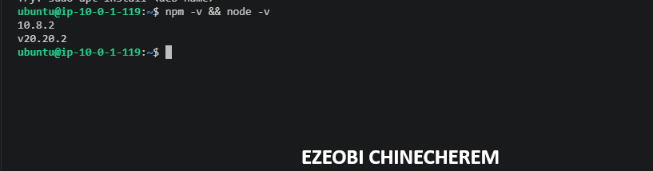
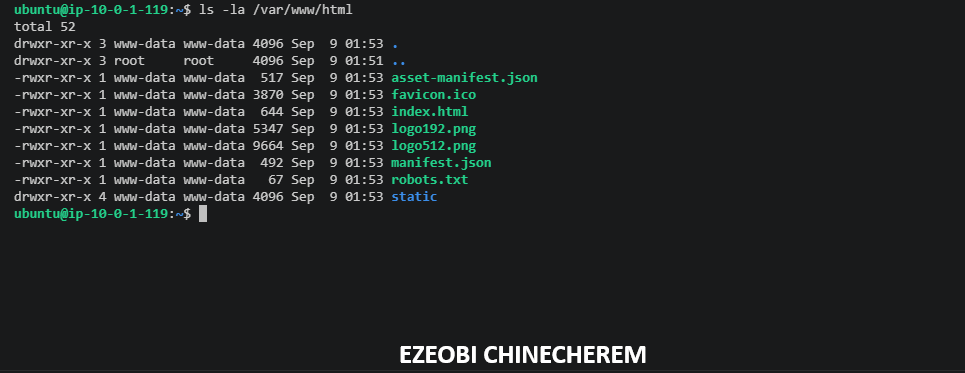
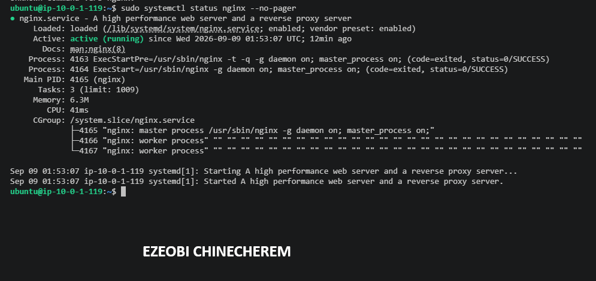
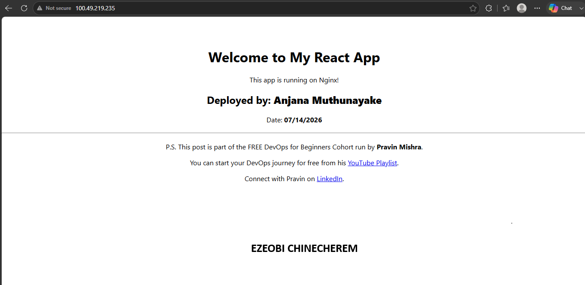

# Assignment 3 — Deploy a React Application on Azure Virtual Machine Using Terraform

Part of the DevOps Micro Internship (DMI) Cohort 3 with Agentic AI

---

## Purpose

In this assignment, you will use Terraform to provision an Azure resource group, network, and Ubuntu 20.04 VM, then deploy the `my-react-app` React application onto the VM over SSH and serve it through Nginx.

---

# Task 1 — Create a New Terraform Project

## Goal

Create a `terraform-react-azure` project directory for the Azure Terraform configuration.

### Evidence

#### Screenshot 1 — File Explorer, VS Code, or terminal showing the `terraform-react-azure` project directory

---

# Task 2 — Write main.tf to Provision the Azure Infrastructure

## Goal

Define the resource group, virtual network/subnet, Network Security Group (SSH 22, HTTP 80), public IP, network interface, and Ubuntu 20.04 Standard B1s VM in `main.tf`.

### Evidence

#### Screenshot 2 — VS Code showing `main.tf` with the required Azure resources, with any password or sensitive values hidden

---

# Task 3 — Initialize Terraform

## Goal

Run `terraform init` and confirm the working directory initializes successfully.

### Evidence

#### Screenshot 3 — Terminal showing successful `terraform init` output

---

# Task 4 — Plan and Apply the Configuration

## Goal

Review `terraform plan`, run `terraform apply`, and record the VM's public IP.

### Evidence

#### Screenshot 4 — Terraform apply output showing successful completion

---

#### Screenshot 5 — Azure portal showing the Virtual Machine running and its public IP

---

# Task 5 — Connect to the Virtual Machine

## Goal

Establish an SSH session with the Ubuntu VM through its public IP.

### Evidence

#### Screenshot 6 — Terminal showing a successful SSH connection to the Azure VM

---

# Task 6 — Install Node.js, npm, and Git

## Goal

Update Ubuntu and install Node.js, npm, and Git.

### Evidence

#### Screenshot 7 — Terminal showing successful installation and the `node -v` and `npm -v` output

---

# Task 7 — Clone, Build, and Serve the React App with Nginx

## Goal

Follow the `my-react-app` repository README to clone, install, and build the app, then serve the production build through Nginx.

### Evidence

#### Screenshot 8 — Terminal showing the successful React build

---

#### Screenshot 9 — Terminal showing that Nginx is active and running

---

# Task 8 — Test the Deployment

## Goal

Confirm the React application loads through the VM's public IP and navigation works.

### Evidence

#### Screenshot 10 — Browser showing the React application with the Azure VM public IP visible in the address bar

---

### Notes

Write a short summary of what you built and any issues you encountered and how you resolved them.

Deployment Overview: Automated AWS Single-Tier Web App Deployment with Terraform

Architecture & Execution Summary

Infrastructure as Code (IaC): Provisioned a complete AWS cloud architecture using Terraform, including a VPC, public subnet, Internet Gateway, route table associations, and an Elastic IP (EIP).

Security & Ingress Configuration: Configured AWS Security Groups to allow inbound SSH (Port 22) for remote management and HTTP (Port 80 / 3000) for public web traffic.

Compute & Provisioning: Deployed an Ubuntu 22.04 LTS EC2 instance running Nginx, auto-configured at boot via custom user_data shell scripts.

Verification & Validation: SSHed into the instance to verify Node.js and npm runtime environments, inspected cloud-init execution logs, and validated live web accessibility via the Elastic Public IP.

Key Achievements

Automated Provisioning: Reduced manual configuration overhead by fully declarative Terraform state management and shell scripting (user_data_base64).

Dynamic Lifecycle Management: Utilized user_data_replace_on_change to enforce deterministic instance recreations upon configuration updates.

Network Integrity: Resolved AWS security dependency constraints (DependencyViolation) and SSH host fingerprint conflicts to ensure zero-downtime infrastructure updates.
---

# Submission Instructions

- Add all required screenshots in your submission
- Include the Azure VM public IP
- Do not expose Azure credentials, passwords, or private keys

---

# Completion Checklist

- [ ] Task 1: `terraform-react-azure` project created (Screenshot 1)
- [ ] Task 2: `main.tf` defines all required Azure resources (Screenshot 2)
- [ ] Task 3: `terraform init` completed successfully (Screenshot 3)
- [ ] Task 4: Plan applied and VM running with public IP (Screenshots 4–5)
- [ ] Task 5: SSH connection verified (Screenshot 6)
- [ ] Task 6: Node.js, npm, and Git installed (Screenshot 7)
- [ ] Task 7: React app built and served through Nginx (Screenshots 8–9)
- [ ] Task 8: App verified through the VM public IP (Screenshot 10)
- [ ] Summary paragraph written (Notes)
- [ ] No sensitive information exposed

---

## 📌 About DMI & CloudAdvisory

DevOps Micro Internship (DMI) is a project-based DevOps program run by Pravin Mishra (The CloudAdvisory) focused on real-world execution, systems thinking, and career readiness.

It helps learners build strong DevOps foundations with hands-on experience.

---

## 📌 Resources

- 🌐 DMI Official Website: https://dmi.pravinmishra.com?utm_source=github&utm_medium=readme  
- 🎓 University: https://university.pravinmishra.com?utm_source=github&utm_medium=readme  
- 💬 Discord Community: https://discord.pravinmishra.com?utm_source=github&utm_medium=readme  
- 📝 Blog: https://dmi.pravinmishra.com/blog?utm_source=github&utm_medium=readme  
- ▶️ YouTube Playlist: https://www.youtube.com/playlist?list=PLFeSNDtI4Cho  
- 🔗 Pravin Mishra (LinkedIn): https://www.linkedin.com/in/pravin-mishra-aws-trainer/  
- 🏢 CloudAdvisory (LinkedIn): https://www.linkedin.com/company/thecloudadvisory/

---

*This submission is part of DevOps Micro Internship (DMI) Cohort 3 — Agentic AI Track.*
