# Assignment 4 — Deploy EpicBook Web App on AWS Using Terraform Modules and Amazon RDS for MySQL

Part of the DevOps Micro Internship (DMI) with Agentic AI

---

## Purpose

In this assignment, you will use Terraform to provision AWS network infrastructure (VPC, public/private subnets, Security Groups), launch an Ubuntu 22.04 EC2 instance, and provision a private Amazon RDS for MySQL instance. You will then deploy EpicBook, connect it to MySQL, and validate the complete user flow.

---

# Task 1 — Create Network Infrastructure with Terraform

## Goal

Define a VPC (10.0.0.0/16) with a public subnet (10.0.1.0/24) and private subnet (10.0.2.0/24), an Internet Gateway with public routing, an EC2 Security Group (SSH 22, HTTP 80), and an RDS Security Group (MySQL 3306 only from the EC2 Security Group).

### Evidence

#### Screenshot 1 — Terraform configuration showing the VPC and both subnet CIDR ranges

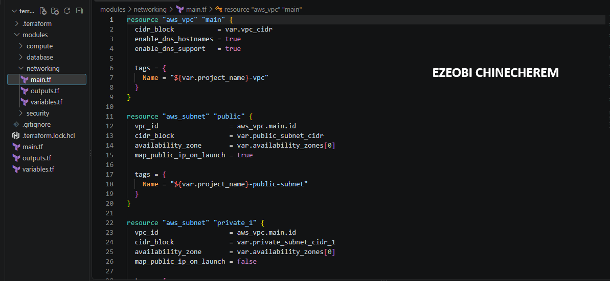

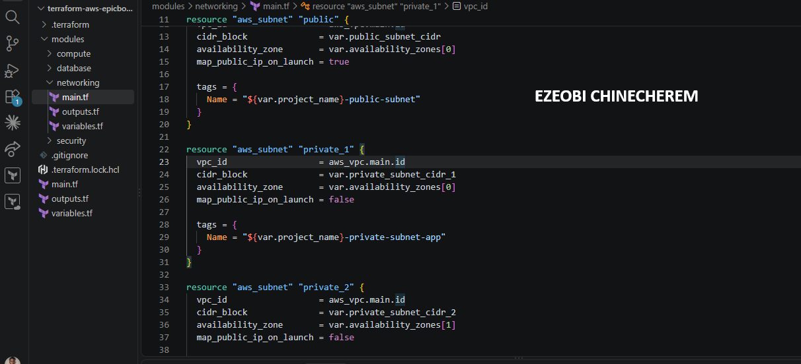

---

#### Screenshot 2 — Terraform configuration showing the Internet Gateway, public route table, and both Security Groups

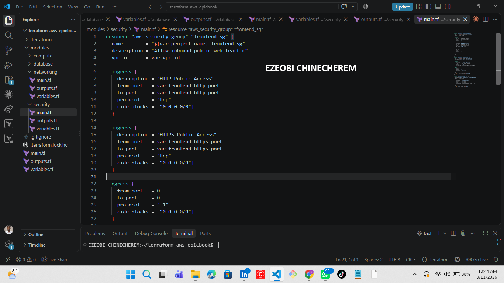

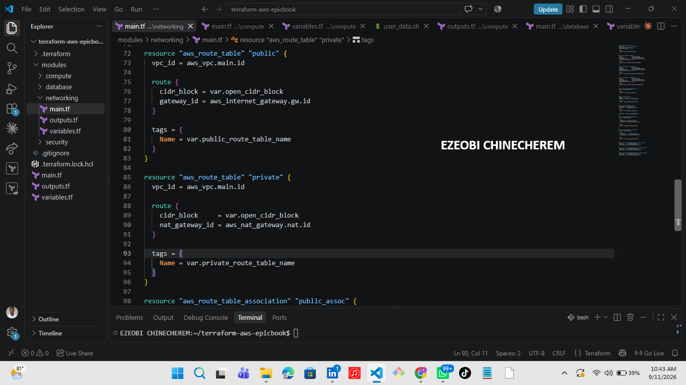

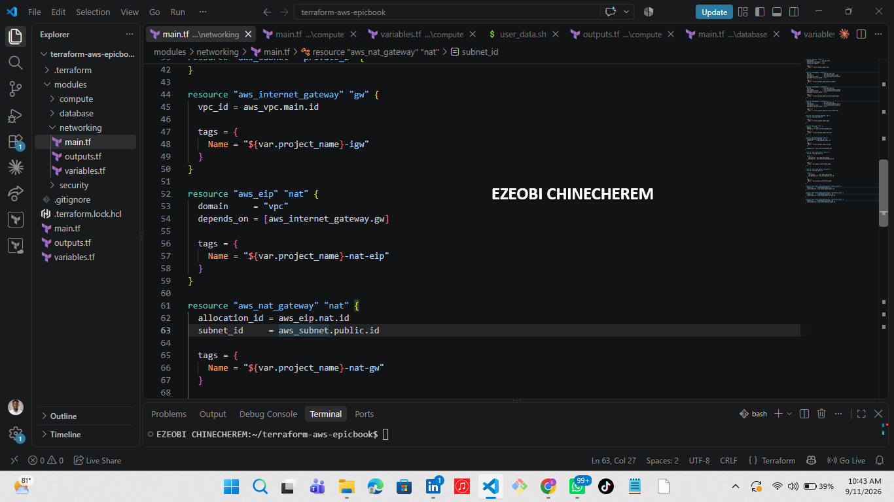

---

# Task 2 — Provision EC2 Virtual Machine (Ubuntu 22.04)

## Goal

Use Terraform to launch a t2.micro Ubuntu 22.04 EC2 instance in the public subnet with a public IP, then install Node.js, npm, Git, Nginx, and MySQL client.

### Evidence

#### Screenshot 3 — Terraform apply output showing successful EC2 provisioning

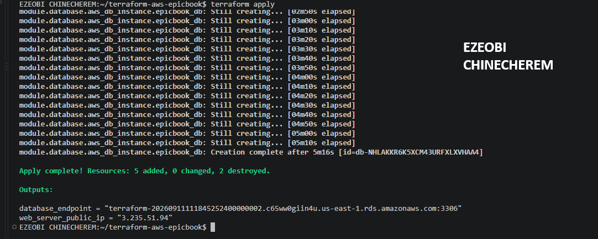

---

#### Screenshot 4 — EC2 instance running in the AWS Console with the public IP and subnet visible

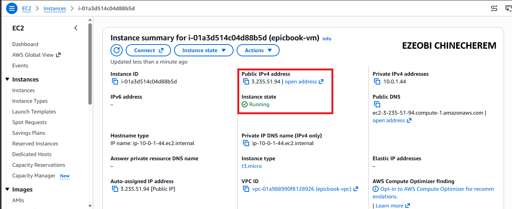

---

#### Screenshot 5 — Terminal showing successful SSH access and installed software

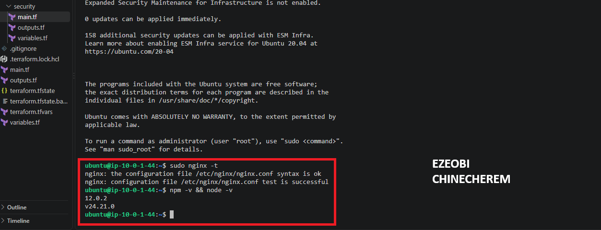

---

# Task 3 — Deploy the EpicBook Application

## Goal

Deploy the EpicBook frontend and backend on the EC2 instance and configure Nginx to serve it, following the Installation, Configuration & Troubleshooting Guide.

### Evidence

#### Screenshot 6 — Terminal showing the EpicBook application files and dependency installation

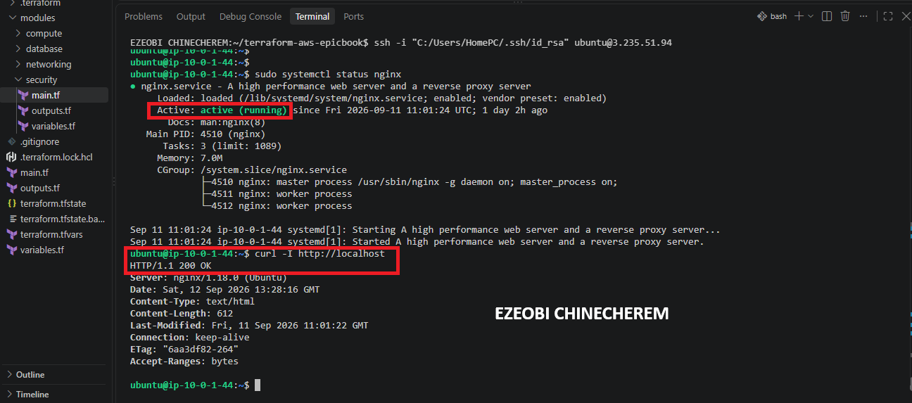

---

#### Screenshot 7 — Terminal showing the application and Nginx services running

---

# Task 4 — Set Up Amazon RDS for MySQL with Terraform

## Goal

Provision a private Amazon RDS MySQL instance (db.t3.micro, Publicly accessible: false) restricted to the EC2 Security Group, then initialize the database using the provided SQL dump and connect the EpicBook backend to it.

### Evidence

#### Screenshot 8 — Terraform apply output showing successful RDS provisioning

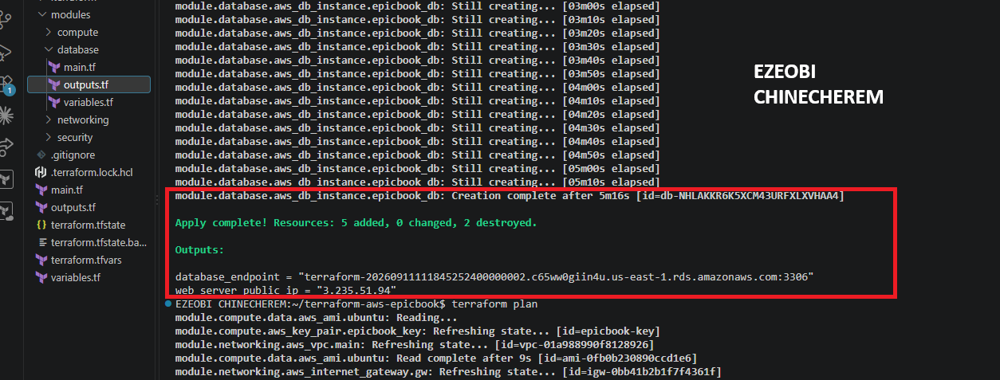

---

#### Screenshot 9 — RDS instance in the AWS Console showing the private network configuration and Publicly accessible: No

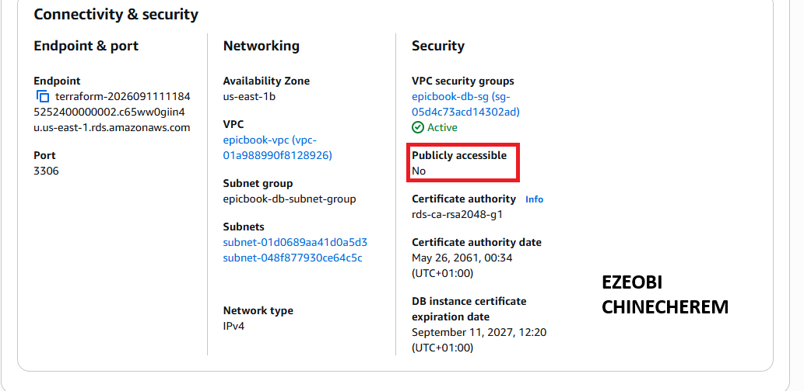

---

#### Screenshot 10 — Terminal showing successful database initialization or table verification from EC2

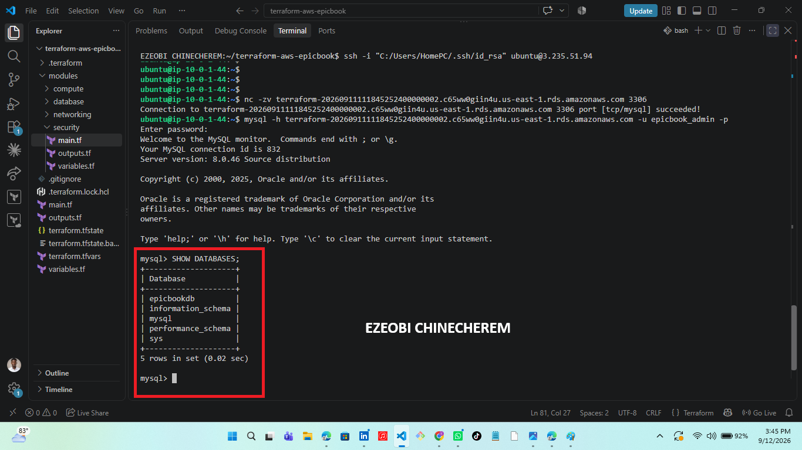

---

# Task 5 — Test End-to-End Functionality

## Goal

Confirm EpicBook is accessible through the EC2 public IP and that navigation, cart, order summary, and checkout all work against the MySQL backend.

### Evidence

#### Screenshot 11 — Browser showing the EpicBook application through the EC2 public IP

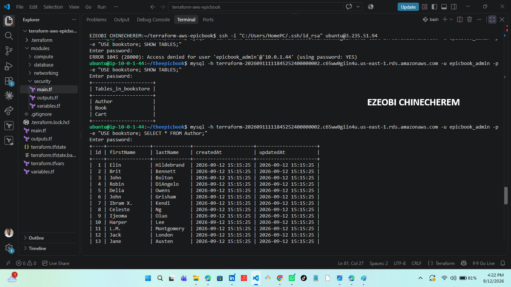

---

#### Screenshot 12 — Browser showing a working product, cart, order summary, or checkout flow

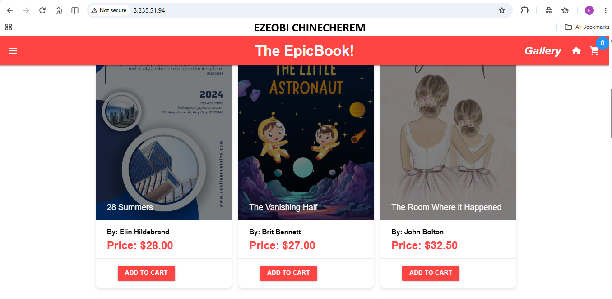

---

### Notes

Write a short note describing any issue you faced, how you fixed it, and what you learned.

The security module
Misconfigured the security group 
Didn't allow the frontend security group in the database security
Misconfigured port
My application wasn't live on the browser
---

# Task 10 — Test End-to-End Functionality

## Goal

Verify that EpicBook, EC2, Nginx, and Amazon RDS work together successfully.

## EC2 Public IP URL

**EC2 Public IP URL:** Add the working EpicBook EC2 public IP URL here

## Evidence

#### LinkedIn Post URL

Paste your LinkedIn post URL here:

https://lnkd.in/p/ej6HARJ9

---

#### Screenshot 13 — Published LinkedIn post showing the text and at least one image or proof

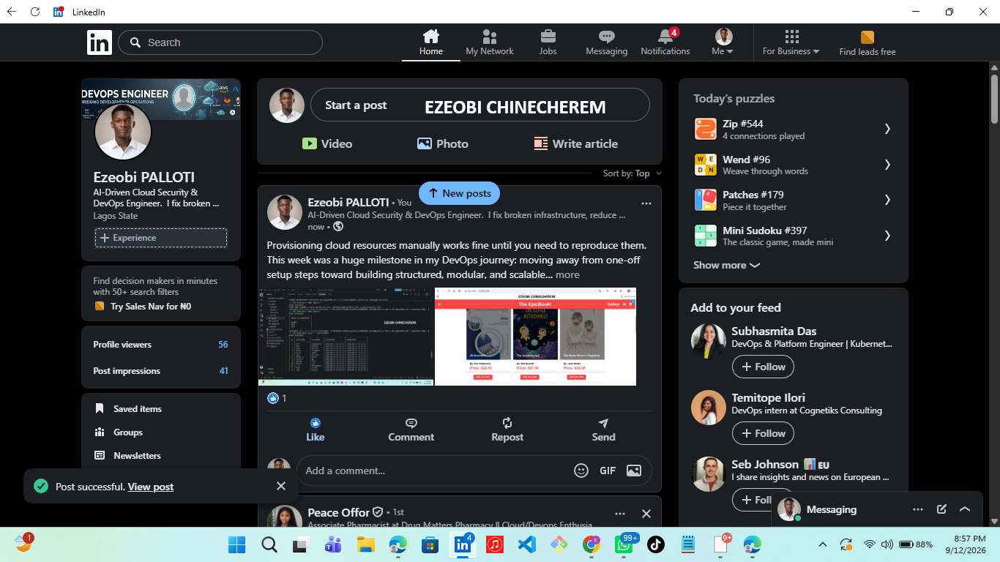

---

# Submission Instructions

- Complete Tasks 0–12 in sequence.
- Include all Screenshots 1–35 exactly as specified.
- Ensure that your full name is visible in the required screenshots.
- Include the working EpicBook EC2 public IP URL.
- Include the published LinkedIn post URL.
- Include proof of frontend, backend, and database integration.
- Ensure that the required Terraform root files, module files, and `user_data.sh` are included in the GitHub submission.
- Do not upload Terraform state files, `.pem` files, or a `terraform.tfvars` file containing passwords or other sensitive values.
- Do not expose AWS credentials, account IDs, private SSH keys, RDS passwords, access tokens, Terraform sensitive values, or other confidential information.
- Review all screenshots and files carefully before submitting through GitHub.

---

# Completion Checklist

- [ ] Installed and verified Terraform
- [ ] Installed and verified AWS CLI
- [ ] Configured AWS CLI
- [ ] Confirmed the AWS Region
- [ ] Installed the HashiCorp Terraform extension
- [ ] Created the modular Terraform project
- [ ] Created the root `main.tf`, `variables.tf`, and `outputs.tf`
- [ ] Created the Network module
- [ ] Created the EC2 module
- [ ] Created the RDS module
- [ ] Created the EC2 `user_data.sh`
- [ ] Created VPC `10.0.0.0/16`
- [ ] Created public subnet `10.0.1.0/24`
- [ ] Created private DB subnet A `10.0.2.0/24`
- [ ] Created private DB subnet B `10.0.3.0/24`
- [ ] Used different Availability Zones for the database subnets
- [ ] Created and attached the Internet Gateway
- [ ] Created the public route table
- [ ] Associated the public subnet with the public route table
- [ ] Created the EC2 Security Group
- [ ] Allowed HTTP port `80`
- [ ] Restricted SSH port `22`
- [ ] Created the RDS Security Group
- [ ] Allowed MySQL port `3306` from the EC2 Security Group only
- [ ] Exposed the required Network module outputs
- [ ] Defined the EC2 instance
- [ ] Connected `user_data.sh` using the EC2 `user_data` argument
- [ ] Configured EC2 with a public IP
- [ ] Installed the required software using user data
- [ ] Created the RDS DB subnet group
- [ ] Created Amazon RDS for MySQL
- [ ] Confirmed RDS is not publicly accessible
- [ ] Configured sensitive database variables
- [ ] Exposed the RDS endpoint
- [ ] Connected all modules through the root module
- [ ] Passed Network module outputs to EC2 and RDS
- [ ] Added root EC2 public IP and RDS endpoint outputs
- [ ] Completed `terraform init`
- [ ] Completed `terraform validate`
- [ ] Reviewed `terraform plan`
- [ ] Completed `terraform apply`
- [ ] Verified EC2 is running
- [ ] Verified RDS is available
- [ ] Verified user data installation
- [ ] Connected to EC2 using SSH
- [ ] Cloned EpicBook
- [ ] Created the `bookstore` database
- [ ] Imported the database schema
- [ ] Imported author seed data
- [ ] Imported book seed data
- [ ] Verified database records
- [ ] Installed EpicBook dependencies
- [ ] Configured EpicBook to use RDS
- [ ] Configured Nginx
- [ ] Started EpicBook
- [ ] Verified port `8080`
- [ ] Loaded EpicBook through the EC2 public IP
- [ ] Verified product viewing
- [ ] Verified Add to Cart
- [ ] Verified the checkout or order workflow
- [ ] Confirmed application actions in Amazon RDS
- [ ] Completed `terraform destroy`
- [ ] Published the required LinkedIn post
- [ ] Added the LinkedIn post URL
- [ ] Captured all 35 required screenshots
- [ ] Confirmed that my full name is visible in the required screenshots
- [ ] Checked that no sensitive information is exposed

---

## About DMI & CloudAdvisory

DevOps Micro Internship (DMI) is a project-based DevOps program run by Pravin Mishra (The CloudAdvisory), focused on real-world execution, systems thinking, and career readiness.

It helps learners build strong DevOps foundations through hands-on experience.

---

## Resources

- EpicBook Repository: [https://github.com/pravinmishraaws/theepicbook](https://github.com/pravinmishraaws/theepicbook)
- EpicBook Installation, Configuration & Troubleshooting Guide: [Installation & Configuration Guide](https://github.com/pravinmishraaws/theepicbook/blob/main/Installation%20%26%20Configuration%20Guide.md)
- DMI Official Website: [https://dmi.pravinmishra.com](https://dmi.pravinmishra.com)
- University: [https://university.pravinmishra.com](https://university.pravinmishra.com)
- Discord Community: [https://discord.pravinmishra.com](https://discord.pravinmishra.com)
- Blog: [https://dmi.pravinmishra.com/blog](https://dmi.pravinmishra.com/blog)
- YouTube Playlist: [https://www.youtube.com/playlist?list=PLFeSNDtI4Cho](https://www.youtube.com/playlist?list=PLFeSNDtI4Cho)
- Pravin Mishra on LinkedIn: [https://www.linkedin.com/in/pravin-mishra-aws-trainer/](https://www.linkedin.com/in/pravin-mishra-aws-trainer/)
- CloudAdvisory on LinkedIn: [https://www.linkedin.com/company/thecloudadvisory/](https://www.linkedin.com/company/thecloudadvisory/)

---

*This sgit statusubmission is part of DevOps Micro Internship (DMI) Cohort 3 — Agentic AI Track.*
