# Assignment 5 — Deploy Book Review App in Your Favorite Cloud (Agentic Terraform Project)

Part of the DevOps Micro Internship (DMI) Cohort 3 with Agentic AI

---

## Purpose

This is the most important assignment of the Terraform section. You will deploy the Book Review App in a production-style three-tier architecture using Terraform on your choice of AWS or Azure — six subnets across two Availability Zones, tier-specific security rules, public and internal load balancers, Next.js/Node.js on Ubuntu VMs, and a private managed MySQL database with a read replica. This assignment is agent-assisted: you may use Claude Code, ChatGPT, or another LLM tool to help design, generate, debug, and improve the infrastructure.

---

# Task 1 — VPC/VNet and Subnet Setup

## Goal

Create a custom VPC/VNet (10.0.0.0/16) with six subnets across two Availability Zones: two public Web Tier subnets, two private App Tier subnets, and two private Database Tier subnets, implemented with Terraform.

### Evidence

#### Screenshot 1 — VPC or VNet details showing 10.0.0.0/16

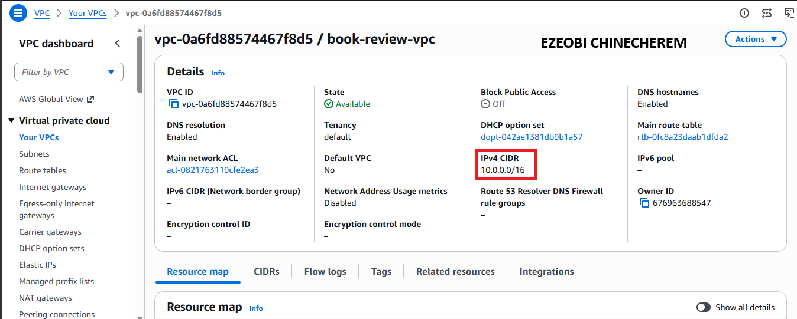

#### Screenshot 2 — Subnet list showing all six subnets, their tiers, CIDR ranges, and Availability Zones

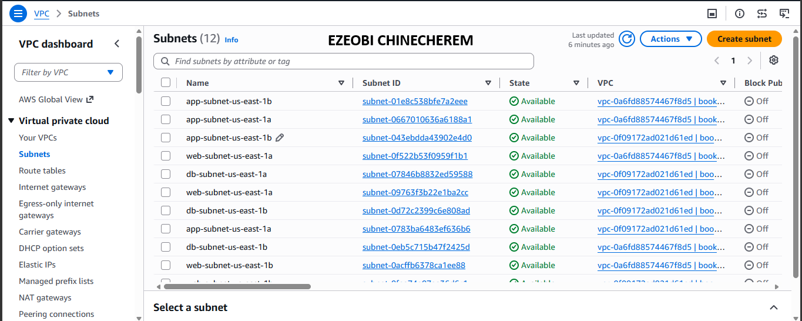

---

#### Screenshot 3 — Terraform plan or cloud networking view showing the required routing and tier isolation

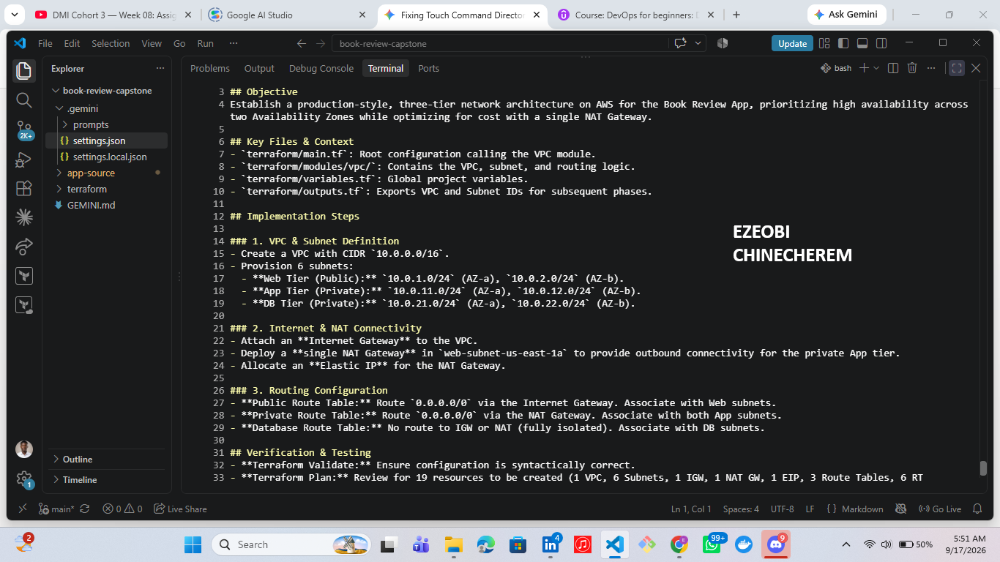

---

# Task 2 — Security Groups/NSGs and Load Balancers

## Goal

Configure tier-specific Security Groups/NSGs (Web Tier HTTP 80, App Tier 3001 only from Web Tier, Database Tier 3306 only from App Tier), and create a public load balancer for the frontend and an internal load balancer for the backend, all with Terraform.

### Evidence

#### Screenshot 4 — Web, App, and Database Security Group or NSG rules

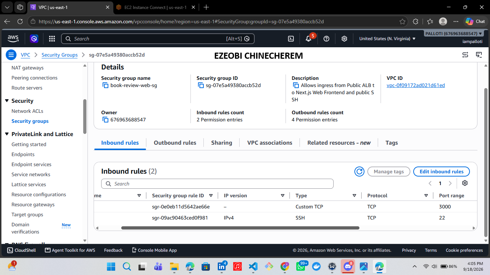

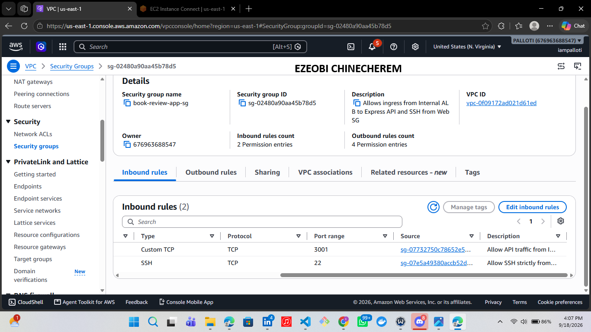

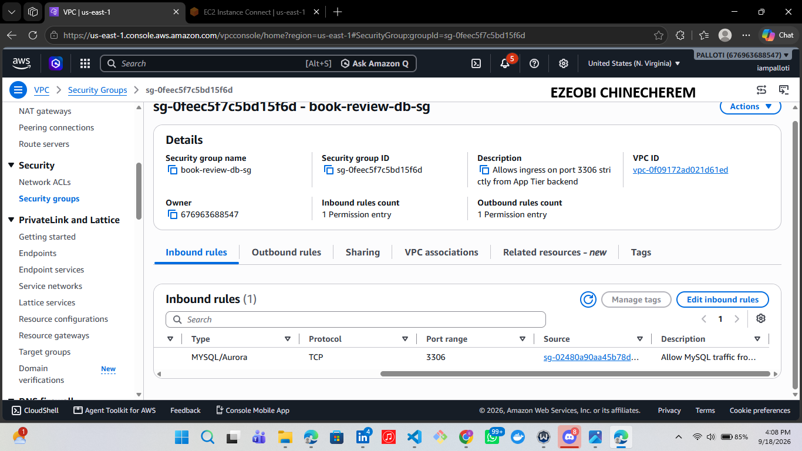

---

#### Screenshot 5 — Public frontend load balancer configuration

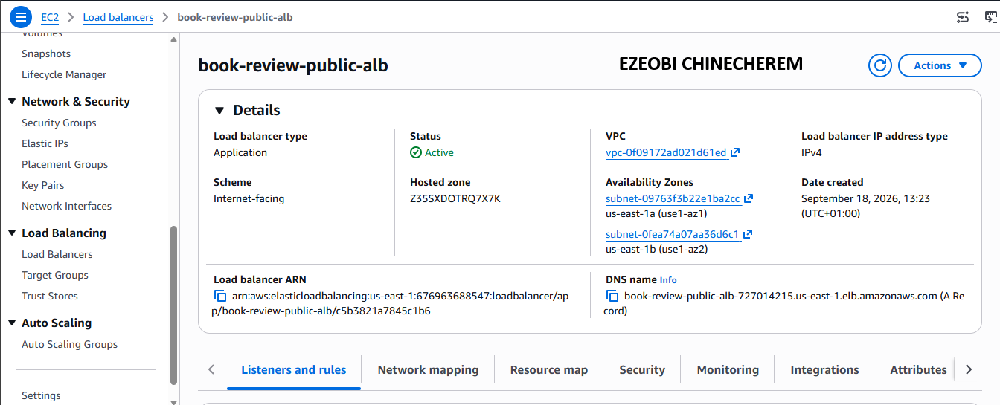

---

#### Screenshot 6 — Internal backend load balancer configuration

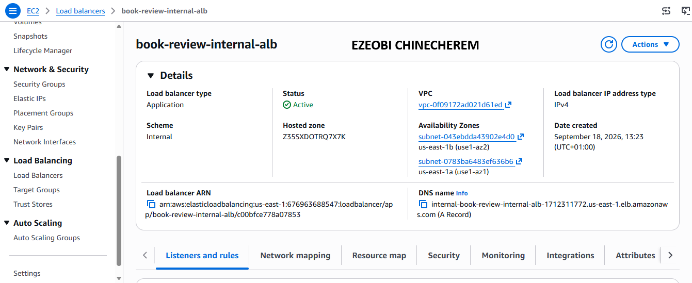

---

#### Screenshot 7 — Healthy frontend and backend targets or backend pools

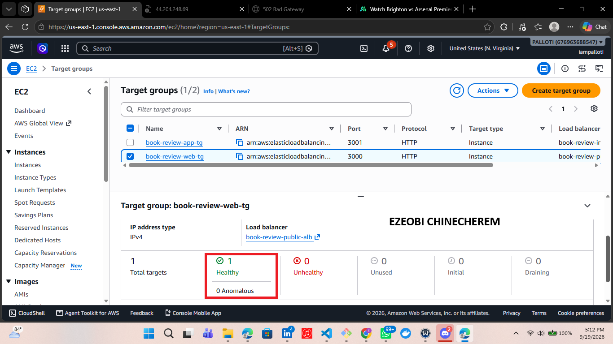

---

# Task 3 — VMs and Application Deployment

## Goal

Deploy the Next.js Web Tier behind Nginx on port 80 in the public subnets, and the Node.js App Tier on port 3001 in the private subnets (no Elastic IPs/Public IPs on private VMs), with the frontend reaching the backend through the internal load balancer.

### Evidence

#### Screenshot 8 — EC2 or Azure VM dashboard showing the frontend and backend VMs

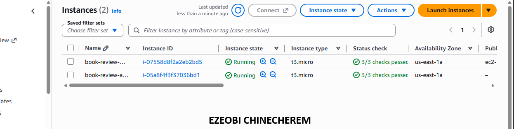

---

#### Screenshot 9 — Nginx status or frontend response on the Web Tier

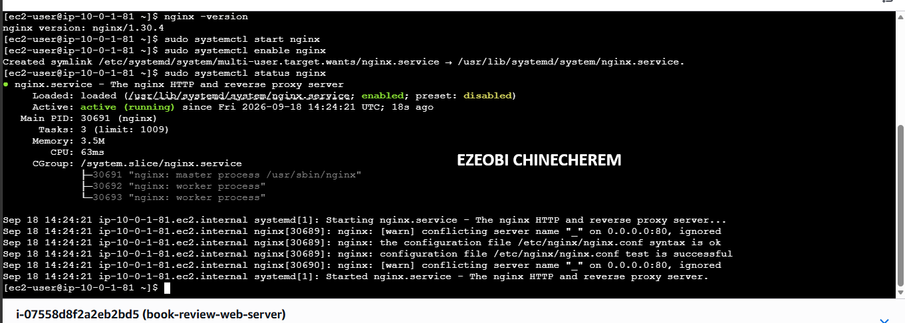

---

#### Screenshot 10 — Backend API response through the permitted internal path

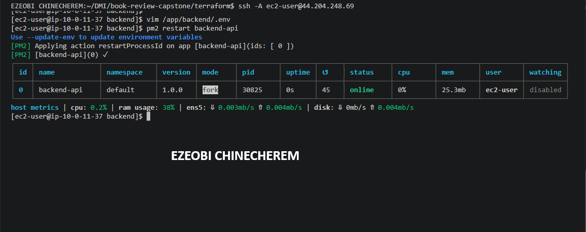

---

# Task 4 — MySQL Database Setup

## Goal

Deploy a private managed MySQL database (Amazon RDS Multi-AZ or Azure Database for MySQL Flexible Server) with a read replica, restricted to the App Tier on port 3306, and validate the Book Review App homepage, login, review flow, backend API, and database integration through the public load balancer.

### Evidence

#### Screenshot 11 — Amazon RDS or Azure Database dashboard showing the primary database and read replica

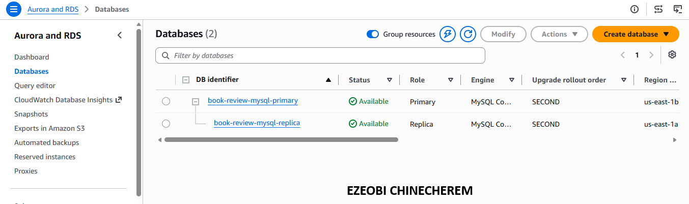

---

#### Screenshot 12 — Evidence of private database networking and permitted App Tier access

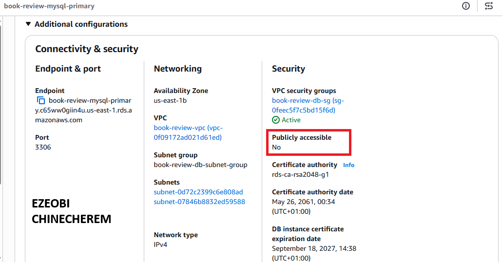

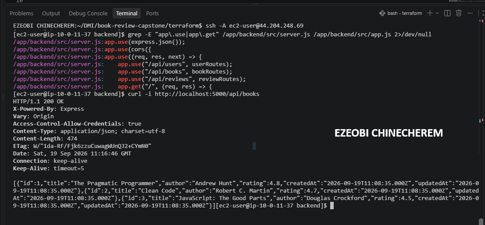

---

#### Screenshot 13 — Functional Book Review App homepage and login flow

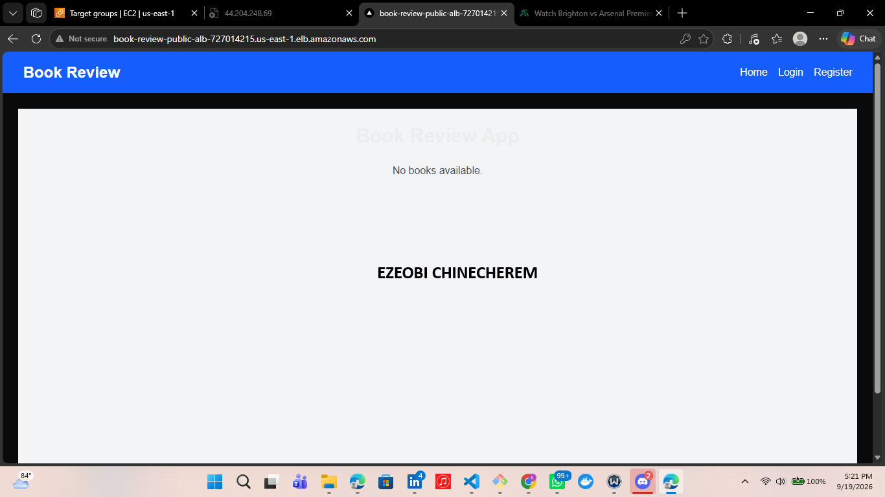

---

#### Screenshot 14 — Functional review flow with working backend API and database integration

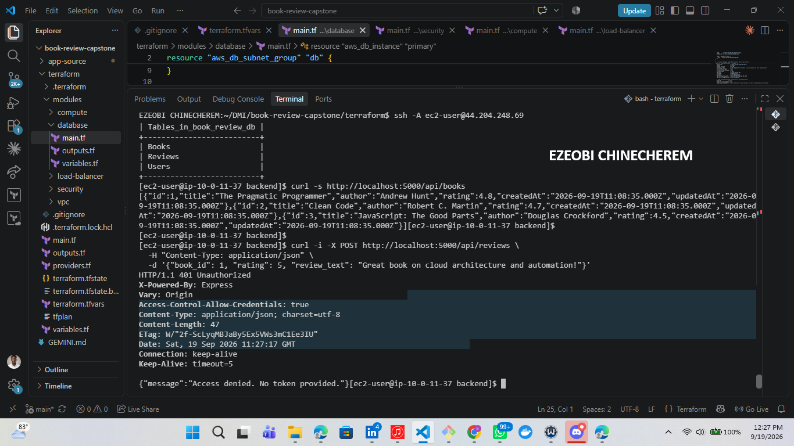

---

#### Screenshot 15 (optional) — Application logs or terminal output

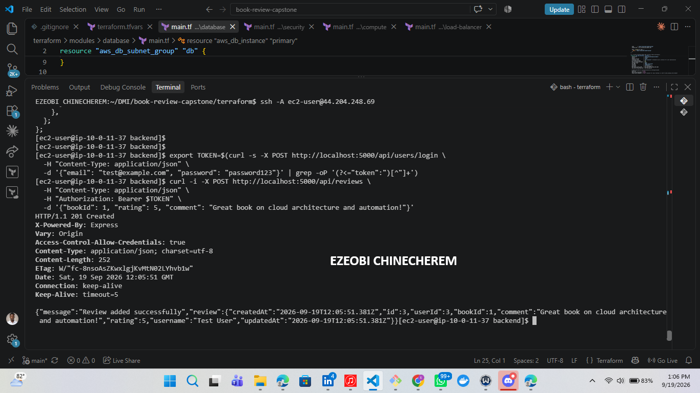

---

### Notes

Report the cloud platform used (AWS or Azure), your Terraform code structure (`main.tf`, `variables.tf`, `outputs.tf`, and supporting files), a link/description of your architecture diagram, and the Public Load Balancer DNS used to access the frontend.

Cloud Infrastructure Architecture Report
1. Cloud Platform
Platform: Amazon Web Services (AWS)

2. Terraform Code Structure & Modularity
To ensure clean code readability, separation of concerns, and reusability, the Infrastructure as Code (IaC) is structured using modular Terraform layers. Each module contains its own dedicated main.tf, variables.tf, and outputs.tf:

➡️ Network / VPC Module: Manages the core networking backbone, subnets, internet gateways, and routing tables.

➡️ Compute Module: Provisions EC2 instances across the multi-tier application architecture.

➡️ Security Module: Configures security groups, firewall rules, and least-privilege access layers.

➡️ Database Module: Handles database provisioning and replica sets.

3. Architecture Overview & Components
The deployment implements a resilient, multi-AZ 3-tier web application architecture:

➡️ VPC & Subnets: Custom VPC (10.0.0.0/16) spanning 2 Availability Zones with 6 total subnets neatly segmented into Public, Private, and Database subnet groups.

Compute Tier:

2 EC2 instances dedicated to the public-facing web tier.

2 EC2 instances running the private backend application tier.

2 EC2 instances dedicated to the database tier.

➡️ Routing & Gateways: An Internet Gateway attached to the VPC, paired with public route tables for web tier connectivity and private route tables secured via a NAT Gateway for outbound internet access in private subnets.

Traffic Management:

➡️ Public Application Load Balancer (ALB): Manages and distributes incoming public traffic.

➡️ Nginx Web Server: Positioned behind the public ALB to reverse-proxy traffic to the frontend application.

➡️ Internal Load Balancer: Manages internal traffic distribution within the private application tier layer.

Data Layer: A primary database serving as the core information warehouse (storing user details and application credentials) backed by a cross-AZ database replica set to ensure high availability and data durability during outages.

4. Public Access Point
➡️ Public Load Balancer DNS: book-review-public-alb-727014215.us-east-1.elb.amazonaws.com

---

# LinkedIn Post (Required)

## Goal

Publish a LinkedIn post about what you achieved in this assignment, with public or "Anyone" visibility.

## Evidence

#### LinkedIn Post URL

Paste your LinkedIn post URL here:

https://lnkd.in/p/eETYtmFM

---

#### Screenshot 16 — Published LinkedIn post showing the text and at least one image or proof

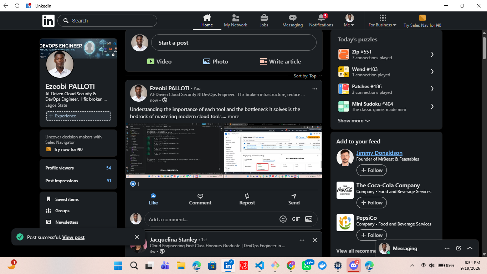

---

# Submission Instructions

- Add all required screenshots in your submission
- Include your architecture diagram and Public Load Balancer DNS
- Do not expose passwords, keys, tokens, database credentials, or Terraform state secrets

---

# Completion Checklist

- [ ] Task 1: Six-subnet VPC/VNet created across two AZs with Terraform (Screenshots 1–3)
- [ ] Task 2: Tier-specific security rules and load balancers configured (Screenshots 4–7)
- [ ] Task 3: Web and App Tier VMs deployed with correct public/private placement (Screenshots 8–10)
- [ ] Task 4: Private MySQL with read replica deployed and app validated end to end (Screenshots 11–15)
- [ ] Report completed: cloud platform, Terraform structure, diagram, LB DNS (Notes)
- [ ] LinkedIn post published and URL submitted (Screenshot 16)
- [ ] No sensitive data exposed

---

## 📌 About DMI & CloudAdvisory

DevOps Micro Internship (DMI) is a project-based DevOps program run by Pravin Mishra (The CloudAdvisory) focused on real-world execution, systems thinking, and career readiness.

It helps learners build strong DevOps foundations with hands-on experience.

---

## 📌 Resources

- 🌐 DMI Official Website: https://dmi.pravinmishra.com?utm_source=github&utm_medium=readme  
- 🎓 University: https://university.pravinmishra.com?utm_source=github&utm_medium=readme  
- 💬 Discord Community: https://discord.pravinmishra.com?utm_source=github&utm_medium=readme  
- 📝 Blog: https://dmi.pravinmishra.com/blog?utm_source=github&utm_medium=readme  
- ▶️ YouTube Playlist: https://www.youtube.com/playlist?list=PLFeSNDtI4Cho  
- 🔗 Pravin Mishra (LinkedIn): https://www.linkedin.com/in/pravin-mishra-aws-trainer/  
- 🏢 CloudAdvisory (LinkedIn): https://www.linkedin.com/company/thecloudadvisory/

---

*This submission is part of DevOps Micro Internship (DMI) Cohort 3 — Agentic AI Track.*
