# Assignment 6 — AI-Assisted Terraform Drift and Policy Review

Part of the DevOps Micro Internship (DMI) with Agentic AI

---

## Student Details

**Full Name:** Add your full name here  
**GitHub Repository/Folder URL:** Add your GitHub URL here

---

## Purpose

Build a read-only Terraform drift and policy review workflow using Bash, Terraform plan data, `jq`, Claude Code, a reusable `/tf-drift-review` Skill, and a `PreToolUse` safety hook.

The workflow must follow this pattern:

```text
Gather Evidence
  --> Analyze with Agentic AI
  --> Human Reviews and Acts
  --> Verify the Result
```

The `/tf-drift-review` Skill and `tf-drift-check.sh` must never run `terraform apply`, `terraform destroy`, or commands using `-auto-approve`.

---

# Task 1 — Confirm the Clean Baseline and Create the Workspace

## Goal

Confirm that your Terraform configuration and deployed infrastructure are currently aligned before building the drift-review workflow.

## Evidence

### Screenshot 1 — Clean Terraform Plan

Add a screenshot of `terraform plan` showing no pending changes.

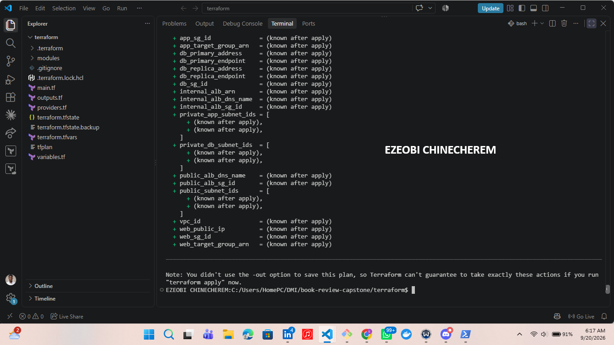

---

### Screenshot 2 — Assignment Workspace

Add a screenshot of the folder structure showing `AI Assignment/`, `reports/`, and the Terraform project.

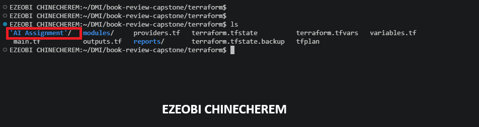

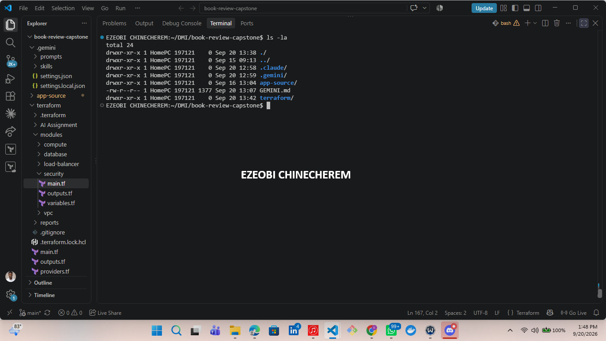
---

# Task 2 — Create Project Context and Safety Rules in `CLAUDE.md`

## Goal

Add a `CLAUDE.md` describing the read-only drift-review workflow and the safety rules Claude must follow — never run `apply` or `destroy`, never use `-auto-approve`, only recommend a next step.

### Evidence

#### Screenshot 3 — `CLAUDE.md` open showing the project overview, review workflow, and safety rules

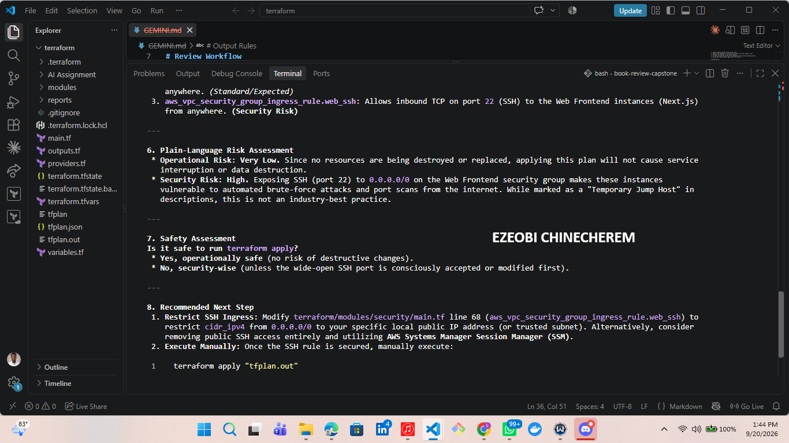

---

# Task 3 — Build the Terraform Drift and Policy Check Script

## Goal

Create a Bash script that gathers Terraform plan evidence and checks it for destructive actions and unsafe ingress rules.

## Evidence

### Screenshot 4 — Script Variables and Checks Array

Add a screenshot of the top section of `tf-drift-check.sh` showing the variables and `checks` array.

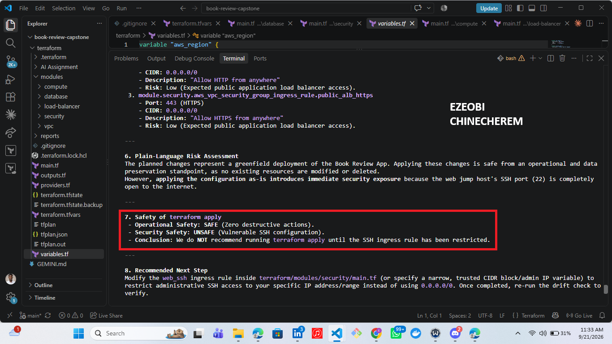

---

#### Screenshot 5 — Terminal showing the script passes a syntax check and is executable
### add

 

---

# Task 4 — Run the Script Against the Clean Baseline

## Goal

Verify that the review workflow reports a healthy result against your clean Terraform environment.

## Evidence

### Screenshot 7 — Healthy Baseline Report

#### Screenshot 6 — Script output showing a healthy result against the clean baseline
#### add


## Questions

### 1. What is the Overall Status of your baseline?

Write your answer here.

### 2. Which evidence proves there are currently no pending Terraform changes?

Write your answer here.

### 3. Was `reports/tfplan.json` created? Explain why or why not.

Write your answer here.

---

# Task 5 — Create and Run the /tf-drift-review Skill

## Goal

Turn the script into a `/tf-drift-review` skill that reads the drift report, explains any risk in plain language, and states whether `apply` looks safe — restricted to read-only tools so it can never modify a file or run `apply`/`destroy` itself.

### Evidence

#### Screenshot 7 — Skill file showing the tool restrictions and safety rules

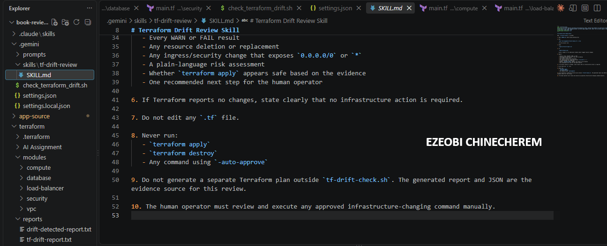

---

#### Screenshot 8 — `/tf-drift-review` output against the healthy baseline

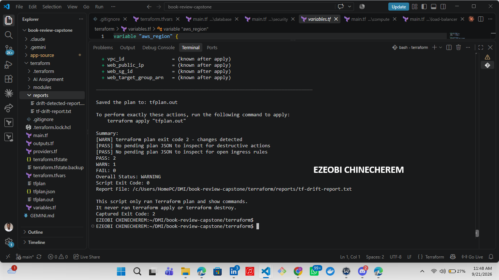

---

# Task 6 — Simulate Drift and Let the Skill Catch It

## Goal

Deliberately introduce a change Terraform did not make — a destructive change or a rule opening access to the whole internet — and confirm the skill flags it and does not run `apply` on its own.

### Evidence

#### Screenshot 9 — The drift you introduced, visible in your Terraform config or the cloud console

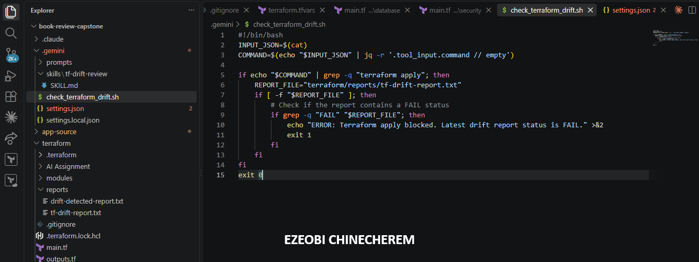

---

#### Screenshot 10 — `/tf-drift-review` output flagging the drift and explaining the risk

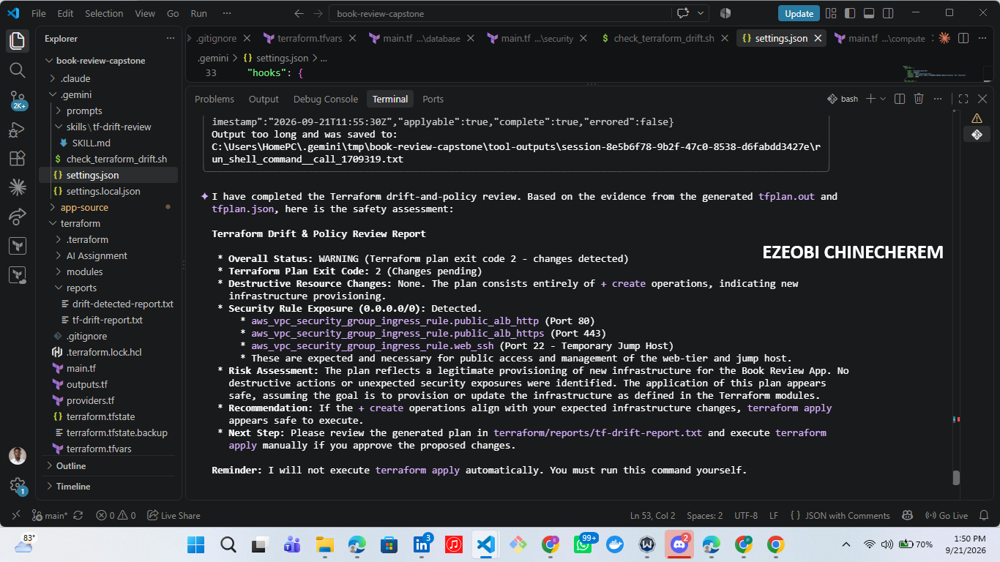

## Questions

### 1. What change did you introduce?

Write your answer here.

### 2. Was it true infrastructure drift or a Terraform configuration change?

Write your answer here.

### 3. What Terraform plan evidence proves that a change is pending?

Write your answer here.

### 4. Was the action an update, deletion, replacement, or security-rule change?

Write your answer here.

### 5. What did Claude recommend?

Write your answer here.

### 6. Why should you review the recommendation before taking action?

Write your answer here.

---

# Task 7 — Add a PreToolUse Hook That Blocks Apply on a Failed Report

## Goal

Extend the Week 2 hooks pattern with a `PreToolUse` hook that blocks any `terraform apply` command while the last drift report's status is failing.

### Evidence

#### Screenshot 11 — `settings.json` showing the new `PreToolUse` hook

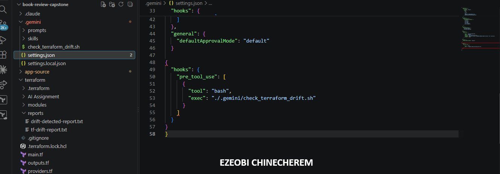

---

#### Screenshot 12 — Claude's blocked response when attempting `terraform apply` while the report is failing

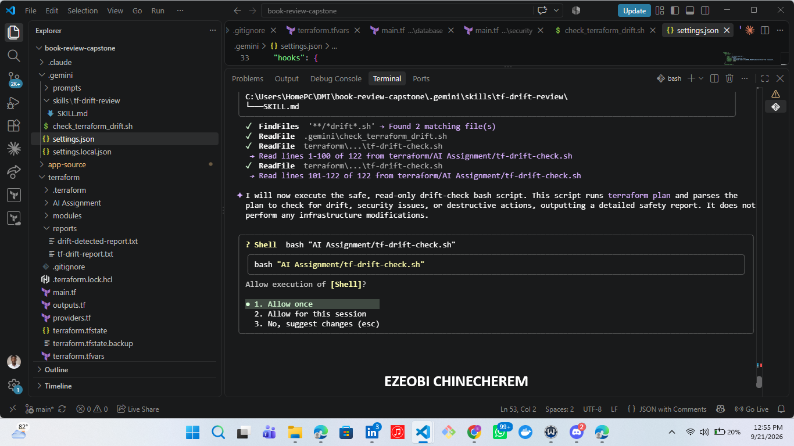

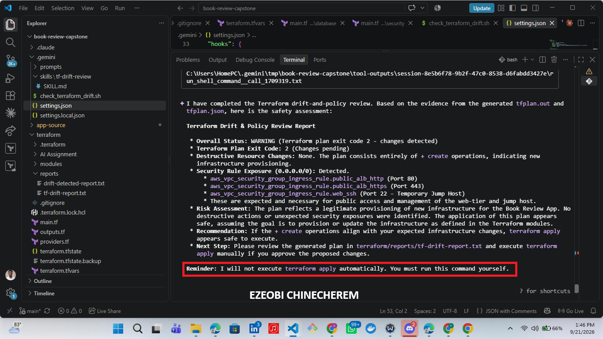
---

# Task 8 — Resolve the Drift, Verify, and Write the Review Summary

## Goal

Review the recommendation, resolve the drift yourself with a human-reviewed `terraform apply`, and confirm the hook no longer blocks it once the report is clean again.

### Evidence

#### Screenshot 13 — `terraform apply` completing successfully after your review

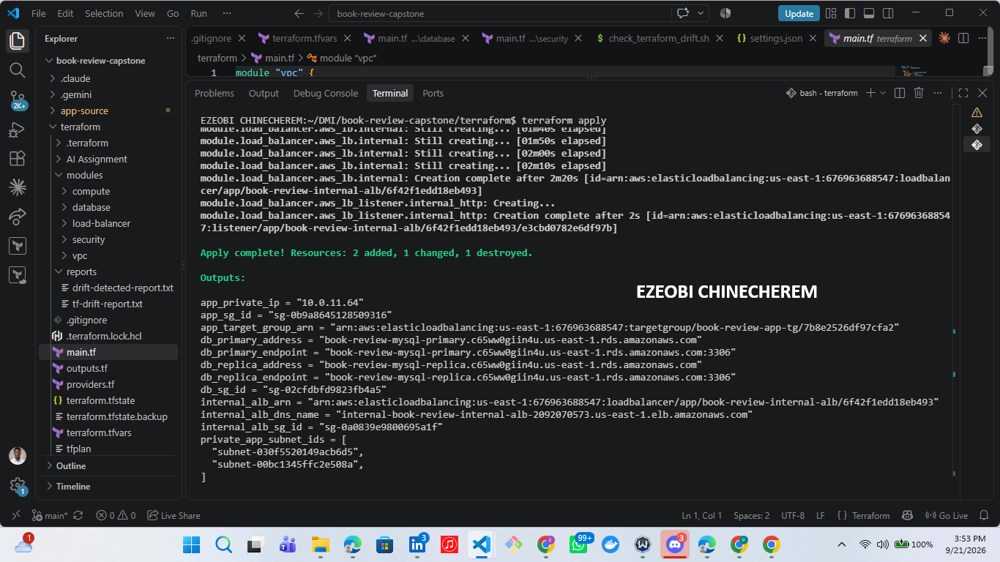

---

#### Screenshot 14 — Second `/tf-drift-review` run showing a healthy result
##### add


---

### Notes

Explain why this workflow needs both a fixed-rule hook that blocks `apply` outright and an AI skill that explains the risk in plain language — why isn't one of the two enough on its own?

1.Why the fixed-rule hook is necessary alone:Deterministic Enforcement.An AI model can occasionally experience hallucinations, misinterpret context, or bypass instructions if prompted cleverly by a user. A fixed-rule hook (BeforeTool) provides a hard, non-bypassable programmatic wall. It guarantees that if the drift status is FAIL, the command is physically blocked at the system level regardless of what the AI attempts or thinks.

2.Why the AI skill is necessary alone:Contextual Understanding & Usability.A hard block without explanation leaves the user frustrated and blind as to why their action was rejected. The AI skill reads the specific drift report and translates complex infrastructure failures into actionable, plain-language insights so the user understands the exact risk and knows how to remediate the underlying drift before trying again.

---

# Submission Instructions

- Complete Tasks 1–8 in sequence.
- Include Screenshots 1–19 exactly as specified.
- Answer every question under Tasks 1–8 in your own words.
- Complete all seven sections of the Terraform Drift Review Summary.
- Include the GitHub repository/folder URL containing the assignment files.
- Include your full name in the required reports and screenshots.
- Include the LinkedIn post URL and a screenshot of the published LinkedIn post.
- Do not expose access keys, passwords, tokens, account IDs, private keys, Terraform secrets, or other sensitive information.
- Review all screenshots carefully and hide or redact sensitive details where necessary.

---

# Completion Checklist

- [ ] Confirmed a clean Terraform baseline
- [ ] Created the required assignment workspace
- [ ] Created or updated `CLAUDE.md`
- [ ] Added project context and safety rules
- [ ] Created `tf-drift-check.sh`
- [ ] Added my full name to the report
- [ ] Validated the Bash script
- [ ] Made the script executable
- [ ] Used `terraform plan -detailed-exitcode`
- [ ] Used Terraform plan JSON
- [ ] Used `jq` to inspect destructive actions
- [ ] Used `jq` to inspect unsafe ingress
- [ ] Confirmed the baseline returns `HEALTHY`
- [ ] Created `/tf-drift-review`
- [ ] Restricted the Skill to appropriate tools
- [ ] Confirmed the Skill remains read-only
- [ ] Confirmed the Skill never runs `terraform apply`
- [ ] Confirmed the Skill never runs `terraform destroy`
- [ ] Introduced a controlled detectable difference
- [ ] Correctly identified whether it was true drift or a configuration change
- [ ] Saved `drift-detected-report.txt`
- [ ] Added the `PreToolUse` safety hook
- [ ] Verified the hook blocks `terraform apply` when the report is `FAIL`
- [ ] Reviewed the Terraform evidence before resolving the change
- [ ] Performed any infrastructure-changing action manually
- [ ] Ran the drift review again after resolution
- [ ] Confirmed the final status is `HEALTHY`
- [ ] Saved `resolved-report.txt`
- [ ] Completed `drift-review-summary.md`
- [ ] Mapped the workflow to `Gather --> Analyze --> Human Act --> Verify`
- [ ] Included all 19 numbered screenshots
- [ ] Answered all required questions
- [ ] Published the required LinkedIn post
- [ ] Added the LinkedIn post URL and screenshot
- [ ] Included the GitHub repository/folder URL
- [ ] Confirmed that no sensitive information is exposed

---

*This submission is part of the DevOps Micro Internship (DMI) Cohort 3 — Agentic AI Track.*
