# Assignment 01 — Set Up a Team-Ready Ansible Development Workstation

Part of the DevOps Micro Internship (DMI) with Agentic AI

---

## Purpose

In this assignment, you will prepare an isolated and reusable Ansible development workstation.

You will install Ansible and supporting tools inside a Python virtual environment, configure VS Code, prepare SSH access, configure Git and pre-commit hooks, and document the complete setup.

This workstation will be used as the Ansible controller in upcoming assignments.

---

# Task 1 — Create and Initialize the Ansible Workspace

## Goal

Create the assignment workspace, initialize a Git repository, prepare the required directories, and add Git ignore rules for local and sensitive files.

### Evidence

#### Screenshot 1 — Terminal showing the `ansible-onboarding` path, `ls -la` output, and `git status` confirming the Git repository is on the `main` branch

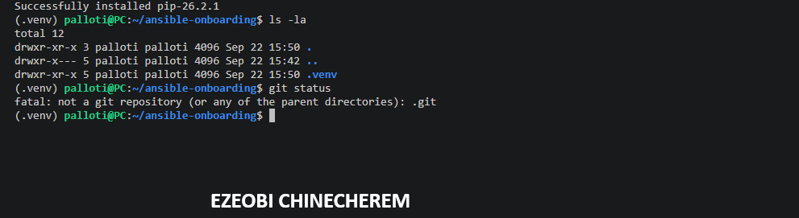

---

# Task 2 — Create the Virtual Environment and Install Ansible Tools

## Goal

Create an isolated Python virtual environment and install Ansible and the required validation tools without modifying the system Python environment.

### Evidence

#### Screenshot 2 — Terminal showing the active `(.venv)` environment, `which ansible`, `ansible --version`, `ansible-lint --version`, `yamllint --version`, and `pre-commit --version`

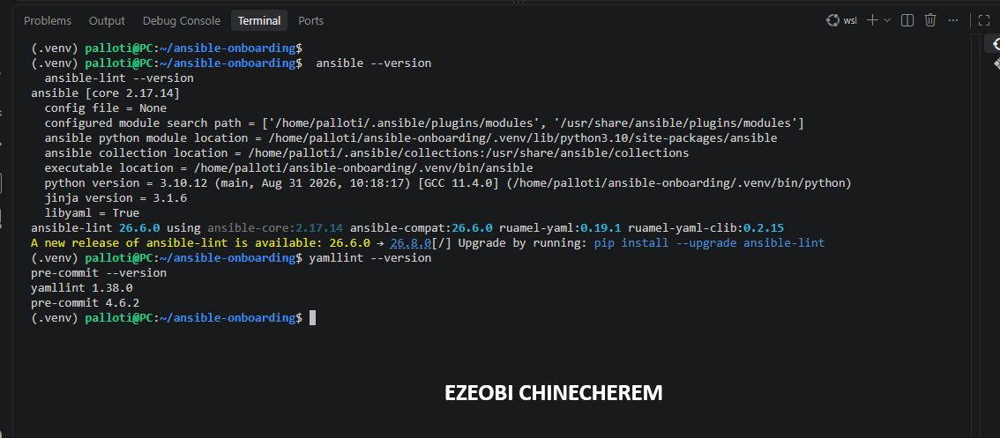

---

# Task 3 — Configure VS Code for Ansible Development

## Goal

Configure Visual Studio Code to use the project’s Python virtual environment and provide validation support for Python, YAML, and Ansible files.

### Evidence

#### Screenshot 3 — VS Code Extensions panel showing the Ansible, YAML, and Python extensions installed

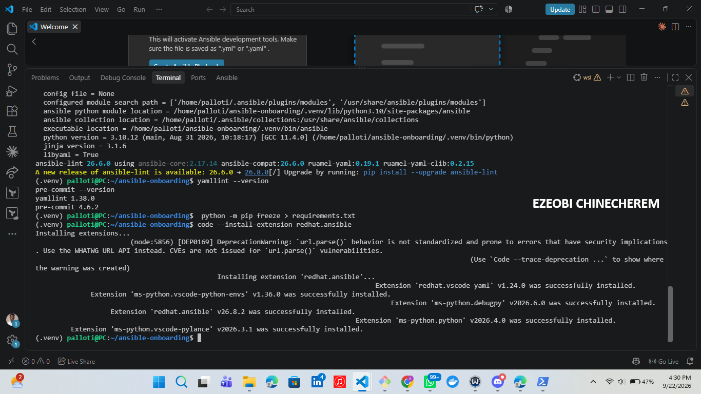

---

#### Screenshot 4 — VS Code showing `.vscode/settings.json` and `.editorconfig` open side by side, with the required settings clearly visible

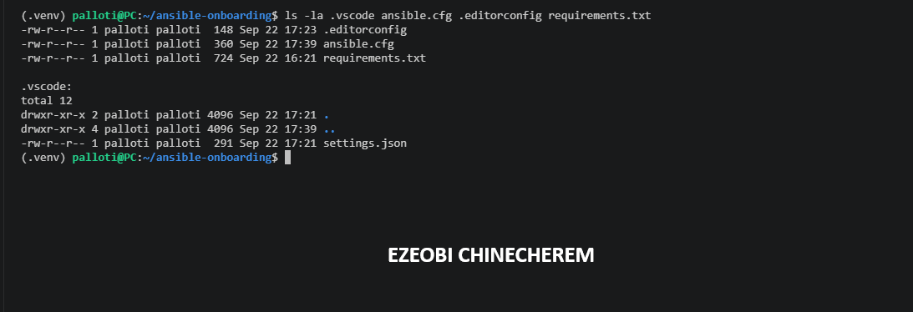

---

# Task 4 — Create the Baseline Ansible Configuration

## Goal

Create a reusable `ansible.cfg` file containing the default settings that will be used in this workspace and upcoming Ansible assignments.

### Evidence

#### Screenshot 5 — `ansible.cfg` open in VS Code or another editor, showing the complete configuration

---

#### Screenshot 6 — Terminal showing `ansible --version` with the `ansible.cfg` path and the output of `ansible-config dump --only-changed`

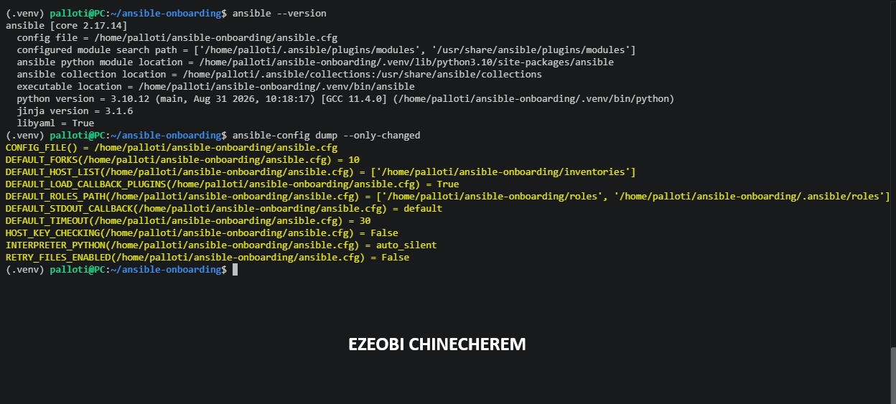

---

# Task 5 — Configure SSH Readiness

## Goal

Prepare SSH key authentication, load the key into the SSH agent, configure reusable SSH client settings, and understand how trusted host fingerprints are stored.

### Evidence

#### Screenshot 7 — Terminal showing `ssh-add -l` with the ED25519 key loaded and the SSH configuration verification output

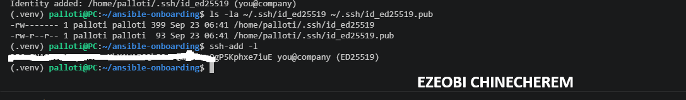

---

# Task 6 — Configure Git Identity and Pre-commit Hooks

## Goal

Configure your Git identity and install pre-commit hooks that validate YAML and Ansible files before commits are created.

### Evidence

#### Screenshot 8 — Terminal showing your Git full name, Git email, default branch, successful `pre-commit install` output, and `.git/hooks/pre-commit`

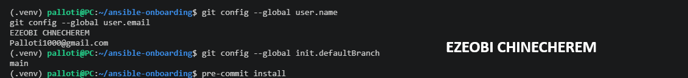

---

# Task 7 — Test the Complete Workstation Setup

## Goal

Verify that Ansible, the linting tools, Git hooks, SSH agent, and Git ignore rules are working correctly.

### Evidence

#### Screenshot 9 — Terminal showing `pre-commit run --all-files` completing successfully

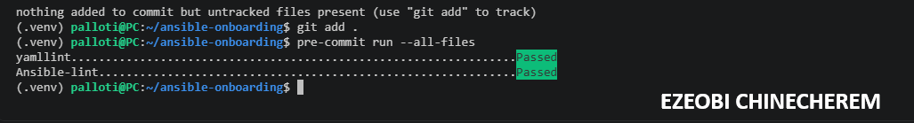

---

#### Screenshot 10 — Terminal showing `ansible --version` with the project configuration path and `ssh-add -l` with the ED25519 key loaded

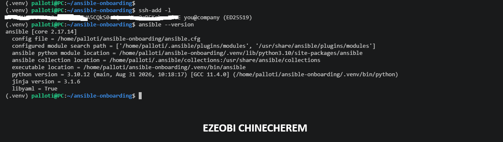

---

# Task 8 — Create the README and Onboarding Checklist

## Goal

Document the completed Ansible workstation setup and create a reusable checklist for preparing another workstation in the future.

### Evidence

#### Screenshot 11 — Terminal showing the final `ansible-onboarding` project structure

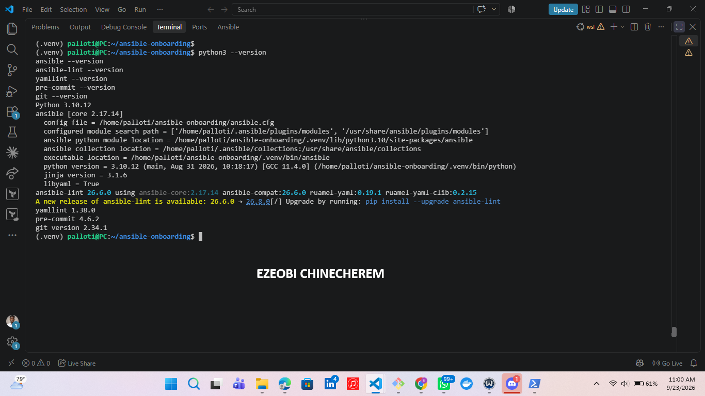

---

#### Screenshot 12 — VS Code Markdown preview showing your full name, project summary, and part of the “New Machine? Do This” checklist

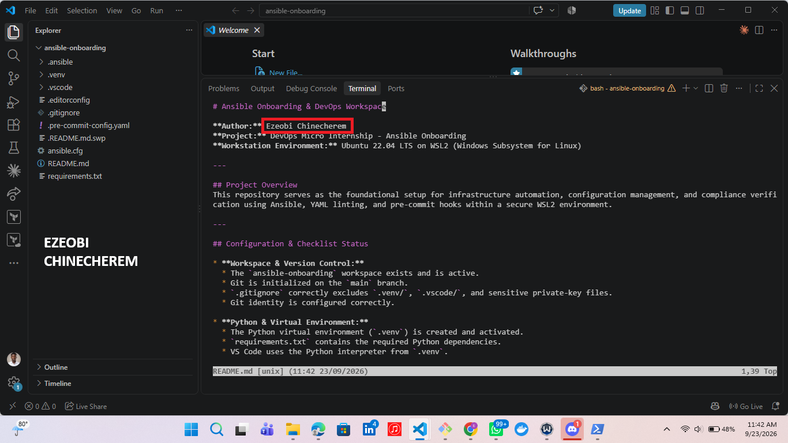

---

# Assignment Questions

Answer the following in your own words:

**1. What is one feature that makes your workstation setup team-friendly?**

1.Pre-commit and EditorConfig Integration:
Standardized Formatting & Checks.
One key feature that makes this workstation setup team-friendly is the inclusion of .editorconfig and .pre-commit-config.yaml files.These ensure that all team members adhere to identical code formatting rules (like indentation and trailing whitespace) and automatically run linters (yamllint and ansible-lint) before every commit.This prevents formatting disputes in pull requests and maintains consistent code quality across the entire team.

---

**2. What is one pitfall you avoided while completing the setup?**

One major pitfall you avoided during this setup was allowing linters to scan massive, third-party files inside the virtual environment (.venv/).Without excluding .venv/ and .git/ directories in your .pre-commit-config.yaml file, running pre-commit run --all-files caused linters like yamllint to recursively parse thousands of external Ansible collection files. This resulted in massive performance overhead, severe terminal lag, and endless irrelevant syntax errors (such as truthy value and indentation warnings) originating from third-party library files rather than your own code. By defining a global exclude pattern (^(\.venv|\.git|\.cache)/), you bypassed this issue entirely, ensuring your pre-commit checks run instantly and focus strictly on your project source files.

---

**3. Why should Ansible be installed inside a Python virtual environment?**

Installing Ansible inside a Python virtual environment (.venv) is a best practice for several important reasons:

Key Benefits of Using a Virtual Environment
1>  Dependency Isolation: It keeps Ansible and its required Python packages contained within your specific project directory, preventing conflicts with global system packages or other projects.

2>  Version Control & Consistency: By pairing the virtual environment with a requirements.txt file, you ensure that everyone on your team (or your CI/CD pipelines) runs the exact same version of Ansible and its dependencies.

3>  System Stability: Operating systems (like Ubuntu) rely on system Python for critical internal tasks. Installing packages globally can risk breaking system tools, whereas a virtual environment keeps your workspace safely sandboxed.

4>  Clean Management: If something goes wrong with your setup, you can easily delete and recreate the .venv folder without affecting your operating system or other projects.

---

**4. Why must SSH private keys and `.venv/` remain outside version control?**

Keeping SSH private keys and virtual environments (.venv/) out of version control is a core security and repository-management best practice:

1> SSH Private Keys (Security Risk): Private keys grant authentication and access to your servers and repositories. If committed to version control, they are exposed to anyone who gains access to the repository (including public history), allowing unauthorized users to impersonate you and compromise your infrastructure.

2> Virtual Environment .venv/ (Portability & Bloat): Virtual environments contain thousands of binary files, system libraries, and paths tied specifically to your local machine's operating system and architecture. Committing them causes massive repository bloat and compatibility errors. Instead, you track a lightweight requirements.txt file so each machine can cleanly generate its own isolated environment.

---

# Required Files

Confirm that the following files are included in your assignment workspace:

- [ ] `README.md`
- [ ] `requirements.txt`
- [ ] `.gitignore`
- [ ] `.editorconfig`
- [ ] `.vscode/settings.json`
- [ ] `ansible.cfg`
- [ ] `.pre-commit-config.yaml`
- [ ] `inventories/`
- [ ] `roles/`

---

# Submission Instructions

- Add all required screenshots in your submission.
- Full Name must be visible in required screenshots.
- All screenshots must be readable.
- Answer all assignment questions clearly in your own words.
- Do not expose SSH private-key contents, passwords, access tokens, API keys, credentials, private certificates, or other sensitive information.

---

# Completion Checklist

- [ ] Task 1: `ansible-onboarding` workspace created
- [ ] Task 1: Git initialized on the `main` branch
- [ ] Task 1: `.gitignore` created
- [ ] Task 2: Python virtual environment created
- [ ] Task 2: Virtual environment activated
- [ ] Task 2: Ansible installed inside `.venv`
- [ ] Task 2: `ansible-lint`, `yamllint`, and `pre-commit` installed
- [ ] Task 2: `requirements.txt` created
- [ ] Task 3: Required VS Code extensions installed
- [ ] Task 3: VS Code uses the Python interpreter from `.venv`
- [ ] Task 3: `.vscode/settings.json` created
- [ ] Task 3: `.editorconfig` created
- [ ] Task 4: `ansible.cfg` created
- [ ] Task 4: Ansible loads `ansible.cfg` from the project directory
- [ ] Task 5: ED25519 SSH key exists
- [ ] Task 5: SSH private key has not been exposed
- [ ] Task 5: SSH key loaded into the SSH agent
- [ ] Task 5: `~/.ssh/config` contains the required settings
- [ ] Task 5: `~/.ssh/known_hosts` exists
- [ ] Task 6: Git identity configured correctly
- [ ] Task 6: Pre-commit hooks installed
- [ ] Task 7: `pre-commit run --all-files` completes successfully
- [ ] Task 8: `README.md` contains your full name and workstation details
- [ ] Task 8: “New Machine? Do This” checklist contains 10–12 items
- [ ] All 12 required screenshots are included
- [ ] Assignment questions are answered
- [ ] No sensitive information is exposed

---

## About DMI & CloudAdvisory

DevOps Micro Internship (DMI) is a project-based DevOps program run by Pravin Mishra and The CloudAdvisory, focused on real-world execution, systems thinking, and career readiness.

It helps learners build strong DevOps foundations with hands-on experience.

---

## Resources

- DMI Official Website: [https://dmi.pravinmishra.com?utm_source=github&utm_medium=readme](https://dmi.pravinmishra.com?utm_source=github&utm_medium=readme)
- University: [https://university.pravinmishra.com?utm_source=github&utm_medium=readme](https://university.pravinmishra.com?utm_source=github&utm_medium=readme)
- Discord Community: [https://discord.pravinmishra.com?utm_source=github&utm_medium=readme](https://discord.pravinmishra.com?utm_source=github&utm_medium=readme)
- Blog: [https://dmi.pravinmishra.com/blog?utm_source=github&utm_medium=readme](https://dmi.pravinmishra.com/blog?utm_source=github&utm_medium=readme)
- YouTube Playlist: [https://www.youtube.com/playlist?list=PLFeSNDtI4Cho](https://www.youtube.com/playlist?list=PLFeSNDtI4Cho)
- Pravin Mishra LinkedIn: [https://www.linkedin.com/in/pravin-mishra-aws-trainer/](https://www.linkedin.com/in/pravin-mishra-aws-trainer/)
- CloudAdvisory LinkedIn: [https://www.linkedin.com/company/thecloudadvisory/](https://www.linkedin.com/company/thecloudadvisory/)

---

*This submission is part of DevOps Micro Internship (DMI) — Agentic AI Track.*