# Assignment 02 — Provision Linux VMs with Terraform and Run Ansible Ad-Hoc Commands

Part of the DevOps Micro Internship (DMI) with Agentic AI

---

## Purpose

In this assignment, you will use Terraform to provision three or four Ubuntu Linux Virtual Machines on either Microsoft Azure or Amazon Web Services.

You will configure SSH key-based authentication, organize the servers using a custom Ansible inventory, and run Ansible ad-hoc commands across individual hosts and inventory groups.

---

# Task 1 — Create the Multi-Host Lab Structure

## Goal

Create a separate project directory for the multi-host lab and prepare the Terraform, Ansible, and documentation files.

This project will use the Git repository and Ansible controller prepared in Assignment 01.

### Evidence

#### Screenshot 1 — Terminal showing the complete `ansible-adhoc-lab` project structure

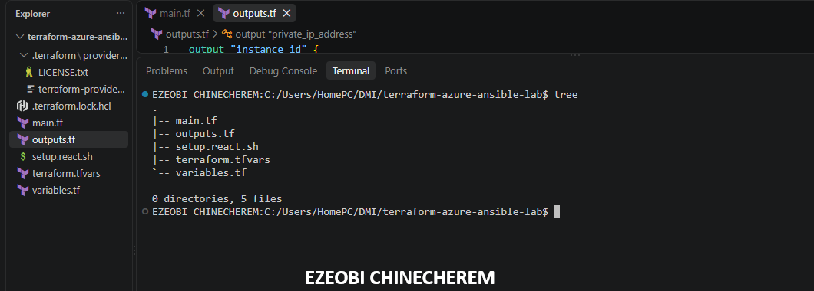

---

#### Screenshot 2 — Terminal showing `git status --short` with the new project files and updated `.gitignore`

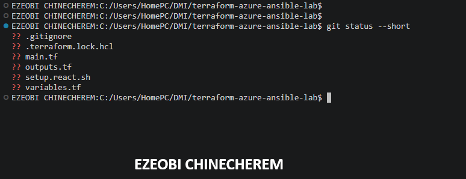

---

### Notes

Initialized multi-tier cloud infrastructure codebase, configured modular Terraform components for networking, compute, and security layers, structured Ansible inventory and ad-hoc automation for the web tier, and updated .gitignore rules for environment files.

---

# Task 2 — Create the Terraform Configuration

## Goal

Create the Terraform configuration required to provision three or four Ubuntu Linux VMs on your selected cloud platform.

Complete only one option:

- Option A — Microsoft Azure
- Option B — Amazon Web Services

Do not configure both providers for this assignment.

### Evidence

#### Screenshot 3 — Terraform configuration showing the three or four server roles and the `for_each` or `count` implementation

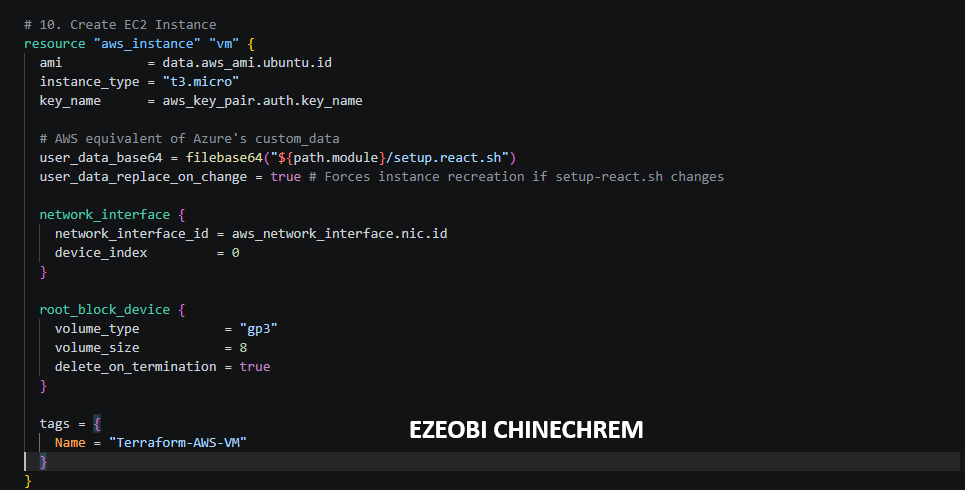

---

#### Screenshot 4 — Terraform configuration showing SSH restricted to the controller IP and HTTP allowed only for web hosts

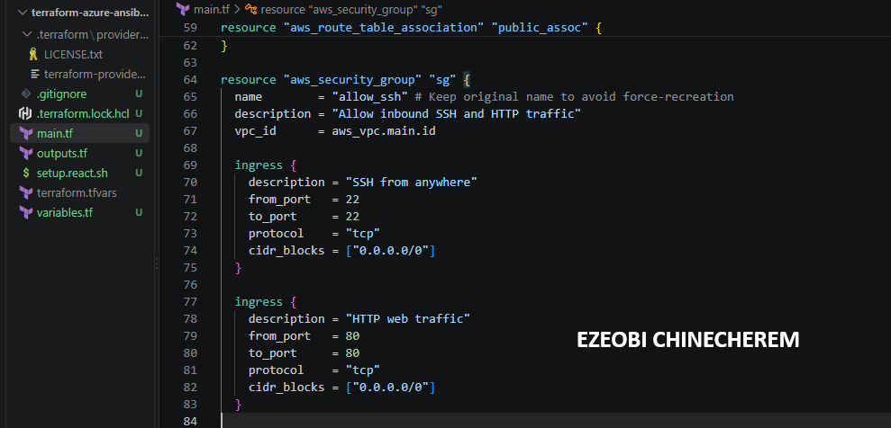

---

#### Screenshot 5 — Terraform output configuration showing how public IP addresses are associated with the server roles

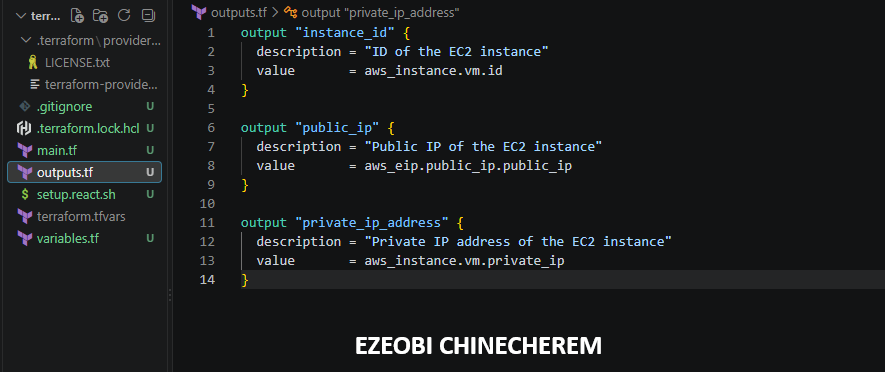

---

### Notes

Configured Terraform output mappings to dynamically expose public IP addresses for the public web tier instances (44.221.103.38 and 54.160.234.240), establishing a clean interface for external inventory mapping and Ansible control node management.

---

# Task 3 — Provision the Infrastructure with Terraform

## Goal

Initialize and validate the Terraform configuration, review the execution plan, provision the selected three or four VMs, and retrieve their public IP addresses.

### Evidence

#### Screenshot 6 — Final `terraform apply` output showing `Apply complete`

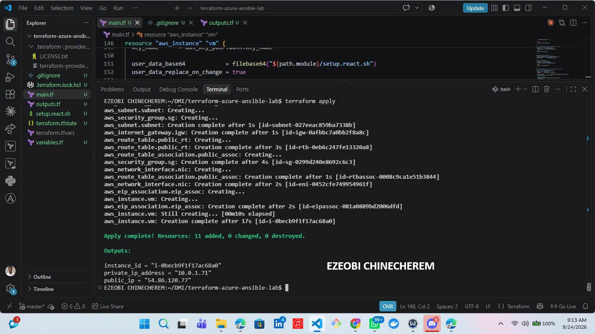

---

#### Screenshot 7 — `terraform output public_ips` showing the role-to-IP mapping for all three or four VMs

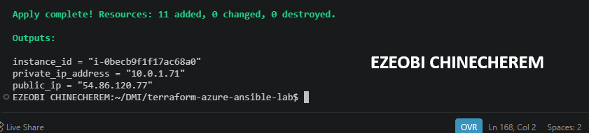

---

#### Screenshot 8 — Azure Portal or AWS Management Console showing all three or four VMs in the `Running` state, with their role-based names visible

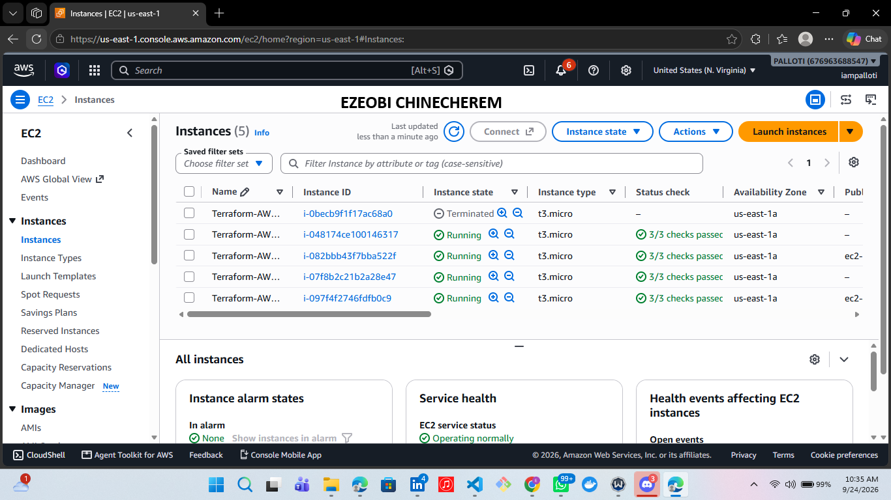

---

### Notes

Verified instance deployment health in the AWS Management Console, confirming all multi-tier virtual machines—including public web servers and private backend nodes—are successfully in the Running state with descriptive, role-based naming conventions applied.

---

# Task 4 — Verify SSH Key-Based Access

## Goal

Verify that each managed VM can be accessed from the Ansible controller using SSH key-based authentication.

### Evidence

#### Screenshot 9 — Terminal showing successful SSH hostname output from all VMs

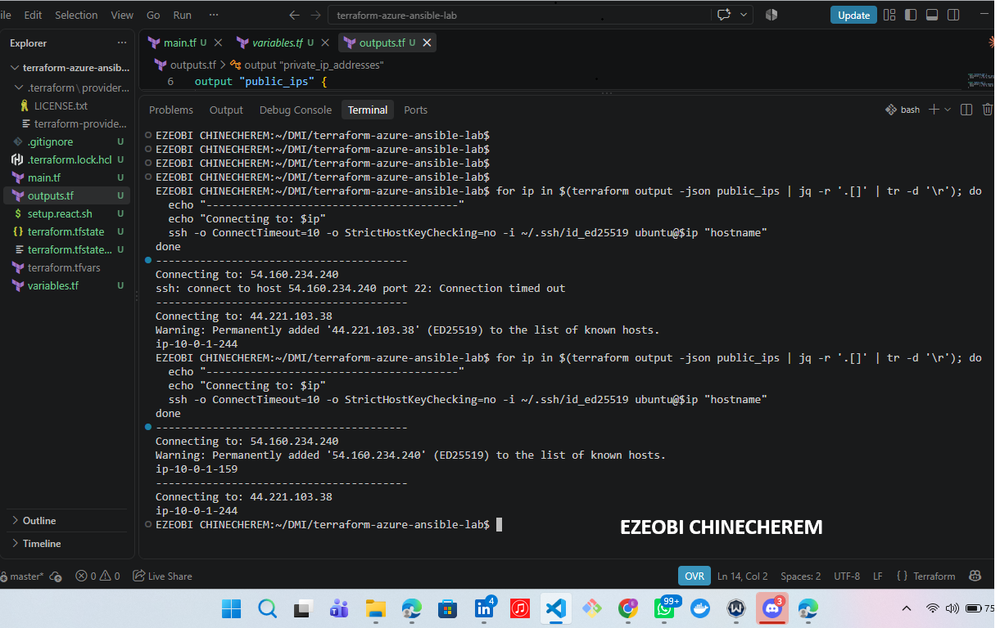

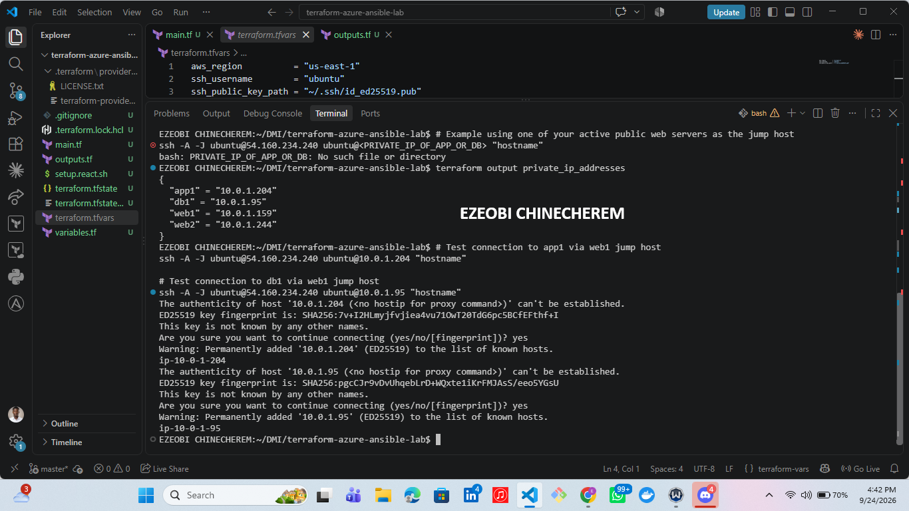

---

### Notes

Validated secure shell connectivity across the multi-tier infrastructure, confirming successful remote command execution and proper network routing from the control node to all provisioned virtual machines.

---

# Task 5 — Create the Custom Ansible Inventory

## Goal

Create an Ansible inventory file that groups the managed VMs by role.

The inventory allows Ansible to run commands against all servers, or only specific groups such as `web`, `app`, or `db`.

### Evidence

#### Screenshot 10 — `inventory.ini` showing the `web`, `app`, and `db` groups

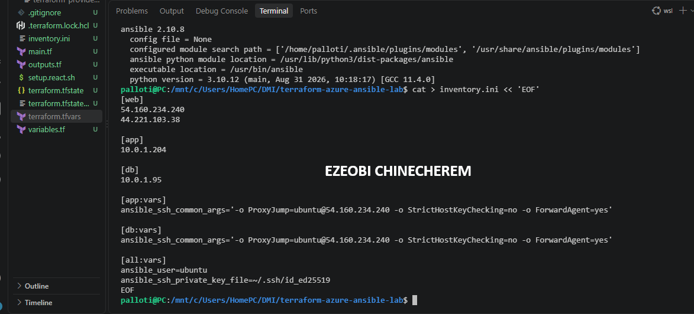

---

#### Screenshot 11 — Output of `ansible-inventory -i inventory.ini --graph`

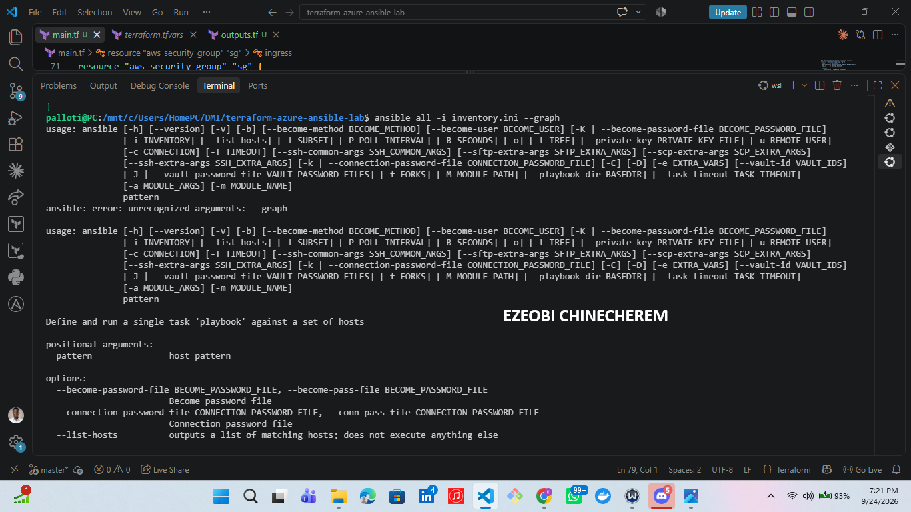

---

### Notes

Validated the Ansible inventory structure using the graph command, confirming proper logical grouping of hosts into web and private tiers for targeted configuration management and playbook execution.

---

# Task 6 — Run Ansible Ad-Hoc Commands

## Goal

Run Ansible ad-hoc commands from the controller to verify connectivity, check server information, and manage packages and services across inventory groups.

This task proves that the inventory is working and that Ansible can control multiple managed VMs without writing a playbook.

### Evidence

#### Screenshot 12 — Output of `ansible all -i inventory.ini -m ping`

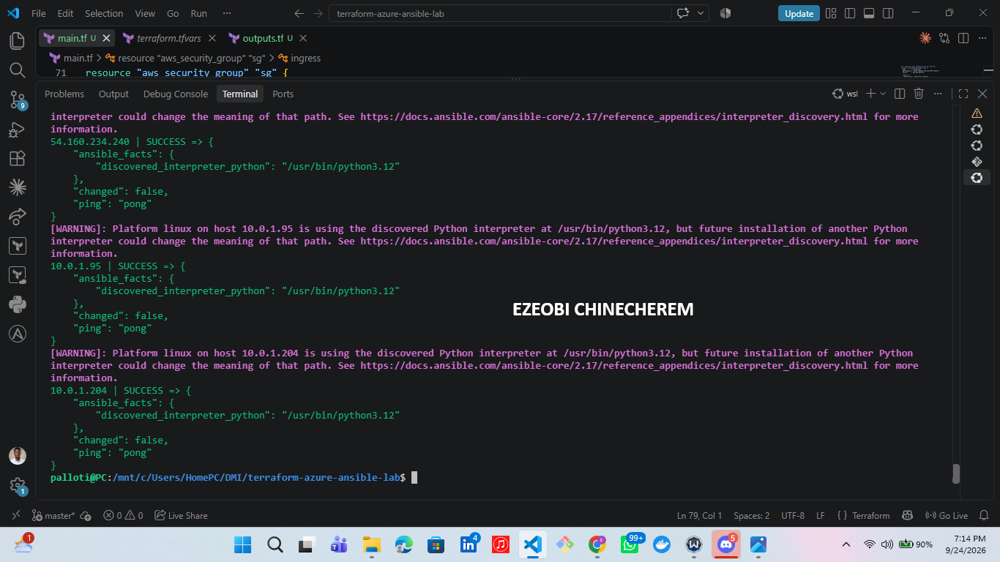

---

#### Screenshot 13 — Output of `ansible all -i inventory.ini -m command -a "uptime"`

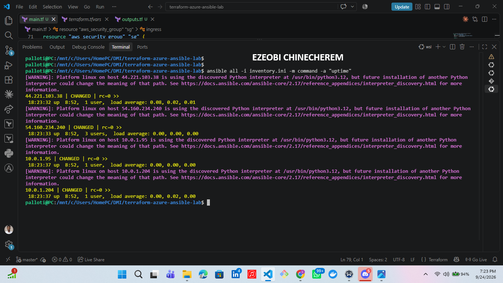

---

#### Screenshot 14 — Output of `ansible web -i inventory.ini -m apt -a "name=nginx state=present update_cache=yes" --become`

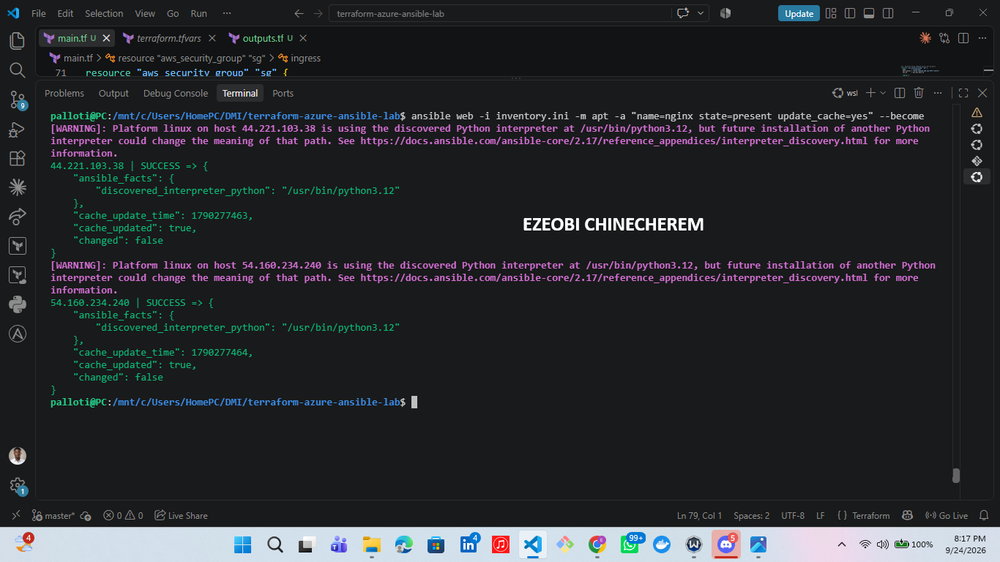

---

#### Screenshot 15 — Output of `ansible web -i inventory.ini -m service -a "name=nginx state=started enabled=yes" --become`

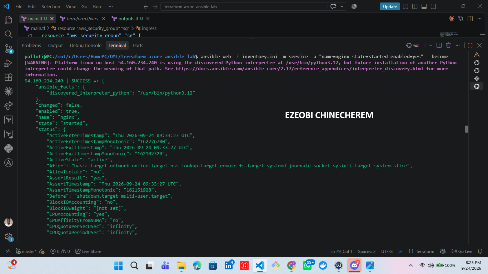

---

#### Screenshot 16 — Output of `ansible all -i inventory.ini -m apt -a "name=htop state=present update_cache=yes" --become`

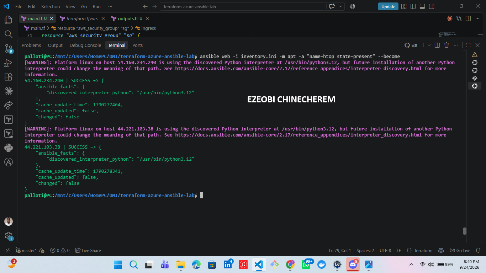

---

#### Screenshot 17 — Output of `ansible web -i inventory.ini -m command -a "systemctl is-active nginx"`

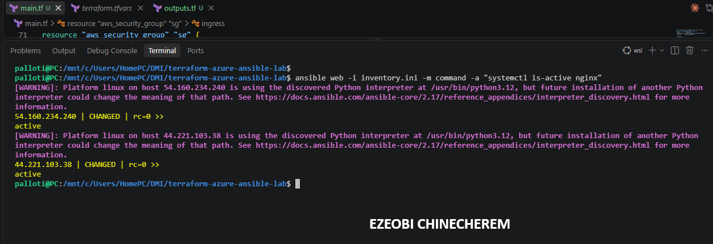

---

### Notes

Executed an Ansible ad-hoc command targeting the web group to verify runtime service health, confirming that Nginx is actively running (is-active) across all provisioned public web instances.

---

# LinkedIn Post Required

## Evidence

#### LinkedIn Post URL

Paste your LinkedIn post URL here:

https://lnkd.in/p/ezT-CbEA

---

#### Screenshot — Published LinkedIn post

---

# Assignment Questions

Answer the following in your own words:

**1. What is the purpose of an Ansible inventory file?**

An Ansible inventory file defines and organizes the managed nodes (servers and hosts) that your control node will connect to, manage, and configure.

Specifically, its key purposes include:

* **Host Grouping:** Organizing your infrastructure into logical groups and tiers—such as `web`, `app`, and `db`—so you can target specific sets of servers with your playbooks.

* **Connection Routing & Variables:** Mapping out connection details like public IP addresses, private IP addresses, SSH keys, ports, and proxy configurations (such as `ProxyJump`) required to safely reach and authenticate with your instances.

---

**2. What is the difference between the `web`, `app`, and `db` groups in your inventory?**

The `web`, `app`, and `db` groups in your inventory represent the distinct functional tiers of your multi-tier cloud architecture, separating servers based on their network exposure, security boundaries, and operational roles:

* **`web` Group (Public Tier):**
* Consists of public-facing web servers (such as Nginx instances) deployed in public subnets with direct access or Elastic IPs.
* Acts as the entry point for incoming user traffic and serves static or frontend application content.

* **`app` Group (Private Tier / Application Layer):**
* Comprises internal application servers (such as backend Node.js processes) hosted securely in private subnets.
* They are isolated from the public internet and are typically accessed via secure SSH proxy jumping through the public web tier.

* **`db` Group (Private Tier / Database Layer):**
* Houses database instances (such as Amazon RDS MySQL) dedicated strictly to backend data storage and persistence.
* Like the app tier, they reside in private subnets with maximum isolation, only accepting connections from authorized internal services.

---

**3. What does the Ansible `ping` module verify?**

The Ansible `ping` module verifies that the control node can successfully connect, authenticate, and communicate with the managed nodes (servers), and that a working Python environment is present on the remote host. It is primarily used to test basic SSH reachability and ensure the target servers are ready to receive playbook commands.

---

**4. Why do package installation commands require `--become`?**

Package installation commands require `--become` (privilege escalation, typically running as `sudo` or `root`) because package managers like `apt`, `yum`, or `dnf` need to modify protected, system-wide directories.

Specifically, privilege escalation is necessary because:

* **System-Level Changes:** Installing software writes binaries to system paths (like `/usr/bin` or `/usr/sbin`), modifies configuration files in `/etc`, and creates system services. Standard users lack write permissions to these directories.
* **Service Control:** Package managers often automatically enable and start system services (such as Nginx), which requires administrative permissions to interact with the underlying system and service manager (`systemctl`).

Using `--become` allows Ansible to temporarily elevate permissions to `root` so these system-level modifications can execute safely and successfully.

---

**5. When would you use an ad-hoc command instead of a playbook?**

You would use an Ansible ad-hoc command instead of a playbook when you need to perform a **quick, one-off, or emergency administrative task** where writing and maintaining a full YAML playbook file would be unnecessary overhead.

Common scenarios include:

* **Quick Status Checks & Troubleshooting:** Quickly checking if a service is running, verifying disk space, or running a quick connectivity test across your server inventory.
* **Emergency Fixes:** Applying a rapid, urgent patch or restarting a service across multiple servers simultaneously without waiting to author a structured playbook.
* **Ad-hoc File Transfers or Management:** Quickly copying a single file, checking log contents, or managing a user account on the fly.
* **Gathering Quick Facts:** Pulling system information or package versions across a fleet instantly from the command line.

**Rule of thumb:** If you only need to run a single command once or troubleshoot an active issue right now, use an **ad-hoc command**. If the task is repeatable, multi-step, or part of a continuous deployment pipeline (like provisioning, configuring, and verifying a web server), use a **playbook**.

---

**6. What is one challenge you faced while setting up SSH or inventory, and how did you fix it?**

* **Challenge:** When setting up SSH connectivity to the managed servers, I encountered "No route to host" errors and `REMOTE HOST IDENTIFICATION HAS CHANGED` warnings caused by AWS dynamically reusing IP addresses.
* **Fix:** I cleared the outdated IP fingerprints from my local machine using `ssh-keygen -R` and updated the `inventory.ini` file with the correct active IP addresses retrieved from `terraform output`. I also explicitly defined the `ansible_ssh_private_key_file` parameter within the inventory's `[all:vars]` block to ensure secure, passwordless authentication across the host groups.

---

# Required Files

Confirm that the following files are included in your assignment workspace:

- [ ] `ansible-adhoc-lab/README.md`
- [ ] `ansible-adhoc-lab/terraform/providers.tf`
- [ ] `ansible-adhoc-lab/terraform/main.tf`
- [ ] `ansible-adhoc-lab/terraform/variables.tf`
- [ ] `ansible-adhoc-lab/terraform/outputs.tf`
- [ ] `ansible-adhoc-lab/ansible/inventory.ini`
- [ ] Updated `.gitignore`

---

# Submission Instructions

- Add all required screenshots from the tasks.
- Full Name must be visible in required screenshots.
- Mention whether you used Azure or AWS.
- Mention whether you used the three-VM option or four-VM option.
- Add the public IP addresses of the VMs, redacted if preferred.
- Add your `inventory.ini` proof.
- Add a short explanation of what you learned.
- Answer all assignment questions clearly in your own words.
- Add your LinkedIn post URL.
- Do not expose SSH private keys, Terraform state files, cloud credentials, passwords, access keys, secret keys, account IDs, or subscription IDs.

---

# Completion Checklist

- [ ] Task 1: `ansible-adhoc-lab` project structure created
- [ ] Task 1: `.gitignore` updated for Terraform files
- [ ] Task 2: Terraform configuration created
- [ ] Task 2: Server roles defined for either three or four VMs
- [ ] Task 2: `count` or `for_each` used
- [ ] Task 2: SSH restricted to the controller public IP
- [ ] Task 2: HTTP allowed only for web hosts
- [ ] Task 2: Terraform output maps roles to public IPs
- [ ] Task 3: Terraform initialized successfully
- [ ] Task 3: Terraform configuration validated
- [ ] Task 3: Terraform apply completed successfully
- [ ] Task 3: All selected VMs are running
- [ ] Task 4: SSH key-based access works for every VM
- [ ] Task 5: `inventory.ini` contains `web`, `app`, and `db` groups
- [ ] Task 5: `ansible-inventory -i inventory.ini --graph` shows the correct groups
- [ ] Task 6: `ansible all -i inventory.ini -m ping` returns `SUCCESS`
- [ ] Task 6: Ad-hoc commands run successfully
- [ ] Task 6: `--become` was used for package and service tasks
- [ ] Task 6: Nginx is active on the `web` group
- [ ] Screenshots 1–17 are included
- [ ] Assignment questions are answered
- [ ] LinkedIn post published
- [ ] LinkedIn post URL added
- [ ] No sensitive information is exposed

---

## About DMI & CloudAdvisory

DevOps Micro Internship (DMI) is a project-based DevOps program run by Pravin Mishra and The CloudAdvisory, focused on real-world execution, systems thinking, and career readiness.

It helps learners build strong DevOps foundations with hands-on experience.

---

## Resources

- DMI Official Website: [https://dmi.pravinmishra.com?utm_source=github&utm_medium=readme](https://dmi.pravinmishra.com?utm_source=github&utm_medium=readme)
- University: [https://university.pravinmishra.com?utm_source=github&utm_medium=readme](https://university.pravinmishra.com?utm_source=github&utm_medium=readme)
- Discord Community: [https://discord.pravinmishra.com?utm_source=github&utm_medium=readme](https://discord.pravinmishra.com?utm_source=github&utm_medium=readme)
- Blog: [https://dmi.pravinmishra.com/blog?utm_source=github&utm_medium=readme](https://dmi.pravinmishra.com/blog?utm_source=github&utm_medium=readme)
- YouTube Playlist: [https://www.youtube.com/playlist?list=PLFeSNDtI4Cho](https://www.youtube.com/playlist?list=PLFeSNDtI4Cho)
- Pravin Mishra LinkedIn: [https://www.linkedin.com/in/pravin-mishra-aws-trainer/](https://www.linkedin.com/in/pravin-mishra-aws-trainer/)
- CloudAdvisory LinkedIn: [https://www.linkedin.com/company/thecloudadvisory/](https://www.linkedin.com/company/thecloudadvisory/)

---

*This submission is part of DevOps Micro Internship (DMI) — Agentic AI Track.*