# Assignment 03 — Deploy a Static Website to Multiple Servers Using a Multi-Play Ansible Playbook

Part of the DevOps Micro Internship (DMI) with Agentic AI

---

## Student Details

**Full Name:** EZEOBI CHINECHEREM
**Cloud Platform Used:** AWS 
**Server 1 URL:** http://3.213.51.38
**Server 2 URL:** http://100.30.95.58

---

## Purpose

In this assignment, you will create a multi-play Ansible playbook to install Nginx, deploy a static website to two Ubuntu servers, and verify that the website is accessible from both servers.

You may use either AWS EC2 instances or Azure Virtual Machines as your managed servers.

---

# Task 1 — Create the Project Structure

## Goal

Create the required folders and files for the Ansible project.

## Evidence

### Screenshot 1 — Terminal or VS Code showing the complete `static-web` project structure

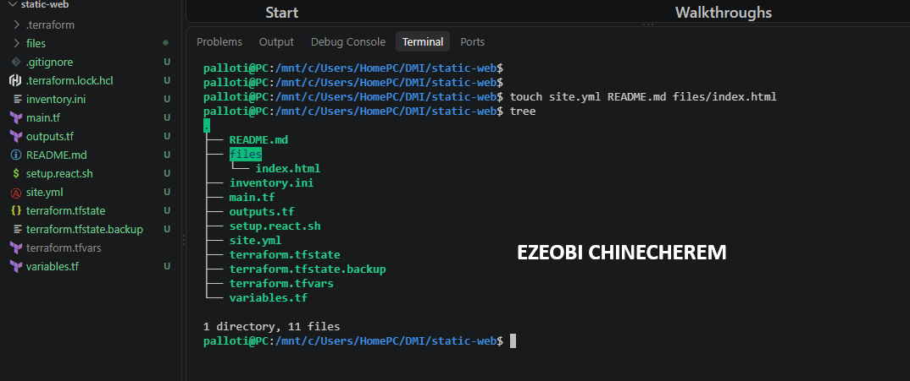

---

# Task 2 — Configure the Ansible Inventory

## Goal

Add both Ubuntu servers to the Ansible inventory.

## Evidence

### Screenshot 2 — Output of `ansible-inventory -i inventory.ini --graph` showing `web1` and `web2`

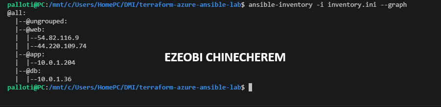

---

## Configuration File

Copy and paste the complete contents of your `inventory.ini` file below:

[web]
3.213.51.38
100.30.95.58

[app]
10.0.1.34

[db]
10.0.1.244

[app:vars]
ansible_ssh_common_args='-o ProxyJump=ubuntu@3.213.51.38 -o ForwardAgent=yes'

[db:vars]
ansible_ssh_common_args='-o ProxyJump=ubuntu@3.213.51.38 -o ForwardAgent=yes'

[all:vars]
ansible_user=ubuntu
ansible_ssh_private_key_file=/home/palloti/.ssh/terraform-aws-vm-key
ansible_ssh_extra_args='-o StrictHostKeyChecking=no'

---

# Task 3 — Verify Ansible Connectivity

## Goal

Confirm that the Ansible controller can connect to both servers.

## Evidence

### Screenshot 3 — Ansible ping output showing `SUCCESS` and `pong` for both servers

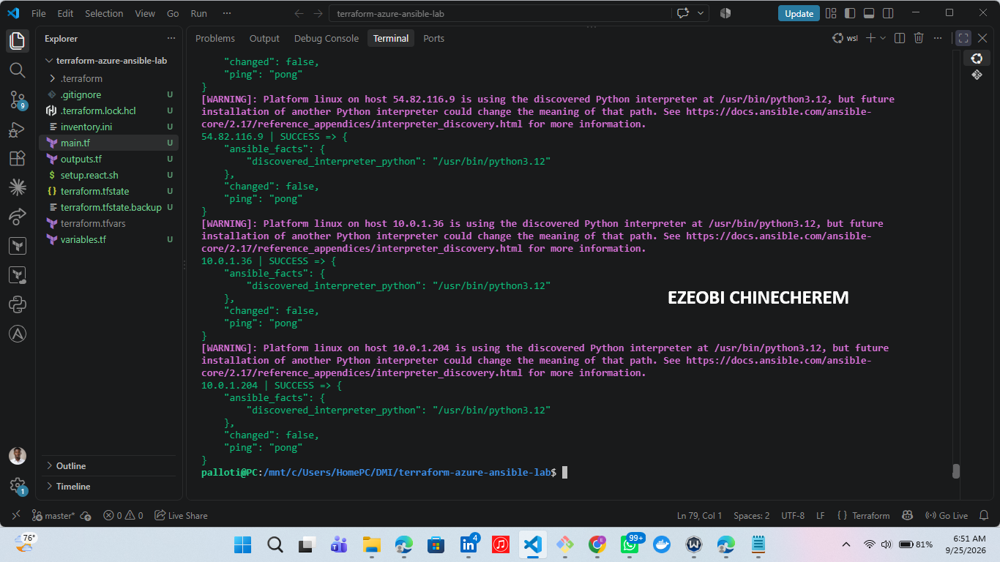

---

# Task 4 — Download and Personalize the Static Website

## Goal

Download `index.html` to the Ansible controller and personalize the website with your full name.

## Evidence

### Screenshot 4 — Edited `files/index.html` showing the footer line with your full name

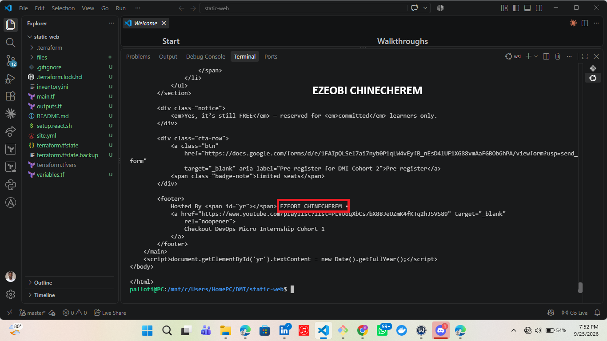

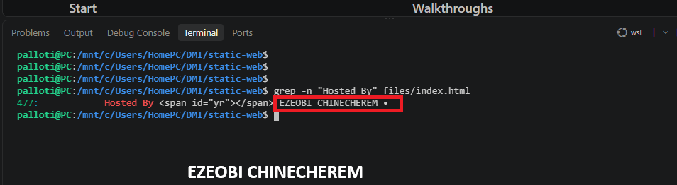

---

# Task 5 — Create the Multi-Play Ansible Playbook

## Goal

Create a single Ansible playbook containing separate plays for installation, deployment, and verification.

## Configuration File

Copy and paste the complete contents of your `site.yml` file below:

---
- name: Install and configure Nginx
  hosts: web
  become: true
  tasks:
    - name: Update the APT package cache
      ansible.builtin.apt:
        update_cache: true

    - name: Install Nginx
      ansible.builtin.apt:
        name: nginx
        state: present

    - name: Start and enable Nginx
      ansible.builtin.service:
        name: nginx
        state: started
        enabled: true

- name: Deploy the static website
  hosts: web
  become: true
  tasks:
    - name: Copy index.html to the web root
      ansible.builtin.copy:
        src: files/index.html
        dest: /var/www/html/index.html
        owner: www-data
        group: www-data
        mode: "0644"
      notify: Reload nginx

  handlers:
    - name: Reload nginx
      ansible.builtin.service:
        name: nginx
        state: reloaded

- name: Verify both websites from each server
  hosts: web
  gather_facts: false
  tasks:
    - name: Send an HTTP GET request to the web server
      ansible.builtin.uri:
        url: "http://{{ inventory_hostname }}"
        status_code: 200
      register: website_check

    - name: Confirm the server returned HTTP 200
      ansible.builtin.assert:
        that:
          - website_check.status == 200
        success_msg: "{{ inventory_hostname }} successfully returned HTTP 200"

---

# Task 6 — Validate the Playbook Syntax

## Goal

Check the playbook for YAML or Ansible syntax errors before running it.

## Evidence

### Screenshot 5 — Successful syntax-check output showing `playbook: site.yml`

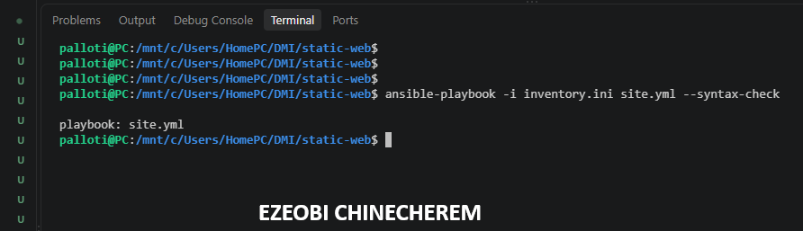

---

# Task 7 — Run the Multi-Play Playbook

## Goal

Install Nginx, deploy the website, and verify both servers in one playbook run.

## Evidence

### Screenshot 6 — Play 3 verification showing HTTP `200` for both servers

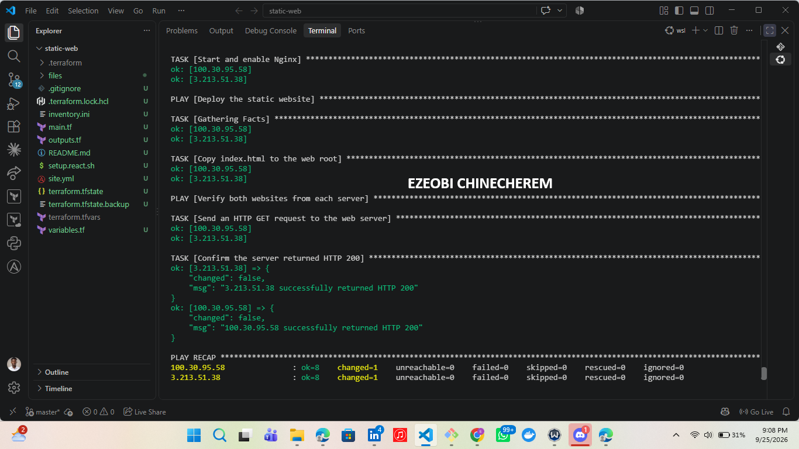

---

### Screenshot 7 — Final play recap showing `unreachable=0` and `failed=0` for `web1`, `web2`, and `localhost`

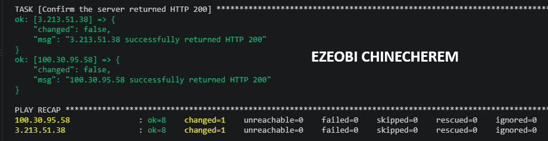

---

# Task 8 — Verify Idempotency

## Goal

Run the playbook again and confirm that it does not make unnecessary changes.

## Evidence

### Screenshot 8 — Second playbook run showing the play recap with `changed=0`, `unreachable=0`, and `failed=0` for both web servers

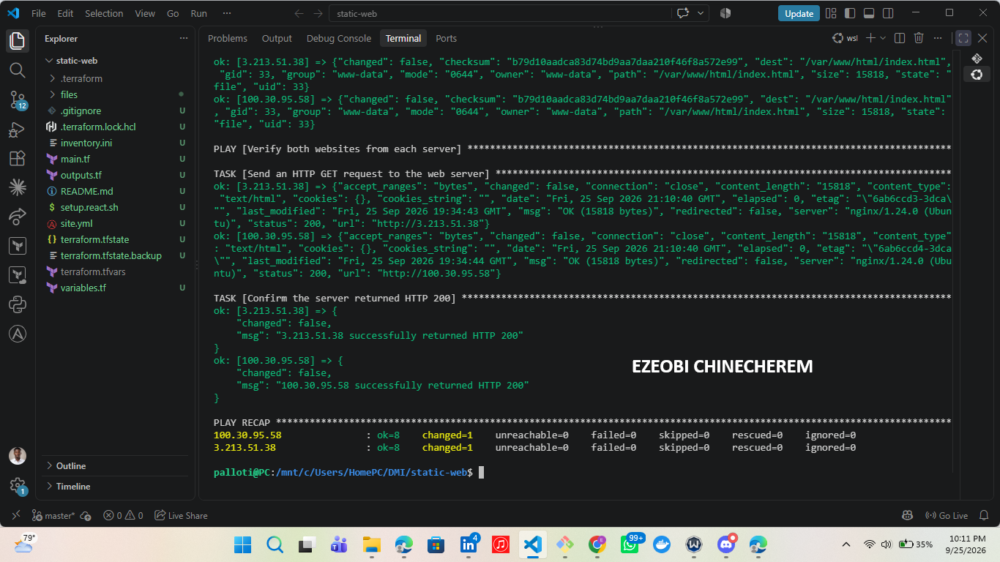

---

# Task 9 — Test Both Websites Manually

## Goal

Confirm that the static website is accessible from both public IP addresses.

## Evidence

### Screenshot 9 — `curl -I` output showing HTTP `200 OK` from both servers

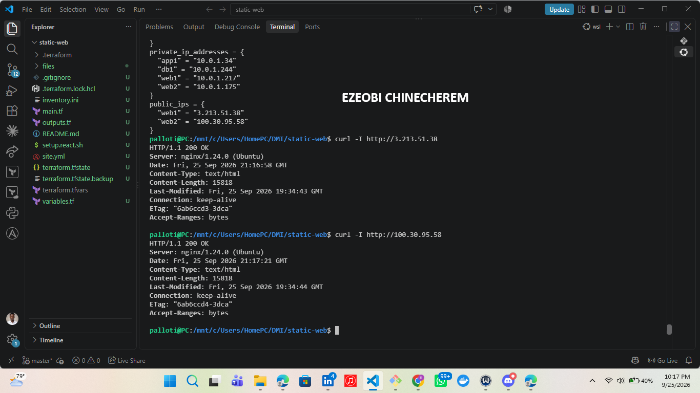

---

### Screenshot 10 — Browser showing the website from Server 1 with the public IP and your full name visible

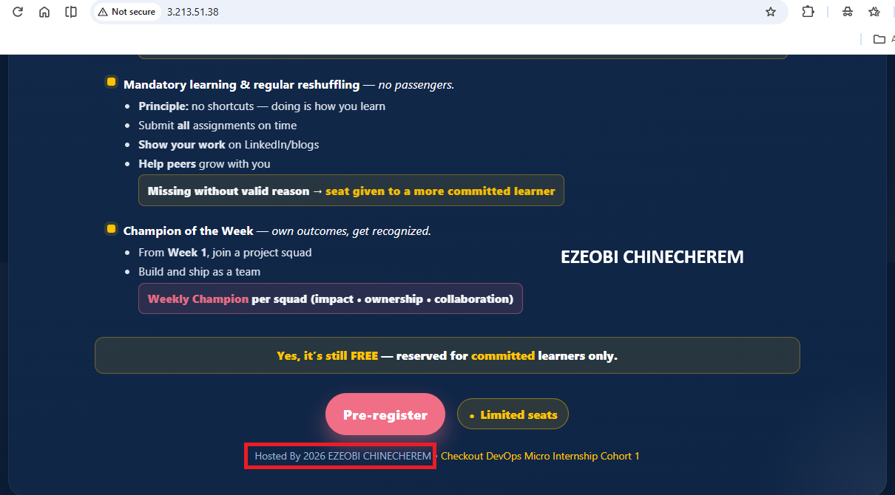

---

### Screenshot 11 — Browser showing the website from Server 2 with the public IP and your full name visible

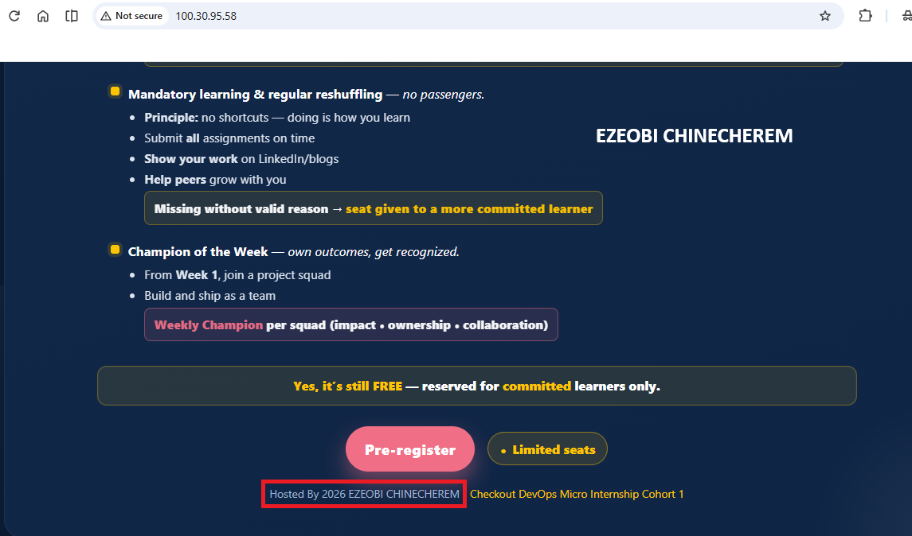

---

## Website URLs

Add both deployed website URLs below:

Server 1: http://3.213.51.38
Server 2: http://100.30.95.58

---

# Task 10 — Complete the Project README

## Goal

Document how the project works and record what you learned.

## README Content

Copy and paste the complete contents of your `README.md` file below:

# Terraform AWS Multi-Tier Web & Infrastructure Lab

A modular cloud infrastructure and configuration management project designed to provision a secure, multi-tier web application architecture on Amazon Web Services using **Terraform** and **Ansible**.

---

## Architecture Overview

* **Public Tier (Web):** Hosts public-facing web servers (`web1` and `web2`) running Nginx behind Elastic IP addresses.

* **Private Tier (App & DB):** Houses private application (`app1`) and database (`db1`) instances isolated in private subnets, accessible exclusively via secure SSH proxy jumping through the public web tier.

* **Automation & Configuration:** Automated resource provisioning via Terraform Infrastructure as Code (IaC) and system-level configuration, service deployments, and health verifications managed through Ansible playbooks.

---

## Project Directory Structure

text
├── .terraform/               # Provisioned Terraform providers and backend plugins
├── files/                    # Static assets (e.g., index.html web root content)
├── inventory.ini             # Dynamic Ansible inventory mapping public/private hosts and ProxyJump rules
├── main.tf                   # Core Terraform resource definitions (VPCs, subnets, EC2 instances, security groups)
├── outputs.tf                # Terraform outputs exposing public and private IP maps
├── variables.tf              # Input variables for region, instance types, and networking parameters
├── terraform.tfvars          # Environment-specific variable assignments
├── site.yml                  # End-to-end Ansible automation playbook
└── README.md                 # Project documentation

---

## Prerequisites

Ensure the following tools are installed in your local development environment (e.g., WSL Ubuntu):

* **Terraform** (v1.x+)
* **Ansible** (v2.x+)
* **AWS CLI** (configured with appropriate credentials and region access)
* An active SSH private key matching your configured AWS key pair (e.g., `~/.ssh/terraform-aws-vm-key`)

---

## Deployment & Setup Instructions

### Step 1: Provision Cloud Infrastructure with Terraform

Initialize and apply the Terraform configuration to build out your AWS VPC, subnets, security groups, and EC2 instances:

bash
terraform init
terraform plan
terraform apply

### Step 2: Configure Ansible Inventory

Verify your dynamic deployment outputs using Terraform:

bash
terraform output

Update your `inventory.ini` file to ensure the public IP addresses of your web servers and private IP addresses of your application/database tiers match your current `terraform output` results.

### Step 3: Run the Ansible Playbook

Execute the automation playbook to configure Nginx, deploy the static website files, and run health validations across your server fleet:

bash
ansible-playbook -i inventory.ini site.yml

---

## Verification & Maintenance

* **Check Inventory Graph:** Verify host group mappings and relationships using:
bash
ansible-inventory -i inventory.ini --graph

* **Test Connectivity:** Run an ad-hoc ping to confirm reachability across your web tier:
bash
ansible web -i inventory.ini -m ping

---

# LinkedIn Post Required

## Evidence

### LinkedIn Post URL

Paste your LinkedIn post URL here:

https://lnkd.in/p/ezT-CbEA

---

### Screenshot — Published LinkedIn post

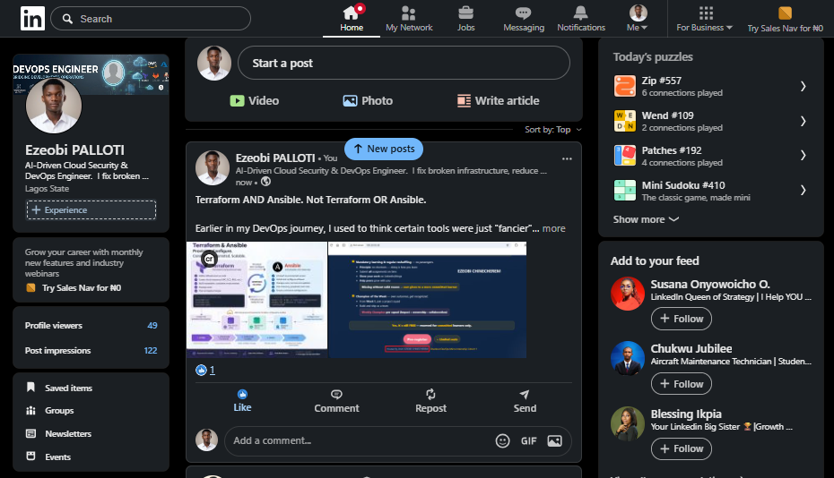

---

# Assignment Questions

Answer the following in your own words:

**1. What issue did you face while completing this assignment, and how did you fix it?**

1. Safely Migrating Terraform State
Issue: I needed to move my working project files into a new static-web directory. However, attempting to move the active directory into a subdirectory of itself caused a "Permission denied" error, and I wanted to avoid running terraform destroy just to reorganize my folders.

Fix: Instead of tearing down the running AWS infrastructure, I migrated the workspace by carefully copying all configuration files along with the hidden .terraform directory and terraform.tfstate files. Running terraform plan in the new directory confirmed the state was intact, stating "No changes," which saved significant provisioning time.

2. Ansible Inventory and SSH Connectivity
Issue: When initially testing server connectivity using Ansible, I encountered "No route to host" errors and REMOTE HOST IDENTIFICATION HAS CHANGED warnings due to AWS dynamically reusing IPs.

Fix: I cleared the old IP fingerprints from my local machine using ssh-keygen -R. Then, I updated my inventory.ini file to include the correct active IPs from terraform output and explicitly defined the ansible_ssh_private_key_file in the [all:vars] block to ensure secure, passwordless authentication.

3. Playbook Variable Scoping & Execution
Issue: During the final playbook task to verify the website's HTTP 200 status, I encountered an "undefined variable" error for ansible_host. This occurred because the play was targeting localhost, which doesn't natively possess the inventory variables of the web servers.

Fix: I refactored the site.yml playbook to target the web group directly instead of localhost. By utilizing the inventory_hostname variable within the uri module, Ansible successfully iterated through the actual web servers. This also ensured the playbook was fully idempotent, reporting zero unintended changes on subsequent runs.

---

**2. What did you learn from this assignment?**

➡️ The Synergy of Infrastructure as Code (IaC) and Configuration Management: You gained hands-on experience understanding that Terraform and Ansible are complementary rather than competing. Terraform successfully provisions and manages cloud infrastructure (such as VPCs, subnets, and EC2 instances), while Ansible takes over for system configuration and post-deployment validation.

➡️ State Continuity and Directory Management: You learned how Terraform tracks infrastructure through state files (terraform.tfstate) rather than local directory names, enabling you to safely migrate project files into a new workspace (static-web) without needing to destroy or recreate running cloud resources.   

➡️ Network Automation & Dynamic Inventories: You mastered mapping multi-tier architectures (Web, App, and Database tiers) using an inventory.ini file, managing SSH proxy jumps (ProxyJump), and handling secure key-based authentication.   Playbook Optimization & Idempotency: You learned how to structure Ansible plays to target specific host groups (using inventory_hostname instead of querying from localhost), ensuring your automation scripts are robust, error-free, and fully idempotent.   

---

**3. Why is it useful to split installation, deployment, and verification into separate plays?**

➡️ Clear Separation of Concerns: Each play has a distinct, single responsibility—such as installing base packages, deploying application code, or running health verifications. This makes your automation code much easier to read, debug, and maintain.  

➡️ Controlled Execution Flow: Different stages often require different execution contexts. For instance, package installation and file copying require become: true (root privileges), whereas verifying web responses or running API checks can often run safely as a standard user without privilege escalation. Separating them allows you to apply permissions precisely where needed.   
 
➡️ Targeted Host Scoping: Different plays can target different tiers of your infrastructure. You can run installation and deployment plays against your web or app groups, while verification or monitoring plays can be targeted specifically where they make the most sense (like checking endpoints per server or from a dedicated controller).   Easier Troubleshooting & Idempotency: If a playbook fails, having distinct plays helps you instantly pinpoint whether the failure happened during package installation, file synchronization, or final validation, allowing you to re-run or debug that specific phase without guessing.

---

**4. What is one benefit of using the Ansible `copy` module instead of cloning the website directly from Git on every managed server?**

Using the Ansible `copy` module to distribute static website files from a central source (or a local staging directory) instead of cloning from Git directly on every managed server offers a major operational benefit: **it ensures consistent, uniform artifacts across all servers without relying on external network calls or local git credentials on production nodes.**

Specifically:

* **Controlled Artifacts:** Pushing pre-built files ensures that every web server receives the exact same tested code version, avoiding discrepancies caused by divergent branch states, missing dependencies, or uncommitted changes on individual nodes.
* **Security & Simplicity:** It removes the need to store sensitive Git personal access tokens or deploy keys on production web servers, minimizing your security attack surface.
* **Speed & Reliability:** It bypasses the overhead of cloning repositories and handling merge conflicts on production machines, making deployments faster and more deterministic.

---

**5. What does idempotency mean in this assignment?**

In this assignment, **idempotency** means that you can run your Ansible playbook multiple times in a row, and if no changes have been made to your code or server configuration, the system state remains completely stable with **zero unintended changes** (`changed=0`) on repeat runs.

In practical terms for your project:

* **Predictable Automation:** An idempotent task (like ensuring Nginx is installed or an HTML file is copied) checks the current state of the server first. If the file or service is already in the desired state, Ansible safely skips modifying it.
* **Why it matters:** It ensures your automation scripts are safe to run repeatedly in production without risking accidental downtime, config drifts, or unnecessary service reloads.

---

**6. What does the Ansible `uri` module verify in Play 3?**

In Play 3 of your Ansible playbook, the `uri` module verifies that the web server is actively responding to HTTP requests by sending an HTTP GET request to each server and confirming that it successfully returns a standard HTTP status code of `200` (OK).

---

# Required Files

Confirm that the following files are included in your assignment folder:

- [ ] `inventory.ini`
- [ ] `site.yml`
- [ ] `files/index.html`
- [ ] `README.md`

---

# Submission Instructions

- Add all required screenshots in the correct order.
- Full Name must be visible in required screenshots.
- Include both deployed website URLs.
- Paste `inventory.ini`, `site.yml`, and `README.md` as editable text.
- Answer all assignment questions clearly in your own words.
- Add your LinkedIn post URL.
- Do not expose SSH private keys, passwords, cloud account IDs, or other sensitive information.

---

# Completion Checklist

- [ ] Task 1: `static-web` folder structure is complete
- [ ] Task 2: Both servers are listed under the `[web]` group in `inventory.ini`
- [ ] Task 2: Inventory graph shows `web1` and `web2`
- [ ] Task 3: Ansible ping returns `SUCCESS` and `pong` for both servers
- [ ] Task 4: `files/index.html` contains your full name
- [ ] Task 5: `site.yml` contains three separate plays
- [ ] Task 5: Play 1 installs, starts, and enables Nginx
- [ ] Task 5: Play 2 deploys `index.html` using the `copy` module
- [ ] Task 5: Nginx reload handler is included
- [ ] Task 5: Play 3 verifies both web servers from the controller
- [ ] Task 6: Playbook syntax check passes
- [ ] Task 7: First playbook run completes with `unreachable=0` and `failed=0`
- [ ] Task 7: URI verification returns HTTP `200` for both servers
- [ ] Task 8: Second playbook run demonstrates idempotency
- [ ] Task 8: Second run shows `changed=0` for both web servers
- [ ] Task 9: Both `curl -I` commands return HTTP `200 OK`
- [ ] Task 9: Website loads from Server 1
- [ ] Task 9: Website loads from Server 2
- [ ] Task 9: Full name is visible on both deployed websites
- [ ] Task 10: `README.md` contains all required explanations
- [ ] Screenshots 1–11 are included
- [ ] `inventory.ini`, `site.yml`, and `README.md` are pasted as editable text
- [ ] Both website URLs are included
- [ ] Assignment questions are answered
- [ ] LinkedIn post published
- [ ] LinkedIn post URL added
- [ ] No sensitive information is exposed

---

## About DMI & CloudAdvisory

DevOps Micro Internship (DMI) is a project-based DevOps program run by Pravin Mishra and The CloudAdvisory, focused on real-world execution, systems thinking, and career readiness.

It helps learners build strong DevOps foundations with hands-on experience.

---

## Resources

- DMI Official Website: [https://dmi.pravinmishra.com?utm_source=github&utm_medium=readme](https://dmi.pravinmishra.com?utm_source=github&utm_medium=readme)
- University: [https://university.pravinmishra.com?utm_source=github&utm_medium=readme](https://university.pravinmishra.com?utm_source=github&utm_medium=readme)
- Discord Community: [https://discord.pravinmishra.com?utm_source=github&utm_medium=readme](https://discord.pravinmishra.com?utm_source=github&utm_medium=readme)
- Blog: [https://dmi.pravinmishra.com/blog?utm_source=github&utm_medium=readme](https://dmi.pravinmishra.com/blog?utm_source=github&utm_medium=readme)
- YouTube Playlist: [https://www.youtube.com/playlist?list=PLFeSNDtI4Cho](https://www.youtube.com/playlist?list=PLFeSNDtI4Cho)
- Pravin Mishra LinkedIn: [https://www.linkedin.com/in/pravin-mishra-aws-trainer/](https://www.linkedin.com/in/pravin-mishra-aws-trainer/)
- CloudAdvisory LinkedIn: [https://www.linkedin.com/company/thecloudadvisory/](https://www.linkedin.com/company/thecloudadvisory/)

---

*This submission is part of DevOps Micro Internship (DMI) — Agentic AI Track.*