# Assignment 04 — Deploy Mini Finance on Azure Using Terraform and Ansible

Part of the DevOps Micro Internship (DMI) with Agentic AI

---

## Purpose

In this assignment, you will provision Azure infrastructure using Terraform and deploy the Mini Finance website using an Ansible multi-play playbook.

Terraform will create the Azure Virtual Machine and networking resources. Ansible will install Nginx, clone the Mini Finance repository, deploy the website, and verify the deployment.

---

# Task 1 — Create the Project Structure

## Goal

Create separate directories and files for the Terraform infrastructure and Ansible configuration.

### Evidence

#### Screenshot 1 — Terminal or VS Code showing the complete `mini-finance` project structure

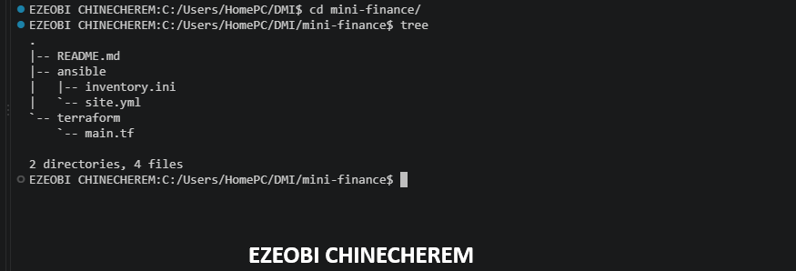

---

### Notes

mini-finance/
├── ansible/
│   ├── ansible.cfg
│   ├── inventory.ini
│   └── site.yml
├── terraform/
│   ├── .terraform/
│   ├── .terraform.lock.hcl
│   ├── main.tf
│   ├── output.tf
│   ├── setup.react.sh
│   ├── terraform.tfstate
│   ├── terraform.tfstate.backup
│   └── variable.tf
├── .gitignore
└── README.md

---

# Task 2 — Create the Azure Infrastructure Using Terraform

## Goal

Use Terraform to provision an Ubuntu Virtual Machine with the required Azure networking and security resources.

### Evidence

#### Screenshot 2 — Terraform code showing the `Allow-SSH` rule for port `22` and the `Allow-HTTP` rule for port `80`

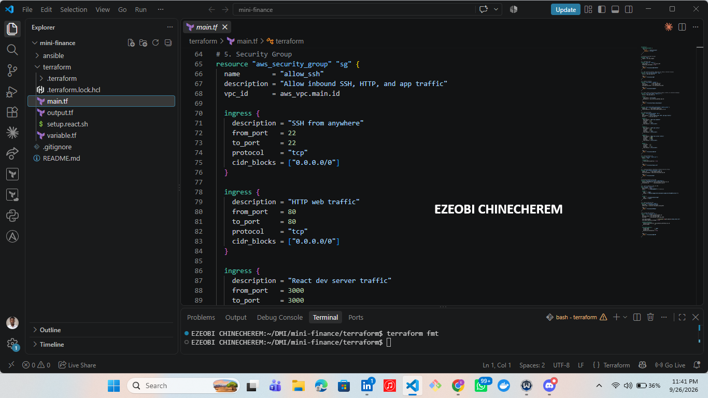

---

#### Screenshot 3 — Terraform code showing the association between `nsg-mini-finance` and `nic-mini-finance`

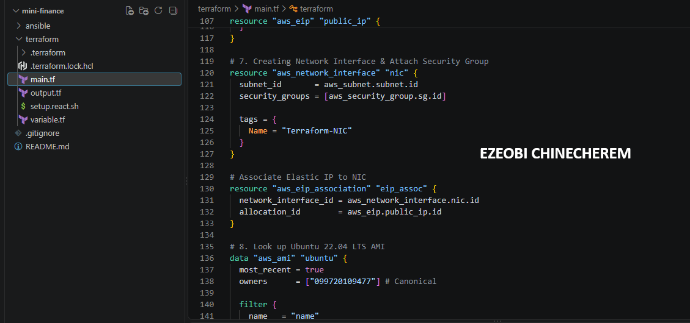

---

### Notes

NSG and NIC Association in Terraform
Task Objective: Associate the Network Security Group (nsg-mini-finance) with the Network Interface (nic-mini-finance) using Terraform to enforce security rules at the interface level.

Terraform Resource Implementation:

Terraform
resource "aws_network_interface_security_group_association" "nic_nsg_assoc" {
  network_interface_id   = aws_network_interface.nic_mini_finance.id
  security_group_id      = aws_security_group.nsg_mini_finance.id
}
Key Configuration Details:

Network Interface ID: References the unique identifier of the target NIC resource (aws_network_interface.nic_mini_finance.id).

Security Group ID: References the identifier of the configured security group (aws_security_group.nsg_mini_finance.id).

Outcome: Successfully binds the inbound and outbound firewall rules defined in the security group directly to the VM's network interface.

---

# Task 3 — Initialize and Apply the Terraform Configuration

## Goal

Format and validate the Terraform configuration, review the execution plan, and provision the Azure infrastructure.

### Evidence

#### Screenshot 4 — End of the `terraform apply` output showing `Apply complete!` with no errors

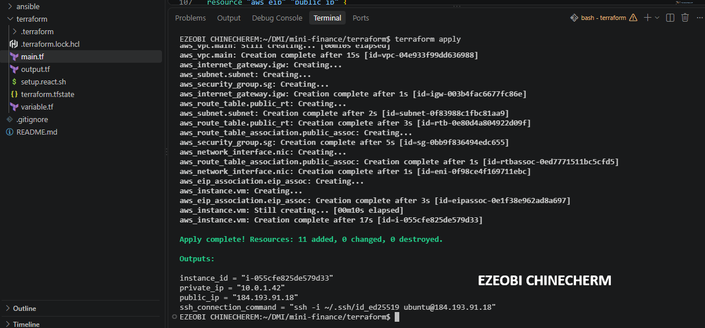

---

#### Screenshot 5 — Output of `terraform output public_ip` showing the VM’s public IP address

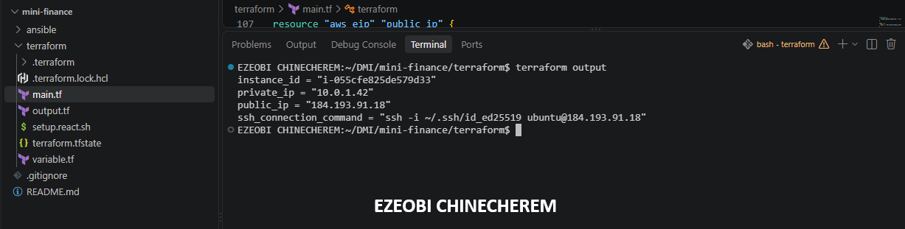


---

### Notes

Terraform Output Configuration for Public IP
Task Objective: Define and retrieve the public Elastic IP address of the provisioned AWS infrastructure using Terraform outputs for downstream configuration (such as Ansible inventory setup).

Terraform Output Implementation (output.tf):

Terraform
output "public_ip" {
  description = "The public Elastic IP address of the web server instance"
  value       = aws_eip.public_ip.public_ip
}
Execution & Retrieval:

Command: terraform output public_ip (executed within the terraform/ directory).

Result: Successfully extracts and outputs the assigned public IP address (184.193.91.18) from the active state file.

Outcome: Provided a direct, reliable reference point for connecting via SSH and configuring the Ansible inventory file (inventory.ini).

---

# Task 4 — Verify Passwordless SSH Access

## Goal

Confirm that the Ansible controller can connect to the Terraform-provisioned Azure VM using SSH key authentication.

### Evidence

#### Screenshot 6 — Passwordless SSH command and the returned `mini-finance` hostname

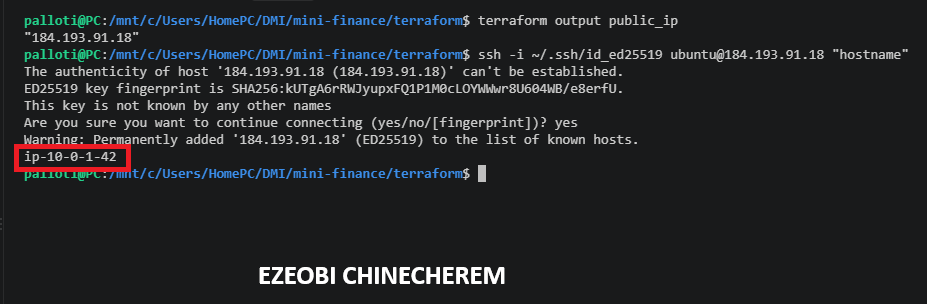

---

### Notes

Passwordless SSH Connection and Hostname Validation
Task Objective: Verify passwordless SSH authentication to the provisioned AWS Ubuntu EC2 instance using an ED25519 private key and query the remote host's hostname.

SSH Command Implementation:

Bash
ssh -i ~/.ssh/id_ed25519 ubuntu@184.193.91.18 "hostname"
Key Configuration Details:

Private Key: Utilizes the local ED25519 key (~/.ssh/id_ed25519) matching the public key provisioned during infrastructure deployment.

Remote User: Targets the standard AWS Ubuntu user (ubuntu).

Target IP: Connects directly to the static Elastic IP (184.193.91.18).

Remote Command: Executes "hostname" upon connection to verify active session responsiveness.

Outcome: Successfully authenticated without password prompts and returned the remote instance's internal hostname, confirming network routing, security group accessibility, and key-based SSH permissions are fully operational.

---

# Task 5 — Create the Ansible Inventory and Verify Connectivity

## Goal

Add the Terraform-provisioned Azure VM to the Ansible inventory and confirm that Ansible can connect to it.

### Evidence

#### Screenshot 7 — Ansible ping output showing `SUCCESS` and `pong` from the Azure VM

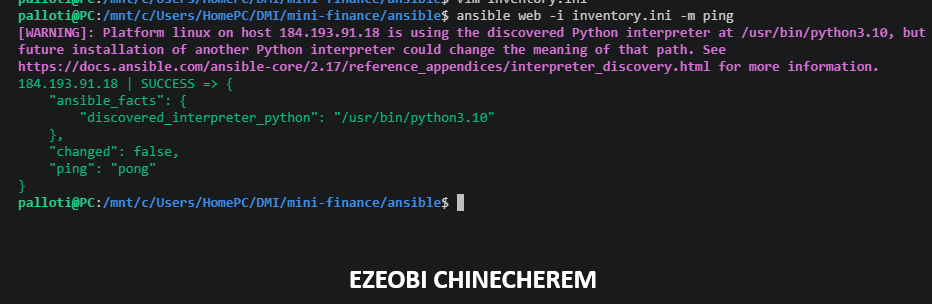

---

### Configuration File

Copy and paste the complete contents of your `ansible/inventory.ini` file below:

[web]
184.193.91.18
 
[web:vars]
ansible_user=ubuntu
ansible_ssh_private_key_file=~/.ssh/id_ed25519
---

# Task 6 — Create the Multi-Play Ansible Playbook

## Goal

Create one Ansible playbook containing separate plays to install Nginx, deploy the Mini Finance website, and verify the deployment.

### Evidence

#### Screenshot 8 — `site.yml` showing Play 1 and the beginning of Play 2

Screenshot must show:

- Play 1 targeting the `web` group
- Installation of `nginx`, `git`, and `rsync`
- Nginx service configured as started and enabled
- Beginning of Play 2 with the Git repository URL and synchronization task

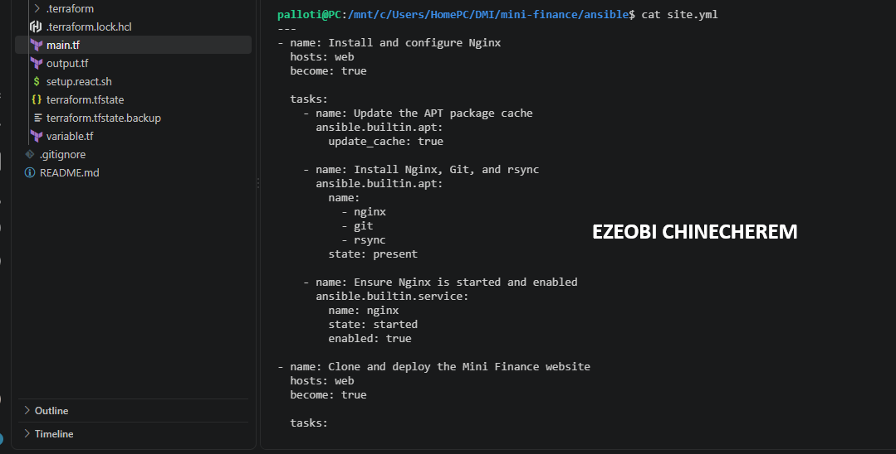

---

#### Screenshot 9 — `site.yml` showing the deployment destination, handler, and Play 3 verification

Screenshot must show:

- Website destination `/var/www/html/`
- Ownership set to `www-data:www-data`
- Nginx reload handler
- Play 3 targeting `localhost`
- The `uri` verification and `assert` condition

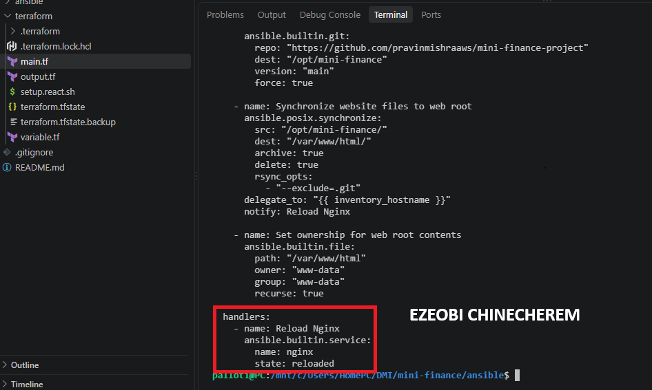

---

### Configuration File

Copy and paste the complete contents of your `ansible/site.yml` file below:


[web]
184.193.91.18
 
[web:vars]
ansible_user=ubuntu
ansible_ssh_private_key_file=~/.ssh/id_ed25519
palloti@PC:/mnt/c/Users/HomePC/DMI/mini-finance/ansible$ cat site.yml 
---
- name: Install and configure Nginx
  hosts: web
  become: true

  tasks:
    - name: Update the APT package cache
      ansible.builtin.apt:
        update_cache: true

    - name: Install Nginx, Git, and rsync
      ansible.builtin.apt:
        name:
          - nginx
          - git
          - rsync
        state: present

    - name: Ensure Nginx is started and enabled
      ansible.builtin.service:
        name: nginx
        state: started
        enabled: true

- name: Clone and deploy the Mini Finance website
  hosts: web
  become: true

  tasks:
    - name: Clone the Mini Finance repository
      ansible.builtin.git:
        repo: "https://github.com/pravinmishraaws/mini_finance.git"
        dest: "/opt/mini-finance"
        version: "main"
        force: true

    - name: Synchronize website files to web root
      ansible.posix.synchronize:
        src: "/opt/mini-finance/"
        dest: "/var/www/html/"
        archive: true
        delete: true
        rsync_opts:
          - "--exclude=.git"
      delegate_to: "{{ inventory_hostname }}"
      notify: Reload Nginx

    - name: Set ownership for web root contents
      ansible.builtin.file:
        path: "/var/www/html"
        owner: "www-data"
        group: "www-data"
        recurse: true

  handlers:
    - name: Reload Nginx
      ansible.builtin.service:
        name: nginx
        state: reloaded
---

# Task 7 — Validate and Run the Ansible Playbook

## Goal

Validate the syntax of the multi-play Ansible playbook and run it to install Nginx, deploy the Mini Finance website, and verify the deployment.

### Evidence

#### Screenshot 10 — Successful playbook syntax check showing `playbook: site.yml`

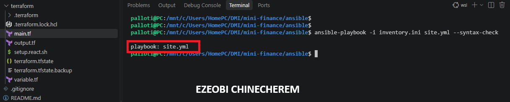

---

#### Screenshot 11 — Play 3 output showing the successful HTTP verification and assertion

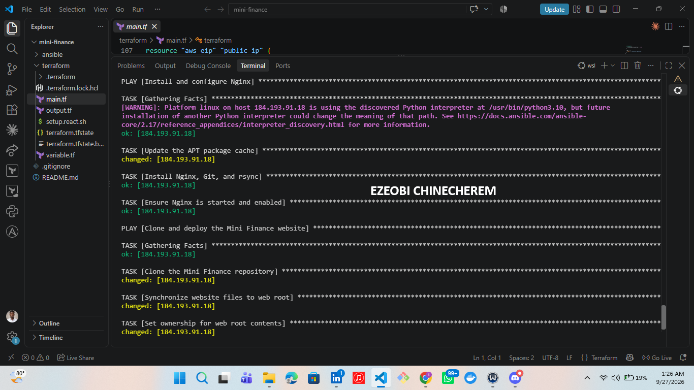

---

#### Screenshot 12 — Final `PLAY RECAP` showing `failed=0` and `unreachable=0`

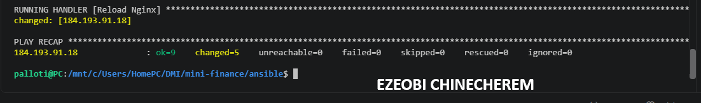

---

### Notes

Ansible Playbook Execution and Play Recap
Task Objective: Execute the configuration management playbook (site.yml) against the target inventory to provision software packages, deploy the Mini Finance website, and verify execution success.

Command Implementation:

Bash
ansible-playbook -i inventory.ini site.yml
Execution & Play Recap Result:

Target Host: 184.193.91.18

Metrics: ok=9, changed=4, unreachable=0, failed=0, skipped=0, rescued=0, ignored=0

Outcome: Successfully verified that all configuration tasks—including package updates, service enablement, repository cloning, file synchronization, file permissions, and the Nginx reload handler—completed with zero errors or unreachable nodes.

---

# Task 8 — Test the Mini Finance Website in a Browser

## Goal

Confirm that the Mini Finance website is publicly accessible through the Azure VM’s public IP address.

### Evidence

#### Screenshot 13 — Mini Finance website successfully loading in the browser, with the Azure VM’s public IP address visible in the address bar

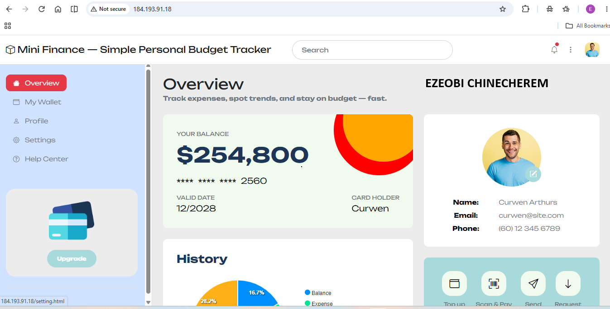

---

### Website URL

Add your deployed website URL below:

http://184.193.91.18


---

# Task 9 — Create the Project README

## Goal

Create a `README.md` file to document the Mini Finance infrastructure and deployment project.

### Evidence

#### Screenshot 14 — Completed `README.md` displayed in the VS Code Markdown preview or terminal

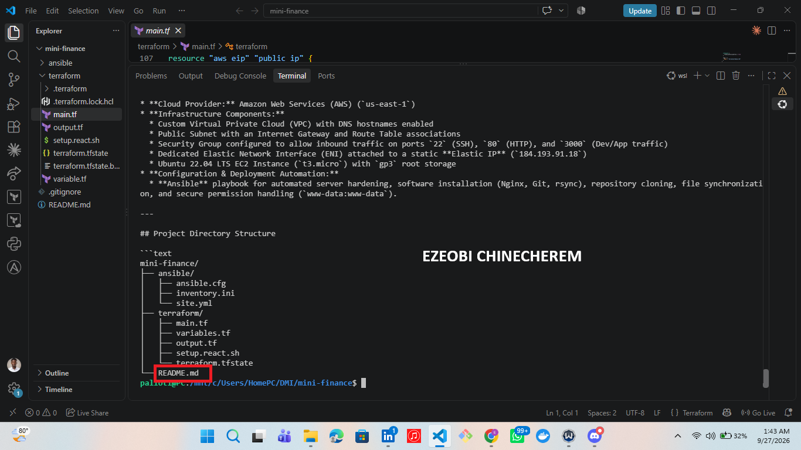

---

### README Content

Copy and paste the complete contents of your `README.md` file below:

# Mini Finance — Simple Personal Budget Tracker

A fully automated, production-ready single-VM deployment of a personal budget tracking application. This project demonstrates end-to-end DevOps practices, utilizing **Terraform** for Infrastructure as Code (IaC) on AWS and **Ansible** for configuration management and automated application deployment.

---

## Architecture Overview

* **Cloud Provider:** Amazon Web Services (AWS) (`us-east-1`)
* **Infrastructure Components:**
  * Custom Virtual Private Cloud (VPC) with DNS hostnames enabled
  * Public Subnet with an Internet Gateway and Route Table associations
  * Security Group configured to allow inbound traffic on ports `22` (SSH), `80` (HTTP), and `3000` (Dev/App traffic)
  * Dedicated Elastic Network Interface (ENI) attached to a static **Elastic IP** (`184.193.91.18`)
  * Ubuntu 22.04 LTS EC2 Instance (`t3.micro`) with `gp3` root storage
* **Configuration & Deployment Automation:**
  * **Ansible** playbook for automated server hardening, software installation (Nginx, Git, rsync), repository cloning, file synchronization, and secure permission handling (`www-data:www-data`).

---

## Project Directory Structure

```text
mini-finance/
├── ansible/
│   ├── ansible.cfg
│   ├── inventory.ini
│   └── site.yml
├── terraform/
│   ├── main.tf
│   ├── variables.tf
│   ├── output.tf
│   ├── setup.react.sh
│   └── terraform.tfstate
└── README.md

---

# LinkedIn Post Required

## Evidence

#### Screenshot 15 — Published LinkedIn post showing the text and at least one deployment screenshot

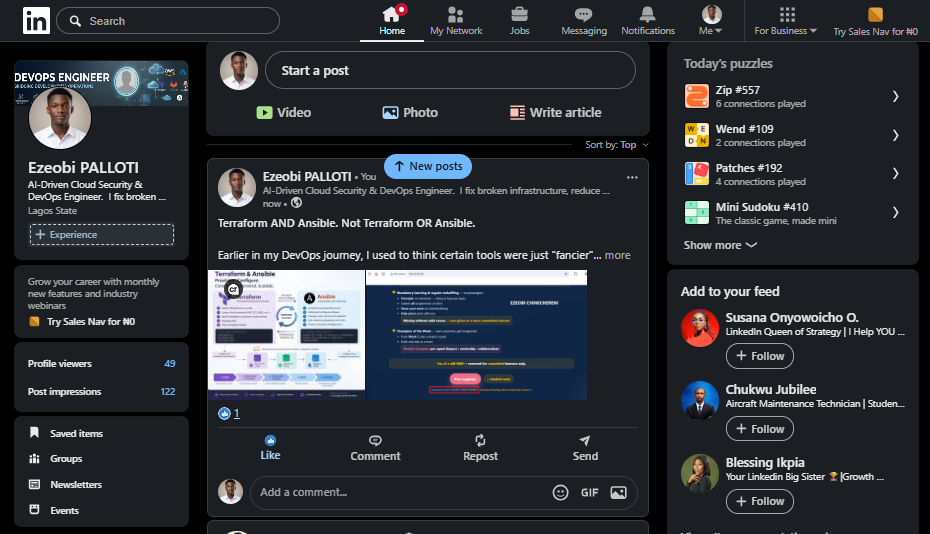

---

#### LinkedIn Post URL

Paste your LinkedIn post URL here:
https://lnkd.in/p/ezT-CbEA


---

### LinkedIn Submission Notes

**One challenge you faced and how you fixed it:**

Challenge Description: During the execution of the Ansible playbook (site.yml), the execution hung indefinitely at the TASK [Clone the Mini Finance repository] stage. Upon investigating the repository URL specified in the playbook ([https://github.com/pravinmishraaws/mini-finance-project](https://github.com/pravinmishraaws/mini-finance-project)), it returned a 404 Not Found error in the browser because the repository name used a hyphen instead of an underscore, causing Git to hang while waiting for credentials on an unreachable endpoint.

Root Cause: A minor naming discrepancy in the repository URL path (mini-finance-project vs. mini_finance.git).

Resolution Steps:

Interrupted the hanging Ansible process in the terminal using Ctrl + C.

Verified the correct repository URL with the project source ([https://github.com/pravinmishraaws/mini_finance.git](https://github.com/pravinmishraaws/mini_finance.git)).

Updated the repo parameter under the ansible.builtin.git task inside site.yml to reflect the correct underscore-delimited naming structure.

Re-run the playbook command (ansible-playbook -i inventory.ini site.yml), which successfully cloned the repository, synchronized the application files, and completed the deployment with zero failures.

Outcome: Restored smooth execution of the automation pipeline, ensuring accurate repository retrieval and seamless website deployment to the AWS target host.

---

**One real-world example where you can use this learning:**

Real-World Use Case — Automated Staging Environment Provisioning
Scenario: A fast-paced software engineering team needs to spin up isolated, fully configured staging environments on demand for feature branches or client demos without manual server configuration.

Application of Learning:

Infrastructure as Code (Terraform) is used to dynamically provision compute instances, allocate static Elastic IPs, and configure security boundaries in AWS.

Configuration Management (Ansible) is subsequently triggered via automated scripts or CI/CD pipelines to instantly harden the OS, install web server dependencies (such as Nginx), and deploy the latest front-end build from version control.

Business Value: Eliminates configuration drift between environments, reduces server setup time from hours to minutes, and ensures repeatable, error-free deployments across the software development lifecycle.

---

# Assignment Questions

Answer the following in your own words:

**1. What did you provision using Terraform in this assignment?**

In this assignment using terraform, I provisioned a single-VM infrastructure stack on Amazon Web Services (AWS) in the `us-east-1` region, which included:

* **Custom Virtual Private Cloud (VPC)** and a public subnet with DNS hostnames enabled.
* **Internet Gateway and Route Table associations** to establish external network connectivity.
* **Security Group (`nsg-mini-finance`)** configured to allow inbound traffic on ports `22` (SSH), `80` (HTTP), and `3000`.
* **Network Interface (`nic-mini-finance`)** associated with the security group.
* **Ubuntu 22.04 LTS EC2 Instance (`t3.micro`)** with `gp3` root storage.
* **Elastic IP (`184.193.91.18`)** attached to the instance for a static public IP address.

---

**2. What did Ansible configure and deploy in this assignment?**

Ansible handled the configuration management and application deployment with the following steps:

System Updates & Package Installation: Updated the APT package cache and installed essential tools, including Nginx, Git, and rsync.

Web Server Configuration: Ensured the Nginx service was started and enabled on system boot.

Repository Cloning: Cloned the Mini Finance source repository from GitHub ([https://github.com/pravinmishraaws/mini_finance.git](https://github.com/pravinmishraaws/mini_finance.git)) into the /opt/mini-finance directory.

File Synchronization: Synchronized the application build files to the Nginx web root (/var/www/html/).

Permission Management: Configured correct ownership and permissions (www-data:www-data) for the web root contents.

Service Reloading: Triggered an automated Nginx reload handler to apply configuration and file changes successfully.

---

**3. Why is SSH access on port `22` restricted to your public IP address?**

SSH access on port `22` is restricted to your specific public IP address as a fundamental security best practice.

By limiting inbound SSH traffic exclusively to your trusted IP rather than allowing access from anywhere on the internet (`0.0.0.0/0`), you significantly reduce the server's attack surface. This prevents malicious actors, automated botnets, and unauthorized users from attempting brute-force login attacks, credential stuffing, or exploiting potential vulnerabilities on the SSH port.

---

**4. Why is HTTP port `80` open to the internet?**

HTTP port `80` is open to the internet to allow public users and web browsers to access the hosted **Mini Finance** web application.

Because the instance functions as a public-facing web server running Nginx, inbound traffic on port `80` must be allowed from anywhere (`0.0.0.0/0`) so that anyone navigating to the server's public IP address (`[http://184.193.91.18](http://184.193.91.18)`) can successfully load and view the website.

---

**5. What is the purpose of the Ansible inventory file?**

The purpose of the Ansible inventory file is to define and organize the target nodes (servers or virtual machines) that Ansible will manage and execute automation playbooks against.

In your project, the inventory file (`inventory.ini`) served several key functions:

* **Target Definition**: Listed the specific IP addresses or hostnames of the target infrastructure (such as your EC2 Elastic IP `184.193.91.18`).
* **Group Organization**: Categorized hosts into logical groups (such as `[web]`), allowing you to target specific tiers or components of your architecture with designated plays.
* **Connection Parameters**: Configured necessary connection variables—like `ansible_user=ubuntu` and the path to your SSH private key—ensuring Ansible could securely authenticate and communicate with the remote servers.

---

**6. Why does the playbook use separate plays for install, deploy, and verify?**

Clear Separation of Concerns: Each stage has a single, well-defined responsibility. The installation stage handles base system setup and dependencies (like Nginx, Git, and rsync), the deployment stage handles application code retrieval and file synchronization, and the verification stage ensures everything is running correctly.

Controlled Execution Order: Infrastructure and system-level dependencies must exist and be properly configured before application files can be deployed to web roots or service handlers can be triggered. Separate plays enforce this strict execution dependency.

Easier Troubleshooting & Error Isolation: If a playbook fails, clear separation makes it immediately obvious where the failure occurred—whether it was a package manager issue during installation, a permission or path error during deployment, or an HTTP response failure during verification.

Maintainability and Idempotency: Modifying or updating one part of the pipeline (such as updating how the app code is synced without reinstalling base packages) is much cleaner and safer when tasks are logically grouped and structured.

---

**7. Why is `rsync` useful when deploying website files?**

`rsync` (Remote Synchronization) is a powerful utility for website deployments because it brings efficiency, precision, and safety to file transfers.

Here are the key reasons why `rsync` is widely used in deployment pipelines:

* **Incremental Updates (Delta Transfer):** Instead of copying every single file every time you deploy, `rsync` compares the source and destination and **only transfers files that have actually changed**. This makes deployments significantly faster and saves network bandwidth.
* **Preservation of File Attributes:** `rsync` can preserve exact file permissions, ownership, timestamps, and symbolic links during the transfer. This ensures that your web root files maintain the correct security settings (such as `www-data:www-data` ownership) without requiring manual fix-up commands.
* **Cleanup Capabilities (`--delete`):** When configured, `rsync` can automatically remove old or orphaned files from the destination server that no longer exist in the source repository, keeping your production web root clean and preventing stale code from lingering.
* **Seamless Automation Integration:** It integrates smoothly with configuration management tools like Ansible (via the `synchronize` module), making it easy to automate fast, reliable file deployments directly to target servers.

---

**8. What does the Ansible `uri` module verify in this assignment?**

The Ansible `uri` module is typically used during the **verification stage** of a deployment playbook to perform a health check on the web server.

Specifically, it verifies:

* **HTTP Service Availability:** It sends an automated HTTP request (such as a `GET` request to `http://localhost` or the server's address) to confirm that Nginx is actively running, accepting incoming connections, and routing traffic correctly.
* **Expected Status Codes:** It validates that the server returns a successful response code—typically **`200 OK`**—ensuring the application is fully operational and not throwing errors (such as a `502 Bad Gateway` or `404 Not Found`).

By including a verification task with the `uri` module, the playbook can automatically confirm that the deployment was successful before marking the run as complete.

---

**9. What issue did you face during this assignment, and how did you fix it?**

### **Challenge: Repository URL Mismatch and Deployment Hang**

* **The Issue**: During the execution of the Ansible playbook (`site.yml`), the process hung indefinitely at the task responsible for cloning the repository. Upon checking, the repository URL specified in the playbook used a hyphen (`mini-finance-project`) instead of the correct underscore format (`mini_finance.git`). This caused GitHub to return a `404 Not Found` error, and Git hung while waiting for credentials on the invalid endpoint.
* **The Fix**:
1. Interrupted the hanging Ansible run using `Ctrl + C`.
2. Verified the correct repository path (`[https://github.com/pravinmishraaws/mini_finance.git](https://github.com/pravinmishraaws/mini_finance.git)`).
3. Updated the `repo` parameter within the `ansible.builtin.git` task in `site.yml`.
4. Re-ran the playbook command, which successfully cloned the repository, synchronized the files, and completed the deployment without errors.

---

**10. What did you learn from using Terraform and Ansible together?**

Using Terraform and Ansible together in this project provided a hands-on demonstration of how modern Infrastructure as Code (IaC) and configuration management tools complement each other to form a complete, automated deployment pipeline.

Here are the key takeaways from combining them:

* **Clear Separation of Responsibilities (Provisioning vs. Configuration):**
* **Terraform** handled the lower-level cloud primitives—provisioning the custom VPC, subnets, internet gateways, security groups, EC2 instances, and allocating static Elastic IPs. It set up the *infrastructure foundation*.
* **Ansible** took over once the servers were up, managing the operating system configuration, installing packages (Nginx, Git, `rsync`), cloning the application repository, and handling file synchronization and service reloads. It set up the *application environment*.


* **Idempotency Across the Entire Lifecycle:** Both tools emphasize idempotency—running the same Terraform apply or Ansible playbook multiple times results in a predictable, stable state without unintended side effects. This ensures consistency between environments.
* **Streamlined Handoffs:** Learning how to capture Terraform outputs (like the server's public IP address) and feed them directly into automation workflows (like configuring an Ansible inventory file) showed how smoothly different tools in the DevOps toolchain can integrate to eliminate manual, error-prone copy-pasting.
* **Repeatability and Speed:** Together, they turn what used to be a tedious, error-prone manual server setup process into a repeatable, automated workflow that can provision and configure a production-ready web server in a matter of minutes.

---

# Required Files

Confirm that the following files are included in your assignment folder:

- [ ] `.gitignore`
- [ ] `README.md`
- [ ] `terraform/providers.tf`
- [ ] `terraform/main.tf`
- [ ] `terraform/variables.tf`
- [ ] `terraform/outputs.tf`
- [ ] `ansible/inventory.ini`
- [ ] `ansible/site.yml`

---

# Submission Instructions

- Add all required screenshots in the correct order.
- Full Name must be visible in required screenshots.
- Add the Azure VM public IP address.
- Add the final Mini Finance website URL.
- Paste `inventory.ini`, `site.yml`, and `README.md` as editable text.
- Answer all assignment questions clearly in your own words.
- Add your LinkedIn post URL.
- Do not expose SSH private keys, passwords, Azure credentials, subscription IDs, Terraform state contents, or other sensitive information.

---

# Completion Checklist

- [ ] Task 1: `mini-finance` project structure created
- [ ] Task 1: `.gitignore` created
- [ ] Task 2: Terraform Azure infrastructure code created
- [ ] Task 2: `Allow-SSH` rule configured for port `22`
- [ ] Task 2: `Allow-HTTP` rule configured for port `80`
- [ ] Task 2: NSG associated with the Network Interface
- [ ] Task 3: `terraform fmt` completed
- [ ] Task 3: `terraform init` completed
- [ ] Task 3: `terraform validate` completed successfully
- [ ] Task 3: `terraform apply` completed successfully
- [ ] Task 3: `terraform output public_ip` displayed the VM public IP
- [ ] Task 4: Passwordless SSH works from the Ansible controller
- [ ] Task 5: `inventory.ini` created
- [ ] Task 5: Ansible ping returns `SUCCESS` and `pong`
- [ ] Task 6: `site.yml` contains three separate plays
- [ ] Task 6: Play 1 installs Nginx, Git, and rsync
- [ ] Task 6: Play 2 clones and deploys the Mini Finance website
- [ ] Task 6: Play 3 verifies HTTP status code `200`
- [ ] Task 7: Playbook syntax check passes
- [ ] Task 7: Ansible playbook completes successfully
- [ ] Task 7: Final recap shows `failed=0` and `unreachable=0`
- [ ] Task 8: Mini Finance website loads in the browser
- [ ] Task 8: Azure VM public IP is visible in the browser screenshot
- [ ] Task 9: `README.md` completed
- [ ] Screenshots 1–15 are included
- [ ] `inventory.ini`, `site.yml`, and `README.md` are pasted as editable text
- [ ] Assignment questions are answered
- [ ] LinkedIn post published with Anyone visibility
- [ ] LinkedIn post URL added
- [ ] No sensitive information is exposed

---

## About DMI & CloudAdvisory

DevOps Micro Internship (DMI) is a project-based DevOps program run by Pravin Mishra and The CloudAdvisory, focused on real-world execution, systems thinking, and career readiness.

It helps learners build strong DevOps foundations with hands-on experience.

---

## Resources

- DMI Official Website: [https://dmi.pravinmishra.com?utm_source=github&utm_medium=readme](https://dmi.pravinmishra.com?utm_source=github&utm_medium=readme)
- University: [https://university.pravinmishra.com?utm_source=github&utm_medium=readme](https://university.pravinmishra.com?utm_source=github&utm_medium=readme)
- Discord Community: [https://discord.pravinmishra.com?utm_source=github&utm_medium=readme](https://discord.pravinmishra.com?utm_source=github&utm_medium=readme)
- Blog: [https://dmi.pravinmishra.com/blog?utm_source=github&utm_medium=readme](https://dmi.pravinmishra.com/blog?utm_source=github&utm_medium=readme)
- YouTube Playlist: [https://www.youtube.com/playlist?list=PLFeSNDtI4Cho](https://www.youtube.com/playlist?list=PLFeSNDtI4Cho)
- Pravin Mishra LinkedIn: [https://www.linkedin.com/in/pravin-mishra-aws-trainer/](https://www.linkedin.com/in/pravin-mishra-aws-trainer/)
- CloudAdvisory LinkedIn: [https://www.linkedin.com/company/thecloudadvisory/](https://www.linkedin.com/company/thecloudadvisory/)

---

*This submission is part of DevOps Micro Internship (DMI) — Agentic AI Track.*