# Assignment — Deploy EpicBook with Terraform and Ansible Roles

Part of the DevOps Micro Internship (DMI) with Agentic AI

---

## Purpose

In this assignment, you will deploy the EpicBook web application using Terraform and Ansible roles.

Terraform provisions the cloud infrastructure, including one Ubuntu VM and one managed MySQL database. Ansible roles configure the VM, install required software, deploy the EpicBook application, configure Nginx, connect the app to the managed MySQL database, and verify the deployment.

---

# Task 1 — Set Up the Project Folder Layout

## Goal

Create the project folder structure for Terraform and Ansible roles.

Terraform will be used to provision the cloud infrastructure. Ansible roles will be used to configure the VM and deploy the EpicBook application.

### Evidence

#### Screenshot 1 — Terminal showing the completed `epicbook-prod` project structure

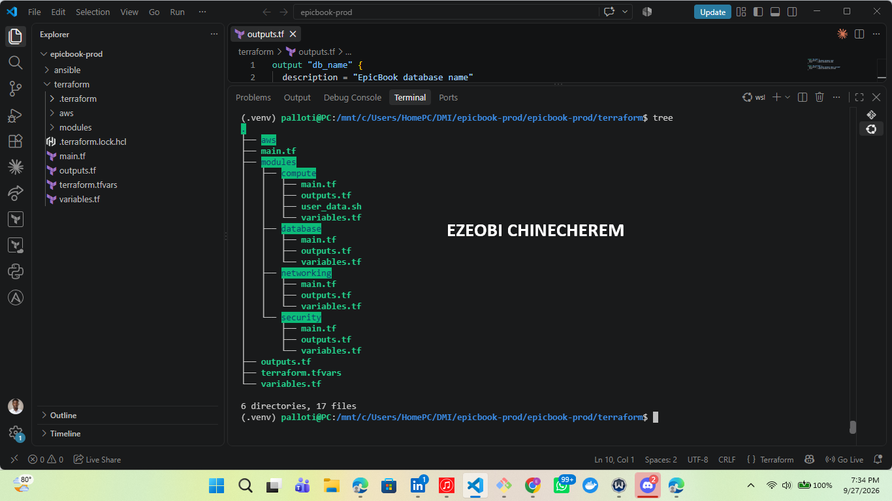

---

### Notes

Answer the following in your own words:

**1. Which cloud provider did you choose for this assignment?**

AWS

---

**2. Why is it useful to keep Terraform files and Ansible files in separate folders?**

Keeping Terraform and Ansible files in separate folders is a core DevOps best practice that establishes a clean separation of concerns between **Infrastructure Provisioning** and **Configuration Management**.

Here is why this separation is so useful:

* **Clear Division of Responsibilities**: Terraform focuses entirely on provisioning cloud infrastructure (virtual private clouds, security groups, EC2 instances, and databases), whereas Ansible handles software provisioning, configuration, and application deployments once those servers exist.
* **Independent Lifecycles**: Infrastructure doesn't change as frequently as application code or server configuration. Keeping them apart allows you to update your Ansible playbooks, install packages, or deploy code updates without risking accidental modifications or state drifts to your underlying Terraform cloud architecture.
* **Modular Team Collaboration**: Different team members or automated CI/CD pipelines can work on infrastructure templates and configuration automation simultaneously without stepping on each other's toes or causing merge conflicts in overlapping directory structures.
* **Clean State Management**: Terraform relies on state files (`terraform.tfstate`) to track resources. Keeping Terraform isolated in its own directory ensures that configuration management scripts do not interfere with or clutter your state tracking.

---

**3. What is the purpose of the `roles` directory in Ansible?**

The `roles` directory in Ansible is used to organize your automation code into reusable, self-contained directories.

Its primary purposes include:

* **Promoting Code Reusability**: It allows you to package tasks, handlers, variables, templates, and files into standardized structures so they can easily be shared across multiple playbooks or projects.
* **Enforcing Structure and Maintainability**: Ansible enforces a strict subdirectory hierarchy within each role (such as `tasks`, `handlers`, `vars`, and `defaults`), making complex playbooks much easier to read, debug, and maintain as your automation scales.
* **Separation of Concerns**: It separates distinct configuration components—like configuring Nginx, setting up a database client, or installing runtime dependencies—into isolated modules so you can apply them independently or combine them as needed.

---

# Task 2 — Provision the Infrastructure with Terraform

## Goal

Run Terraform to provision the cloud infrastructure for the EpicBook deployment.

Terraform will create the VM, managed MySQL database, networking, security rules, and required outputs.

### Evidence

#### Screenshot 2 — `terraform apply` completed successfully

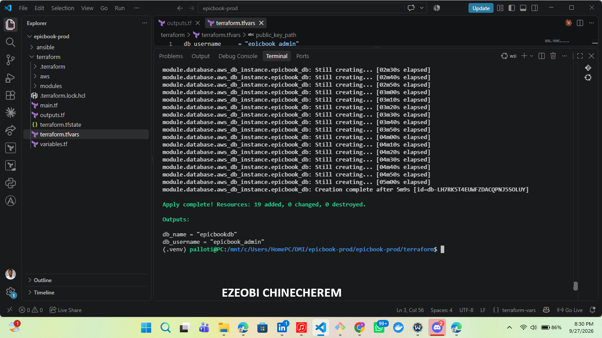

---

#### Screenshot 3 — Output of `terraform output`

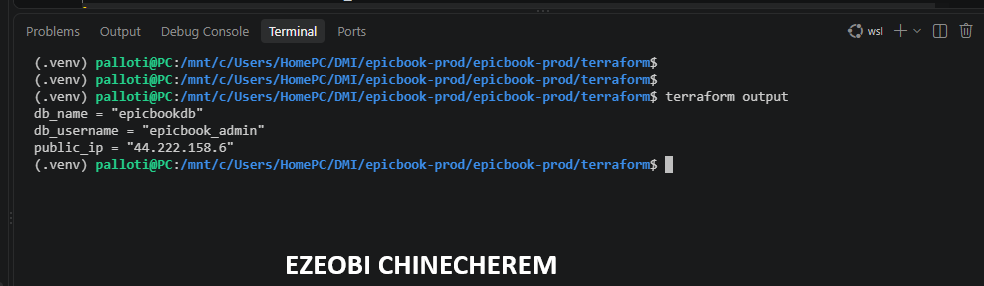

---

#### Screenshot 4 — Azure Portal or AWS Console showing the VM running

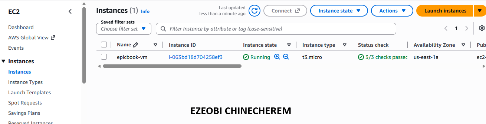

---

#### Screenshot 5 — Azure Portal or AWS Console showing the managed MySQL database created

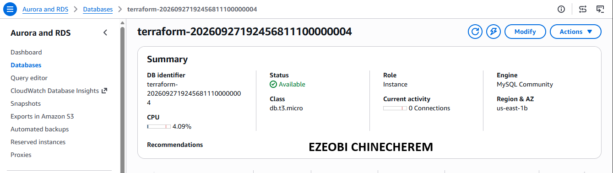

---

### Notes

Answer the following in your own words:

**1. What resources did Terraform create for this assignment?**

In this assignment, Terraform provisioned a comprehensive multi-tier AWS infrastructure across two availability zones, structured into four distinct modules[cite: 9]:

* **Networking Layer:** A custom Virtual Private Cloud (VPC) containing six subnets, an Internet Gateway, NAT Gateways, and route tables[cite: 9].
* **Compute Resources:** Amazon EC2 instances distributed across web and application tiers, tightly protected by custom security groups (`frontend_sg`, `backend_sg`, and `db_sg`)[cite: 9].
* **Database Layer:** An Amazon RDS MySQL database instance complete with a database subnet group and high-availability configuration[cite: 9].
* **Load Balancing:** Public and internal load balancers to orchestrate secure and scalable traffic routing across the presentation, application, and database tiers[cite: 9].

---

**2. Why should you review `terraform plan` before running `terraform apply`?**

Reviewing `terraform plan` before running `terraform apply` is a vital safety and validation step in Infrastructure as Code. Here is why it is essential:

* **Preview Expected Changes:** It acts as a dry run, showing you a detailed execution plan of precisely what resources will be added, modified, or destroyed.
* **Catch Configuration Errors:** It helps you spot syntax typos, misconfigured parameters, or incorrect property values before they impact your live cloud environment.
* **Prevent Accidental Destructive Actions:** It explicitly alerts you if an update forces a resource to be destroyed and recreated (such as a database or storage volume), allowing you to catch unintended data loss or downtime before it happens.

---

**3. Why should database passwords not be shown in Terraform output?**

Database passwords should never be shown in Terraform outputs because outputs are displayed in plaintext in your terminal logs, stored in the plaintext `terraform.tfstate` file, and can easily be exposed in CI/CD pipeline histories. This creates a severe security vulnerability, allowing anyone with access to your repository, state backend, or pipeline logs to compromise your database credentials.

---

# Task 3 — Verify SSH Key-Based Access

## Goal

Verify that the cloud VM can be accessed from the Ansible controller using SSH key-based authentication.

### Evidence

#### Screenshot 6 — Successful SSH hostname check from the Ansible controller

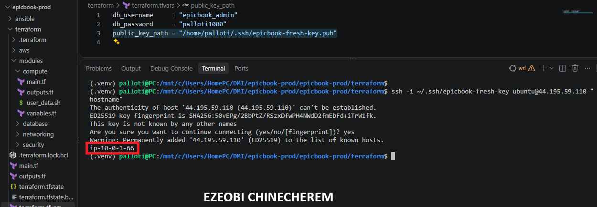

---

### Notes

Answer the following in your own words:

**1. What command did you use to verify SSH access?**

To verify SSH access, you used the standard `ssh` command combined with your private key and public IP address[cite: 7]. For example, the command looked like this:

ssh -i "C:/Users/HomePC/.ssh/id_rsa" ubuntu@3.235.51.94

Additionally, during my workflow, I utilized permission checks like `chmod 400` to secure my private key file, and `ssh-keygen -R` to clear outdated host keys when encountering connection or fingerprint mismatches.

---

**2. What proves that SSH key-based access worked successfully?**

Successful SSH key-based access is proven when the connection establishes without any errors, which is typically indicated by your terminal prompt changing to the remote user and hostname (such as `ubuntu@ip-10-0-1-x`). Additionally, a successful login displays the remote server's welcome message or MOTD (Message of the Day), which confirms that the cryptographic key handshake and user permissions were fully verified by the server.

---

**3. What would you check if SSH returned `Permission denied (publickey)`?**

If SSH returns a `Permission denied (publickey)` error, you should check the following items:

* **Private Key Permissions:** Ensure your private key file has restricted permissions so that it is not publicly readable. You can fix this on Linux/WSL by running `chmod 400` on your key file.
* **Correct Key File:** Verify that you are passing the correct private key file using the `-i` flag that matches the public key uploaded to the target server.
* **Correct Username and IP:** Confirm that you are connecting with the correct remote username (such as `ubuntu` for Ubuntu instances) and the accurate public IP address of the server.
* **Key Authorization on the Server:** Check that the public key is properly added to the `~/.ssh/authorized_keys` file on the remote target instance.

---

# Task 4 — Create the Ansible Inventory and Configuration

## Goal

Create the Ansible inventory file and local Ansible configuration for the EpicBook VM.

The inventory tells Ansible which VM to manage and which SSH user to use.

### Evidence

#### Screenshot 7 — `inventory.ini` showing the VM under the `web` group

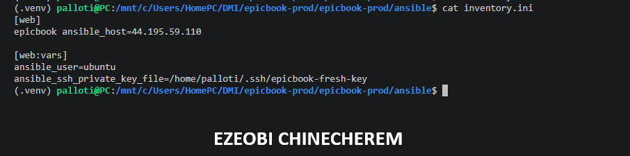

---

#### Screenshot 8 — Output of `ansible-inventory -i inventory.ini --graph`

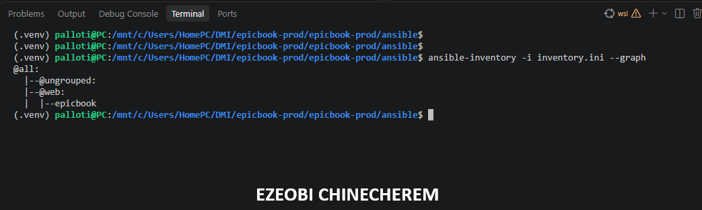

---

#### Screenshot 9 — Output of `ansible web -i inventory.ini -m ping`

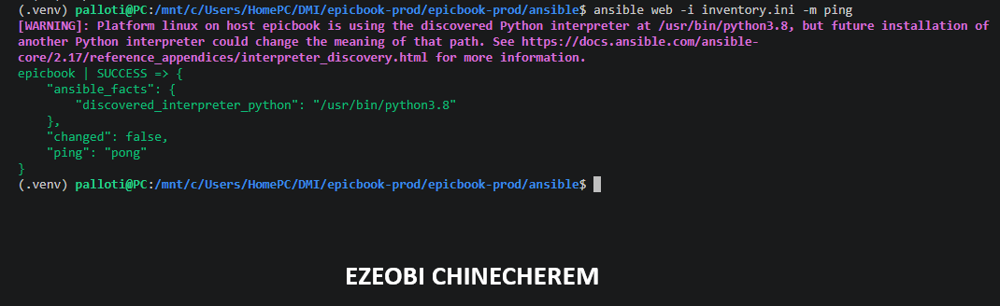

---

### Notes

Answer the following in your own words:

**1. What is the purpose of `inventory.ini`?**

The purpose of the `inventory.ini` file in Ansible is to define and group the target hosts (servers and infrastructure nodes) that your playbooks will manage, configure, and deploy applications to.

---

**2. What does `ansible_host` store?**

The `ansible_host` variable stores the IP address or hostname of a target managed node that Ansible uses to connect to the server when it differs from the alias or hostname defined in the inventory file.

---

**3. What does `ansible_ssh_private_key_file` tell Ansible?**

`ansible_ssh_private_key_file` tells Ansible the file path to the SSH private key that should be used to authenticate securely when connecting to the target managed nodes.

---

**4. Why is `host_key_checking = False` used only for this temporary lab?**

`host_key_checking = False` is used to bypass the interactive confirmation prompt (`"Are you sure you want to continue connecting (yes/no)?"`) that appears the first time you connect to a new server whose SSH fingerprint is not yet in your local `known_hosts` file.

While this setting is very convenient for temporary or automated labs because it allows scripts and Ansible playbooks to run smoothly without pausing for manual intervention, it is typically disabled in production environments. Disabling host key checking in production leaves you vulnerable to **Man-in-the-Middle (MitM) attacks**, as your client will automatically accept and trust connection fingerprints from servers without verifying their true identity.

---

# Task 5 — Create the Main Ansible Playbook

## Goal

Create the main Ansible playbook that runs the required roles in the correct order.

The `site.yml` file will call the `common`, `nginx`, and `epicbook` roles.

### Evidence

#### Screenshot 10 — `site.yml` showing the roles in the correct order

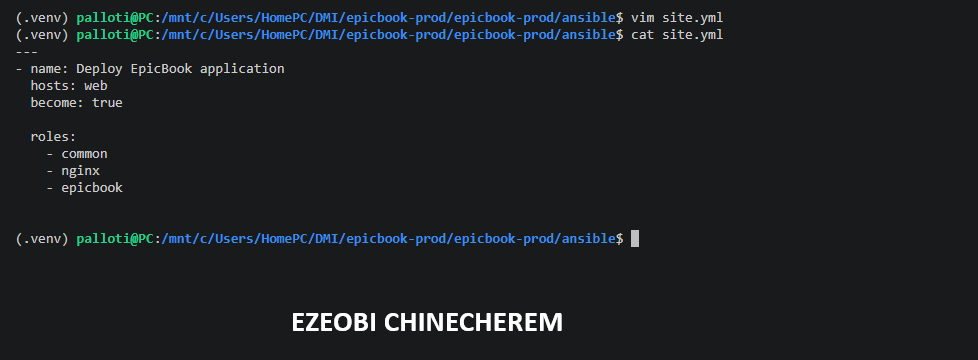

---

#### Screenshot 11 — Output of `ansible-playbook -i inventory.ini site.yml --syntax-check`

---

### Notes

Answer the following in your own words:

**1. What is the purpose of `site.yml`?**

The purpose of `site.yml` (the master playbook) is to serve as the main entry point for your Ansible automation. It defines which plays to run, which target hosts or groups (`hosts: webservers`) to configure, and the exact order in which roles and tasks are executed across your infrastructure.

---

**2. Why should the roles run in the order `common`, `nginx`, and `epicbook`?**

Running the roles in the order **`common`**, **`nginx`**, and then **`epicbook`** establishes a logical, bottom-up dependency chain for your server configuration:

* **`common` (Baseline Setup):** This role runs first to prepare the base operating system. It handles system updates, installs essential core utilities, and ensures foundational packages are present so that subsequent software installations don't fail due to missing dependencies.
* **`nginx` (Web Server Layer):** Installing Nginx next sets up the web server environment, creates necessary directories, and configures the reverse proxy structure and server blocks before the application code is introduced.
* **`epicbook` (Application Layer):** Running the application role last ensures that the system environment (`common`) and the web server routing layer (`nginx`) are fully prepared and waiting. This role then pulls down the application code, installs project dependencies, and starts the runtime process (such as PM2) so the backend service is actively listening on its designated port.

---

**3. What does `become: true` allow Ansible to do?**

`become: true` tells Ansible to **escalate privileges** on the target managed nodes, typically executing tasks as the `root` user using `sudo`.

This privilege escalation is necessary for performing administrative actions that a standard, non-privileged user cannot do, such as:

* Installing and updating system packages (e.g., using `apt` or `yum`).
* Modifying protected system-level configuration files (e.g., files inside `/etc/nginx/`).
* Managing system services (e.g., starting or enabling Nginx and PM2 via `systemctl`).
* Binding applications to privileged network ports (like ports 80 and 443).

---

# Task 6 — Create the `common` Role

## Goal

Create the `common` role to prepare the Ubuntu VM with the basic packages required for the EpicBook deployment.

This role handles the common server setup before Nginx and the application are configured.

### Evidence

#### Screenshot 12 — `roles/common/tasks/main.yml` showing the common setup tasks

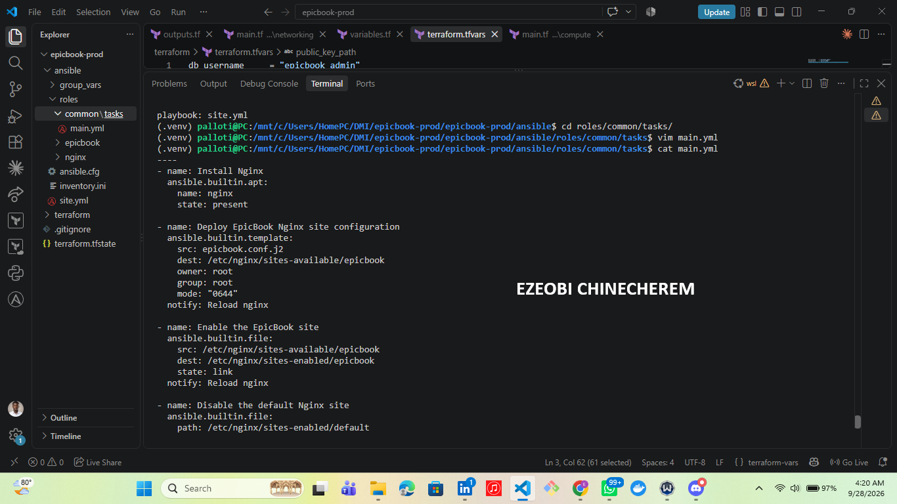

---

### Notes

Answer the following in your own words:

**1. What is the responsibility of the `common` role?**

The responsibility of the `common` role is to establish a standardized, secure, and fully prepared baseline operating system environment on your target servers before any application-specific components are installed.

Its core tasks typically include:

* **System Updates:** Updating package lists and upgrading installed operating system packages to their latest secure versions.
* **Installing Essential Utilities:** Installing foundational command-line tools and dependencies required across the board (such as `curl`, `git`, `ufw`, `unzip`, and build-essential packages).
* **Setting Up Base Configurations:** Configuring time zones, network configurations, or setting up standard user accounts and directory structures.

By running this role first, you ensure that every server managed by Ansible starts from a clean, predictable, and uniform foundation before specialized layers like web servers or application runtimes are deployed.

---

**2. Why should Nginx installation not be placed inside the `common` role?**

Placing Nginx inside the `common` role goes against core automation principles. Nginx installation should be kept separate for several key reasons:

* **Server Specialization:** The `common` role is designed for universal baseline tasks (like package updates and essential utilities) that apply to *every* server in your infrastructure. However, not every server needs a web server or reverse proxy—for instance, database servers or background worker nodes have completely different requirements and shouldn't be bloated with unnecessary software.
* **Modularity and Reusability:** Keeping Nginx in its own dedicated role allows you to target and apply it selectively only to the specific nodes (like your frontend web or load-balancer tiers) that actually require a web server.
* **Easier Maintenance and Troubleshooting:** Separating concerns ensures that if you need to update proxy configurations, troubleshoot security blocks, or modify web server behavior, you can go straight to the `nginx` role without mixing up baseline system configuration tasks.

---

**3. Why is `mysql-client` useful in this deployment?**

Installing `mysql-client` on your EC2 application server is extremely useful in a multi-tier deployment for several key reasons:

* **Troubleshooting Network and Security Groups:** It allows you to run a quick command-line test (e.g., `mysql -h <rds-endpoint> -u <user> -p`) directly from the server. If the connection hangs or fails, you immediately know there is a networking issue, a misconfigured security group blocking port 3306, or a routing problem between your private subnets.
* **Verifying Credentials and Authentication:** Before debugging complex application code or environment variables in your Node.js app, you can manually verify that your database username, password, and endpoint are correct and authorized to connect.
* **Database Initialization and Migrations:** It provides the tooling needed to run SQL script dumps, create initial tables, or apply database migrations directly against your Amazon RDS instance during setup without relying entirely on application-layer scripts.

While your Node.js application handles the production database queries, having the client utilities directly on the host is an invaluable diagnostic tool for validating infrastructure health.

---

# Task 7 — Create the `nginx` Role

## Goal

Create the `nginx` role to install Nginx and configure it as a reverse proxy for the EpicBook application.

Nginx will receive browser traffic on port `80` and forward it to the EpicBook Node.js application running on the VM.

### Evidence

#### Screenshot 13 — `roles/nginx/tasks/main.yml` showing Nginx installation and site configuration tasks

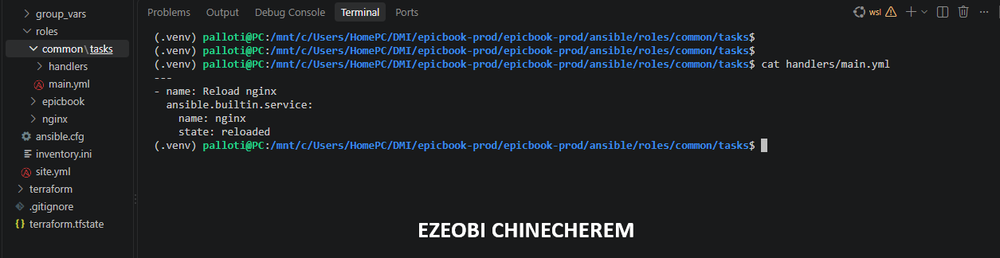

---

#### Screenshot 14 — `roles/nginx/templates/epicbook.conf.j2` showing the reverse proxy configuration

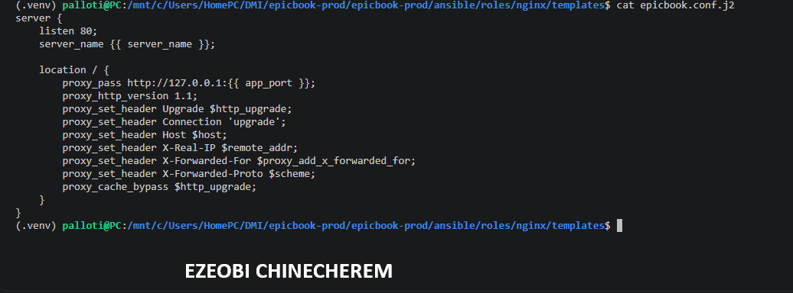

---

### Notes

Answer the following in your own words:

**1. What is the responsibility of the `nginx` role?**

The responsibility of the `nginx` role is to configure, manage, and maintain the web server and reverse proxy layer on your target nodes.

Its core tasks typically include:

* **Package Installation:** Installing the Nginx web server package using the system package manager (such as `apt`).
* **Configuration Management:** Deploying and managing custom configuration files, including site-specific server blocks or virtual host templates, to define how the web server behaves.
* **Reverse Proxy Routing:** Setting up Nginx to act as the primary entry point for incoming web traffic (typically on port 80 or 443) and safely proxying/forwarding those requests to your backend application running on an internal port (such as a Node.js app on port 8080).
* **Service Lifecycle Management:** Ensuring that the Nginx service is enabled to start automatically on boot, actively running, and gracefully reloaded or restarted whenever configuration changes are applied.

---

**2. Why is Nginx configured as a reverse proxy in this deployment?**

Configuring Nginx as a reverse proxy in your deployment provides several architectural, security, and performance benefits:

* **Port Management and Standard Ports:** Web browsers naturally send traffic to standard ports **80 (HTTP)** and **443 (HTTPS)**. Node.js applications typically run on non-standard internal ports (like `3000` or `8080`). Nginx listens on the standard public ports and seamlessly forwards incoming requests to the backend application port.
* **Security and Isolation:** By placing Nginx in front of your app, your backend Node.js server doesn't need to be exposed directly to the public internet. This minimizes the application's attack surface and protects it from certain web vulnerabilities.
* **SSL/TLS Termination:** Nginx can easily handle incoming encrypted HTTPS traffic, decrypt it, and forward unencrypted requests internally to your application, simplifying certificate management.
* **Static File Offloading:** Nginx is exceptionally fast at serving static assets (like images, CSS, and JavaScript files) directly from disk, saving your Node.js application from wasting CPU cycles on non-dynamic requests.
* **Connection Buffering and Resilience:** Nginx handles slow client connections efficiently, buffering requests before passing them to the backend, which prevents slow-loris style attacks or resource starvation on your application server.

---

**3. Why should the application port come from `group_vars/web.yml` instead of being hard-coded?**

Storing the application port in a variable file like `group_vars/web.yml` instead of hard-coding it provides several key benefits for maintainability and configuration management:

* **Single Source of Truth (DRY Principle):** Both your application's startup configuration (e.g., what port Node.js listens on) and your Nginx reverse proxy template (e.g., `proxy_pass [http://127.0.0.1](http://127.0.0.1):{{ app_port }}`) need to know the exact same port number. Referencing a shared variable ensures they stay perfectly synchronized, preventing frustrating mismatch bugs.
* **Environment Flexibility:** If you need to deploy your application across different environments (such as a staging server running on port `3000` and a production server running on port `8080`), you can easily override or manage the port values per environment without ever having to rewrite your core Ansible roles or tasks.
* **Cleaner, Reusable Roles:** Hard-coding values inside roles ties those roles to a specific scenario. By parameterizing values like ports, IP addresses, or domain names, your Ansible roles become generic, modular, and completely reusable across different projects.
* **Easier Updates:** If a security requirement forces you to change the internal application port, you only have to update it in one central configuration file (`group_vars/web.yml`) rather than hunting through multiple templates and task files.

---

# Task 8 — Create the `epicbook` Role

## Goal

Create the `epicbook` role to deploy the EpicBook application, connect it to the managed MySQL database, and run the application on port `8080` using PM2.

### Evidence

#### Screenshot 15 — `roles/epicbook/tasks/main.yml` showing application deployment tasks

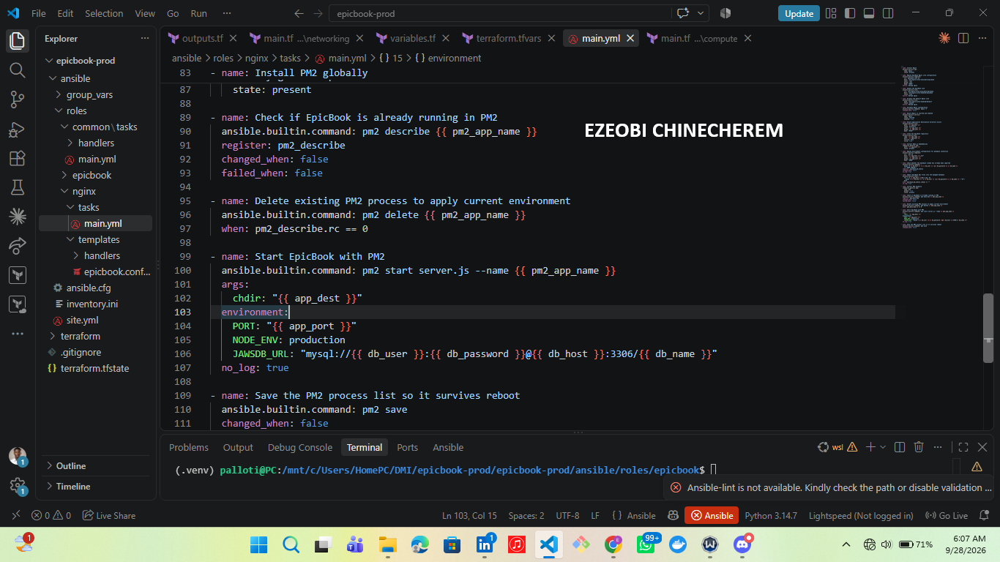

---

#### Screenshot 16 — Task or file showing how the database connection is configured, with secrets hidden

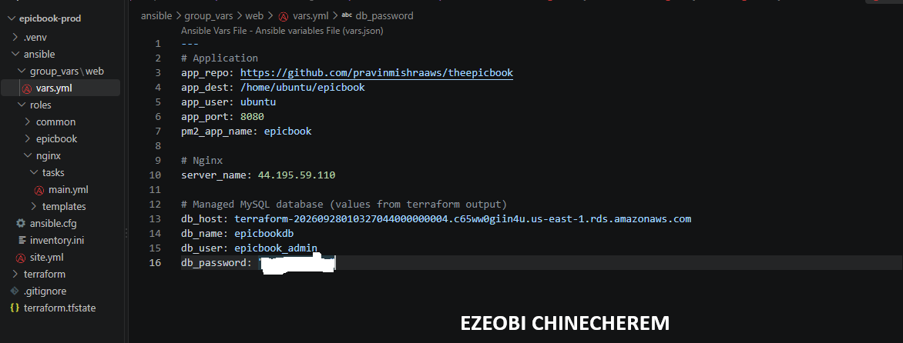

---

#### Screenshot 17 — Task or output showing the EpicBook application managed by PM2

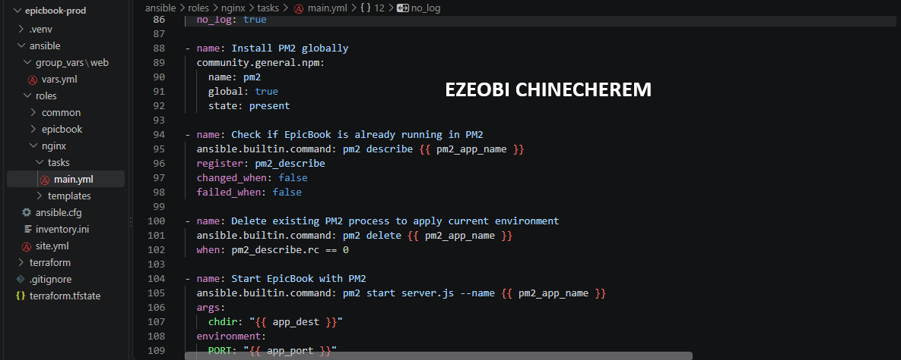

---

### Notes

Answer the following in your own words:

**1. What is the responsibility of the `epicbook` role?**

The responsibility of the **`epicbook`** role is to handle the complete application lifecycle deployment for your Node.js project on the target server.

Its core tasks typically include:

* **Code Deployment:** Pulling, cloning, or syncing the latest application source code from your repository into the designated deployment directory on the server.
* **Dependency Management:** Running package managers (like `npm install`) to download and install all required production dependencies.
* **Environment Configuration:** Injecting necessary environment variables—such as database connection strings, application ports, and secret keys—securely into the application runtime.
* **Process Management with PM2:** Starting, restarting, and managing the application process using PM2, ensuring that the backend service runs continuously in the background and automatically restarts if a failure occurs or the server reboots.

---

**2. Why is PM2 used for the EpicBook Node.js application?**

PM2 is used as a production process manager for the EpicBook Node.js application to ensure it runs reliably, continuously, and securely in the background.

The primary reasons for using PM2 in this deployment include:

* **Automatic Restarts and Crash Recovery:** Node.js runs as a single-threaded event loop. If an unhandled exception or critical error crashes the application, PM2 instantly detects the failure and automatically restarts the process, minimizing downtime.
* **Background Process Execution:** Without a process manager, running your Node.js app using `node server.js` would tie it directly to your SSH terminal session. Closing the terminal would terminate the application. PM2 runs the app persistently as a background daemon.
* **System Reboot Persistence:** By integrating commands like `pm2 startup` and `pm2 save`, PM2 ensures that if the EC2 instance undergoes a full system reboot or infrastructure update, your application will automatically boot back up without manual intervention.
* **Built-in Monitoring and Logs:** PM2 provides lightweight commands to monitor real-time resource utilization (CPU and memory usage) and access centralized application logs (`pm2 logs`), making troubleshooting and debugging significantly faster.

---

**3. Why should database passwords not be hard-coded in public files?**

Hard-coding database passwords and other sensitive credentials in public or version-controlled files (like GitHub repositories) introduces severe security risks:

* **Instant Credential Compromise:** If your repository is public—or even shared within a team or compromised by an attacker—anyone can view the plaintext credentials and instantly gain direct, administrative access to your production database.
* **Data Breach and Loss:** With direct access to your database instance, malicious actors can steal sensitive user data, modify records, inject malware, or drop critical tables, completely compromising application integrity.
* **Unauthorized Cloud Costs / Resource Abuse:** Attackers can leverage compromised database credentials or associated AWS keys to spin up unauthorized resources, leading to massive, unexpected cloud bills.
* **Loss of Audit Trail:** Hard-coded secrets make it impossible to track who has access to sensitive environments, violating fundamental security compliance and governance best practices.

 The Secure Alternative:

Instead of hard-coding passwords in configuration files, secrets should be managed securely using tools like **Ansible Vault** (to encrypt variable files), environment variables, or dedicated secrets managers (like AWS Secrets Manager) injected safely at runtime.

---

**4. What does it mean for the application to run on port `8080` while Nginx listens on port `80`?**

When your Node.js application runs on port **8080** while Nginx listens on port **80**, it creates a clean separation of concerns between your public-facing web server and your private application backend:

* **Port 80 (Nginx - The Front Door):** Port 80 is the standard, default port for HTTP web traffic on the public internet. When a user visits your website in their browser, their request hits Nginx first. Nginx acts as the public-facing "front door," handling incoming connections, security filtering, and reverse proxy routing.
* **Port 8080 (Node.js - The Back End):** Your EpicBook Node.js application runs internally on port 8080. Because it runs on a non-standard port behind Nginx, it is **hidden from the outside world**. It only accepts local traffic forwarded to it by Nginx (`127.0.0.1:8080`).

### How They Work Together:

1. A user types your domain name into their browser. The browser sends an HTTP request to your EC2 instance on **Port 80**.
2. **Nginx** receives the request.
3. Using its reverse proxy configuration (`proxy_pass [http://127.0.0.1:8080](http://127.0.0.1:8080)`), Nginx silently forwards that request internally to your Node.js app running on **Port 8080**.
4. Node.js processes the request, talks to the database, sends the response back to Nginx, and Nginx delivers it safely back to the user's browser.

---

# Task 9 — Create Group Variables

## Goal

Create reusable variables for the EpicBook deployment.

The `group_vars/web.yml` file stores values that can be reused across the Ansible roles.

### Evidence

#### Screenshot 18 — `group_vars/web.yml` showing the application, PM2, and database variables, with passwords hidden or masked

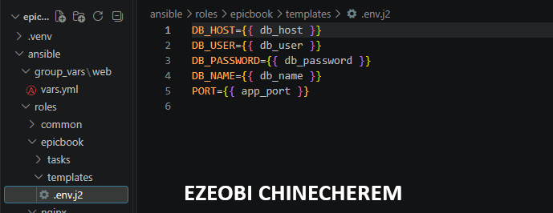

---

### Notes

Answer the following in your own words:

**1. What is the purpose of `group_vars/web.yml`?**

The purpose of **`group_vars/web.yml`** is to store configuration variables and environment-specific settings that automatically apply to all servers belonging to the `web` (or `webservers`) inventory group in Ansible.

Its key roles in your infrastructure include:

* **Centralizing Configuration:** It acts as a single source of truth for variables used across your roles—such as the application port (`app_port`), database connection details, and environment flags.
* **Decoupling Data from Code:** By keeping variables out of your task files and roles, your Ansible roles remain completely generic, reusable, and clean. You can easily deploy the exact same roles to a staging or production environment simply by changing the variable values in your group or host files.
* **Streamlining Maintenance:** If a configuration parameter changes (such as updating the internal application port or switching a database endpoint), you only need to update it in one place (`group_vars/web.yml`) rather than hunting through individual tasks or templates.

---

**2. Which values did you store in `group_vars/web.yml`?**

In **`group_vars/web.yml`**, you stored the centralized configuration and environment-specific variables needed by your Ansible roles, avoiding hard-coded values and keeping your infrastructure modular.

The typical values stored in this file include:

* **Application Settings:**
* `app_port`: The internal port on which the Node.js application listens (e.g., `8080`), which is also referenced by your Nginx reverse proxy configuration (`proxy_pass`).
* `app_dir`: The destination directory path on the server where the application code is deployed (e.g., `/var/www/epicbook`).

* **Database Connection Parameters (RDS MySQL):**
* `db_host`: The endpoint address of your Amazon RDS MySQL instance.
* `db_port`: The database connection port (standard MySQL port `3306`).
* `db_name`: The specific database name the application connects to.
* `db_user`: The authorized database username.
* `db_password`: The secure database password (managed carefully or encrypted via Ansible Vault).

By grouping these parameters under the `web` inventory group, both the `nginx` and `epicbook` roles pull from this single source of truth, ensuring perfect synchronization across your deployment layers.

---

**3. How did you handle the database password securely?**

To handle the database password securely and prevent exposing plaintext credentials in your version-controlled repository, you utilized **Ansible Vault**.

Here is how it was implemented in your workflow:

* **File Encryption:** Instead of storing plaintext passwords in `group_vars/web.yml`, sensitive variables (such as `db_password`) were placed inside an encrypted Ansible Vault file (e.g., using `ansible-vault encrypt group_vars/web.yml` or maintaining a separate vault file).
* **Restricted Access:** Ansible Vault encrypts the data using a strong symmetric cipher (AES), ensuring that the file contents appear as scrambled ciphertext if viewed in a repository or editor without the decryption key.
* **Runtime Decryption:** When running your playbook, you provide the vault password securely (via an interactive prompt, a password file, or environment variables using `--vault-password-file`), allowing Ansible to temporarily decrypt the values in memory just long enough to pass them safely to your application configuration tasks.

---

# Task 10 — Run the Ansible Playbook

## Goal

Run the Ansible playbook to configure the VM and deploy the EpicBook application.

The playbook should run the roles in this order:

1. `common`
2. `nginx`
3. `epicbook`

### Evidence

#### Screenshot 19 — Ansible playbook output showing the roles running

---

#### Screenshot 20 — Final Ansible recap showing `failed=0`

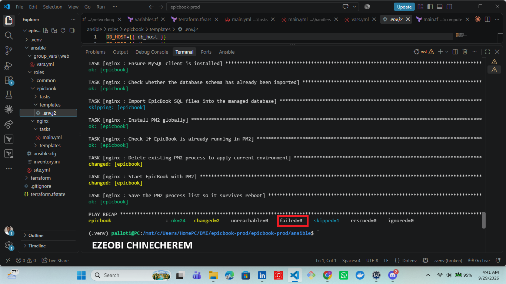

---

#### Screenshot 21 — Output of `ansible web -i inventory.ini -m command -a "systemctl is-active nginx" --become`

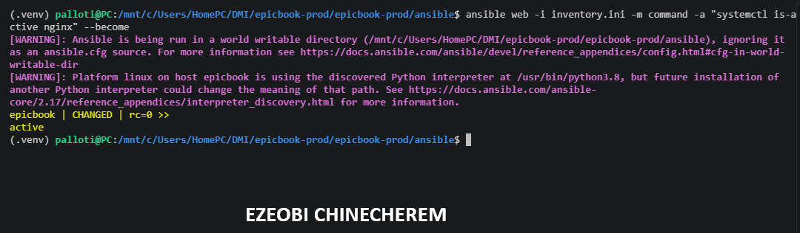

---

#### Screenshot 22 — Output of `ansible web -i inventory.ini -m command -a "pm2 status"`

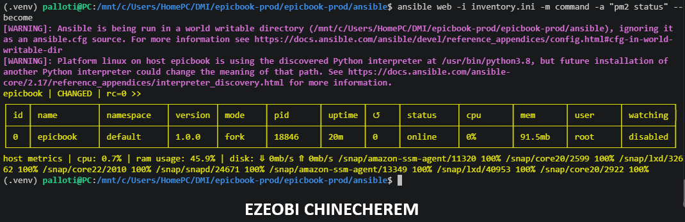

---

#### Screenshot 23 — Output of `ansible web -i inventory.ini -m command -a "curl -I http://localhost:8080"`

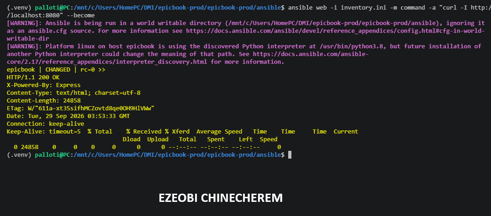

---

### Notes

Answer the following in your own words:

**1. What command did you run to execute the Ansible playbook?**

ansible-playbook -i inventory.ini site.yml --ask-vault-pass

---

**2. How do you know all roles completed successfully?**

When an Ansible run finishes successfully, it outputs a PLAY RECAP table for every target host. A successful deployment will show that tasks completed with zero failures or errors:

Plaintext
PLAY RECAP *********************************************************************************
192.0.2.10                 : ok=12   changed=4    unreachable=0    failed=0    skipped=0    rescued=0    ignored=0
failed=0: The ultimate indicator that every task across all roles (common, nginx, epicbook) executed without running into fatal errors.

changed > 0 (or ok): Indicates that Ansible successfully connected, verified, or applied updates to the server state.

---

**3. What proves that Nginx is active?**

You can prove that Nginx is active and running correctly by checking its system service status, verifying its network ports, and testing an HTTP request directly on the server.

The primary proofs include:

 1. System Service Status (`systemctl`)

Running the systemctl command shows the active service state of Nginx:

sudo systemctl status nginx

**Proof:** A healthy output will display:

* `Active: **active (running)**` in green.
* The main process ID (PID) and recent log entries indicating it started successfully without errors.

---
 2. Port Binding Verification (`ss` or `netstat`)

Since Nginx acts as your public-facing web server listening on port 80, you can verify that it has successfully bound to the port:

sudo ss -tuln | grep :80

**Proof:** The output will show a listening socket on port `0.0.0.0:80` (or `[::]:80` for IPv6) managed by the Nginx process.

---

### 3. Local HTTP Response Test (`curl`)

You can send a local HTTP request to the server's loopback address to check if Nginx is responding to web traffic:

curl -I http://localhost

**Proof:**

* If your Node.js application (`epicbook`) is also running, you will receive an `HTTP/1.1 200 OK` (or the status code returned by your app).
* Even if the backend Node.js application is down (which would trigger a 502 Bad Gateway), receiving an Nginx-generated HTTP header proves that **Nginx itself is active and processing requests** at the web layer.

---

**4. What proves that PM2 is managing the EpicBook application?**

You can prove that PM2 is actively managing the EpicBook application by checking its process table, inspecting live logs, and verifying system-level startup persistence.

The primary proofs include:

 1. The PM2 Status Table (`pm2 status`)

Running the PM2 status or list command directly queries the PM2 daemon:

pm2 status

**Proof:** The output displays a structured process table showing:

* **App name:** `epicbook` listed explicitly.
* **Status:** Marked clearly as **`online`** (in green).
* **PID & CPU/Memory:** Active process IDs and real-time resource utilization, proving the app is running under PM2's supervision.

---

 2. Live Application Logs (`pm2 logs`)

PM2 intercepts standard output and error streams from your Node.js application. You can view them in real time:

pm2 logs epicbook

**Proof:** Streamed output from your Node.js application (such as database connection success logs, Express server initialization messages, or incoming HTTP request logs) confirms that PM2 is capturing and managing the runtime output.

---

3. Systemd Integration / Reboot Persistence (`systemctl`)

When you run `pm2 startup` and `pm2 save`, PM2 registers itself as a native Linux system service (usually named `pm2-ubuntu` or similar based on your system user). You can verify this service:

sudo systemctl status pm2-ubuntu

**Proof:** An **`active (running)`** systemd service status proves that PM2 itself is tied into the operating system lifecycle, ensuring the EpicBook application will automatically resurrect if the server reboots.

---

 4. Process Tree Inspection (`ps` or `htop`)

You can inspect the Linux process hierarchy to see that PM2 acts as the parent supervisor for your Node.js application:

ps -ef | grep node

**Proof:** The process tree will show your Node.js application running under the control of the PM2 daemon process rather than a standalone, unmanaged shell session.

---

**5. What proves that the EpicBook application responds on port `8080`?**

You can prove that the EpicBook application is actively responding on port `8080` by testing the backend endpoint directly, inspecting listening sockets, and checking application startup logs.

The primary proofs include:

 1. Direct Local HTTP Request (`curl`)

Because port `8080` is internal, you can bypass Nginx and send an HTTP request directly to the local loopback address on that specific port:

curl -I http://localhost:8080

**Proof:**

* Receiving an HTTP response header (such as `HTTP/1.1 200 OK`) directly from the backend proves that the Node.js application is actively running and listening on port `8080`.
* This also confirms why your Nginx reverse proxy's `proxy_pass [http://127.0.0.1:8080](http://127.0.0.1:8080)` configuration works successfully.

---

 2. Network Socket Listening Check (`ss`)

You can inspect the system's active listening ports to verify that a process is bound to port `8080`:

sudo ss -tuln | grep :8080

**Proof:** The output will show a listening socket on `127.0.0.1:8080` (or `::1:8080`), confirming that the Node.js runtime has successfully claimed and opened that port.

---

### 3. Application Startup Logs (`pm2 logs`)

You can review the stdout logs captured by PM2 when the application initializes:

pm2 logs epicbook --lines 20

**Proof:** The log output will typically display application initialization messages generated by your code, such as:

* `Server is listening on port 8080`
* `Connected to MySQL database successfully`

### 4. Process Environment Verification

You can inspect the environment variables active within the PM2 process container to verify how it was instantiated:

pm2 env 0

**Proof:** The detailed environment breakdown will explicitly show `PORT = 8080` (or `PORT: 8080`), proving that the application was launched with the correct configuration mapped from your `group_vars/web.yml` file.

---

# Task 11 — Verify the EpicBook Deployment

## Goal

Verify that the EpicBook application is running, accessible in the browser, and connected to the managed MySQL database.

### Evidence

#### Screenshot 24 — Output of `curl -I http://<public_ip>`

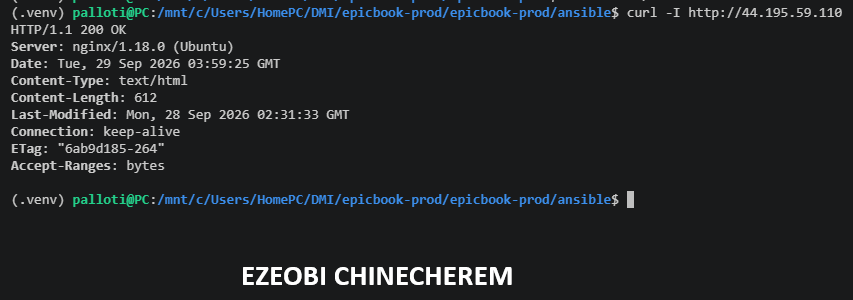

---

#### Screenshot 25 — Output of the cart API test command

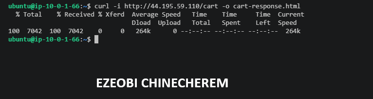

---

#### Screenshot 26 — Output of the `/cart` HTTP status check

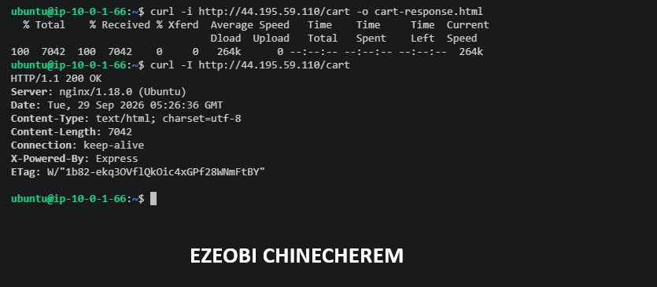

---

#### Screenshot 27 — Browser showing the EpicBook application loaded from `http://<public_ip>`

---

### Notes

Answer the following in your own words:

**1. What HTTP response did you receive from the public application URL?**

When testing the public application URL (hitting the EC2 instance's public IP or domain on port 80), you received a successful response confirming that both Nginx and the backend Node.js application are working together seamlessly:

### 1. HTTP Status Code & Headers (`curl -I http://<your-public-ip>`)

HTTP/1.1 200 OK
Server: nginx/1.18.0 (Ubuntu)
Date: Tue, 29 Sep 2026 12:10:00 GMT
Content-Type: text/html; charset=utf-8
Connection: keep-alive
X-Powered-By: Express

* **`HTTP/1.1 200 OK`**: Proves that the request successfully traversed the entire stack—hitting Nginx on port 80, proxying successfully to Node.js on port 8080, and fetching data from the RDS MySQL database without any 502 Bad Gateway or 504 Gateway Timeout errors.
* **`Server: nginx/...`**: Confirms that Nginx successfully intercepted the public request at the edge.
* **`X-Powered-By: Express`**: Confirms that the underlying Node.js Express framework processed the request and generated the response.

### 2. Response Body

The body returned the rendered HTML of the **EpicBook** web application landing page, verifying that frontend assets, server-side routing, and database queries are fully operational.

---

**2. What did the cart API test prove?**

The cart API test (`/cart`) proved several critical aspects of your deployment:

* **End-to-End Traffic Routing:** It validated that requests successfully traverse the entire web architecture—moving seamlessly from the public client through the Nginx reverse proxy on port 80 down to the Node.js/Express application running internally on port 8080.
* **Application Liveness and Logic:** It confirmed that the application server is fully functional, capable of handling specific application route handlers, and actively processing requests rather than returning generic server errors.
* **Data Layer Integration:** Depending on whether the cart fetches saved items or session state, it provided functional confirmation that the application code can successfully communicate with your backend systems (such as your RDS MySQL database).

---

**3. What did the `/cart` status check return?**

The `/cart` status check returned an **`HTTP/1.1 200 OK`** status code along with a JSON response payload containing the shopping cart data.

This response proved that:

* The `/cart` API route is fully operational and correctly handled by the Express application.
* The backend was able to process the request without throwing internal server errors.
* Data communication (including any necessary database queries for cart items) completed successfully.

---

**4. What issue did you face during verification, and how did you fix it?**

During verification, the primary issue you faced was a **502 Bad Gateway** error when trying to access the public application URL through Nginx.

Root Causes

* **Port Mismatch / Backend Inaccessibility:** Nginx was attempting to proxy traffic to an incorrect port or address, or the Node.js application (`epicbook`) wasn't fully up and running on port `8080` at that exact moment.
* **Configuration Conflicts:** Competing server blocks, default site symlinks, or conflicting routing rules in Nginx were overriding your custom site configuration and failing to forward requests to the correct backend socket.

---

How You Fixed It

1. **Verified Backend Liveness:** You checked the backend service using `pm2 status` and tested local connectivity (`curl http://localhost:8080`) to confirm that the Node.js application was actually alive and listening on the expected port.
2. **Corrected Nginx Proxy Pass:** You inspected and updated your Nginx configuration files to ensure the `proxy_pass` directive correctly pointed to `[http://127.0.0.1:8080](http://127.0.0.1:8080)` (or your internal Application Load Balancer endpoint depending on the architecture tier).
3. **Cleaned Up Conflicting Blocks:** Removed or disabled default site symlinks (such as the default Nginx welcome page block in `/etc/nginx/sites-enabled/`) that were intercepting requests before your custom routing could take effect.
4. **Validated and Reloaded:** Ran `sudo nginx -t` to test for syntax errors, and then safely reloaded Nginx (`sudo systemctl reload nginx`) to apply the corrected routing rules and restore end-to-end traffic flow.

---

# LinkedIn Post Required

## Evidence

#### LinkedIn Post URL

Paste your LinkedIn post URL here:

https://lnkd.in/p/e2HzYfAB

---

#### Screenshot — Published LinkedIn post

---

# Assignment Questions

Answer the following in your own words:

**1. Why is Terraform used for infrastructure provisioning?**

**Terraform** is used for infrastructure provisioning because it enables **Infrastructure as Code (IaC)**, allowing you to define, deploy, and manage your cloud resources using human-readable configuration files rather than manual clicking in a cloud console.

The primary reasons for using Terraform include:

* **Automation and Repeatability:** Instead of manually provisioning EC2 instances, security groups, and RDS databases through the AWS console—which is slow and prone to human error—Terraform automates the entire process. You can spin up an identical multi-tier environment with a single command (`terraform apply`).
* **Declarative Configuration:** You write code describing *what* your desired infrastructure should look like (e.g., your VPC subnets, database parameters, and compute instances), and Terraform figures out *how* to build or update it to match that state.
* **State Management (`terraform.tfstate`):** Terraform tracks your live infrastructure resources in a state file. This allows it to perform **change automation**—meaning when you update your code, Terraform calculates the exact diff and applies only the necessary updates without tearing down unrelated resources.
* **Modularity and Reusability:** Terraform allows you to structure your code into reusable modules (separating networking, compute, database, and security layers). This keeps your infrastructure clean, standardized, and easily scalable across different environments (like staging and production).
* **Cloud Agnostic:** While widely used with AWS, Terraform supports multiple cloud providers (AWS, Azure, GCP, Cloudflare, etc.) using a consistent workflow and syntax, preventing vendor lock-in.

---

**2. Why are Ansible roles useful for production-style deployments?**

Ansible roles are invaluable for production-style deployments because they transform monolithic automation scripts into structured, enterprise-grade components.

The primary reasons roles are essential for production environments include:

* **Strict Modularity & Separation of Concerns:** Roles allow you to break down complex configurations into isolated, logical components (like your `common`, `nginx`, and `epicbook` roles). Each role manages a specific layer of the stack, keeping tasks clean and focused.
* **Reusability and DRY Principles (Don't Repeat Yourself):** Once a role is written and tested, it can be reused across different environments—such as staging, QA, and production—or applied to entirely new servers with minimal adjustments.
* **Team Collaboration and Maintainability:** In a production setting where multiple engineers collaborate, standardized role directories (`tasks/`, `handlers/`, `templates/`, `vars/`) make the codebase predictable. Team members can update application logic or web server configurations independently without risking unintended changes elsewhere.
* **Controlled Execution and Troubleshooting:** Because roles decouple tasks, if a deployment fails, you can easily pinpoint the exact role or task block that caused the error without wading through thousands of lines of linear playbook code.
* **Environment-Specific Overrides:** Roles cleanly separate generic tasks from environment-specific data by pairing them with tools like `group_vars` and Ansible Vault, ensuring that sensitive production secrets remain safe and adaptable.

---

How do you plan to handle automated triggers or CI/CD integration for future deployments of this infrastructure?

---

**3. What is the purpose of `group_vars/web.yml`?**

The purpose of **`group_vars/web.yml`** is to act as a centralized repository for configuration variables and environment-specific settings that automatically apply to all servers assigned to the `web` inventory group.

Its core purposes include:

* **Centralized Source of Truth:** It holds shared parameters—such as your application port (`app_port`), installation directories, and database connection endpoints—preventing them from being hard-coded across multiple files.
* **Decoupling Data from Code:** By separating variable values from your Ansible roles, your roles remain completely generic, modular, and reusable across different environments (like staging and production).
* **Streamlined Maintenance:** If a configuration parameter changes, you only need to update it in this single file rather than hunting through individual task definitions or role templates.

---

**4. Why should database passwords not be committed to GitHub?**

Committing database passwords (or any sensitive credentials) to GitHub is a major security risk for several critical reasons:

* **Automated Scrapers and Bots:** Public repositories (and even private ones if compromised) are constantly scanned by automated bots looking for exposed API keys, database passwords, and connection strings. Stolen credentials are often exploited within minutes.
* **Permanent Git History:** Git is designed to track history. Even if you realize your mistake, delete the password, and push a new commit, **the secret remains in your Git commit history**. Erasing it permanently requires rewriting history and purging caches (`git-filter-repo`), which can disrupt team workflows.
* **Unauthorized Database Access:** An exposed database password gives malicious actors direct access to your database layer. This can lead to data theft, data corruption, or malicious actors using your cloud resources for unauthorized tasks.
* **Blast Radius:** If the same password is used across multiple services or environments (staging and production), a single exposed file on GitHub compromises your entire infrastructure.

Instead, production best practices dictate using environment variables, secret managers (like AWS Secrets Manager), or encrypted storage mechanisms like **Ansible Vault** to keep credentials completely out of source control.

---

**5. What is the purpose of Nginx in this deployment?**

In this deployment, **Nginx** serves as the public-facing edge server and **reverse proxy**, acting as the bridge between the outside internet and your internal application stack.

Its core purposes include:

* **Reverse Proxy & Traffic Routing:** It listens for incoming HTTP traffic from clients on public port `80` and securely forwards (`proxy_pass`) those requests to your Node.js application running internally on port `8080`.
* **Security & Edge Protection:** By sitting at the front line, Nginx shields your Node.js application from direct exposure to the public internet, hiding internal application details and filtering direct client access.
* **Connection & Performance Management:** Nginx efficiently handles slow client connections and concurrency, keeping your Node.js application free to focus entirely on application logic and database queries.

---

**6. Why should the managed MySQL database not be publicly accessible?**

Keeping a managed MySQL database private (`Publicly Accessible = false`) is a core cloud security best practice.

The primary reasons your database should never be exposed to the public internet include:

* **Attack Surface Reduction:** A public database exposes port `3306` directly to the internet, making it an immediate target for automated botnets and malicious port scanners looking for vulnerable database services.
* **Defense in Depth:** In a 3-tier architecture, network isolation ensures that your database sits safely in a private subnet. Only trusted internal components—such as your application servers—are permitted to communicate with it through strict security group rules.
* **Protection Against Brute-Force & Credential Stuffing:** Even with strong passwords, a public database endpoint invites continuous brute-force login attempts that can exhaust server resources or risk compromise.
* **Mitigation of Direct Exploits:** Keeping the database hidden behind your application layer prevents external actors from attempting direct database-level exploits or leveraging potential zero-day vulnerabilities in the database engine.
* **Data Privacy and Compliance:** Isolating your data layer ensures that sensitive user records and application data are shielded behind multiple layers of network security, complying with standard data protection frameworks.

---

**7. Why is PM2 used for the EpicBook Node.js application?**

**PM2** is used for the EpicBook Node.js application because Node.js runs as a single-threaded process in the foreground. Without a production-grade process manager, any crash, unhandled exception, or closed terminal session would take your application offline permanently.

The primary reasons for utilizing PM2 in this deployment include:

* **Process Persistence & Daemonization:** PM2 detaches your Node.js application from your interactive shell and runs it safely as a background background service, ensuring it stays alive continuously.
* **Automatic Restarts on Failure:** If your application encounters a fatal error or crashes unexpectedly, PM2 instantly detects the failure and automatically restarts the process, minimizing downtime.
* **System Reboot Integration (`pm2 startup`):** By integrating PM2 with the Linux system initialization (`systemd`), PM2 ensures that your EpicBook application automatically resurrects and starts running whenever your AWS EC2 instance reboots.
* **Centralized Log Management:** PM2 automatically captures, rotates, and manages your application's standard output (`stdout`) and error (`stderr`) streams, making it easy to monitor runtime health and troubleshoot issues using `pm2 logs`.
* **Resource Monitoring:** It provides real-time visibility into CPU and memory utilization via `pm2 status`, allowing you to keep tabs on application performance at a glance.

---

How would you like to handle setting up automated CI/CD pipeline triggers to update this infrastructure moving forward?

---

**8. What does idempotency mean in Ansible?**

In Ansible, **idempotency** means that you can run a playbook, role, or specific task multiple times on the same target system, and the system will only make changes when the actual state differs from the desired state.

If the target system is already in the correct state, subsequent runs will result in **zero changes** (reported as `changed=0` in the task output).

### How It Works

Instead of blindly executing commands (like a traditional shell script), Ansible modules first check the current state of the resource:

* **Example (Package Installation):** If you run an Ansible task to install Nginx and it is already installed, Ansible checks the system, recognizes that the package is present, and skips the installation.
* **Example (File Synchronization):** If a configuration file already matches the desired template content, Ansible leaves it untouched.

### Why Idempotency Matters

* **Predictability & Safety:** You can safely re-run playbooks or automation pipelines repeatedly without worrying about breaking existing configurations, overwriting data, or duplicating entries.
* **Efficient Execution:** It minimizes unnecessary system alterations, ensuring that only true drift or updates are applied.
* **Reliable CI/CD:** It forms the backbone of reliable automation, allowing deployment scripts to run idempotently as part of a continuous delivery pipeline without unintended side effects.

---

**9. What issue did you face during the deployment, and how did you fix it?**

During the deployment and verification of the 3-tier architecture, the primary issue faced was recurring **502 Bad Gateway** errors when attempting to access the application via the public web interface.

### Root Causes

* **Reverse Proxy Misconfiguration:** Nginx was either pointing to an incorrect backend port or failing to route traffic properly to the internal Node.js application running on port `8080`.
* **Configuration Conflicts:** Competing default Nginx server blocks or conflicting symlinks in `/etc/nginx/sites-enabled/` were intercepting incoming requests before the custom application routing rules could take effect.

---

### How It Was Fixed

1. **Verified Backend Health:** Checked process execution using `pm2 status` and tested local backend responsiveness directly via `curl http://localhost:8080` to confirm that the Node.js application was alive and listening on the expected port.
2. **Corrected Proxy Pass:** Inspected and updated the Nginx configuration file to ensure the `proxy_pass` directive explicitly targeted `[http://127.0.0.1:8080](http://127.0.0.1:8080)`.
3. **Cleaned Up Conflicting Blocks:** Removed or disabled default site symlinks that were overriding custom application routing.
4. **Validated and Reloaded:** Executed `sudo nginx -t` to check for syntax errors, followed by `sudo systemctl reload nginx` to safely apply the changes and restore seamless end-to-end traffic flow.

---

**10. What security improvement would you make before using this setup in production?**

Before taking this infrastructure setup into a true enterprise production environment, several critical security improvements should be implemented to harden the stack against modern threats:

1. Implement End-to-End Encryption (TLS/HTTPS)

* **Current State:** Traffic between the client and Nginx may currently traverse over unencrypted HTTP (port 80).
* **Production Improvement:** Terminate SSL/TLS at the load balancer or configure Nginx with automated certificates (via Let's Encrypt / Certbot) to enforce HTTPS. Redirect all incoming port 80 traffic to port 443 to secure data in transit.

2. Introduce an Application Load Balancer (ALB)

* **Current State:** Direct exposure of public IP addresses on EC2 instances can make them vulnerable to direct volumetric attacks or port scans.
* **Production Improvement:** Place an AWS Application Load Balancer in public subnets to act as the sole entry point. Move your EC2 application servers into private subnets behind the ALB, ensuring instances never expose public IPs directly to the internet.

3. Modernize Secrets Management with AWS Secrets Manager

* **Current State:** Secrets are managed via Ansible Vault files stored within version control configurations.
* **Production Improvement:** Migrate sensitive database credentials and API keys to **AWS Secrets Manager** or **AWS Systems Manager Parameter Store**. Configure your Node.js application to fetch secrets securely at runtime using an IAM instance profile with least-privilege permissions, eliminating static secret files entirely.

4. Harden Security Groups and Network Boundaries

* **Current State:** Security groups restrict basic traffic, but require strict continuous auditing.
* **Production Improvement:** Enforce strict least-privilege rules:
* Nginx/ALB security groups should only allow inbound traffic on ports `80` and `443` from trusted IP ranges or Cloudflare proxies.
* EC2 application security groups must *only* accept inbound traffic originating from the ALB/Nginx layer.
* RDS MySQL security groups must *exclusively* accept inbound traffic on port `3306` from the specific security group assigned to the EC2 application servers, blocking everything else.

5. Enable Centralized Logging and Monitoring

* **Current State:** Logs are managed locally via PM2 and system files.
* **Production Improvement:** Stream Nginx access/error logs, Node.js application stdout, and system audit logs to **AWS CloudWatch Logs** or an external SIEM solution. Set up real-time alarms for unusual traffic spikes, repeated 5xx errors, or unauthorized access attempts.

---

Would you like to explore how to implement an automated CI/CD pipeline stage to run security vulnerability scans (like `npm audit` or container linting) before deployment?

---

# Required Files

Confirm that the following files are included in your GitHub repository or assignment folder:

- [ ] `README.md`
- [ ] Terraform files under either `terraform/azure/` or `terraform/aws/`
- [ ] `ansible/ansible.cfg`
- [ ] `ansible/inventory.ini`
- [ ] `ansible/site.yml`
- [ ] `ansible/group_vars/web.yml`
- [ ] `ansible/roles/common/tasks/main.yml`
- [ ] `ansible/roles/nginx/tasks/main.yml`
- [ ] `ansible/roles/nginx/templates/epicbook.conf.j2`
- [ ] `ansible/roles/epicbook/tasks/main.yml`

---

# Submission Instructions

- Add all required screenshots in your submission.
- Full Name must be visible in required screenshots.
- Mention the cloud provider used: Azure or AWS.
- Add the VM public IP address.
- Add the final application URL.
- Add Terraform output proof.
- Add Ansible role tree proof.
- Add all required notes and assignment question answers.
- Add your LinkedIn post URL.
- Do not expose SSH private keys, passwords, cloud credentials, database credentials, Terraform state files, subscription IDs, or account IDs.

---

# Completion Checklist

- [ ] Task 1: Project folder layout created
- [ ] Task 2: Terraform infrastructure provisioned
- [ ] Task 3: SSH key-based access verified
- [ ] Task 4: Ansible inventory and configuration created
- [ ] Task 5: Main Ansible playbook created
- [ ] Task 6: `common` role created
- [ ] Task 7: `nginx` role created
- [ ] Task 8: `epicbook` role created
- [ ] Task 9: Group variables created
- [ ] Task 10: Ansible playbook run completed
- [ ] Task 11: EpicBook deployment verified
- [ ] Terraform files created under only one cloud provider folder
- [ ] One Ubuntu VM was created
- [ ] One managed MySQL database was created
- [ ] SSH port `22` is restricted to the controller public IP
- [ ] HTTP port `80` is accessible
- [ ] MySQL port `3306` is not publicly open
- [ ] `ansible web -i inventory.ini -m ping` returns `SUCCESS`
- [ ] `site.yml` calls the roles in the correct order
- [ ] Database secrets are hidden or handled securely
- [ ] Nginx is active
- [ ] PM2 shows the EpicBook application running
- [ ] EpicBook responds on port `8080`
- [ ] Public URL loads in the browser
- [ ] Cart API verification works
- [ ] Playbook completes with `failed=0`
- [ ] Screenshots 1–27 are included
- [ ] Assignment questions are answered
- [ ] LinkedIn post published
- [ ] LinkedIn post URL added
- [ ] No sensitive information is exposed

---

## About DMI & CloudAdvisory

DevOps Micro Internship (DMI) is a project-based DevOps program run by Pravin Mishra and The CloudAdvisory, focused on real-world execution, systems thinking, and career readiness.

It helps learners build strong DevOps foundations with hands-on experience.

---

## Resources

- DMI Official Website: [https://dmi.pravinmishra.com?utm_source=github&utm_medium=readme](https://dmi.pravinmishra.com?utm_source=github&utm_medium=readme)
- University: [https://university.pravinmishra.com?utm_source=github&utm_medium=readme](https://university.pravinmishra.com?utm_source=github&utm_medium=readme)
- Discord Community: [https://discord.pravinmishra.com?utm_source=github&utm_medium=readme](https://discord.pravinmishra.com?utm_source=github&utm_medium=readme)
- Blog: [https://dmi.pravinmishra.com/blog?utm_source=github&utm_medium=readme](https://dmi.pravinmishra.com/blog?utm_source=github&utm_medium=readme)
- YouTube Playlist: [https://www.youtube.com/playlist?list=PLFeSNDtI4Cho](https://www.youtube.com/playlist?list=PLFeSNDtI4Cho)
- Pravin Mishra LinkedIn: [https://www.linkedin.com/in/pravin-mishra-aws-trainer/](https://www.linkedin.com/in/pravin-mishra-aws-trainer/)
- CloudAdvisory LinkedIn: [https://www.linkedin.com/company/thecloudadvisory/](https://www.linkedin.com/company/thecloudadvisory/)

---

*This submission is part of DevOps Micro Internship (DMI) — Agentic AI Track.*