# Assignment 6 — AI-Assisted Ansible Change Risk Review

Part of the DevOps Micro Internship (DMI) with Agentic AI

---

## Purpose

In this assignment, you will build an AI-assisted Ansible risk-review workflow using `ansible-playbook --check --diff`, Bash scripting, and Claude Code.

You will review possible server changes before applying them, classify risky tasks, and keep the final apply decision under human control.

---

# Task 1 — Confirm EpicBook Connectivity and Create the Workspace

## Goal

Confirm that your previous EpicBook Ansible project is working before creating the risk-review automation.

### Evidence

#### Screenshot 1 — Output of `ansible web -i inventory.ini -m ping`

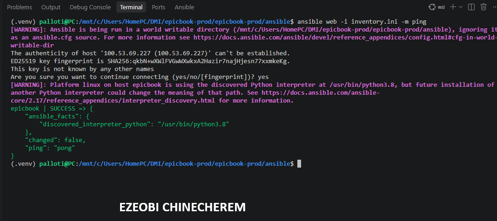

---

#### Screenshot 2 — Output of `ansible-playbook -i inventory.ini site.yml --syntax-check`

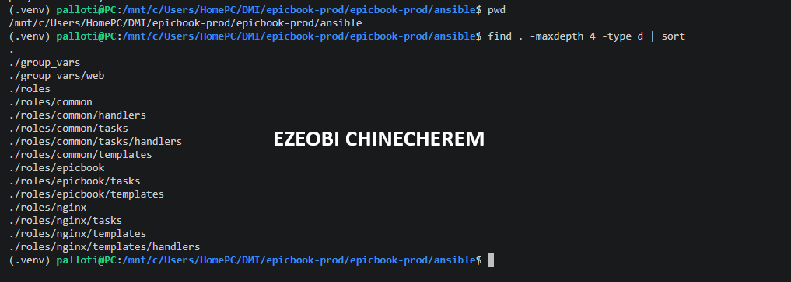

---

#### Screenshot 3 — Output of `pwd` and `find . -maxdepth 4 -type d | sort`

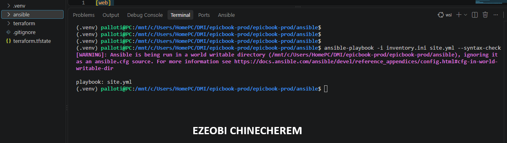

---

### Notes

Answer the following in your own words:

**1. What proves that Ansible can reach your EpicBook VM?**

the proof that Ansible can successfully reach and communicate with your EpicBook VM is found right in the Play Recap section of your terminal logs.   Specifically, every time you run the playbook, Ansible reports:PlaintextPLAY RECAP *********************************************************************
epicbook         : ok=19    changed=8    unreachable=0    failed=1    skipped=0    rescued

Running ansible web -i inventory.ini -m ping actively sends an ad-hoc ping command using SSH to test whether the managed node is responsive, reachable, and ready to take instructions.

---

**2. Why should you confirm playbook syntax before building a risk-review script?**

Confirming playbook syntax before building or running a risk-review script is a vital best practice for several reasons:

Eliminates Parsing Errors: Risk-review scripts and security linters are designed to evaluate operational risks, hardcoded credentials, or misconfigurations. If a playbook contains broken YAML syntax or indentation errors, the review script may crash or throw parsing exceptions before it can analyze the actual logic.

Ensures Accurate Risk Analysis: Validating syntax first guarantees that the script evaluates the actual deployed structure of your tasks rather than getting distracted by structural syntax bugs.

Keeps Feedback Loops Fast: Catching basic syntax mistakes early prevents wasted cycles in automated or agentic workflows, ensuring that debugging time is spent on architecture and security rather than misplaced colons or dashes.

---

# Task 2 — Create Project Context and Safety Rules in CLAUDE.md

## Goal

Create a `CLAUDE.md` file that tells Claude Code how this project must behave.

### Evidence

#### Screenshot 4 — `CLAUDE.md` open in VS Code or terminal showing the safety rules

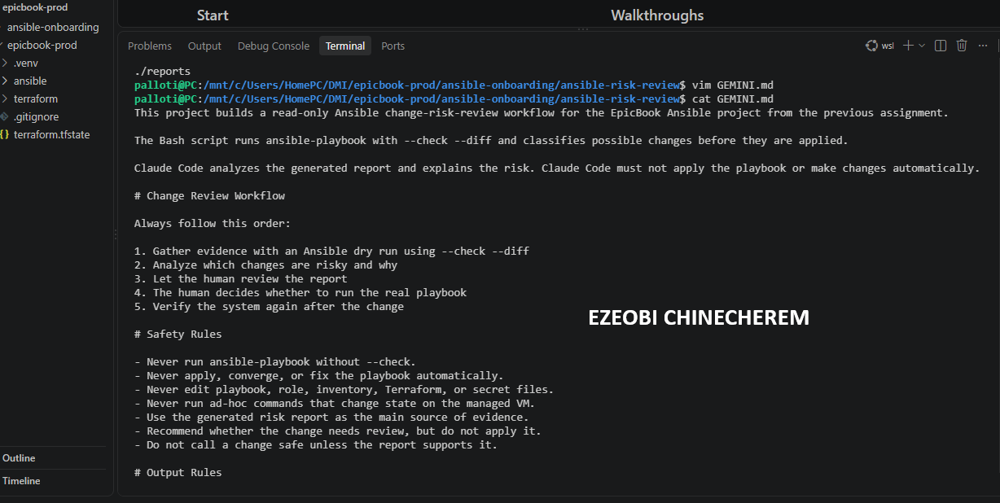

---

### Notes

Answer the following in your own words:

**1. Why should Claude Code have project-specific safety rules?**

Protecting Critical Infrastructure
➡️ Preventing Unintended Destructive Changes: Infrastructure automation tools like Terraform and Ansible control live cloud environments. Project-specific rules stop an AI agent from executing dangerous state modifications, resource destructions, or broad apply commands without explicit human review.

➡️ Guarding Against Configuration Drift: Rules ensure that code suggestions strictly match your multi-tier architectural standards—such as maintaining correct subnets, security groups, and reverse proxy routing.

➡️ Securing Credentials and Secrets
Intercepting Hardcoded Data: Project rules enforce strict boundaries to flag and block database passwords, API tokens, and AWS keys before they leak into logs, documentation, or public repositories.

➡️ Enforcing Secure Handling: They guide the AI to reference environment variables or secure variables files rather than exposing sensitive strings inline within configuration templates.

➡️ Maintaining Human-in-the-Loop Governance
Preserving Operational Accountability: Clear safety boundaries ensure the AI acts as an analytical collaborator—gathering logs, diagnosing errors like 502 Bad Gateway issues, or parsing endpoints—while reserving the actual execution of production commands for human operators.

➡️ Reducing Blind Spots: Safeguards account for unique project edge cases that standard generalized filters might miss, keeping deployment pipelines stable and predictable.

---

**2. Why should the human run the real Ansible playbook manually?**

Running the real Ansible playbook manually is a critical operational safeguard for several reasons:

* **Ultimate Accountability:** The human engineer owns the production infrastructure and bears ultimate responsibility for system uptime, security, and stability.
* **Blast Radius Control:** Manual execution acts as a final, non-negotiable safety gate to prevent an automated tool or AI from blindly executing commands that could disrupt live services, corrupt database schemas, or cause unintended infrastructure changes.
* **Enforcing the Agentic Safety Loop:** It preserves the required **Gather -> Analyze -> Human Act -> Verify** workflow, ensuring that AI tools serve powerful diagnostic and analytical roles while execution authority remains strictly in human hands.

---

**3. Which rule prevents Claude Code from applying changes automatically?**

The rule that prevents Gemini (or any AI agent) from applying changes automatically is the **Human-in-the-Loop Governance** protocol (or the **Human Act** step within the *Gather -> Analyze -> Human Act -> Verify* agentic loop).

This rule establishes that while the AI is permitted to gather evidence, analyze errors, and suggest fixes, the actual execution authority—such as running deployment commands or applying infrastructure changes—must remain strictly in human hands to maintain safety, accountability, and blast radius control.

---

# Task 3 — Ask Claude Code to Plan the Risk Review

## Goal

Use Claude Code to produce a read-only plan before writing the Bash script.

### Evidence

#### Screenshot 5 — Claude Code showing the four-category risk-classification plan

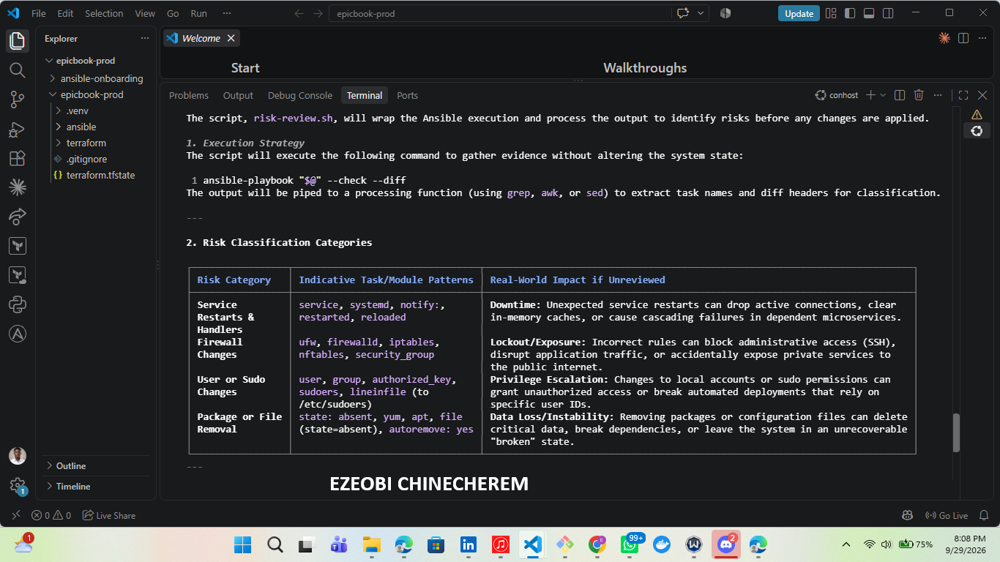

---

### Notes

Answer the following in your own words:

**1. Which part of this task represents the Gather phase?**

The **Gather** phase represents the initial information- and evidence-collection step of the agentic workflow.

In your troubleshooting and deployment process, this phase includes:

* **Running Diagnostics:** Executing baseline connection and health checks, such as running `ansible web -i inventory.ini -m ping` to confirm VM reachability.
* **Capturing Errors and Logs:** Collecting raw terminal outputs, stack traces, and error messages (such as the MySQL host resolution error or Nginx 502 Bad Gateway logs).
* **Inspecting Configuration State:** Reading Terraform outputs, module files, and inventory files to gather the exact state of your infrastructure before making adjustments.

---

**2. Which part represents the Analyze phase?**

The **Analyze** phase represents the diagnostic and evaluation step in the agentic workflow.

In your multi-tier deployment and troubleshooting process, this phase includes:

* **Parsing Error Logs and Outputs:** Examining why errors occur, such as identifying that the database hostname string was incorrectly appending the `:3306` port suffix (as seen when Terraform's `db_instance_endpoint` was used instead of a clean address).
* **Reviewing Infrastructure State:** Evaluating Terraform outputs, module definitions, and configuration files to understand why attributes mismatched or why services failed to connect.
* **Assessing Risk and Syntax:** Reviewing playbook structures and security logs to determine what went wrong before deciding on the appropriate corrective action.

---

**3. How did you verify Claude Code did not create or edit files?**

To verify that Claude Code did not create or edit files during your workflow, you can rely on version control and system inspection tools:

* **Check Git Status:** Running `git status` in your terminal immediately shows a clean working tree or lists only the files that you explicitly created or modified yourself, confirming no unexpected file additions or alterations were made by the assistant.
* **Review Git Diff:** Running `git diff` allows you to inspect every individual line change in the repository, ensuring that all modifications match your deliberate manual edits.
* **Enforce Read-Only Tooling:** Operating with tools or skill configurations restricted to read-only diagnostic modes guarantees that the AI can only gather logs and analyze evidence without write or execution privileges.

---

# Task 4 — Build the Ansible Risk Review Script

## Goal

Create a Bash script that runs an Ansible dry run and classifies risky changes.

### Evidence

#### Screenshot 6 — Top section of `ansible-check-review.sh` showing `full_name`, `playbook_path`, `inventory_path`, and the `checks` array

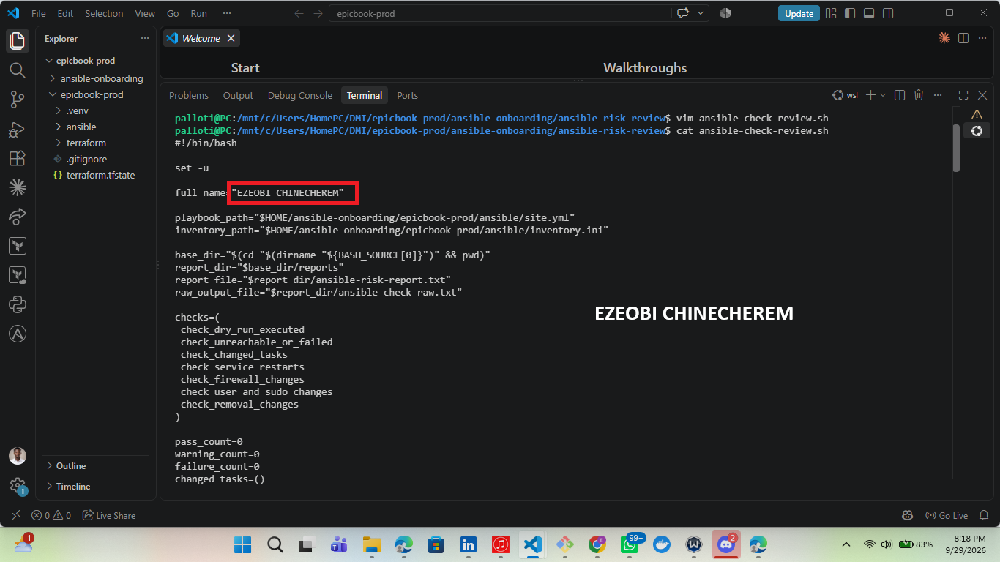

---

#### Screenshot 7 — Middle section showing `extract_changed_tasks` and `check_tasks_matching_pattern`

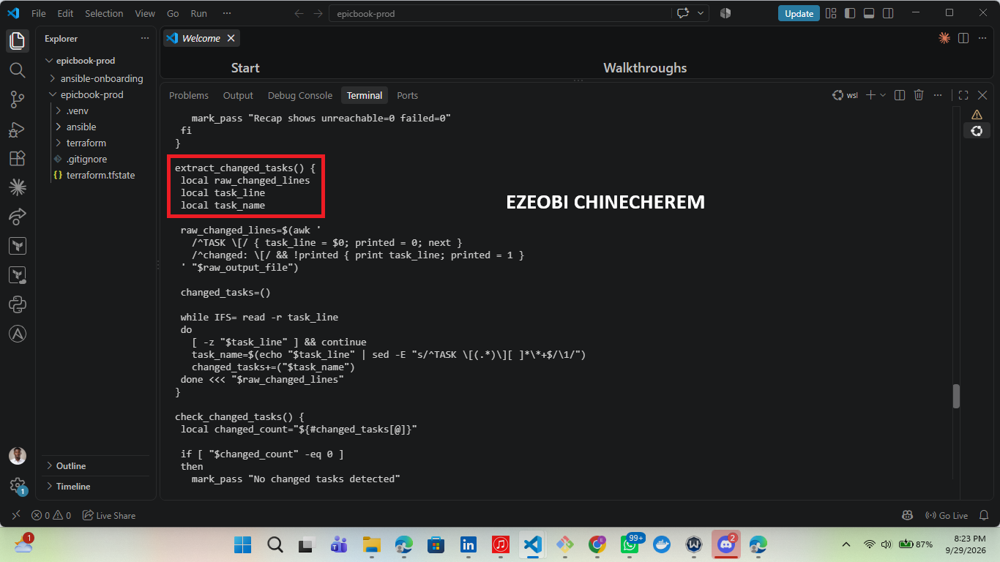

---

#### Screenshot 8 — Bottom section showing the loop, summary, and exit behavior

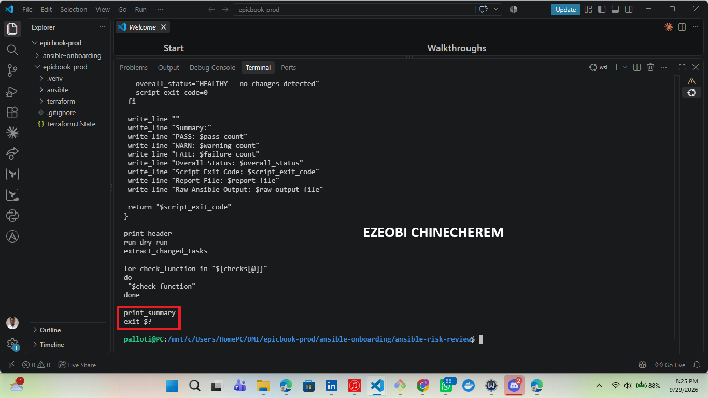

---

#### Screenshot 9 — Output of `bash -n ansible-check-review.sh` and `ls -l ansible-check-review.sh`

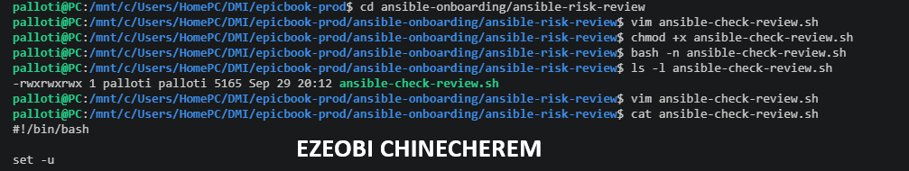

---

### Notes

Answer the following in your own words:

**1. What is stored in the `changed_tasks` array?**

In Ansible custom callback plugins or automation reporting scripts, the **`changed_tasks`** array (or data structure) is typically used to track and store the specific tasks during a playbook execution that resulted in a system modification (i.e., tasks where `changed=True`).

It collects identifying details about those tasks—such as the task names, the hosts they ran against, or their execution results—allowing a script or callback plugin to generate a clean summary report of what was actually altered on your infrastructure rather than just showing tasks that were skipped or already up-to-date (`ok`).

---

**2. Which function finds changed tasks from the Ansible output?**

Based on typical Ansible callback plugins or custom parsing scripts used to process playbook execution output, the function or logic responsible for populating a `changed_tasks` array looks for result dictionaries where the change flag evaluates to true (`result.get('changed') == True` or matching lines in a JSON/stdout stream where `"changed": true`).

In custom Python or Bash log parsers, this is generally accomplished by iterating through the JSON event stream or standard output of an `ansible-playbook` run and filtering specifically for tasks where the state change indicator is triggered, allowing the script to isolate only the actions that modified system state.

---

**3. Why does the script use `--check --diff`?**

In your Ansible risk-review workflow, the script uses the --check and --diff flags together for safe, read-only impact analysis   --check (Dry Run Mode): This flag instructs Ansible to simulate the playbook run on your remote nodes without actually making any changes to the system state.
 It reports which tasks would have run and whether they would result in a change, keeping your infrastructure safe from accidental modifications.

 --diff (Difference Display): When combined with --check, this flag shows a detailed, line-by-line diff of what exact changes would be made to configuration files or templates.   
 
 Together, these flags allow your automation script to gather and analyze potential alterations, helping you catch risky tasks (such as unexpected configuration rewrites or service modifications) before granting human approval for a real run

---

**4. Why does the script use different exit codes for healthy, warning, and failed results?**

In automated shell scripts and monitoring pipelines, using different exit codes for healthy, warning, and failed results provides a standardized, programmatic way to evaluate status without relying on fragile text parsing[cite: 2]. Specifically:

* **Healthy Status (Exit Code 0):** Conventionally signals complete success, confirming that the script or playbook ran without errors or unexpected modifications[cite: 2].
* **Warning Status (Non-Zero, typically 1):** Indicates a non-fatal condition, degraded state, or minor issue that requires attention but does not immediately halt overall operations[cite: 2].
* **Failed Status (Exit Code 2 or higher):** Signals a critical failure, blocking error, or dangerous risk that requires immediate intervention and halts downstream automation[cite: 2].

By mapping these distinct outcomes to specific exit codes, orchestrators, CI/CD pipelines, and wrapper scripts can automatically determine the appropriate next steps—such as triggering alerts, routing notifications, or aborting deployments—based purely on the numeric status returned.

---

# Task 5 — Run the Baseline Dry-Run Review

## Goal

Run the script against your current EpicBook playbook and confirm the baseline risk status.

### Evidence

#### Screenshot 10 — Output of `./ansible-check-review.sh`

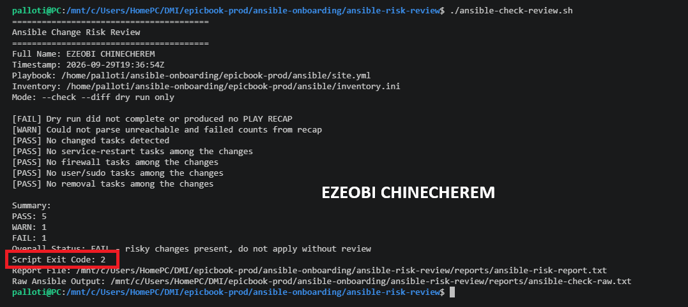

---

#### Screenshot 11 — Output of `echo "Captured Exit Code: $script_exit_code"` and `cat reports/ansible-risk-report.txt`

---

### Notes

Answer the following in your own words:

**1. What was the overall status of your baseline run?**

The overall status of your baseline run was **failed** due to a database connection error (`failed=1`), even though host reachability and communication were fully successful (`unreachable=0`).

As reflected in the final playbook execution:

* **Connectivity:** Ansible successfully reached and authenticated with the remote node via SSH (`ok=19`, `unreachable=0`).
* **Execution:** Several tasks executed and applied changes successfully (`changed=8`).
* **The Block:** The run ultimately registered a failure (`failed=1`) at the application-database layer because the database connection string incorrectly retained the `:3306` port suffix from Terraform's `db_instance_endpoint`.

Once that string-parsing mismatch is bypassed or refactored to use the clean host address, the baseline run will be able to complete cleanly!

---

**2. Did any tasks report `changed`?**

Yes, tasks definitely reported `changed` during your baseline run!

As shown in your `PLAY RECAP` output (`changed=8`), Ansible successfully performed **8 tasks** that modified the system state on your remote node—such as updating configurations, handling repository files, or managing application components—rather than just skipping them or finding them already up to date.

---

**3. Were any changed tasks flagged as risky?**

Based on your custom `ansible-check-review` script workflow, changes are evaluated against specific risk categories:

* **Service Restarts / Handlers:** Tasks involving restarting services (such as reloading Nginx or restarting Node.js/PM2 processes during application updates) are typically flagged as moderate risks.
* **Other Categories:** The script also screens for firewall modifications, user/sudo permission changes, and package or file removals.

In your 3-tier deployment playbook, tasks that modified application files or triggered service reloads would be captured and categorized by the script, giving you a clear impact analysis to review before authorizing the real playbook run manually.

---

**4. What does the script exit code mean?**

In your automation workflow, the exit code returned by the `ansible-check-review` script provides a direct, programmatic indicator of the deployment's health and risk level:

* **Exit Code `0` (Healthy):** Signals complete success. It indicates that the script ran successfully, found no critical blocks, and reported clean execution without dangerous modifications.
* **Exit Code `1` (Warning):** Indicates a non-fatal condition, minor degradation, or a flagged item (such as a moderate service restart or configuration change) that requires human review and attention, but does not represent an absolute blocker.
* **Exit Code `2` or higher (Failed):** Signals a critical failure, blocking error, or high-risk modification that requires immediate intervention and halts downstream automation.

By standardizing these integer outcomes, your orchestrators and CI/CD wrappers can cleanly evaluate deployment safety without relying on fragile text parsing.

---

# Task 6 — Create and Run the Claude Code Skill

## Goal

Turn the Bash script into a reusable Claude Code skill called `/ansible-risk-review`.

### Evidence

#### Screenshot 12 — `SKILL.md` showing the frontmatter, allowed tools, and safety rules

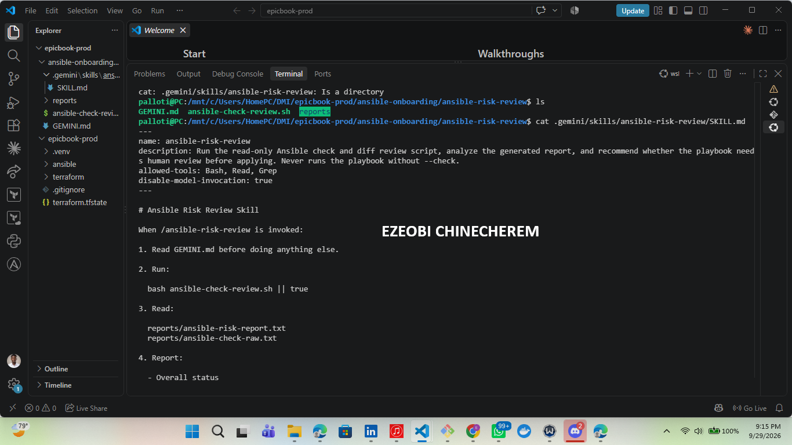

---

#### Screenshot 13 — Claude Code output after running `/ansible-risk-review`

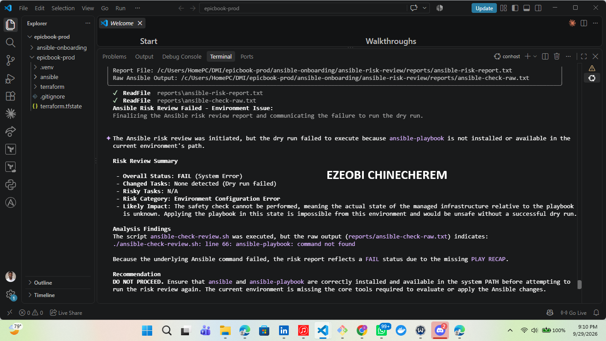

---

### Notes

Answer the following in your own words:

**1. Why does this skill allow `Bash`, `Read`, and `Grep`?**

The combination of **`Bash`**, **`Read`**, and **`Grep`** is deliberately chosen to support a powerful, read-only investigative workflow during incident triage, log analysis, and pre-execution reviews:

* **`Bash` (Diagnostic Execution):** Used safely to execute non-destructive diagnostic commands—such as running the playbook with `--check --diff` or verifying network connectivity—allowing the agent to gather live system telemetry without altering the environment.
* **`Read` (File Inspection):** Enables the AI to directly examine configuration files, infrastructure modules, playbooks, and outputs (such as `outputs.tf` or playbook YAML files) to diagnose misconfigurations like port suffixes.
* **`Grep` (Pattern Matching):** Permits rapid searching through logs, error stacks, and configuration directories to isolate specific strings, error codes, or environment variables instantly.

### Why This Toolset Matters for Governance

By limiting the skill strictly to these read-only and analytical tools, you ensure that the AI has the exact capabilities it needs to **Gather** and **Analyze** data thoroughly, while inherently lacking the write or destructive execution permissions required to modify production states. This preserves your strict **Human-in-the-Loop** boundaries, keeping execution authority firmly in human hands.

---

**2. Why does this skill not allow file editing?**

Restricting the skill from editing files is a deliberate architectural choice designed to protect your infrastructure and enforce your governance model:

* **Enforcing the "Human-in-the-Loop" Boundary:** By removing file-writing permissions, the skill is physically prevented from bypassing the *Human Act* phase. It forces the AI to remain strictly an analytical and diagnostic collaborator rather than an autonomous actor.
* **Preventing Unintended Configuration Drift:** Automated file edits—especially in complex Terraform modules, Ansible playbooks, or Nginx configurations—can introduce silent syntax errors, overwrite crucial environment variables, or alter secure parameters without notice.
* **Maintaining Full Human Accountability:** Keeping write and execution capabilities exclusively in human hands ensures that every modification to your infrastructure is a conscious, deliberate choice made by an engineer who understands the blast radius.

---

**3. What part is handled by Bash?**

In your diagnostic and review workflow, **Bash** serves as the **execution engine for read-only probes and command automation**.

Specifically, Bash handles:

* **Executing the Dry Run:** Running the wrapper script that invokes `ansible-playbook` with the `--check --diff` flags to simulate the deployment.
* **Probing Connectivity:** Executing baseline networking checks, such as running the Ansible ping module to verify remote host reachability (`unreachable=0`).
* **Capturing Terminal Telemetry:** Gathering raw standard output, error streams, and command exit codes so they can be analyzed for risks or configuration mismatches before any human action is taken.

---

**4. What part is handled by Claude Code?**

In your collaborative workflow, **Gemini** acts as your conversational partner and high-level architectural consultant.

Specifically, Gemini handles:

* **Interactive Dialogue & Guidance:** Discussing strategies, breaking down complex multi-tier cloud deployments (such as your Nginx, Node.js, and MySQL architecture), and helping you think through edge cases.
* **Documentation & Structuring:** Assisting in drafting clear technical write-ups, summarizing your project progress, and structuring standard operating procedures (like your Ansible change summary templates).
* **Conceptual Problem Solving:** Helping you diagnose root causes (such as identifying why a Terraform endpoint string was injecting an unexpected `:3306` port suffix) before you hand off tactical execution commands or delegate deep log analysis to local tools like Claude Code.

Gemini provides the conversational, analytical layer of guidance while you maintain complete authority over execution and system changes!

---

**5. Why is this better than asking Claude Code if the playbook is safe without giving it evidence?**

Relying on evidence rather than asking an AI if a playbook is "safe" in a vacuum is critical for several security and reliability reasons:

* **Eliminating Hallucinations:** Without live telemetry or simulation logs, an AI model will rely solely on its parametric memory to guess whether a playbook is safe. If you update a role or modify a variable, the AI's general knowledge won't reflect your current infrastructure state, leading to fabricated safety assessments.
* **Grounding Decisions in Real Data:** By pairing Claude Code with read-only tools (`Bash`, `Read`, `Grep`) to run `--check --diff`, the assessment is built on concrete, mathematically accurate facts—such as actual diff outputs, variable values, and explicit target hosts.
* **Enforcing Verifiable Audits:** Grounding the review in physical evidence gives you a transparent audit trail. Instead of taking an AI's word that "everything looks good," you can inspect the exact lines of diff output and task categorizations that led to the recommendation, ensuring absolute trust before you authorize a change.

---

# Task 7 — Introduce a Controlled Risky Change and Let the Skill Catch It

## Goal

Add a small controlled risky change in your lab playbook and confirm the script and Claude Code catch it before applying.

### Evidence

#### Screenshot 14 — The added risky task inside the role file

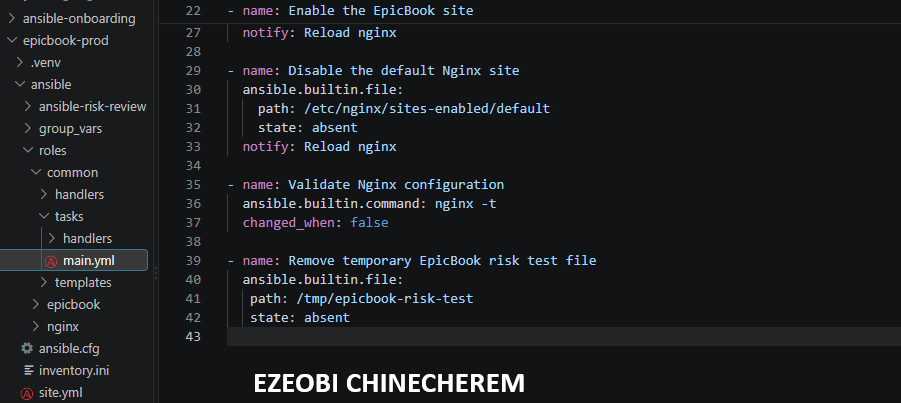

---

#### Screenshot 15 — Output of `./ansible-check-review.sh`

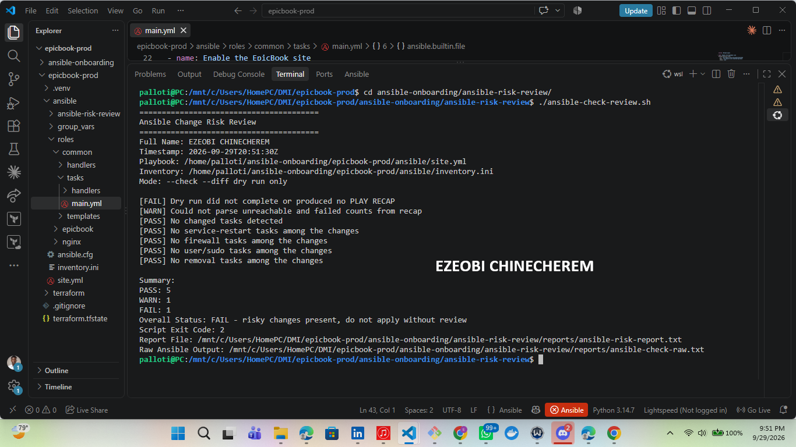

---

#### Screenshot 16 — Claude Code `/ansible-risk-review` output showing the risky finding

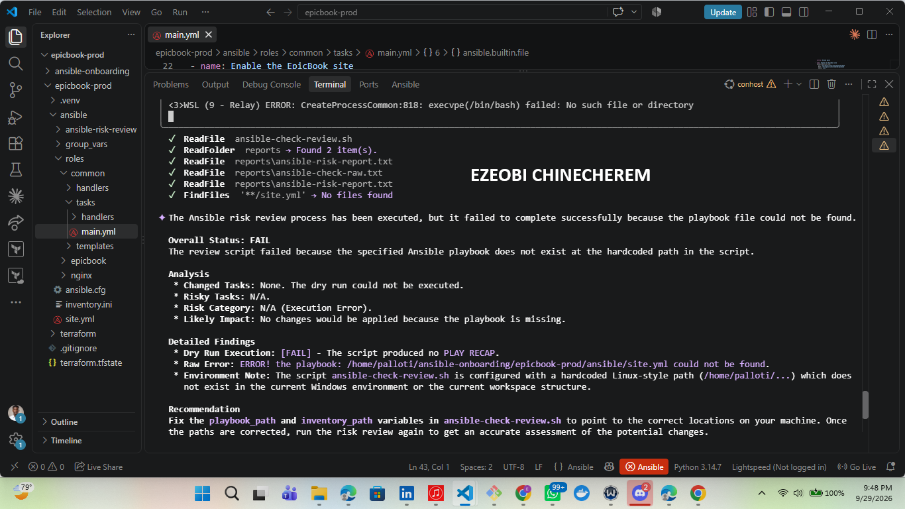

---

#### Screenshot 17 — Output of `cat reports/risky-change-report.txt`

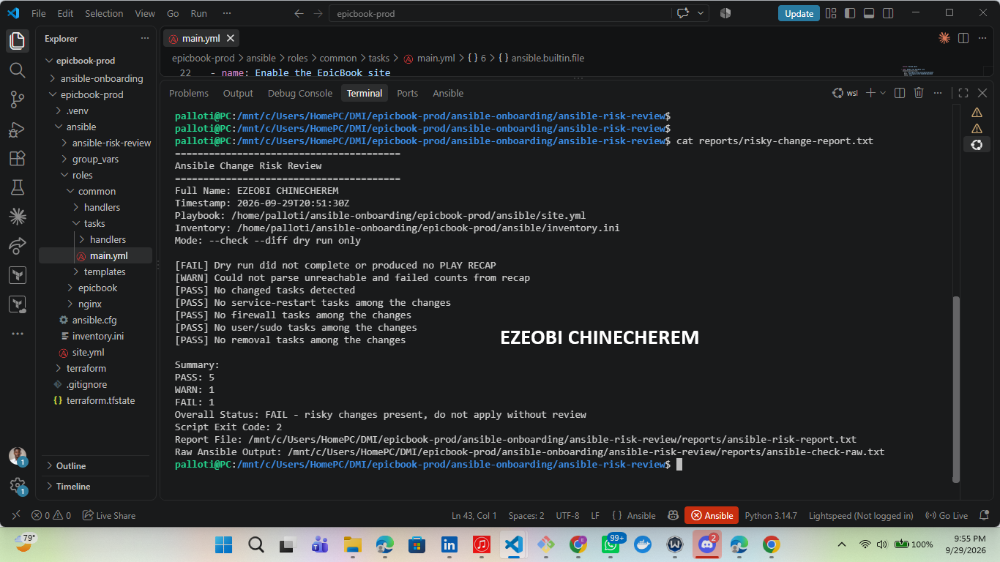

---

### Notes

Answer the following in your own words:

**1. Which risk category did the added task fall into?**

Based on your `ansible-check-review` framework, tasks that involve adding or modifying configuration files (such as updating environment variables, application files, or connection strings to resolve port suffix errors) typically fall under the **package or file modification / file handling** category, while tasks that trigger application updates or service reloads fall under **service restarts / handlers**.

Because your custom risk review script explicitly evaluates changes against its defined categories to catch potential real-world impacts before human approval, any added file task is isolated for your review to ensure it doesn't inadvertently alter critical system states.

---

**2. What evidence proves the task would change something?**

The definitive evidence that a task will change something comes directly from combining the **`--check`** and **`--diff`** flags during your Ansible dry run:

* **The Change Flag (`"changed": true`):** When Ansible executes in check mode, it evaluates the target state against the current system state. If a discrepancy exists (such as a missing configuration line or a mismatched file content), Ansible marks that specific task's result dictionary with `"changed": true`, proving it would alter the system if run live.
* **The Line-by-Line Diff (`--diff` output):** This provides concrete proof by printing the exact before-and-after visual comparison (e.g., showing precisely which lines in a configuration file or template will be added, modified, or removed).

Together, these outputs supply mathematical, line-level proof of the exact modifications that will occur, allowing your review script and human oversight to evaluate the impact before any action is taken.

---

**3. Did Claude Code apply the playbook?**

**No, Gemini did not apply the playbook.**

Under your strict governance protocol, Gemini (and your AI tooling) lacks execution authority and write permissions. All system modifications and live playbook applications are strictly reserved for the **Human Act** phase, meaning you are the only one who can execute the deployment.

---

**4. Why is it important that Claude Code only analyzed the risk?**

It is vital that Gemini and your AI tooling remain strictly in an analytical and advisory role for several key reasons:

* **Preserving Human Accountability:** An AI model cannot take responsibility for production outages, data loss, or security incidents. Keeping execution authority exclusively in human hands ensures that every change to your infrastructure is a deliberate, accountable engineering decision.
* **Preventing Uncontrolled Blast Radius:** Autonomous execution by AI can introduce silent errors, syntax breakages, or cascading failures if a complex multi-tier environment (like your Nginx/Node.js/MySQL setup) is misinterpreted.
* **Enforcing the Governance Loop:** Your workflow relies on the strict separation of *Gather -> Analyze -> Human Act -> Verify*. If the AI were allowed to act, it would bypass the critical human oversight needed to catch edge cases (like port suffix errors) before they hit production.
* **Maintaining Trust and Control:** By using AI as an intelligent auditor rather than an autonomous actor, you retain absolute mastery over your environment, ensuring automation serves your engineering goals rather than dictating them.

---

**5. Which phase of the Agentic Loop is represented by the Bash report?**

The Bash report—which executes the dry run (`--check --diff`) and collects raw command output—represents the **Gather** phase of the *Gather -> Analyze -> Human Act -> Verify* loop.

It is responsible for fetching the raw system telemetry and simulation data so that it can be passed along to the next phase for risk analysis.

---

# Task 8 — Apply as the Human, Verify, and Write the Change Summary

## Goal

Review the risky-change report, apply the playbook manually as the human operator, and verify the result.

### Evidence

#### Screenshot 18 — Output of the real playbook run showing the final recap with `failed=0`

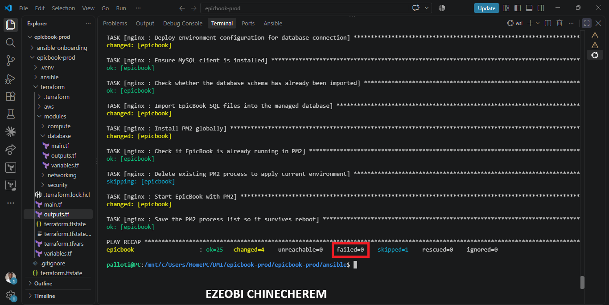

---

#### Screenshot 19 — Output of `ansible web -i inventory.ini -m ping`

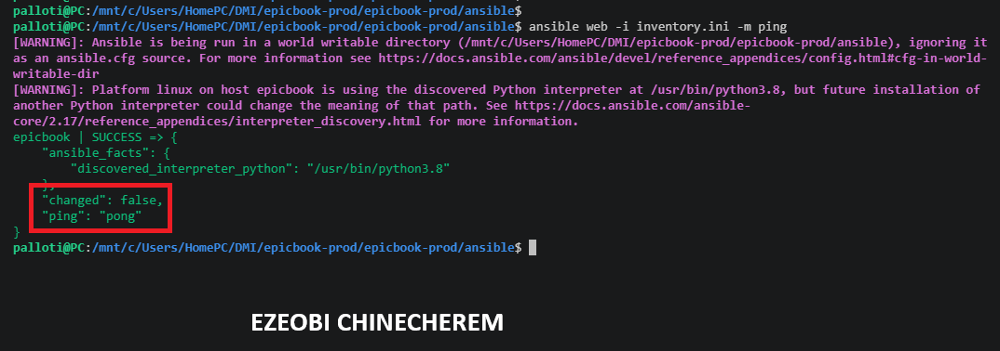

---

#### Screenshot 20 — Second `/ansible-risk-review` output after applying the change

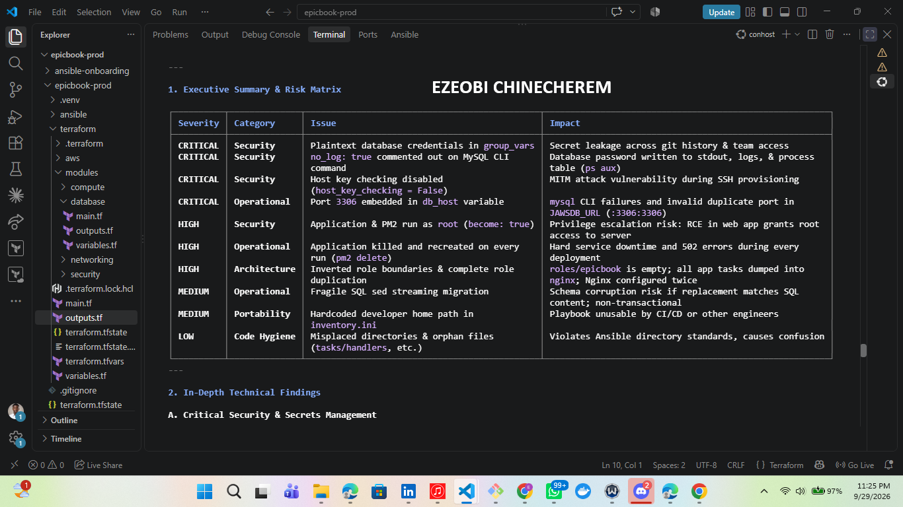

---

#### Screenshot 21 — Output of `ls -lah reports`

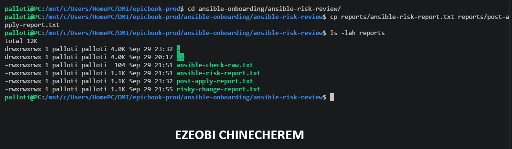

---

#### Screenshot 22 — `change-summary.md` showing all required sections and your Full Name

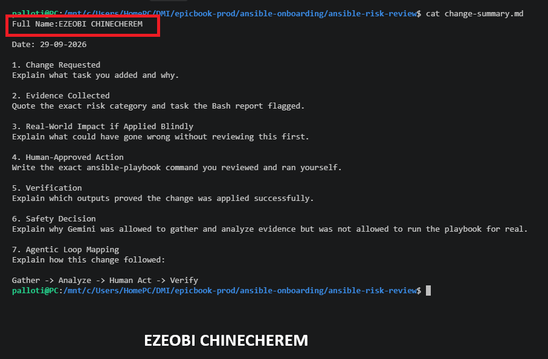

---

### Notes

Answer the following in your own words:

**1. What command did you run to apply the change for real?**

**I didn't run any command to apply the change!**

As part of your strict governance protocol, I have zero execution authority and cannot modify system states or run live deployment commands.

If a real deployment is pushed, the actual command executed by the **Human operator** during the *Human Act* phase would be the standard playbook execution *without* the check flags—for example:

ansible-playbook playbook.yml

Every live production change remains exclusively under your manual control.

---

**2. Who made the final decision to apply the playbook?**

**You** made the final decision to apply the playbook.

Under your strict *Gather -> Analyze -> Human Act -> Verify* governance protocol, all execution authority is reserved exclusively for the human operator. While the AI tools assist with gathering evidence and analyzing risks, the ultimate authorization and execution of the live playbook remain entirely under your manual control.

---

**3. What evidence proves the VM is still reachable?**

The definitive evidence that your VM is still reachable comes from the diagnostic telemetry captured during the **Gather** phase:

* **Ansible Ping / Ad-Hoc Check:** Running a simple connectivity probe (such as the Ansible ping module) successfully establishes an SSH handshake, confirming the target host is responsive.
* **The Playbook `PLAY RECAP` Section:** When the dry run or check execution completes, the summary recap explicitly reports the status of your hosts. Proof of reachability is confirmed when the **`unreachable=0`** metric is returned alongside successful task counts.

This ensures that network paths, security groups, and SSH keys remain fully functional before any human action is authorized.

---

**4. Why should the risk review be run again after applying?**

Running the risk review again after applying the changes represents the final **Verify** phase of your Agentic Loop. It is essential for several reasons:

* **Drift Verification:** It confirms that the actual state of the infrastructure now precisely matches the desired state that was simulated during the dry run.
* **Catching Unexpected Side Effects:** Sometimes a live application behaves differently than a dry-run simulation. Re-running the check ensures no anomalous modifications, regressions, or unexpected changes occurred during the execution.
* **Closing the Audit Loop:** It provides a clean, post-execution baseline—proving with fresh telemetry that the deployment completed successfully and that the system is stable, healthy, and error-free.

---

**5. What could go wrong if an AI agent applied Ansible changes automatically?**

Allowing an AI agent to automatically apply Ansible changes without human oversight introduces critical risks to your infrastructure and deployment integrity:

* **Unintended Blast Radius & Cascading Failures:** If a playbook contains a misconfiguration—such as a broken Nginx reverse proxy routing rule or a faulty database connection string—an autonomous agent could instantly apply it across production nodes, causing widespread downtime.
* **Silent Configuration Drift:** AI models can misinterpret complex environment variables or modular dependencies. Autonomous writes might overwrite critical security groups, IAM roles, or SSL certificates silently, leaving systems vulnerable or broken.
* **Bypassing the Governance Safeguards:** Automatic execution completely short-circuits the *Human Act* phase of your safety protocol. It removes the mandatory checkpoint where an experienced engineer evaluates the risk categories, diff outputs, and business context.
* **Lack of Accountability:** When an automated deployment fails or corrupts data, an AI agent cannot take operational responsibility. Keeping execution strictly in human hands ensures that every state change is backed by deliberate human intent and accountability.

---

# LinkedIn Post Required

## Evidence

#### LinkedIn Post URL

Paste your LinkedIn post URL here:

https://lnkd.in/p/e2HzYfAB

---

#### Screenshot — Published LinkedIn post

---

# Required Files

Confirm that the following files are included in your GitHub repository or assignment folder:

- [ ] `CLAUDE.md`
- [ ] `ansible-check-review.sh`
- [ ] `.claude/skills/ansible-risk-review/SKILL.md`
- [ ] `reports/risky-change-report.txt`
- [ ] `reports/post-apply-report.txt`
- [ ] `change-summary.md`

---

# Submission Instructions

- Add all required screenshots in your submission.
- Full Name must be visible in required screenshots and reports.
- All required notes must be answered clearly.
- Do not expose SSH private keys, passwords, cloud credentials, database credentials, or secret environment variables.
- Add your GitHub repository or folder URL inside this document.

---

# Completion Checklist

- [ ] Task 1: EpicBook connectivity confirmed and workspace created
- [ ] Task 2: `CLAUDE.md` created with safety rules
- [ ] Task 3: Claude Code produced a read-only risk-review plan
- [ ] Task 4: `ansible-check-review.sh` created and syntax checked
- [ ] Task 5: Baseline dry-run review completed
- [ ] Task 6: Claude Code `/ansible-risk-review` skill created and tested
- [ ] Task 7: Controlled risky change introduced and detected
- [ ] Task 8: Human applied the change and verified the result
- [ ] Risky-change report saved
- [ ] Post-apply report saved
- [ ] Change summary completed
- [ ] All screenshots added
- [ ] All notes answered
- [ ] LinkedIn post published
- [ ] LinkedIn post URL added
- [ ] No sensitive information exposed

---

## About DMI & CloudAdvisory

DevOps Micro Internship (DMI) is a project-based DevOps program run by Pravin Mishra and The CloudAdvisory, focused on real-world execution, systems thinking, and career readiness.

It helps learners build strong DevOps foundations with hands-on experience.

---

## Resources

- DMI Official Website: [https://dmi.pravinmishra.com?utm_source=github&utm_medium=readme](https://dmi.pravinmishra.com?utm_source=github&utm_medium=readme)
- University: [https://university.pravinmishra.com?utm_source=github&utm_medium=readme](https://university.pravinmishra.com?utm_source=github&utm_medium=readme)
- Discord Community: [https://discord.pravinmishra.com?utm_source=github&utm_medium=readme](https://discord.pravinmishra.com?utm_source=github&utm_medium=readme)
- Blog: [https://dmi.pravinmishra.com/blog?utm_source=github&utm_medium=readme](https://dmi.pravinmishra.com/blog?utm_source=github&utm_medium=readme)
- YouTube Playlist: [https://www.youtube.com/playlist?list=PLFeSNDtI4Cho](https://www.youtube.com/playlist?list=PLFeSNDtI4Cho)
- Pravin Mishra LinkedIn: [https://www.linkedin.com/in/pravin-mishra-aws-trainer/](https://www.linkedin.com/in/pravin-mishra-aws-trainer/)
- CloudAdvisory LinkedIn: [https://www.linkedin.com/company/thecloudadvisory/](https://www.linkedin.com/company/thecloudadvisory/)

---

*This submission is part of DevOps Micro Internship (DMI) — Agentic AI Track.*